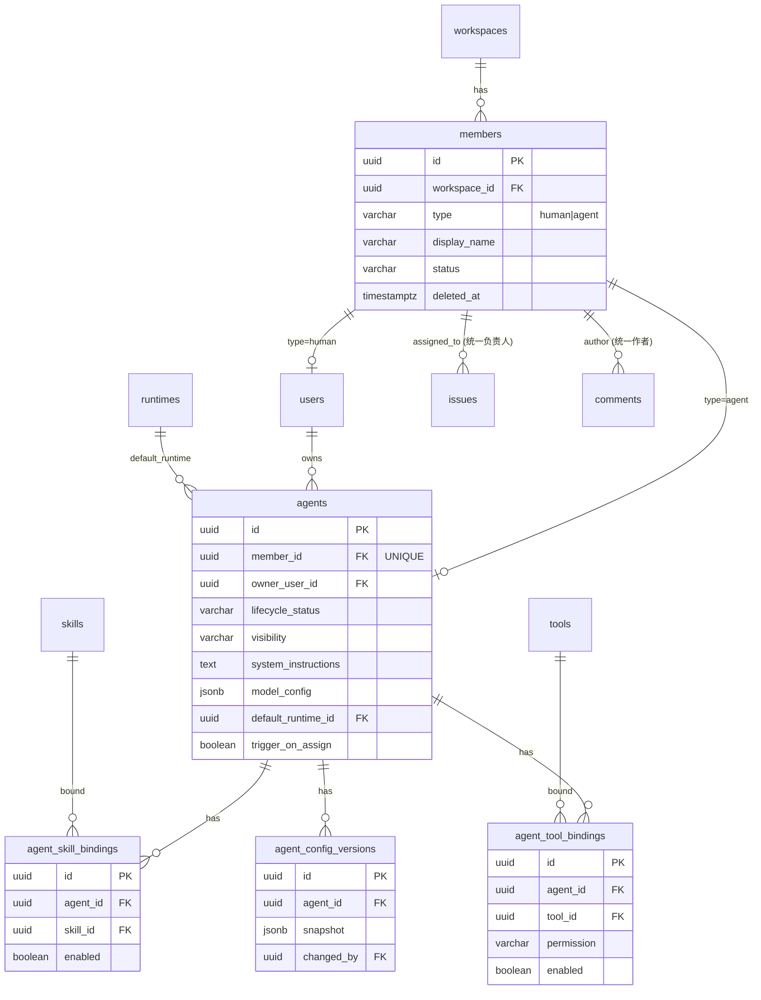
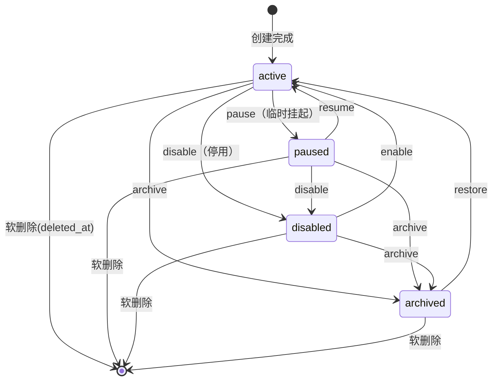

# 调研记录：Agent 管理（Agent Management）

> 模块簇：AI 队友与智能体编排
> 调研对象：业界主流 AI 原生团队工作区 / AI agent 平台在「agent 作为一等成员、agent 配置、技能/工具绑定、可见性、生命周期、被分派后自动工作、AI 身份呈现」上的成熟设计。
> 说明：本文仅记录中性化的设计模式与业界标准做法，用于指导 Mesh 的 Spec 撰写；不指向任何具体产品、公司或模型。底层模型一律以「主流大语言模型」指代，竞品一律以「同类产品 / 业界标准做法」指代。
> Mesh 特色标注：`[Mesh 特色]` 表示需要特别为「AI agent 作为真正队友」这一核心范式做的设计。
> 衔接模块：member（成员）、runtime（运行时）、skill（技能）、issue（看板/分派）、comment-inbox（评论/通知）。本模块是「agent 被分派 issue 后自动开始工作」这条主链路的入口。

---

## 一、功能清单

### 1.1 Agent 作为 workspace 一等成员

| # | 功能点 | 典型用户场景 |
|---|--------|--------------|
| F1 | agent 与人类成员统一抽象 `[Mesh 特色]` | 在成员列表、`@` 提及、分派人选择器里，agent 与人类成员出现在同一个候选集合中；系统用统一的「成员」概念承载两者，通过 `type` 区分 |
| F2 | type 区分（human / agent） | 列表可按类型筛选「只看人 / 只看 agent / 全部」；权限与计费可按 type 分别处理 |
| F3 | agent 拥有独立身份 | agent 有自己的头像、名称、个人简介，发评论/改状态时以自身身份署名，而不是借用创建者身份 |
| F4 | agent 可被分派 issue `[Mesh 特色]` | 在看板卡片或 issue 详情的「负责人」里选中某 agent，等同于把任务交给它 |
| F5 | agent 可被 `@` 提及 `[Mesh 特色]` | 评论里 `@某agent` 会入队一次该 agent 的运行，运行结果以该 agent 的评论回流（详见 comment-inbox 模块 F4） |
| F6 | agent 行为以自身身份留痕 | 看板活动流、issue 时间线里，agent 的状态变更/评论显示为「agent X 把状态改为进行中」，与人类操作同构 |
| F7 | 创建者 / 所有者关系 | 每个 agent 记录由哪个人类成员创建/拥有，用于权限归属与「我创建的 agent」筛选 |
| F8 | agent 不计入人类席位 | 席位/邀请统计区分人类成员与 agent，agent 通常单独计费或按用量计费 |

### 1.2 Agent Profile（身份信息）

| # | 功能点 | 典型用户场景 |
|---|--------|--------------|
| P1 | 名称（display_name） | 给 agent 起一个像队友的名字，如「小测」「后端机器人」；workspace 内可重名但建议唯一 |
| P2 | 头像（avatar） | 上传图片或使用系统生成的几何/像素头像；头像角标叠加 AI 徽章 |
| P3 | 简介 / 个人说明（bio） | 一段 markdown 描述这个 agent 的职责、擅长领域、使用须知，显示在详情页 |
| P4 | 角色标签（role_tag） | 单个或多个标签，如「测试工程师」「文档撰写」「值班运维」，用于列表快速辨识与筛选 |
| P5 | AI 身份徽章（badge）`[Mesh 特色]` | 在头像右下角、名称旁固定显示「AI」角标/图标，任何场景下都明确标注其非人类身份，杜绝冒充 |
| P6 | 能力摘要（capabilities） | 详情页展示该 agent 绑定的技能/工具清单与底层模型档位，让人类一眼知道它能干什么 |
| P7 | 状态指示 | profile 上显示生命周期状态（active/paused/disabled/archived）与实时忙碌指示（空闲/处理中） |

### 1.3 Agent 配置（推理与行为）

| # | 功能点 | 典型用户场景 |
|---|--------|--------------|
| C1 | 底层模型选择 | 在「主流大语言模型」清单里为该 agent 选定一个模型档位（强推理 / 均衡 / 轻量快速），不同任务用不同档位控本 |
| C2 | System Instructions（系统指令） | 用一段长文本定义 agent 的角色、边界、输出规范、禁止事项；这是 agent 行为的「岗位说明书」 |
| C3 | 温度（temperature） | 调节输出随机性：写代码/做判断调低，做创意/头脑风暴调高 |
| C4 | top_p | 核采样阈值，与温度配合控制多样性 |
| C5 | max_tokens | 单次输出上限，防止失控长输出与成本溢出 |
| C6 | 推理强度（reasoning effort）`[Mesh 特色]` | 低/中/高档位，控制 agent 在动手前的内部推理深度，权衡延迟与质量 |
| C7 | 停止序列 / 其它推理参数 | stop_sequences、频率/存在惩罚等高级参数，收纳在「高级」折叠区 |
| C8 | 参数预设 / 模板 | 提供「严谨工程」「轻量助手」等预设组合，一键套用，避免逐个调参 |
| C9 | 配置版本与回滚 | 每次配置变更留存快照，可查看历史、对比、回滚到任一版本（审计与排障） |
| C10 | 配置校验 | 保存前校验参数范围（如 temperature ∈ [0,2]）、模型可用性、指令非空等，失败给出明确提示 |

### 1.4 Agent 与技能 / 工具绑定

| # | 功能点 | 典型用户场景 |
|---|--------|--------------|
| S1 | 绑定技能（skill） | 把若干「技能」（打包好的指令集/工作流）授予该 agent，扩展其能力域 |
| S2 | 绑定工具（tool） | 把具体工具（代码执行、网页抓取、文件读写、外部 API 调用等）授权给 agent |
| S3 | 逐项授权开关 | 每个技能/工具可单独启用/停用，而非全有或全无 |
| S4 | 权限分级 `[Mesh 特色]` | 工具绑定可带权限级别（只读 / 可写 / 需人工确认），高风险操作默认「需确认」 |
| S5 | 默认运行时绑定 | 为 agent 指定默认运行环境（runtime），被分派任务时在该环境中执行 |
| S6 | 绑定变更留痕 | 技能/工具的增删改记入审计与配置版本 |
| S7 | 能力可见 | 详情页与分派前的提示里展示该 agent 当前可用技能/工具，避免「分派了它却干不了」 |

### 1.5 可见性与共享

| # | 功能点 | 典型用户场景 |
|---|--------|--------------|
| V1 | workspace 级共享 `[Mesh 特色]` | 默认 agent 对整个 workspace 可见、可被任何成员分派/提及，像公共队友 |
| V2 | 可见性级别 | `workspace`（全员可见可用）/ `private`（仅创建者与管理员）两档，后续可扩展到「指定项目/小队」 |
| V3 | 编辑权限 | 谁能修改 agent 配置：仅所有者 / 所有者+管理员 / 全员可编辑（按 workspace 策略） |
| V4 | 调用权限 | 谁能分派/`@`触发该 agent：通常与可见性一致；私有 agent 仅创建者可触发 |
| V5 | 所有权转移 | 创建者离职/换岗时，把 agent 所有权转给另一位人类成员，避免成为无主资产 |

### 1.6 创建 / 编辑 / 停用

| # | 功能点 | 典型用户场景 |
|---|--------|--------------|
| L1 | 创建 agent（向导式） | 通过分步向导：基本信息 → 模型与指令 → 技能/工具 → 可见性，逐步创建 |
| L2 | 从模板 / 复制创建 | 基于现有 agent 或官方模板快速复制一份再微调 |
| L3 | 编辑 profile 与配置 | 详情页内随时改名/换头像/调参/改指令，即时生效（对进行中的运行不影响，对后续运行生效） |
| L4 | 软停用（disable）而非硬删 `[Mesh 特色]` | 停用后 agent 不再接受新分派/触发，但历史评论、分派记录、归属关系完整保留 |
| L5 | 暂停（pause） | 临时挂起：不接新任务，已运行的任务可继续或一并暂停，区别于永久停用 |
| L6 | 归档（archive） | 从主列表移入归档区，保留数据但默认不显示 |
| L7 | 恢复（resume / enable） | 从 paused/disabled/archived 恢复到 active |
| L8 | 删除（软删除） | 标记 `deleted_at`，默认从所有列表与候选中隐藏；历史外键引用以「已停用 agent」占位渲染 |
| L9 | 停用前置检查 | 停用/归档前提示「该 agent 当前有 N 个进行中的任务」，让用户选择一并暂停或先等待 |

### 1.7 被分派 issue 后自动触发工作 `[Mesh 特色]`

| # | 功能点 | 典型用户场景 |
|---|--------|--------------|
| A1 | 分派即触发（事件驱动） | 一旦把某 agent 设为 issue 负责人，系统发出 `issue.assigned` 事件，自动入队一次该 agent 的运行，无需人工再点「开始」 |
| A2 | 与 runtime 衔接的入口 | 触发器把 issue 上下文（标题/描述/评论/附件/标签）打包，交给该 agent 绑定的默认 runtime 执行 |
| A3 | `@` 提及触发 | 评论中 `@agent` 同样入队一次运行（与分派触发共用同一执行入口） |
| A4 | 触发去重 / 防抖 | 短时间内重复分派/取消分派不重复入队；同一 issue 上该 agent 已有运行中任务时按策略合并或排队 |
| A5 | 暂停/停用拦截 | 若 agent 处于 paused/disabled，分派不触发运行，转为提示「该 agent 已停用，无法自动开始」 |
| A6 | 运行状态回流 | 运行开始/进行/完成/失败的状态实时回写 issue（卡片忙碌指示、评论流进度），形成闭环 |
| A7 | 自动状态流转 | agent 接单后把 issue 置为「进行中」，产出后置于「待评审」，与人类工作流同构 |

### 1.8 在各处的呈现与 AI 身份标识 `[Mesh 特色]`

| # | 功能点 | 典型用户场景 |
|---|--------|--------------|
| D1 | 看板卡片呈现 | 卡片负责人位置显示 agent 头像（带 AI 角标）；agent 正在处理时卡片显示动态忙碌指示 |
| D2 | 评论流呈现 | agent 发的评论带头像 + AI 徽章 + 「AI」标签，署名清晰区别于人类 |
| D3 | 成员列表呈现 | 成员页 agent 行带类型标记与生命周期状态，可筛选「仅 agent」 |
| D4 | `@` 候选呈现 | 提及弹层里 agent 项带 AI 图标，并标注「提及将触发一次运行」，避免误触发 |
| D5 | 分派人选择器呈现 | 选择器把人与 agent 分组或加图标区分，选中 agent 时提示「分派后它将自动开始工作」 |
| D6 | 活动流呈现 | 时间线里 agent 的系统动作（改状态/加标签）以 agent 身份署名，与人类动作同构但带 AI 标 |

---

## 二、数据模型

> 约定：PostgreSQL；UUID 主键（`gen_random_uuid()`）；所有表含 `created_at`/`updated_at`（`timestamptz`，默认 `now()`，UTC）；软删除统一 `deleted_at timestamptz null`；REST + JSON；游标分页；Bearer token 鉴权；实时走 WebSocket/SSE。命名：表名 snake_case 复数，字段 snake_case。

### 2.0 关键设计决策：统一成员表 vs 独立 agent 表

这是本模块最核心的建模取舍，业界标准做法是**「统一成员表 + 独立 agent 配置表」的类表继承（class-table inheritance）混合方案**，而非二选一。

| 方案 | 描述 | 优点 | 缺点 |
|------|------|------|------|
| A. 单一 `members` 表（`type` 区分） | 人和 agent 共表，agent 配置塞 JSONB 或同表稀疏列 | 列表/`@`/分派查询天然统一，外键简单（`assignee_id → members.id`） | 稀疏列多、约束难写；agent 配置频繁变更与人混在一起；人与 agent 的索引/权限难以分别优化 |
| B. 独立 `agents` 表 + `users` 表 | 人与 agent 完全分表，业务层用 union 拼候选 | 各自约束清晰 | 每个「负责人/提及人」外键都要带 `(id, type)` 二元组或多态关联，查询/索引复杂，统一候选靠应用层 union |
| **C. 混合（推荐）** | `members` 作为统一身份层（含 `type`），人类细节在 `users`、agent 细节在 `agents`，分别 1:1 关联回 `members` | 外键统一指向 `members.id`；agent 专有配置隔离在 `agents`，可频繁演进；类型特有约束在子表表达 | 多一次 join，但用主键关联代价极小 |

**结论：采用方案 C。** `members` 是「workspace 内的一个身份」，`type` 决定其专有属性挂在 `users` 还是 `agents`。所有协作实体（issue 负责人、评论作者、提及对象）外键统一指向 `members.id` + 冗余 `*_type` 便于无 join 渲染，从根本上支撑「agent 与人类同为一等成员」。

### 2.1 `members` — 统一成员表（身份层）

| 字段 | 类型 | 约束 / 默认 | 说明 |
|------|------|-------------|------|
| id | uuid | PK, default `gen_random_uuid()` | 成员唯一身份 |
| workspace_id | uuid | NOT NULL, FK `workspaces(id)` ON DELETE CASCADE | 所属 workspace |
| type | varchar(16) | NOT NULL, CHECK (`type` IN ('human','agent')) | 成员类型 |
| display_name | varchar(120) | NOT NULL | 显示名 |
| avatar_url | text | NULL | 头像 URL |
| role_tag | varchar(64) | NULL | 角色标签（如「测试工程师」） |
| status | varchar(16) | NOT NULL DEFAULT 'active', CHECK IN ('active','disabled','archived') | 成员级状态（与 agent 生命周期联动） |
| created_by | uuid | NULL, FK `members(id)` | 创建/邀请者成员 id |
| created_at | timestamptz | NOT NULL DEFAULT `now()` | |
| updated_at | timestamptz | NOT NULL DEFAULT `now()` | |
| deleted_at | timestamptz | NULL | 软删除 |

约束 / 索引：
- `UNIQUE (workspace_id, type, ...)` 不做名称强唯一（允许重名），但建议加普通索引 `(workspace_id, lower(display_name))` 加速搜索。
- `idx_members_ws_type_status`：`(workspace_id, type, status)` WHERE `deleted_at IS NULL` —— 支撑成员列表/`@`候选/分派候选的主查询。
- 子表关联：`type='human'` 时对应一行 `users.member_id`；`type='agent'` 时对应一行 `agents.member_id`（均 UNIQUE）。

### 2.2 `users` — 人类账号（节选，仅列与本模块相关的关联字段）

| 字段 | 类型 | 约束 / 默认 | 说明 |
|------|------|-------------|------|
| id | uuid | PK | 人类账号 id |
| member_id | uuid | NOT NULL UNIQUE, FK `members(id)` ON DELETE CASCADE | 对应成员身份 |
| email | citext | NOT NULL UNIQUE | 登录邮箱 |
| auth_provider | varchar(32) | NOT NULL DEFAULT 'password' | 认证方式（password / OAuth 2.0 等） |
| created_at / updated_at | timestamptz | NOT NULL DEFAULT `now()` | |

> 人类成员 = `members` 一行 + `users` 一行。认证、邮箱等人类专有属性放这里，不污染统一身份层。

### 2.3 `agents` — agent 专有配置表

| 字段 | 类型 | 约束 / 默认 | 说明 |
|------|------|-------------|------|
| id | uuid | PK, default `gen_random_uuid()` | agent id |
| member_id | uuid | NOT NULL UNIQUE, FK `members(id)` ON DELETE CASCADE | 对应统一成员身份 |
| owner_user_id | uuid | NOT NULL, FK `users(id)` | 创建者 / 所有者（人类） |
| slug | varchar(64) | NULL | 可选短标识，用于提及简写 |
| bio | text | NULL | 个人简介（markdown） |
| badge_kind | varchar(32) | NOT NULL DEFAULT 'ai' | AI 身份徽章类型（用于渲染区分） |
| lifecycle_status | varchar(16) | NOT NULL DEFAULT 'active', CHECK IN ('active','paused','disabled','archived') | 生命周期状态（见 5.2 状态机） |
| visibility | varchar(16) | NOT NULL DEFAULT 'workspace', CHECK IN ('workspace','private') | 可见性级别 |
| system_instructions | text | NULL | 系统指令（岗位说明书） |
| model_config | jsonb | NOT NULL DEFAULT `'{}'::jsonb` | 模型与推理参数（结构见 2.4） |
| default_runtime_id | uuid | NULL, FK `runtimes(id)` | 默认运行时（被分派后在此执行） |
| trigger_on_assign | boolean | NOT NULL DEFAULT true | 被分派 issue 时是否自动触发运行 `[Mesh 特色]` |
| active_config_version_id | uuid | NULL, FK `agent_config_versions(id)` | 当前生效配置版本（指向快照，见 2.7） |
| created_at | timestamptz | NOT NULL DEFAULT `now()` | |
| updated_at | timestamptz | NOT NULL DEFAULT `now()` | |
| deleted_at | timestamptz | NULL | 软删除 |

索引：
- `idx_agents_owner`：`(owner_user_id)` —— 「我创建的 agent」。
- `idx_agents_lifecycle`：`(lifecycle_status)` WHERE `deleted_at IS NULL`。
- `idx_agents_visibility`：`(visibility)` —— 可见性过滤。
- `member_id` 已 UNIQUE，关联查询走主键。

### 2.4 `model_config` JSONB 结构（模型与推理参数）

`model_config` 用 JSONB 承载频繁演进、字段不固定的推理参数，避免为每个新参数加列。推荐结构（应用层用 schema 校验）：

```json
{
  "model": "mainstream-llm-large",
  "model_tier": "strong_reasoning",
  "temperature": 0.2,
  "top_p": 1.0,
  "max_tokens": 8192,
  "reasoning_effort": "medium",
  "stop_sequences": [],
  "preset": "strict_engineering",
  "advanced": {
    "frequency_penalty": 0.0,
    "presence_penalty": 0.0
  }
}
```

| 键 | 类型 | 取值 / 范围 | 说明 |
|----|------|-------------|------|
| model | string | 主流大语言模型标识 | 具体模型，由模型注册表枚举 |
| model_tier | string | `strong_reasoning` / `balanced` / `lightweight_fast` | 模型档位（控本与选型的抽象） |
| temperature | number | [0, 2] | 随机性 |
| top_p | number | [0, 1] | 核采样 |
| max_tokens | integer | [1, 模型上限] | 单次输出上限 |
| reasoning_effort | string | `low` / `medium` / `high` | 内部推理强度 `[Mesh 特色]` |
| stop_sequences | string[] | — | 停止序列 |
| preset | string | 预设名 | 一键套用的参数模板 |
| advanced | object | — | 低频高级参数收纳 |

设计要点：
- 校验在应用层完成（JSON Schema / ORM 校验器），保存前拒绝越界值，错误码 `422 validation_error`。
- 用 GIN 索引按需查询特定键（如统计用某模型档位的 agent 数）：`CREATE INDEX idx_agents_model_tier ON agents USING gin ((model_config->'model_tier'))`（表达式 gin）。
- 重大变更同步写入 `agent_config_versions` 快照（2.7），实现可回滚。

### 2.5 `agent_skill_bindings` — agent ↔ 技能绑定

| 字段 | 类型 | 约束 / 默认 | 说明 |
|------|------|-------------|------|
| id | uuid | PK | |
| agent_id | uuid | NOT NULL, FK `agents(id)` ON DELETE CASCADE | |
| skill_id | uuid | NOT NULL, FK `skills(id)` ON DELETE CASCADE | 绑定的技能 |
| enabled | boolean | NOT NULL DEFAULT true | 单项启用开关 |
| created_at | timestamptz | NOT NULL DEFAULT `now()` | |
| updated_at | timestamptz | NOT NULL DEFAULT `now()` | |

约束 / 索引：
- `UNIQUE (agent_id, skill_id)` —— 防重复绑定。
- `idx_skill_bindings_agent`：`(agent_id)` WHERE `enabled = true` —— 取某 agent 的可用技能。

### 2.6 `agent_tool_bindings` — agent ↔ 工具绑定（带权限）

| 字段 | 类型 | 约束 / 默认 | 说明 |
|------|------|-------------|------|
| id | uuid | PK | |
| agent_id | uuid | NOT NULL, FK `agents(id)` ON DELETE CASCADE | |
| tool_id | uuid | NOT NULL, FK `tools(id)` ON DELETE CASCADE | 绑定的工具 |
| permission | varchar(16) | NOT NULL DEFAULT 'confirm_required', CHECK IN ('read_only','write','confirm_required') | 权限级别，高风险默认需人工确认 `[Mesh 特色]` |
| enabled | boolean | NOT NULL DEFAULT true | |
| created_at | timestamptz | NOT NULL DEFAULT `now()` | |
| updated_at | timestamptz | NOT NULL DEFAULT `now()` | |

约束 / 索引：
- `UNIQUE (agent_id, tool_id)`。
- `idx_tool_bindings_agent`：`(agent_id)` WHERE `enabled = true`。

### 2.7 `agent_config_versions` — 配置版本快照（审计 / 回滚）

| 字段 | 类型 | 约束 / 默认 | 说明 |
|------|------|-------------|------|
| id | uuid | PK | 版本 id |
| agent_id | uuid | NOT NULL, FK `agents(id)` ON DELETE CASCADE | |
| snapshot | jsonb | NOT NULL | 该版本的完整配置快照（system_instructions + model_config + 绑定清单） |
| change_summary | text | NULL | 变更摘要 |
| changed_by | uuid | NOT NULL, FK `members(id)` | 操作者成员 id |
| created_at | timestamptz | NOT NULL DEFAULT `now()` | 版本生成时间（仅插入，不更新） |

索引：`idx_config_versions_agent_time`：`(agent_id, created_at DESC)` —— 按时间倒序取历史。
> `agents.active_config_version_id` 指向当前生效版本；回滚 = 复制旧快照写新版本并把指针指过去（不可变快照，符合 immutable 原则）。

### 2.8 实体关系（ER 图）



外键与唯一约束要点：
- `agents.member_id` UNIQUE → 一个成员身份至多对应一个 agent，1:1。
- `agent_skill_bindings.UNIQUE(agent_id, skill_id)`、`agent_tool_bindings.UNIQUE(agent_id, tool_id)`。
- 协作实体（issue 负责人、评论作者）外键指向 `members.id`，并冗余 `assignee_type` / `author_type`（'human'|'agent'）以便无 join 渲染 AI 徽章。

---

## 三、接口设计

### 3.0 通用约定

- **鉴权**：所有端点要求 `Authorization: Bearer <token>`（JWT 或不可撤销的访问令牌）。鉴权失败 `401`，权限不足 `403`。
- **响应包络**（统一 API 响应格式）：

```json
{
  "success": true,
  "data": { },
  "error": null,
  "meta": { "next_cursor": null }
}
```

错误时：

```json
{
  "success": false,
  "data": null,
  "error": { "code": "validation_error", "message": "temperature 必须在 [0,2] 区间", "details": [ {"field":"model_config.temperature","issue":"out_of_range"} ] },
  "meta": null
}
```

- **分页**：列表统一游标分页 `?cursor=<opaque>&limit=N`（默认 limit=20，上限 100），响应 `meta.next_cursor`，为空表示末页。
- **时间**：全部 UTC RFC3339。
- **资源命名**：复数名词 `/agents`、`/members`。
- **实时**：长任务/状态变化经 WebSocket 推送（见 5.3），REST 仅负责读写。

### 3.1 REST 端点清单

| 方法 | 路径 | 说明 |
|------|------|------|
| POST | `/agents` | 创建 agent（含 profile + 初始配置） |
| GET | `/agents` | 列表，支持 `?status=&visibility=&owner_id=&type=agent&cursor=&limit=&q=` |
| GET | `/agents/{id}` | 详情（profile + 配置 + 绑定 + 当前版本） |
| PATCH | `/agents/{id}` | 更新 profile（名称/头像/简介/角色标签/可见性） |
| PATCH | `/agents/{id}/config` | 更新模型与推理参数、system instructions（生成新配置版本） |
| POST | `/agents/{id}/pause` | 暂停 |
| POST | `/agents/{id}/resume` | 恢复到 active |
| POST | `/agents/{id}/disable` | 停用 |
| POST | `/agents/{id}/enable` | 启用 |
| POST | `/agents/{id}/archive` | 归档 |
| POST | `/agents/{id}/restore` | 从归档/停用恢复 |
| DELETE | `/agents/{id}` | 软删除（置 `deleted_at`） |
| POST | `/agents/{id}/transfer` | 转移所有权 |
| GET | `/agents/{id}/skills` | 列出绑定技能 |
| POST | `/agents/{id}/skills` | 绑定技能（批量） |
| DELETE | `/agents/{id}/skills/{skill_id}` | 解绑技能 |
| PATCH | `/agents/{id}/skills/{skill_id}` | 启用/停用单项 |
| GET | `/agents/{id}/tools` | 列出绑定工具 |
| POST | `/agents/{id}/tools` | 绑定工具（带 permission） |
| DELETE | `/agents/{id}/tools/{tool_id}` | 解绑工具 |
| GET | `/agents/{id}/config-versions` | 配置版本历史 |
| POST | `/agents/{id}/config-versions/{version_id}/rollback` | 回滚到指定版本 |
| GET | `/members` | 统一成员列表，`?type=human\|agent&status=&cursor=&limit=` |

### 3.2 可运行 JSON 示例

**创建 agent — 请求 `POST /agents`**

```json
{
  "display_name": "小测",
  "avatar_url": "https://cdn.mesh.internal/avatars/xiaoce.png",
  "role_tag": "测试工程师",
  "bio": "负责回归测试与缺陷复现，输出可执行的测试报告。",
  "visibility": "workspace",
  "system_instructions": "你是测试工程师。收到 issue 后先复现问题，再给出最小复现步骤与修复建议。不做超出测试范围的改动。",
  "model_config": {
    "model_tier": "balanced",
    "temperature": 0.2,
    "top_p": 1.0,
    "max_tokens": 8192,
    "reasoning_effort": "medium",
    "preset": "strict_engineering"
  },
  "default_runtime_id": "8b2c1f0e-4a7d-4c9b-9e1a-2f3b4c5d6e7f",
  "trigger_on_assign": true,
  "skill_ids": ["s-uuid-1", "s-uuid-2"],
  "tools": [
    { "tool_id": "t-uuid-exec", "permission": "confirm_required" },
    { "tool_id": "t-uuid-read", "permission": "read_only" }
  ]
}
```

**创建 agent — 响应 `201 Created`**

```json
{
  "success": true,
  "data": {
    "id": "a1b2c3d4-0000-4000-8000-000000000001",
    "member": {
      "id": "m1b2c3d4-0000-4000-8000-000000000001",
      "type": "agent",
      "display_name": "小测",
      "avatar_url": "https://cdn.mesh.internal/avatars/xiaoce.png",
      "role_tag": "测试工程师",
      "status": "active"
    },
    "owner_user_id": "u-uuid-current",
    "visibility": "workspace",
    "lifecycle_status": "active",
    "badge_kind": "ai",
    "model_config": {
      "model_tier": "balanced",
      "temperature": 0.2,
      "top_p": 1.0,
      "max_tokens": 8192,
      "reasoning_effort": "medium",
      "preset": "strict_engineering"
    },
    "trigger_on_assign": true,
    "active_config_version_id": "v-uuid-1",
    "created_at": "2026-07-24T12:00:00Z",
    "updated_at": "2026-07-24T12:00:00Z"
  },
  "error": null,
  "meta": null
}
```

**列表 — `GET /agents?status=active&limit=2`**

```json
{
  "success": true,
  "data": [
    { "id": "a1b2...0001", "display_name": "小测", "role_tag": "测试工程师", "lifecycle_status": "active", "badge_kind": "ai", "busy": true },
    { "id": "a1b2...0002", "display_name": "文档助手", "role_tag": "文档撰写", "lifecycle_status": "active", "badge_kind": "ai", "busy": false }
  ],
  "error": null,
  "meta": { "next_cursor": "eyJpZCI6ImExYjIuLi4wMDAyIn0=" }
}
```

**更新配置 — `PATCH /agents/{id}/config`（生成新版本）**

```json
{
  "model_config": { "temperature": 0.7, "reasoning_effort": "high" },
  "system_instructions": "（更新后的岗位说明书）"
}
```

响应 `200 OK` 返回新的 `active_config_version_id` 与生效配置；`change_summary` 可由服务端自动生成。

**绑定工具 — `POST /agents/{id}/tools`**

```json
{ "tools": [ { "tool_id": "t-uuid-web", "permission": "read_only" } ] }
```

**生命周期 — `POST /agents/{id}/pause`**

```json
{ "reason": "临时维护", "in_flight_policy": "finish_current" }
```

`in_flight_policy` 取值 `finish_current`（让进行中的任务跑完）/ `pause_now`（一并暂停）。响应返回最新 `lifecycle_status` 与被影响的运行数。非法状态迁移返回 `409 conflict`。

**软删除 — `DELETE /agents/{id}`** → `204 No Content`；后续列表中不再出现，历史评论以「已停用 agent」占位渲染。

### 3.3 错误码体系

| HTTP | code | 含义 | 触发示例 |
|------|------|------|----------|
| 400 | invalid_request | 请求体格式错误 / JSON 解析失败 | body 非合法 JSON |
| 401 | unauthorized | 缺少/无效 token | 未带 Authorization |
| 403 | forbidden | 无权限（编辑/调用/转移） | 非所有者编辑私有 agent |
| 404 | not_found | 资源不存在或已删除 | 错误的 agent id |
| 409 | conflict | 状态冲突 / 唯一约束冲突 | 非法生命周期迁移；重复绑定同一技能 |
| 422 | validation_error | 业务校验失败 | temperature 越界；system_instructions 为空（若要求必填） |
| 429 | rate_limited | 触发限流 | 单位时间创建过多 agent |
| 500 | internal_error | 服务端异常 | 未捕获错误（不向外泄漏堆栈） |

> 错误响应不泄漏内部实现细节（无堆栈、无 SQL）；`details` 仅返回字段级校验信息。所有端点接入限流。

---

## 四、UI 设计

### 4.1 信息架构

agent 管理有两个入口：
1. **设置 → Agents**（管理视角）：agent 列表、创建向导、详情与配置编辑、生命周期操作。
2. **成员页（Members）**（协作视角）：人与 agent 统一列出，agent 行带 AI 标识，点击进详情。

```
设置 Settings
└── Agents
    ├── 列表页（筛选 / 搜索 / 新建）
    └── 详情页
        ├── Tab：概览 Profile
        ├── Tab：配置 Configuration（模型 + 指令 + 参数）
        ├── Tab：技能与工具 Skills & Tools
        ├── Tab：可见性与权限 Visibility & Access
        └── Tab：历史 History（配置版本 / 审计）
成员 Members（人与 agent 统一）
```

### 4.2 Agent 列表页

```
┌───────────────────────────────────────────────────────────────┐
│  Agents                                   [ 筛选 ▾ ] [ + 新建 ] │
│  搜索: [__________________________]  状态: [全部▾] 类型: [仅agent]│
├───────────────────────────────────────────────────────────────┤
│  ◉ 小测  [AI]   测试工程师        ● 处理中   active   ⋯         │
│  ◉ 文档助手[AI] 文档撰写          ○ 空闲     active   ⋯         │
│  ◉ 值班运维[AI] 运维             ◐ 已暂停   paused   ⋯         │
│  ▢ 老报表  [AI] 报表             ▭ 已归档   archived ⋯         │
├───────────────────────────────────────────────────────────────┤
│  共 12 个 · 加载下一页 ↓                                         │
└───────────────────────────────────────────────────────────────┘
```
- 每行：头像（右下角叠加 AI 角标）、名称 + `[AI]` 徽章、角色标签、实时忙碌指示（●处理中/○空闲）、生命周期状态、`⋯` 行内操作（暂停/停用/归档/复制/转移）。
- 顶部筛选：状态（active/paused/disabled/archived）、可见性、所有者、关键字搜索。
- 列表默认隐藏 archived/disabled，需主动勾选显示。

### 4.3 Agent 详情页（profile + 配置 tabs）

```
┌──────────────────────────────────────────────────────────────────┐
│  ← 返回   ◉ 小测 [AI]   active ● 处理中        [ 暂停 ] [ ⋯ 更多 ] │
│  测试工程师 · 由 张三 创建 · workspace 可见                         │
├──────────────────────────────────────────────────────────────────┤
│ [概览] [配置] [技能与工具] [可见性与权限] [历史]                     │
├──────────────────────────────────────────────────────────────────┤
│  配置 Tab：                                                        │
│   底层模型档位   ( ○强推理  ●均衡  ○轻量快速 )                       │
│   具体模型       [ 主流大语言模型-均衡版 ▾ ]                         │
│   System Instructions                                            │
│   ┌──────────────────────────────────────────────┐                │
│   │ 你是测试工程师。收到 issue 后先复现问题……       │                │
│   │                                              │                │
│   └──────────────────────────────────────────────┘                │
│   ▸ 高级参数                                                       │
│     温度 ──●────── 0.2     top_p ──────● 1.0                       │
│     max_tokens [ 8192 ]    推理强度 (低 ●中 高)                     │
│   预设: [严谨工程 ▾]   [ 应用预设 ]                                 │
│                                       [ 取消 ]  [ 保存(生成新版本) ] │
└──────────────────────────────────────────────────────────────────┘
```
- **概览 Tab**：头像（可换）、名称、角色标签、bio（markdown 预览）、能力摘要（绑定技能/工具数量与清单）、当前状态。
- **配置 Tab**：模型档位单选 + 具体模型下拉；system instructions 多行编辑器（支持 markdown、变量插值提示）；推理参数滑块/输入；高级折叠区；预设套用；保存即生成新配置版本。
- **技能与工具 Tab**：双列清单，逐项开关；工具项带权限下拉（只读/可写/需确认），高风险默认「需确认」并加警示色。
- **可见性与权限 Tab**：可见性单选、编辑权限策略、所有权转移。
- **历史 Tab**：配置版本时间线，支持「对比上一版」「回滚到此版本」。

### 4.4 创建 / 编辑向导

四步向导（编辑时复用同一组件，预填现有值）：

```
① 基本信息  →  ② 模型与指令  →  ③ 技能与工具  →  ④ 可见性  →  [完成]
─────────────────────────────────────────────────────────
步骤 ①  名称*  [____________]   头像 [上传/自动生成]
        角色标签 [____________]  简介 [________________]
─────────────────────────────────────────────────────────
        [ 上一步 ]                         [ 下一步 ]
```
- 每步可独立校验、可后退不丢数据；步骤指示器显示进度。
- 步骤 ② 提供「预设」快速起步，新手无需逐项调参。
- 步骤 ③ 支持「稍后配置」，允许先建一个最小 agent 再补能力。
- 「完成」后立即出现在成员列表与 `@`/分派候选中。
- 提供「从现有 agent 复制」与「从模板创建」快捷入口。

### 4.5 成员列表中的 AI 标识

```
成员 Members                       [ 全部 ▾ ]  [ 邀请成员 ] [ + 新建 Agent ]
─────────────────────────────────────────────────────────
👤 张三        人类 · 产品负责人          在线
👤 李四        人类 · 后端工程师          离线
◉ 小测 [AI]    Agent · 测试工程师         ● 处理中 · active
◉ 文档助手[AI] Agent · 文档撰写           ○ 空闲   · active
```
- agent 行：头像带 AI 角标、名称旁 `[AI]` 徽章、类型列显式标「Agent」、状态列含生命周期 + 实时忙碌。
- 顶部筛选可切「全部 / 仅人类 / 仅 Agent」。
- `[ + 新建 Agent ]` 与「邀请成员」并列，体现 agent 与人类同为可加入的「成员」。

### 4.6 看板卡片与评论区中 agent 头像与徽章

看板卡片：
```
┌──────────────────────────┐
│ 修复登录态丢失      [高]   │
│ #MES-42                  │
│ 标签: [bug]              │
│            ◉[AI] ●处理中  │  ← 负责人头像 + AI 角标 + 忙碌动效
└──────────────────────────┘
```
评论区：
```
┌──────────────────────────────────────────────┐
│ ◉[AI] 小测 · AI · 2 分钟前                     │
│ 已复现：在 token 过期后刷新页面会丢失登录态。    │
│ 最小复现步骤：1) ……  2) ……                     │
│ [ 产物附件 ▾ ]                                 │
└──────────────────────────────────────────────┘
```
- 卡片：负责人位显示 agent 头像（右下 AI 角标），处理中加动态指示（脉冲/进度），让人类一眼看到「这个任务正被 agent 干着」。
- 评论：agent 评论恒带 `[AI]` 标签与徽章，署名是 agent 自身；产物（报告/补丁）作为附件挂在该评论下。
- `@` 候选弹层：agent 项带 AI 图标 + 副文案「提及将触发一次运行」，避免误触发。
- 分派人选择器：人与 agent 分组或加图标区分；选中 agent 时浮出提示「分派后它将自动开始工作」。

---

## 五、UX 设计

### 5.1 关键交互流程：创建 → 配置 → 分派 → 观察自动工作

```
1. 用户在 设置→Agents 点「+ 新建」，走向导：
   ① 起名「小测」、传头像、填角色标签
   ② 选「均衡」模型档位、套用「严谨工程」预设、写岗位说明书
   ③ 绑定「回归测试」技能 + 「代码执行(需确认)」工具
   ④ 可见性选 workspace → 完成
2. 「小测」立即出现在成员列表与 @ /分派候选（头像带 AI 角标）。
3. 用户在看板把卡片 #MES-42 的负责人改为「小测」。
4. 系统发 issue.assigned 事件 → 入队一次运行 → 卡片头像出现「●处理中」动效，
   issue 状态自动转「进行中」，时间线记一条「小测 已开始处理」。
5. 运行中：卡片/详情实时显示进度指示；agent 阶段性进展以评论回流。
6. 运行完成：agent 发一条带产物的评论，把状态置「待评审」，
   触发通知给分派者；用户在评论区复核产物（5.5）。
7. 全程 agent 以自身身份署名，AI 徽章始终可见。
```

设计要点：分派即触发是「无感自动化」的关键——用户不需要再点「开始」，这正是「agent 像队友一样接单干活」的体验核心。同时通过浮出提示与去重防抖，避免「不知道它已经开始」或「重复触发」。

### 5.2 生命周期状态机



状态语义与拦截规则：
- **active**：可被分派/`@`触发，可正常处理任务。
- **paused**：不接新任务；进行中任务按 `in_flight_policy` 决定继续或一并暂停；可快速 resume。
- **disabled**：停用，不接新任务，进行中的任务在停用前置检查中处理；保留全部历史归属。
- **archived**：从主列表隐藏，数据保留；restore 回 active。
- **软删除**：置 `deleted_at`，默认从所有候选/列表隐藏；历史外键以「已停用 agent」占位渲染。
- 非法迁移（如 archived 直接 pause）返回 `409 conflict`。状态变更经 WebSocket 广播，UI 即时刷新。

### 5.3 实时性方案

- **在线 / 忙碌状态**：agent 的「空闲 / 处理中」由运行时心跳与运行状态推导，经 WebSocket 频道 `agent:{id}:presence` 推送；列表与卡片上的指示点即时变化（脉冲动画表示处理中）。
- **运行进度**：每次运行有独立流（WebSocket/SSE），把「开始 / 阶段进展 / 完成 / 失败」事件推给订阅了该 issue 或该 agent 的客户端，卡片与详情页实时刷新。
- **配置/状态变更**：agent 的生命周期与配置变更经 workspace 级频道广播，多端同步。
- **降级**：WebSocket 断线时回退到带 `updated_at` 的轮询（如每 5s 拉一次相关 agent 的轻量状态），重连后增量补齐。
- **一致性**：所有实时事件携带单调递增的 `seq`/`updated_at`，客户端按序去重，避免乱序覆盖。

### 5.4 通知机制

| 事件 | 通知对象 | 渠道 |
|------|----------|------|
| 我被分派的 issue 由 agent 完成 / 失败 | 分派者 / 订阅者 | 站内 + 可选邮件 |
| 我 `@` 触发的 agent 运行结束 | 触发者 | 站内 |
| 我创建/拥有的 agent 被停用/归档/转移 | 所有者 | 站内 |
| agent 运行需要人工确认（高风险工具）`[Mesh 特色]` | 分派者 / 所有者 | 站内（强提醒） |
| agent 长时间无心跳 / 运行卡死 | 所有者 / 管理员 | 站内 |

- 通知进收件箱（见 comment-inbox 模块），可在通知偏好里按类型开关，含「agent 运行通知」总开关。
- 「需人工确认」类通知带内联操作按钮（批准/拒绝），无需跳转即可放行高风险操作。

### 5.5 人类监督与干预点

`[Mesh 特色]` agent 自主性必须以「人类随时可介入」为前提：

1. **暂停一个正在工作的 agent**：详情页/卡片 `⋯` →「暂停」，选 `pause_now` 立即冻结当前运行，或 `finish_current` 让它跑完手头这步再停；运行流随之冻结并标注「已被 张三 暂停」。
2. **取消单次运行**：在 issue 的运行进度条上「停止本次运行」，不影响 agent 整体生命周期。
3. **复核产出**：agent 完成后 issue 置于「待评审」，产物以评论附件呈现；人类可批准（转「完成」）、打回（评论补充意见，重新 `@` 或再次分派触发返工）。
4. **高风险操作闸门**：绑定为 `confirm_required` 的工具在执行前发「需人工确认」通知，人类批准后才继续——这是写操作/外部调用的默认护栏。
5. **配置回滚**：发现 agent 行为异常可回滚到上一个配置版本，快速止损。
6. **审计可追溯**：所有配置变更、生命周期操作、绑定变更留有版本与操作者记录，事后可查。

干预的核心原则：任何自动化都必须有人类可踩的「刹车」（暂停/取消/拒绝/回滚），且 agent 的每一步关键产出都流经人类可见的表面（评论/评审），杜绝「黑箱跑完直接生效」。

---

## 六、对 Mesh 的设计启示

1. **统一身份层是「AI 队友」范式的地基。** 用 `members`（含 `type`）+ `users`/`agents` 子表的类表继承，让 issue 负责人、评论作者、`@` 提及全部外键指向同一张成员表。这样 agent 与人类在看板/评论/成员列表里天然同构，AI 徽章作为「叠加标识」而非「另起一套」，是支撑全文核心范式的最关键建模决策。

2. **「分派即触发」要用事件驱动 + 去重防抖落地。** 把 `issue.assigned`（与 `@` 提及）作为唯一执行入口，统一交给 runtime；同时做去重/合并、暂停拦截、运行状态回流，才能既「无感自动」又「不重复、可观测」。这条主链路是 Mesh 区别于「需要手动点开始」的同类产品的体验分水岭。

3. **模型与推理参数用 JSONB + 配置版本快照。** 推理参数字段会持续演进，用 JSONB 避免频繁加列，应用层做 schema 校验；每次变更写不可变快照并支持回滚，既满足审计合规，又给「行为异常快速止损」留了后路（符合 immutable 原则）。

4. **AI 身份标识必须无处不在且不可关闭。** 头像角标、`[AI]` 徽章、`@`/分派时的「将触发一次运行」提示，构成一套贯穿全场景的明示系统。这既是信任基础（人类永远知道在跟谁协作），也避免误触发与身份混淆。

5. **自主性必须以人类可踩的刹车为前提。** 暂停/取消/需人工确认/评审打回/配置回滚构成完整干预矩阵；高风险工具默认 `confirm_required`。设计上要把「人类随时可介入」当硬约束，而不是事后补丁。

6. **软停用优于硬删除，生命周期要状态机化。** active/paused/disabled/archived + 软删除的完整状态机，配合非法迁移 `409` 拦截与前置检查（进行中任务如何处理），保证历史归属与审计完整——agent 是长期资产，其历史评论与分派记录是团队知识的一部分，不能一删了之。
