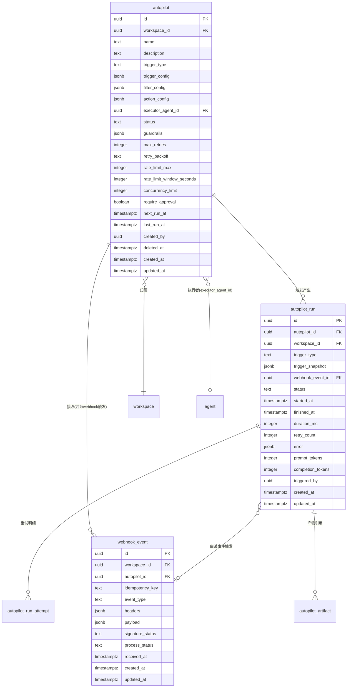
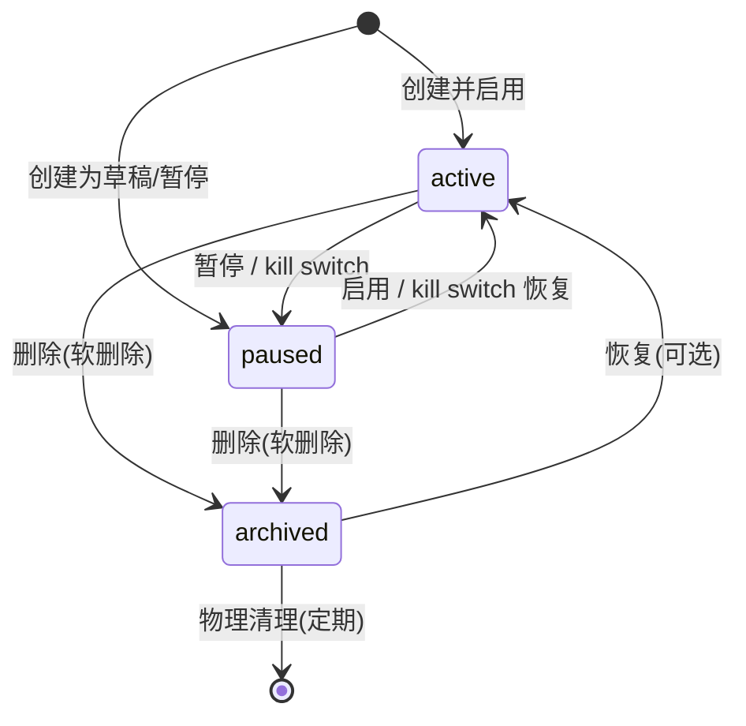
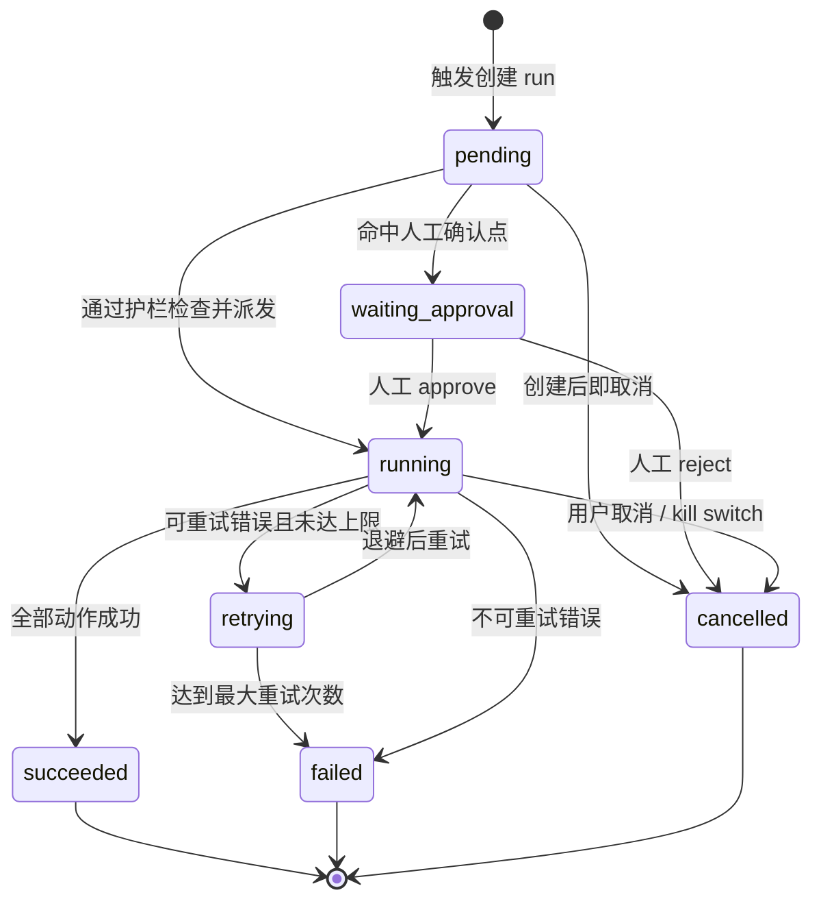

# 自动化(autopilot)模块调研记录

> 本文档为 Mesh(AI 原生团队工作区,AI agent 作为真正的队友)撰写 spec 的调研依据。
> 后端技术栈:Python(异步 Web 框架 + PostgreSQL + ORM + WebSocket)。
> 全文采用统一的数据模型基准约定(见下),并对业界标准做法做了匿名化抽象,不指向任何具体产品。

---

## 0. 数据模型基准约定(全文统一)

- 数据库:PostgreSQL,主键统一为 `UUID`(v4),由数据库或应用层生成。
- 所有表均含 `created_at` / `updated_at`,类型 `timestamptz`,统一存 UTC。
- 对外协议:REST + JSON;鉴权使用 Bearer token(JWT 或 opaque token 均可)。
- 列表接口统一游标分页:`?cursor=<opaque>&limit=<int>`,响应含 `next_cursor`(无更多则为 `null`)。
- 软删除优先:核心实体含 `deleted_at timestamptz null`,删除即置位而非物理删除。
- 时间一律 UTC、RFC3339 格式(如 `2026-07-24T08:30:00Z`)。
- 表名 `snake_case` 复数;字段名 `snake_case`。
- JSONB 用于半结构化配置(触发器、过滤、动作配置)。
- 状态字段统一用 `text` + `check` 约束枚举,而非整数,便于可读与扩展。

### 模块定位

自动化(autopilot)模块的本质是 **"触发器 + 条件 + 动作"** 的自动化规则引擎:把重复性的运营、监控、响应工作交给 agent 自动完成。一条 autopilot 规则 = 何时触发(trigger)+ 是否满足条件(filter)+ 做什么(action,通常是把一段 prompt 交给指定 agent 执行)。

在 Mesh 的语境里,autopilot 是"AI 队友的值班表":它让 agent 不必等人召唤,而是按约定(定时)或按事件(状态变更、被 @、外部系统回调)自动上岗。

---

## 一、功能清单

每一项附典型用户场景。

### 1.1 自动化规则构成

一条 autopilot 规则由以下要素组成:

| 要素 | 说明 | 必填 |
|------|------|------|
| 名称 | 规则的人类可读名,workspace 内建议唯一 | 是 |
| 描述 | 规则用途说明(可选) | 否 |
| 触发器(trigger) | 定时或事件,见 1.2 / 1.3 | 是 |
| 过滤条件(filter) | 触发后再过滤,决定是否真正执行,见 1.4 | 否 |
| 动作(action) | 执行 prompt 交给 agent / 改字段 / 发评论 / 发通知,见 1.5 | 是 |
| 执行者 agent | 由哪个 agent 来执行动作,见 1.5 | 视动作而定 |
| 护栏(guardrails) | 频率上限、去重、并发、人工确认、kill switch,见 1.10 | 否(有默认值) |
| 启用状态 | active / paused / archived | 是 |

**典型场景**:运营负责人创建一条规则"每天早上 9 点汇总昨日各成员进展并发到团队频道";研发负责人创建一条规则"当某 issue 被 @提及值班 agent 时,自动让该 agent 介入处理"。

### 1.2 定时触发器(cron 调度)

- 使用标准 cron 表达式(5 段:分 时 日 月 周)描述周期。
- **必须显式携带时区**(IANA 时区名,如 `Asia/Shanghai`),避免服务器 UTC 与用户预期错位。
- 提供**下次运行时间预览**:给定当前时间,计算并返回未来 N 次(默认 5 次)预计触发时刻,供配置时校验。
- 支持一次性定时(在指定时刻运行一次后自动归档)作为 cron 的退化形态。
- 错过触发(missed fire)的处理策略可配置:`skip`(跳过补偿)/ `run_once`(恢复后补跑一次)/ `run_all`(逐个补跑,慎用)。

**典型场景**:每周一 09:00(Asia/Shanghai)自动生成上周复盘草稿;每月 1 号 00:00 跑一次成本审计。

### 1.3 事件触发器

| 事件类型 | 触发时机 | 说明 |
|----------|----------|------|
| `issue_status_changed` | issue 状态变更 | 如 todo→in_progress、→done、→blocked |
| `issue_created` | 新 issue 创建 | 可用于自动分诊、自动打标签 |
| `issue_field_changed` | 指定字段变更 | 如优先级、负责人、截止日期变化 |
| `comment_created` | issue 下新评论 | 可配合关键词过滤 |
| `agent_mentioned` | 评论/正文 @提及某 agent | 触发该 agent 自动响应 |
| `webhook_received` | 外部系统经入站 Webhook 推送事件 | 见 1.3.1 与第三章入站端点 |

- 事件触发器需声明**关注的事件类型**与**关注对象范围**(如仅某 project 内)。
- 事件载荷(payload)会被**快照**进 run,保证可回溯、可重放。

**1.3.1 外部 Webhook 事件**:外部系统(代码托管、监控告警、CI/CD、表单等)通过入站 HTTP 端点推送事件。每条规则可生成专属的入站 URL,或共享端点 + 路由键。所有入站事件先落库(`webhook_event` 表)做签名校验、去重、审计,再分发到匹配的规则。

**典型场景**:监控系统告警经 Webhook 推入 → 自动创建 issue 并让值班 agent 初诊;代码合并事件 → 自动更新对应 issue 状态并通知。

### 1.4 触发过滤条件(filter)

触发器决定"何时被叫醒",过滤条件决定"叫醒后要不要真的干活"。过滤维度:

- 按项目(project)
- 按标签(label)
- 按优先级(priority)
- 按作者/触发者(actor)
- 按关键词(标题/正文/评论内容包含/不包含)
- 按状态(from/to,仅对状态变更事件)
- 自定义键值匹配(对 Webhook 载荷的字段做 JSONPath/键匹配)

过滤条件之间默认 AND;同类多值之间为 OR(如标签命中任一即可)。

**典型场景**:"只在优先级为 high/critical 且带有 `bug` 标签的 issue 被 @ 时,才让值班 agent 介入",避免 agent 被无关提及频繁打扰。

### 1.5 动作(action)

动作是规则执行的核心。一条规则可配置一个或多个动作(顺序执行)。

| 动作类型 | 说明 |
|----------|------|
| `run_agent_prompt` | 把一段 prompt(可含变量模板)交给指定 agent 执行,这是最核心动作 |
| `update_issue_fields` | 修改 issue 字段(状态、优先级、负责人、标签等) |
| `add_comment` | 在目标 issue 下发一条评论(可含模板与 agent 产物) |
| `send_notification` | 向规则所有者/指定成员发送通知 |
| `create_issue` | 基于模板创建新 issue(可由 agent 产物填充) |
| `http_request` | 调用外部 HTTP 端点(出向),用于联动外部系统 |

**prompt 模板变量**:动作 prompt 支持占位符,运行时由触发上下文填充,例如:
`{{trigger.issue.title}}`、`{{trigger.comment.body}}`、`{{trigger.actor.name}}`、`{{trigger.webhook.payload.*}}`、`{{run.id}}`、`{{now}}`。

**执行者 agent**:`run_agent_prompt` 必须绑定一个 `executor_agent_id`。该 agent 的运行时(runtime)、技能(skill)、权限决定了它能做什么。规则定义本身不持有执行能力,只是"派单"。

**典型场景**:Webhook 告警进入 → 动作 1 让值班 agent 跑诊断 prompt → 动作 2 把 agent 结论作为评论发到 issue → 动作 3 通知负责人。

### 1.6 启用 / 暂停 / 删除

- **启用(active)**:规则参与调度与事件匹配。
- **暂停(paused)**:规则保留配置但不再触发;暂停期间命中的事件默认丢弃(可配置为缓冲)。
- **归档/删除(archived)**:软删除,`deleted_at` 置位,不再出现在默认列表,历史 run 仍保留以备审计。

状态切换均记录到审计日志(谁、何时、从什么状态到什么状态)。

**典型场景**:节假日临时暂停"每日站会汇总";某规则被新规则取代后归档。

### 1.7 执行历史(run)

每次规则被触发并进入执行,都生成一条 `autopilot_run` 记录,包含:

- 触发时间、触发类型、触发事件快照(JSONB)
- 运行状态(pending/running/succeeded/failed/cancelled/retrying/waiting_approval)
- 开始时间、结束时间、耗时
- 产物引用(指向 agent 产物/评论/创建的 issue 等)
- token 消耗(prompt_tokens / completion_tokens / 合计)与成本估算
- 错误信息(失败原因、错误码、堆栈摘要)
- 重试计数

**典型场景**:规则所有者打开规则详情页,看到最近 20 次运行的时间线,其中 1 次失败,点进去看失败原因与当时的输入快照。

### 1.8 失败重试

- 可配置最大重试次数(默认 3,上限可设)。
- 退避策略:`fixed`(固定间隔)/ `linear`(线性递增)/ `exponential`(指数退避,推荐),均带抖动(jitter)避免雪崩。
- 重试间隔有上限封顶(max_backoff)。
- 区分**可重试错误**(超时、限流、瞬时网络错误)与**不可重试错误**(配置错误、鉴权失败、参数非法)——后者直接 failed,不浪费重试。
- 每次重试可生成新的 run 或在原 run 上累加 `retry_count`(推荐:同 run 累加 + 记录每次尝试明细,便于聚合统计)。

**典型场景**:agent 调用主流大语言模型时被限流,系统按指数退避自动重试,第 2 次成功;若 3 次都失败则标记 failed 并告警。

### 1.9 告警

- 规则所有者(及可配置的额外接收人)在以下情况收到通知:
  - 连续失败达到阈值(如连续 3 次)
  - 单次运行失败(可选,默认仅连续失败)
  - 运行命中频率上限被熔断
  - 触发人工确认点等待处理
- 告警通道:站内通知(inbox)、可选的出向 Webhook、邮件(由通知模块统一承载)。
- 告警去重:同一规则同类告警在静默窗口内只发一次,避免告警风暴。

**典型场景**:某规则的 agent 因 token 耗尽连续失败 3 次,所有者收到"autopilot 连续失败"告警,内含最近一次错误与跳转链接。

### 1.10 防失控护栏(guardrails)

这是 autopilot 区别于普通脚本的关键。失控的自动化比没有自动化更危险。

| 护栏 | 说明 |
|------|------|
| **频率上限(rate limit)** | 单位时间内单条规则最多触发 N 次(如 10 次/小时)。超限时新触发被拒绝或排队,并触发熔断告警 |
| **去重/幂等(idempotency)** | 同一事件(以事件唯一键标识)在去重窗口内只执行一次,防止重复投递/重复回调导致重复执行 |
| **并发上限(concurrency)** | 单条规则同时运行的 run 数上限(默认 1,即串行);防止慢任务堆积 |
| **人工确认点(approval gate)** | 高风险动作执行前暂停,等待人工 approve/reject;run 进入 `waiting_approval` |
| **kill switch(全局暂停)** | workspace 级一键暂停所有 autopilot;也可按规则、按 agent 维度暂停 |
| **作用域限制** | 规则只能在创建者权限范围内操作;agent 动作受 agent 自身权限约束(最小权限) |
| **预算上限** | 单 run / 单规则 / 单日的 token 与运行次数预算,超限熔断 |

**频率上限触顶后的行为**(可配置):`drop`(丢弃并记录)/ `queue`(排队等待下个窗口)/ `alert_only`(放行但告警)。默认 `drop` + 告警。

**典型场景**:外部系统因 bug 在 1 分钟内重复推送同一告警 500 次,去重键命中,只执行 1 次;同时频率上限把超出的触发熔断并告警,避免 agent 被刷爆。

---

## 二、数据模型

### 2.1 实体关系图(mermaid erDiagram)



### 2.2 表:`autopilot`(自动化规则定义)

| 字段 | 类型 | 约束 | 默认值 | 说明 |
|------|------|------|--------|------|
| `id` | uuid | PK | gen_random_uuid() | 主键 |
| `workspace_id` | uuid | NOT NULL, FK→workspace | - | 归属 workspace |
| `name` | text | NOT NULL | - | 规则名,workspace 内建议唯一 |
| `description` | text | NULL | - | 描述 |
| `trigger_type` | text | NOT NULL, check in (`schedule`,`issue_status_changed`,`issue_created`,`issue_field_changed`,`comment_created`,`agent_mentioned`,`webhook_received`) | - | 触发器类型 |
| `trigger_config` | jsonb | NOT NULL | `'{}'` | 触发器配置(见 2.5) |
| `filter_config` | jsonb | NOT NULL | `'{}'` | 过滤条件(见 2.6) |
| `action_config` | jsonb | NOT NULL | `'[]'` | 动作列表(数组,见 2.7) |
| `executor_agent_id` | uuid | NULL, FK→agent | - | 执行者 agent;`run_agent_prompt` 必填 |
| `status` | text | NOT NULL, check in (`active`,`paused`,`archived`) | `'active'` | 规则状态 |
| `guardrails` | jsonb | NOT NULL | 见 2.8 | 护栏配置 |
| `max_retries` | integer | NOT NULL, check >=0 | `3` | 最大重试次数 |
| `retry_backoff` | text | NOT NULL, check in (`fixed`,`linear`,`exponential`) | `'exponential'` | 退避策略 |
| `retry_base_seconds` | integer | NOT NULL, check >0 | `30` | 退避基数 |
| `retry_max_seconds` | integer | NOT NULL, check >0 | `1800` | 退避封顶 |
| `rate_limit_max` | integer | NOT NULL, check >=0 | `10` | 窗口内最大触发数 |
| `rate_limit_window_seconds` | integer | NOT NULL, check >0 | `3600` | 频率窗口(秒) |
| `concurrency_limit` | integer | NOT NULL, check >=1 | `1` | 并发 run 上限 |
| `require_approval` | boolean | NOT NULL | `false` | 是否需人工确认点 |
| `next_run_at` | timestamptz | NULL | - | 下次定时触发时刻(调度索引用) |
| `last_run_at` | timestamptz | NULL | - | 上次运行时刻 |
| `created_by` | uuid | NOT NULL | - | 创建者(member 或 agent) |
| `deleted_at` | timestamptz | NULL | - | 软删除时间 |
| `created_at` | timestamptz | NOT NULL | now() | 创建时间 |
| `updated_at` | timestamptz | NOT NULL | now() | 更新时间 |

**唯一约束**:`UNIQUE (workspace_id, name) WHERE deleted_at IS NULL`(软删除范围内名称唯一)。

### 2.3 表:`autopilot_run`(每次执行记录)

| 字段 | 类型 | 约束 | 默认值 | 说明 |
|------|------|------|--------|------|
| `id` | uuid | PK | gen_random_uuid() | 主键 |
| `autopilot_id` | uuid | NOT NULL, FK→autopilot | - | 所属规则 |
| `workspace_id` | uuid | NOT NULL, FK→workspace | - | 冗余,便于按 workspace 查询 |
| `trigger_type` | text | NOT NULL | - | 触发类型快照 |
| `trigger_snapshot` | jsonb | NOT NULL | `'{}'` | 触发事件输入快照(可重放) |
| `webhook_event_id` | uuid | NULL, FK→webhook_event | - | 关联入站事件(若适用) |
| `status` | text | NOT NULL, check in (`pending`,`running`,`waiting_approval`,`retrying`,`succeeded`,`failed`,`cancelled`) | `'pending'` | 运行状态 |
| `started_at` | timestamptz | NULL | - | 开始时间 |
| `finished_at` | timestamptz | NULL | - | 结束时间 |
| `duration_ms` | integer | NULL | - | 耗时(毫秒) |
| `retry_count` | integer | NOT NULL, check >=0 | `0` | 已重试次数 |
| `error` | jsonb | NULL | - | 错误信息 `{code,message,retryable,detail}` |
| `prompt_tokens` | integer | NULL, check >=0 | - | 输入 token |
| `completion_tokens` | integer | NULL, check >=0 | - | 输出 token |
| `total_tokens` | integer | GENERATED ALWAYS AS (coalesce(prompt_tokens,0)+coalesce(completion_tokens,0)) STORED | - | 合计 token |
| `triggered_by` | uuid | NULL | - | 触发者(手动 test run 时为操作者) |
| `created_at` | timestamptz | NOT NULL | now() | 创建时间 |
| `updated_at` | timestamptz | NOT NULL | now() | 更新时间 |

### 2.4 表:`autopilot_run_attempt`(重试明细)与 `autopilot_artifact`(产物)

`autopilot_run_attempt`(每次尝试一行,便于精确统计与排障):

| 字段 | 类型 | 约束 | 默认值 | 说明 |
|------|------|------|--------|------|
| `id` | uuid | PK | gen_random_uuid() | 主键 |
| `run_id` | uuid | NOT NULL, FK→autopilot_run | - | 所属 run |
| `attempt_number` | integer | NOT NULL, check >=1 | - | 第几次尝试 |
| `status` | text | NOT NULL | - | 本次尝试结果 |
| `started_at` / `finished_at` | timestamptz | NULL | - | 起止 |
| `error` | jsonb | NULL | - | 本次错误 |
| `prompt_tokens` / `completion_tokens` | integer | NULL | - | 本次 token |
| `created_at` | timestamptz | NOT NULL | now() | - |
| 唯一约束 | `UNIQUE (run_id, attempt_number)` | | | |

`autopilot_artifact`(产物引用,把 run 与它产生的对象解耦关联):

| 字段 | 类型 | 约束 | 默认值 | 说明 |
|------|------|------|--------|------|
| `id` | uuid | PK | gen_random_uuid() | 主键 |
| `run_id` | uuid | NOT NULL, FK→autopilot_run | - | 所属 run |
| `artifact_type` | text | NOT NULL, check in (`comment`,`issue`,`notification`,`agent_output`,`http_response`) | - | 产物类型 |
| `ref_table` | text | NOT NULL | - | 被引用对象所在表 |
| `ref_id` | uuid | NOT NULL | - | 被引用对象 id |
| `summary` | text | NULL | - | 产物摘要 |
| `created_at` | timestamptz | NOT NULL | now() | - |

### 2.5 表:`webhook_event`(外部事件接收记录,去重与审计)

| 字段 | 类型 | 约束 | 默认值 | 说明 |
|------|------|------|--------|------|
| `id` | uuid | PK | gen_random_uuid() | 主键 |
| `workspace_id` | uuid | NOT NULL, FK→workspace | - | 归属 |
| `autopilot_id` | uuid | NULL, FK→autopilot | - | 路由到的规则(可为空表示未匹配) |
| `idempotency_key` | text | NOT NULL | - | 去重键(来自事件 ID 或签名/内容哈希) |
| `event_type` | text | NOT NULL | - | 事件类型(由来源/载荷解析) |
| `headers` | jsonb | NULL | - | 入站请求头(脱敏后) |
| `payload` | jsonb | NOT NULL | - | 原始载荷 |
| `signature_status` | text | NOT NULL, check in (`valid`,`invalid`,`missing`,`skipped`) | - | 签名校验结果 |
| `process_status` | text | NOT NULL, check in (`received`,`matched`,`dispatched`,`deduped`,`rejected`,`processed`,`failed`) | `'received'` | 处理状态 |
| `received_at` | timestamptz | NOT NULL | now() | 接收时间 |
| `created_at` | timestamptz | NOT NULL | now() | - |
| `updated_at` | timestamptz | NOT NULL | now() | - |

**去重唯一键**:`UNIQUE (workspace_id, idempotency_key)`。入站时先尝试插入,命中唯一冲突即视为重复,直接返回成功(幂等)但不再分发。

### 2.6 JSONB 配置结构

**`trigger_config`(定时)**:
```json
{
  "cron": "0 9 * * 1-5",
  "timezone": "Asia/Shanghai",
  "misfire_policy": "run_once",
  "one_time_at": null
}
```

**`trigger_config`(事件)**:
```json
{
  "event": "issue_status_changed",
  "scope_project_ids": ["<uuid>"],
  "from_status": ["todo"],
  "to_status": ["in_progress"],
  "watch_fields": ["priority", "assignee_id"]
}
```

**`filter_config`**:
```json
{
  "project_ids": ["<uuid>"],
  "labels": ["bug"],
  "priorities": ["high", "critical"],
  "actor_ids": [],
  "keyword_include": ["回归", "线上"],
  "keyword_exclude": ["忽略"],
  "payload_match": [{"path": "alert.severity", "op": "in", "value": ["critical"]}]
}
```

**`action_config`(数组,顺序执行)**:
```json
[
  {"type": "run_agent_prompt", "executor_agent_id": "<uuid>",
   "prompt": "请诊断 issue {{trigger.issue.title}}:{{trigger.comment.body}}"},
  {"type": "add_comment", "target": "trigger.issue",
   "content": "自动诊断结论:{{steps.0.output}}"},
  {"type": "send_notification", "to": ["owner"], "template": "autopilot_done"}
]
```

**`guardrails`**:
```json
{
  "rate_limit_overflow": "drop",
  "dedup_window_seconds": 300,
  "dedup_key_template": "{{trigger.event_id}}",
  "daily_run_budget": 200,
  "daily_token_budget": 2000000,
  "approval_required_actions": ["http_request", "create_issue"],
  "kill_switch_paused": false
}
```

### 2.7 关键索引

```sql
-- 调度器扫描:按下次运行时间取出到期的 active 定时规则
CREATE INDEX idx_autopilot_schedule
  ON autopilot (next_run_at)
  WHERE status = 'active' AND trigger_type = 'schedule' AND deleted_at IS NULL;

-- 事件匹配:按触发类型 + 状态找候选规则
CREATE INDEX idx_autopilot_trigger
  ON autopilot (trigger_type, status)
  WHERE deleted_at IS NULL;

-- 执行历史:某规则的 run 时间线(详情页第常用查询)
CREATE INDEX idx_run_autopilot_started
  ON autopilot_run (autopilot_id, started_at DESC);

-- workspace 维度运行列表
CREATE INDEX idx_run_workspace_started
  ON autopilot_run (workspace_id, created_at DESC);

-- 状态过滤(查在跑/等待审批的 run)
CREATE INDEX idx_run_status
  ON autopilot_run (status)
  WHERE status IN ('running', 'retrying', 'waiting_approval', 'pending');

-- 事件去重唯一键
CREATE UNIQUE INDEX uq_webhook_event_idem
  ON webhook_event (workspace_id, idempotency_key);

-- 事件按规则与处理状态查询
CREATE INDEX idx_webhook_event_route
  ON webhook_event (autopilot_id, process_status, received_at DESC);
```

---

## 三、接口设计

### 3.1 通用约定

- Base path:`/api/v1`,所有路径含 `workspace_id`(或以 workspace 子域/上下文注入)。
- 鉴权:`Authorization: Bearer <token>`;入站 Webhook 端点除外(用 HMAC 签名校验)。
- 列表分页:`GET ...?cursor=<opaque>&limit=<int>`(limit 默认 20,上限 100);响应:
  ```json
  {"data": [ ... ], "next_cursor": "<opaque-or-null>"}
  ```
- 错误响应统一信封:
  ```json
  {"error": {"code": "rate_limited", "message": "autopilot 触发频率超限", "details": {}}}
  ```
- 时间均为 UTC RFC3339;id 均为 UUID。

### 3.2 REST 端点清单

| 方法 | 路径 | 说明 |
|------|------|------|
| POST | `/workspaces/{ws}/autopilots` | 创建规则 |
| GET | `/workspaces/{ws}/autopilots` | 列表(分页 + 过滤) |
| GET | `/workspaces/{ws}/autopilots/{id}` | 详情 |
| PATCH | `/workspaces/{ws}/autopilots/{id}` | 更新配置 |
| DELETE | `/workspaces/{ws}/autopilots/{id}` | 软删除(归档) |
| POST | `/workspaces/{ws}/autopilots/{id}/pause` | 暂停 |
| POST | `/workspaces/{ws}/autopilots/{id}/resume` | 启用 |
| POST | `/workspaces/{ws}/autopilots/{id}/test-run` | 手动触发一次(测试运行) |
| GET | `/workspaces/{ws}/autopilots/{id}/runs` | 该规则执行历史 |
| GET | `/workspaces/{ws}/autopilot-runs/{run_id}` | 单次运行详情(含产物/尝试明细) |
| GET | `/workspaces/{ws}/autopilot-runs/{run_id}/artifacts` | 运行产物列表 |
| POST | `/workspaces/{ws}/autopilot-runs/{run_id}/cancel` | 取消正在运行的 run |
| POST | `/workspaces/{ws}/autopilot-runs/{run_id}/approve` | 人工确认通过(审批门) |
| POST | `/workspaces/{ws}/autopilot-runs/{run_id}/reject` | 人工确认拒绝 |
| GET | `/workspaces/{ws}/autopilots/{id}/preview-schedule` | cron 下次运行预览 |
| POST | `/workspaces/{ws}/autopilots/kill-switch` | 全局暂停/恢复所有 autopilot |
| POST | `/webhooks/inbound/{token}` | 接收外部 Webhook(HMAC 签名校验) |
| POST | `/workspaces/{ws}/webhook-secrets` | 创建/轮换 Webhook 密钥 |
| GET | `/workspaces/{ws}/webhook-secrets` | 列出密钥(不返回明文) |

### 3.3 创建规则

`POST /workspaces/{ws}/autopilots`

请求体:
```json
{
  "name": "每日站会前汇总进展",
  "description": "工作日 09:00 自动汇总各成员昨日进展",
  "trigger_type": "schedule",
  "trigger_config": {
    "cron": "0 9 * * 1-5",
    "timezone": "Asia/Shanghai",
    "misfire_policy": "run_once"
  },
  "filter_config": {"project_ids": ["6f1c..."]},
  "action_config": [
    {"type": "run_agent_prompt", "executor_agent_id": "a9e2...",
     "prompt": "汇总项目 {{filter.project_ids[0]}} 各成员昨日进展,输出 markdown"},
    {"type": "send_notification", "to": ["owner"], "template": "daily_summary"}
  ],
  "executor_agent_id": "a9e2...",
  "max_retries": 3,
  "retry_backoff": "exponential",
  "rate_limit_max": 5,
  "rate_limit_window_seconds": 3600,
  "require_approval": false
}
```

响应 `201 Created`:
```json
{
  "id": "3b7d1f0e-2c4a-4e1b-9f8a-1d2e3f4a5b6c",
  "workspace_id": "7ea1...",
  "name": "每日站会前汇总进展",
  "trigger_type": "schedule",
  "trigger_config": {"cron": "0 9 * * 1-5", "timezone": "Asia/Shanghai", "misfire_policy": "run_once"},
  "filter_config": {"project_ids": ["6f1c..."]},
  "action_config": [ ... ],
  "executor_agent_id": "a9e2...",
  "status": "active",
  "guardrails": {"rate_limit_overflow": "drop", "dedup_window_seconds": 300},
  "max_retries": 3,
  "retry_backoff": "exponential",
  "rate_limit_max": 5,
  "rate_limit_window_seconds": 3600,
  "concurrency_limit": 1,
  "require_approval": false,
  "next_run_at": "2026-07-27T01:00:00Z",
  "created_at": "2026-07-24T12:00:00Z",
  "updated_at": "2026-07-24T12:00:00Z"
}
```

### 3.4 列表(分页 + 过滤)

`GET /workspaces/{ws}/autopilots?status=active&trigger_type=schedule&cursor=<c>&limit=20`

响应:
```json
{
  "data": [
    {
      "id": "3b7d...",
      "name": "每日站会前汇总进展",
      "trigger_type": "schedule",
      "status": "active",
      "last_run_at": "2026-07-24T01:00:00Z",
      "next_run_at": "2026-07-27T01:00:00Z",
      "stats": {"runs_30d": 22, "success_rate": 0.95}
    }
  ],
  "next_cursor": "eyJpZCI6IjNiN2Qu"
}
```

### 3.5 启用 / 暂停

`POST /workspaces/{ws}/autopilots/{id}/pause` → `200`:
```json
{"id": "3b7d...", "status": "paused", "updated_at": "2026-07-24T12:30:00Z"}
```
`POST .../resume` 同理返回 `status: "active"`,并重算 `next_run_at`。

### 3.6 手动触发一次(test run)

`POST /workspaces/{ws}/autopilots/{id}/test-run`
```json
{"simulate_trigger_payload": {"issue": {"title": "登录报错"}}, "dry_run": false}
```
响应 `202 Accepted`:
```json
{"run_id": "c0a8...", "status": "pending", "autopilot_id": "3b7d...", "is_test": true}
```
`dry_run=true` 时只校验配置与过滤命中、不真正执行动作,返回 `{"would_run": true, "matched_filters": {...}}`。

### 3.7 执行历史

`GET /workspaces/{ws}/autopilots/{id}/runs?status=failed&cursor=&limit=20`
```json
{
  "data": [
    {
      "id": "c0a8...",
      "status": "failed",
      "trigger_type": "schedule",
      "started_at": "2026-07-24T01:00:00Z",
      "finished_at": "2026-07-24T01:00:42Z",
      "duration_ms": 42000,
      "retry_count": 3,
      "total_tokens": 15230,
      "error": {"code": "agent_timeout", "message": "agent 执行超时", "retryable": true}
    }
  ],
  "next_cursor": null
}
```

### 3.8 单次运行详情

`GET /workspaces/{ws}/autopilot-runs/{run_id}`
```json
{
  "id": "c0a8...",
  "autopilot_id": "3b7d...",
  "status": "succeeded",
  "trigger_type": "agent_mentioned",
  "trigger_snapshot": {
    "event_id": "evt_9f2...",
    "issue": {"id": "i1", "title": "登录报错"},
    "comment": {"id": "cm1", "body": "@值班agent 帮忙看下"},
    "actor": {"id": "u7", "name": "张三"}
  },
  "started_at": "2026-07-24T03:12:00Z",
  "finished_at": "2026-07-24T03:12:35Z",
  "duration_ms": 35000,
  "retry_count": 0,
  "prompt_tokens": 8200,
  "completion_tokens": 1300,
  "total_tokens": 9500,
  "attempts": [
    {"attempt_number": 1, "status": "succeeded", "started_at": "2026-07-24T03:12:00Z",
     "finished_at": "2026-07-24T03:12:35Z", "error": null}
  ],
  "artifacts": [
    {"artifact_type": "comment", "ref_table": "comments", "ref_id": "cm9", "summary": "已发布诊断结论"}
  ],
  "error": null
}
```

### 3.9 取消运行 / 人工确认

`POST /workspaces/{ws}/autopilot-runs/{run_id}/cancel` → `200`
```json
{"id": "c0a8...", "status": "cancelled", "finished_at": "2026-07-24T03:13:00Z"}
```
`POST .../approve` / `.../reject`(仅 `waiting_approval` 可调用):
```json
{"id": "c0a8...", "status": "running", "approval": {"by": "u7", "decision": "approved", "at": "2026-07-24T03:13:10Z"}}
```

### 3.10 cron 下次运行预览

`GET /workspaces/{ws}/autopilots/{id}/preview-schedule?count=5`
```json
{
  "cron": "0 9 * * 1-5",
  "timezone": "Asia/Shanghai",
  "next_runs": [
    "2026-07-27T01:00:00Z",
    "2026-07-28T01:00:00Z",
    "2026-07-29T01:00:00Z",
    "2026-07-30T01:00:00Z",
    "2026-07-31T01:00:00Z"
  ]
}
```

### 3.11 全局 kill switch

`POST /workspaces/{ws}/autopilots/kill-switch`
```json
{"enabled": true, "reason": "紧急止血:批量异常"}
```
响应:
```json
{"kill_switch": true, "paused_autopilots": 14, "updated_at": "2026-07-24T04:00:00Z"}
```
恢复时 `enabled: false`,逐条恢复原状态(active 的重新参与调度)。

### 3.12 入站 Webhook(HMAC 签名校验)

`POST /webhooks/inbound/{token}`(无需 Bearer;`{token}` 为规则/端点路由令牌)

请求头:
```
Content-Type: application/json
X-Signature: t=1721808000,v1=5d41402abc4b2a76b9719d911017c592...
X-Event-Type: alert.triggered
X-Event-Id: evt_9f2a...
```
签名计算:`v1 = HMAC_SHA256(secret, f"{t}.{raw_body}")`,服务端用密钥重算并**恒定时间比较**;同时校验时间戳 `t` 在容差窗口(如 ±300s)内防重放。

响应 `200`(幂等,重复事件同样返回 200):
```json
{"received": true, "event_id": "evt_9f2a...", "process_status": "dispatched", "run_id": "c0a8..."}
```
重复事件:
```json
{"received": true, "event_id": "evt_9f2a...", "process_status": "deduped", "run_id": null}
```
签名失败返回 `401`:
```json
{"error": {"code": "invalid_signature", "message": "Webhook 签名校验失败"}}
```

**处理流程**:接收 → 落库 `webhook_event`(状态 `received`)→ 校验签名(`signature_status`)→ 计算/读取 `idempotency_key` 尝试去重插入(命中则 `deduped` 直接返回)→ 路由匹配规则 → 频率/护栏检查 → 创建 `autopilot_run`(`process_status=dispatched`)→ 异步执行。

### 3.13 错误码表

| HTTP | code | 含义 |
|------|------|------|
| 400 | `invalid_request` | 请求体/参数非法 |
| 400 | `invalid_cron` | cron 表达式不合法 |
| 400 | `invalid_trigger_config` | 触发器配置与类型不匹配 |
| 401 | `unauthorized` | 缺少/无效 Bearer token |
| 401 | `invalid_signature` | Webhook 签名校验失败 |
| 403 | `forbidden` | 无权限操作该规则/run |
| 404 | `not_found` | 规则/run/事件不存在 |
| 409 | `conflict` | 名称重复;或对非允许状态的 run 操作(如取消已结束 run) |
| 409 | `duplicate_event` | 事件去重命中(通常作为 200 `deduped` 返回,内部用) |
| 422 | `executor_required` | `run_agent_prompt` 缺少 executor_agent_id |
| 422 | `agent_unavailable` | 执行 agent 不存在/不可用 |
| 429 | `rate_limited` | 触发频率超限 / API 限流 |
| 500 | `internal_error` | 服务内部错误 |
| 503 | `executor_busy` | agent 运行时繁忙且并发已满 |

---

## 四、UI 设计

### 4.1 自动化规则列表页

展示要素:名称、触发器类型(图标+文案)、状态徽章、上次运行时间与结果、近 30 天成功率、下次运行时间(定时)、快捷操作(暂停/启用/手动运行)。顶部有"新建 autopilot"按钮、状态/类型过滤器、搜索框。

```
┌──────────────────────────────────────────────────────────────────────┐
│  自动化 Autopilots                          [+ 新建 autopilot]        │
│  状态:[全部▾] 类型:[全部▾] 搜索:[____________]   ⚠ 全局开关:● 已开启  │
├──────────────────────────────────────────────────────────────────────┤
│ 名称                  触发器        状态     上次运行    成功率  操作   │
│ ────────────────────────────────────────────────────────────────────  │
│ 每日站会前汇总进展     ⏰ 定时       ● active  1h前 ✓     95%   ⏸ ▶ ⋯  │
│ @值班agent 自动响应   💬 @提及      ● active  8m前 ✓     88%   ⏸ ▶ ⋯  │
│ 监控告警自动分诊       🔌 Webhook   ⏸ paused  2d前 ✗     60%   ▶ ⋯    │
│ 周一复盘草稿          ⏰ 定时       ● active  3d前 ✓    100%   ⏸ ▶ ⋯  │
│ ────────────────────────────────────────────────────────────────────  │
│  加载更多…                                                           │
└──────────────────────────────────────────────────────────────────────┘
```

### 4.2 规则编辑器(分区式:触发器→过滤→动作→执行者→护栏)

分四个可折叠区块,底部固定保存/取消栏。cron 输入提供可视化(下拉选择常用周期 + 高级手填)与"下次 5 次运行预览"实时刷新。

```
┌──────────────────────────────────────────────────────────────────────┐
│  编辑 autopilot:每日站会前汇总进展              [取消] [保存草稿] [保存]│
├──────────────────────────────────────────────────────────────────────┤
│ 名称* [每日站会前汇总进展____________________]                        │
│ 描述  [工作日早上自动汇总各成员进展__________]                        │
│                                                                      │
│ ▼ ① 触发器                                                           │
│   类型:(●)定时 ( )事件                                               │
│   周期:[每个工作日 ▾]  时间:[09:00]  时区:[Asia/Shanghai ▾]          │
│   高级 cron:[0 9 * * 1-5______]                                      │
│   下次运行预览: 07-27 09:00 · 07-28 09:00 · 07-29 09:00 …            │
│   错过补偿:[补跑一次 ▾]                                              │
│                                                                      │
│ ▼ ② 过滤条件                                                         │
│   项目:[Mesh ▾]  标签:[+ 添加]  优先级:[□high □critical]            │
│   关键词包含:[________] 排除:[________]                              │
│                                                                      │
│ ▼ ③ 动作(按顺序执行)                              [+ 添加动作]       │
│   1. 交给 agent 执行 prompt   [值班agent ▾]                          │
│      [汇总项目各成员昨日进展,输出 markdown________]                  │
│   2. 发送通知  对象:[规则所有者 ▾] 模板:[daily_summary ▾]            │
│                                                                      │
│ ▼ ④ 护栏与重试                                                       │
│   执行者 agent:[值班agent ▾]                                         │
│   频率上限:[5] 次 / [1] 小时   超限行为:[丢弃并告警 ▾]               │
│   并发上限:[1]   重试次数:[3]  退避:[指数 ▾]                         │
│   ☐ 执行前需人工确认   预算:每日 [200] 次 / [200万] token            │
├──────────────────────────────────────────────────────────────────────┤
│                                       [取消]            [保存并启用]  │
└──────────────────────────────────────────────────────────────────────┘
```

### 4.3 规则详情页(配置 + 执行历史时间线)

上半部为只读配置卡片(含编辑入口、暂停/启用、手动运行按钮);下半部为执行历史时间线,支持按状态过滤。

```
┌──────────────────────────────────────────────────────────────────────┐
│ ← 每日站会前汇总进展      ● active     [编辑] [暂停] [手动运行] [⋯]   │
├───────────────────────────────┬──────────────────────────────────────┤
│ 配置                          │ 执行历史(近 30 天 22 次,成功率 95%)│
│ 触发:⏰ 0 9 * * 1-5 (沪)     │  状态:[全部▾]                       │
│ 下次:07-27 09:00             │ ──────────────────────────────────── │
│ 过滤:项目=Mesh               │  ✓ 07-24 09:00  35s  9.5k tok        │
│ 动作:①agent prompt ②通知     │  ✗ 07-23 09:00  42s  重试3次 超时    │
│ 执行者:值班agent             │  ✓ 07-22 09:00  31s  8.9k tok        │
│ 护栏:5次/h · 并发1 · 重试3   │  ● 07-21 09:00  running…            │
│ 创建者:李四  创建于 06-01    │  … 加载更多                          │
└───────────────────────────────┴──────────────────────────────────────┘
```

### 4.4 单次运行详情页(输入快照、产物、日志、重试)

```
┌──────────────────────────────────────────────────────────────────────┐
│ ← Run c0a8…    autopilot:@值班agent 自动响应    状态:✓ succeeded     │
├──────────────────────────────────────────────────────────────────────┤
│ 概要:触发=agent_mentioned · 耗时 35s · 重试 0 · token 9500           │
│ 触发时间:2026-07-24 03:12:00 UTC                                     │
├──────────────────────────────────────────────────────────────────────┤
│ [输入快照] [产物] [尝试明细/日志]                                    │
│  输入快照(JSON):                                                     │
│  {                                                                   │
│    "issue": {"id":"i1","title":"登录报错"},                          │
│    "comment": {"body":"@值班agent 帮忙看下"},                        │
│    "actor": {"name":"张三"}                                          │
│  }                                                                   │
│  产物:                                                               │
│   • 评论 cm9 — 已发布诊断结论            [跳转]                      │
│  尝试明细:                                                           │
│   #1  succeeded  03:12:00 → 03:12:35  无错误                         │
└──────────────────────────────────────────────────────────────────────┘
```

### 4.5 Webhook 配置与密钥管理

```
┌──────────────────────────────────────────────────────────────────────┐
│  Webhook 入站配置                                                     │
│  入站端点:https://<host>/webhooks/inbound/<token>     [复制]          │
│  签名密钥:v1_••••••••••••(创建后仅显示一次)  [轮换密钥] [新增]      │
│  签名说明:HMAC-SHA256(secret, "{timestamp}.{raw_body}")              │
│  最近事件:                                                           │
│   evt_9f2a  alert.triggered  valid    dispatched  07-24 03:12        │
│   evt_8c11  alert.triggered  valid    deduped     07-24 03:12        │
│   evt_7a03  build.failed     invalid  rejected    07-24 02:58        │
└──────────────────────────────────────────────────────────────────────┘
```

---

## 五、UX 设计

### 5.1 关键交互流程

**流程 A:创建"每日站会前自动汇总各成员进展"(定时)**
1. 列表页点"+ 新建 autopilot"。
2. 填名称;触发器选"定时",用可视化选"每个工作日 09:00",时区选本地。
3. 系统即时展示"下次 5 次运行预览",用户确认无误。
4. 过滤条件限定项目。
5. 动作选"交给 agent 执行 prompt",选执行者 agent,写汇总 prompt(可用模板变量)。
6. 追加"发送通知"动作给规则所有者。
7. 护栏使用默认值(5 次/小时、并发 1、重试 3 次指数退避)。
8. 保存并启用 → 列表出现该规则,`next_run_at` 已计算。

**流程 B:创建"@提及某 agent 时自动响应"(事件)**
1. 新建 → 触发器选"事件 → @提及某 agent",选定目标 agent。
2. 过滤:仅 `bug` 标签 + high/critical 优先级,排除含"忽略"关键词。
3. 动作:把评论上下文模板化进 prompt,交给该 agent;产物作为评论回发;可选通知。
4. 护栏:开启去重(同一评论的重复事件不重复响应),频率上限防刷屏。
5. 保存启用。被 @ 时,系统事件总线上该规则匹配 → 创建 run → agent 介入。

**流程 C:配置 Webhook 接收外部事件 → 触发 agent**
1. 在规则的触发器选"外部 Webhook",系统生成入站 URL 与签名密钥(密钥仅显示一次,提示妥善保存)。
2. 把 URL 与密钥配置到外部系统;约定事件类型与载荷格式。
3. 设置 `payload_match` 过滤(如仅 `severity=critical`)与去重键模板。
4. 动作:创建 issue + 让值班 agent 跑诊断 prompt + 发评论 + 通知。
5. 外部事件到达 → 签名校验 → 去重 → 匹配 → run 执行。`webhook_event` 全程留痕。

### 5.2 状态机(mermaid stateDiagram)

**规则状态机:**


**Run 状态机:**


### 5.3 调度实时性方案

**定时调度(扫描式 + 数据库为唯一事实源)**
- 一个常驻调度协程按固定节拍(如每 10–30s)扫描 `idx_autopilot_schedule` 取出 `next_run_at <= now()` 的 active 规则。
- 取出后用**行级锁/原子更新**(`UPDATE ... SET next_run_at=<下次> WHERE id=? AND next_run_at=? RETURNING *`)抢占,避免多实例重复触发(乐观并发,谁更新成功谁执行)。
- 立即重算并写回 `next_run_at`(基于 cron + 时区);按 misfire_policy 处理错过触发。
- 优势:无需额外调度中间件,PostgreSQL 即调度状态机,天然支持水平扩展与故障转移。

**事件驱动(发布订阅)**
- 业务侧(issue 状态变更、评论、@提及)在事务提交后向进程内事件总线/轻量消息通道发布领域事件(outbox 模式保证"业务写入"与"事件发布"一致)。
- 订阅方加载 `trigger_type` 匹配且 active 的规则,逐条做 filter 匹配与护栏检查,命中则创建 run 入队。
- run 的实际执行交给异步 worker 池(受 concurrency_limit 与 agent 运行时容量约束),通过 WebSocket/SSE 把 run 状态实时推给前端。
- Webhook 入站走同一事件管线,只是事件来源是 HTTP 而非内部领域事件。

**实时反馈**:run 状态变化经 WebSocket 推到规则详情页与列表页,运行中/成功/失败即时刷新,无需手动刷新。

### 5.4 通知机制

| 时机 | 通知对象 | 通道 |
|------|----------|------|
| 运行成功(可选) | 规则所有者 | 站内 inbox |
| 运行失败 / 连续失败 | 所有者 + 配置的接收人 | inbox + 可选出向 Webhook/邮件 |
| 命中频率上限被熔断 | 所有者 | inbox + 告警 |
| 需人工确认(审批门) | 所有者 / 指定审批人 | inbox + 推送,run 进入 `waiting_approval` |
| kill switch 触发 | workspace 管理员 | inbox |

- 通知带深链,直达对应 run 详情页。
- 告警去重与静默窗口:同规则同类告警在窗口内合并,避免风暴;连续失败计数在成功后清零。

### 5.5 人类监督与干预点

1. **人工确认点 / 审批门**:`require_approval=true` 或动作命中 `approval_required_actions`(如出向 HTTP、创建 issue)时,run 暂停在 `waiting_approval`,通知审批人,approve 才继续、reject 则取消。高风险动作默认走审批门。
2. **频率上限触顶行为**:超限按 `rate_limit_overflow` 配置——`drop`(丢弃并告警,默认)、`queue`(排队下窗口)、`alert_only`(放行但告警)。无论哪种都产生审计记录并通知所有者。
3. **全局 kill switch**:workspace 管理员一键暂停所有 autopilot(紧急止血),恢复时按各规则原状态还原。规则级、agent 级暂停同样可用。
4. **随时暂停 / 取消**:任何 active 规则可随时暂停;任何未结束 run 可随时取消;dry_run 测试运行让用户在真正生效前验证配置。
5. **可观测兜底**:每次 run 保留完整输入快照、尝试明细、产物与 token 消耗,失败可定位、可重放;所有状态切换与护栏命中均进审计日志。
6. **预算护栏**:单 run/单规则/单日 token 与运行次数预算,超限熔断,防止 agent 失控刷量产生高额成本。

---

## 六、对 Mesh 的设计启示

1. **autopilot 是"AI 队友的值班表",派单与执行要解耦**。规则只描述"触发器+条件+动作",执行能力完全来自被指派的 agent(其 runtime/skill/权限)。这样 autopilot 模块保持纯粹,agent 能力升级即自动惠及所有规则,无需改动规则引擎。Mesh 应把 `executor_agent_id` 作为一等公民,并让 agent 权限成为动作的硬边界(最小权限)。

2. **防失控护栏必须是默认开启的一等公民,而非可选项**。频率上限、事件去重(幂等键)、并发上限、人工确认点、全局 kill switch、token/次数预算,这六件套要在创建规则时就以合理默认值生效。失控的自动化比没有自动化更危险——尤其当事件源是外部 Webhook(可能重复/被刷)或 agent 之间互相 @ 触发(可能成环)时。Mesh 需特别设计"agent 触发 agent"的环路与级联深度限制。

3. **以 PostgreSQL 作为调度唯一事实源,用原子抢占实现可扩展定时**。`next_run_at` + 部分索引 + `UPDATE ... WHERE next_run_at=? RETURNING` 的乐观抢占,可避免引入额外调度中间件就实现多实例水平扩展与故障转移;事件侧用 outbox 模式保证业务写入与事件发布的一致性。这契合 Mesh"Python 异步 + PostgreSQL"的技术栈,降低运维复杂度。

4. **每次运行都要可观测、可重放、可核算**。`trigger_snapshot` 完整冻结输入,`autopilot_run_attempt` 记录每次重试明细,`autopilot_artifact` 解耦关联产物,token 与成本逐 run 计量。这不仅是排障基础,也是 Mesh 向用户证明"agent 干了什么、值不值"的信任来源——AI 队友和人类队友一样需要可审计的工作记录。

5. **重试要区分错误性质,退避要带抖动**。可重试错误(超时、限流、瞬时故障)走指数退避+抖动自动重试,不可重试错误(配置/鉴权/参数)直接失败并告警,避免在注定失败的 run 上浪费 token 与重试预算;连续失败触发告警且成功后清零,配合告警静默窗口防止风暴。

6. **人类监督点要前置且低摩擦**。审批门让高风险动作(出向请求、创建 issue、改关键字段)默认等人确认;dry_run/test-run 让配置在生效前可验证;暂停、取消、kill switch 随时可用。Mesh 的产品主张是"AI 是队友而非黑盒",autopilot 的人类干预设计正是这一主张在自动化场景的落地:授权充分,但刹车始终在人手里。
