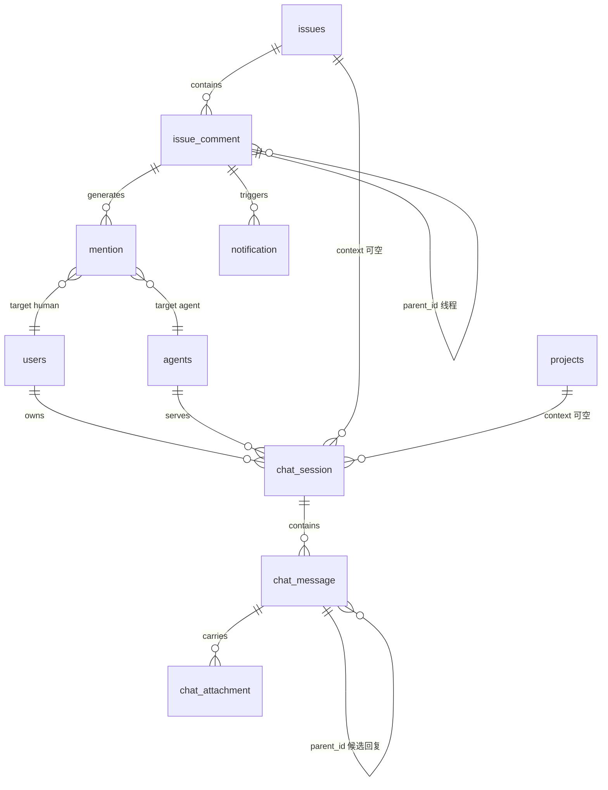
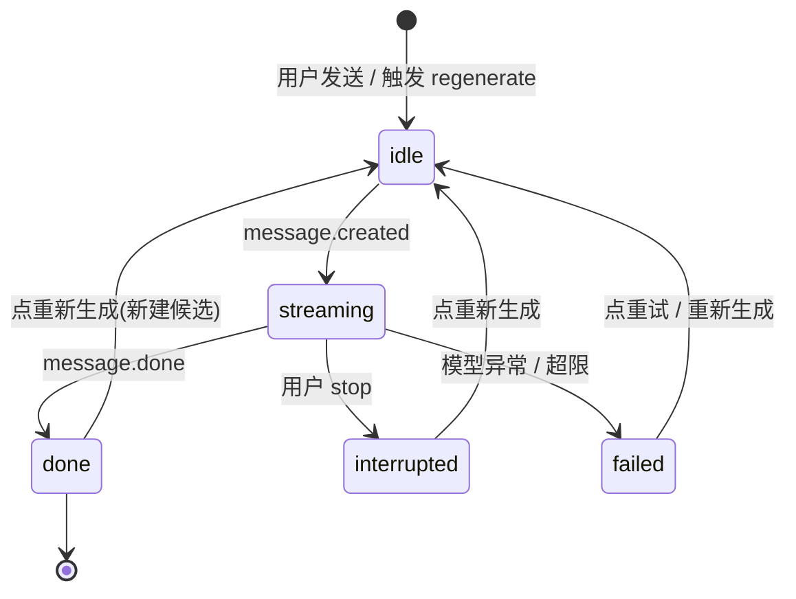

# 与 Agent 直接聊天(Chat Session)模块调研记录

> 文档性质:Mesh 产品 spec 撰写依据(调研记录)
> 模块范围:与单个 agent 的实时聊天会话 + issue 评论区的异步协作对话
> 后端技术栈基准:Python(异步 Web 框架 + PostgreSQL + ORM + WebSocket)
> 匿名化说明:本文底层模型一律以「主流大语言模型」指代;竞品做法以「业界标准做法 / 主流 AI agent 平台」指代;不出现任何具体产品、公司、模型、框架品牌名与外链。
> 通用技术名词保留:PostgreSQL、WebSocket、SSE、REST、HTTP、JSON、UUID、OAuth 2.0、JWT、Git、SQL、TLS、Webhook、markdown、token、流式。

---

## 0. 模块范围与核心命题

### 0.1 两种对话形态

Mesh 把 AI agent 当作真正的队友。队友之间的「对话」天然存在两种形态,本模块同时覆盖:

- **形态 A:实时聊天会话(real-time chat)**——人与单个 agent 的即时对话,agent 回复逐 token/逐块流式返回,体验类似 IM;适合探索、问答、头脑风暴、需要人 AI 紧密协作的快速迭代。
- **形态 B:issue 评论区的异步协作对话(async comments)**——围绕某个具体任务(issue),人与人、人与 agent、agent 与 agent 通过 @提及与线程回复异步往来;agent 回复不是实时流,而是被分派/被提及后异步处理完成,再以完整结果回评到评论区;适合任务派发、结果交付、多方评审。

两种形态不是替代关系,而是互补:

- 聊天重「过程」,评论重「结论」;
- 聊天是 1 对 1(人 ↔ agent),评论是 1 对多(issue 下多主体);
- 聊天同步流式,评论异步事件驱动;
- 聊天可携带 issue 上下文,聊天结论可一键沉淀回 issue 评论,形成闭环。

### 0.2 数据模型基准约定(全文统一)

- PostgreSQL;主键 UUID(v4);所有表含 `created_at` / `updated_at`(`timestamptz`,UTC)。
- 接口风格 REST + JSON,Bearer token(JWT)鉴权。
- 列表游标分页(`?cursor&limit`),响应含 `next_cursor`;消息历史按时间倒序游标。
- 软删除优先(`deleted_at`)。
- 时间格式统一 UTC RFC 3339。
- 表名 snake_case 复数,字段 snake_case。

---

## 1. 功能清单

### 1.1 形态 A:实时聊天会话

| # | 功能 | 说明 | 典型用户场景 |
|---|------|------|--------------|
| A1 | 发起与某 agent 的会话 | 从 agent 名册选择一个 agent,创建空会话 | 产品经理想和「需求分析 agent」讨论一个需求,在 agent 详情页点「开始对话」 |
| A2 | 多轮消息历史 | 用户消息与 agent 回复持久化,支持向上滚动回溯 | 用户第二天回到昨天的会话,接着上次的上下文继续提问 |
| A3 | 流式输出 | agent 回复经 SSE/WebSocket 逐块返回,打字机效果 | 用户提问后文本逐 token 出现,无需等待数十秒的完整响应 |
| A4 | 会话携带上下文 | 关联某个 issue/项目/文件,作为对话上下文注入 | 用户开会话时挂上一个 issue,agent 自动知晓该 issue 的描述、评论与状态 |
| A5 | 中断当前生成 | 生成途中发送 stop 信号,终止流式 | agent 答偏了,用户点「停止」,重新组织提问 |
| A6 | 重新生成 | 对某条 agent 消息重跑生成,保留多个候选回复 | 用户觉得第一版回复不够好,点「重新生成」,在 3 个候选里挑最优 |
| A7 | 会话列表管理 | 最近会话、置顶/归档/删除、按 agent 筛选 | 会话很多,用户把重要的置顶,已完成的归档,按 agent 过滤 |
| A8 | 标题自动生成/重命名 | 首轮对话后自动总结标题;支持手动重命名 | 会话标题从「新对话」自动变为「登录重定向 bug 讨论」 |
| A9 | 消息内引用与附件 | 回复中引用某条消息;上传图片/文档附件 | 用户上传一张截图让 agent 分析;引用 agent 的某条回答继续追问 |
| A10 | 消息生成状态 | streaming/done/failed/interrupted 状态可见可恢复 | 生成中途网络中断,该消息标记「生成失败」并提供重试入口 |

### 1.2 形态 B:issue 评论区的异步协作

| # | 功能 | 说明 | 典型用户场景 |
|---|------|------|--------------|
| B1 | 发表评论 | 在 issue 下发布 markdown 评论 | 开发同学在 issue 里写下实现方案 |
| B2 | @提及人/agent | 提及人 → 通知;提及 agent → 入队异步处理并回评 | 用户在评论里 @测试 agent,agent 收到后开始跑测试,完成后回评结果 |
| B3 | 线程回复 | 主评论 + 回复聚合为线程,回复折叠 | 多人围绕同一条方案讨论,回复都挂在该主评论下,不刷屏 |
| B4 | agent 异步回评 | agent 被分派或被提及后,处理完毕在评论区发出结果 | agent 运行数分钟后,把测试报告贴回评论区,带 AI 徽章 |
| B5 | 评论编辑/删除 | 作者与有权限者可编辑/软删除评论 | 修正评论中的笔误;删除无效评论 |
| B6 | 解决线程(resolve) | 标记某线程为已解决并折叠 | 方案确认,把该讨论线程标记为已解决 |
| B7 | 已读/未读与收件箱 | 提及、回复、agent 回评聚合进收件箱,带未读计数 | 用户在收件箱看到 3 条未读提及,逐条处理 |
| B8 | agent 循环防护 | 检测并切断 agent 之间互相提及导致的无限循环 | agent A 提及 agent B,B 回评又提及 A,系统在深度阈值后截断 |

### 1.3 两种形态如何共存与互补

| 维度 | 实时聊天(A) | 异步评论(B) |
|------|--------------|--------------|
| 参与方 | 1 人 + 1 agent | 多人 + 多 agent,围绕 issue |
| 时效 | 同步、流式 | 异步、事件驱动 |
| 承载 | 探索性过程、发散思考 | 任务结论、可交付物 |
| 触发 | 用户主动发送 | 被分派、被 @、状态变更 |
| 产出去向 | 留在会话内 | 落在 issue 评论区,可被链接回看 |
| 实时通道 | SSE/WebSocket 流式 | WebSocket 通知 + REST 拉取 |
| 典型长度 | 短、高频轮次 | 长文本、低频 |

**闭环路径**:在聊天里对齐方案 → 一键「沉淀为 issue 评论」→ @ 相关 agent 执行 → agent 异步回评结果 → 人在收件箱确认并 resolve 线程。聊天负责把模糊问题谈清楚,评论负责把结论钉在任务上。

---

## 2. 数据模型

### 2.1 实体总览

核心实体(均为 PostgreSQL 表,主键 UUID v4,含 `created_at`/`updated_at` timestamptz UTC):

- `chat_session` —— 聊天会话
- `chat_message` —— 聊天消息(含候选回复分支)
- `chat_attachment` —— 聊天附件
- `issue_comment` —— issue 评论(含线程)
- `mention` —— 提及记录(含是否已触发 agent run)
- `notification` —— 收件箱通知(依赖项,简述)

### 2.2 chat_session(聊天会话)

| 字段 | 类型 | 约束 | 默认值 | 说明 |
|------|------|------|--------|------|
| id | uuid | PK | gen_random_uuid() | 会话 ID |
| owner_id | uuid | NOT NULL, FK → users | - | 所属用户(会话发起人) |
| agent_id | uuid | NOT NULL, FK → agents | - | 关联 agent |
| title | text | NOT NULL | '新对话' | 会话标题 |
| title_is_auto | boolean | NOT NULL | true | 标题是否自动生成 |
| context_issue_id | uuid | NULL, FK → issues | NULL | 上下文关联 issue |
| context_project_id | uuid | NULL, FK → projects | NULL | 上下文关联项目 |
| status | text | NOT NULL, CHECK IN ('active','archived','deleted') | 'active' | 会话状态 |
| is_pinned | boolean | NOT NULL | false | 是否置顶 |
| last_message_at | timestamptz | NULL | NULL | 最近一条消息时间(排序用) |
| last_message_preview | text | NULL | NULL | 最近消息摘要(列表展示) |
| message_count | integer | NOT NULL | 0 | 消息数 |
| created_at | timestamptz | NOT NULL | now() | 创建时间 |
| updated_at | timestamptz | NOT NULL | now() | 更新时间 |
| deleted_at | timestamptz | NULL | NULL | 软删除时间 |

关键索引:

- `idx_chat_session_owner_list` ON (owner_id, is_pinned DESC, last_message_at DESC) WHERE deleted_at IS NULL —— 会话列表主查询(置顶优先 + 时间倒序)
- `idx_chat_session_owner_agent` ON (owner_id, agent_id, last_message_at DESC) —— 按 agent 筛选
- `idx_chat_session_context_issue` ON (context_issue_id) WHERE context_issue_id IS NOT NULL —— 反查某 issue 关联了哪些会话

### 2.3 chat_message(聊天消息)

| 字段 | 类型 | 约束 | 默认值 | 说明 |
|------|------|------|--------|------|
| id | uuid | PK | gen_random_uuid() | 消息 ID |
| session_id | uuid | NOT NULL, FK → chat_session | - | 所属会话 |
| role | text | NOT NULL, CHECK IN ('user','agent','system') | - | 消息角色 |
| content | text | NOT NULL | '' | 消息内容(markdown) |
| generation_status | text | NOT NULL, CHECK IN ('streaming','done','failed','interrupted') | 'done' | 生成状态(user 消息恒为 done) |
| parent_id | uuid | NULL, FK → chat_message | NULL | 候选回复:指向其所回答的用户消息 |
| selected_candidate | boolean | NOT NULL | true | 是否为当前选中的候选回复 |
| quote_message_id | uuid | NULL, FK → chat_message | NULL | 引用的消息 |
| prompt_tokens | integer | NULL | NULL | 输入 token 计数 |
| completion_tokens | integer | NULL | NULL | 输出 token 计数 |
| error_message | text | NULL | NULL | 失败原因 |
| started_at | timestamptz | NULL | NULL | 生成开始时间 |
| finished_at | timestamptz | NULL | NULL | 生成结束时间 |
| created_at | timestamptz | NOT NULL | now() | 创建时间 |
| updated_at | timestamptz | NOT NULL | now() | 更新时间 |

关键索引:

- `idx_chat_message_session_time` ON (session_id, created_at DESC) —— 历史分页主索引
- `idx_chat_message_parent` ON (parent_id) WHERE parent_id IS NOT NULL —— 候选回复查询(同一 parent 的全部候选)
- `idx_chat_message_streaming` ON (session_id) WHERE generation_status = 'streaming' —— 部分索引,快速定位「当前正在生成」的消息,用于并发守卫

**候选回复设计**:针对同一条用户消息,多个 agent 候选回复都挂在同一 `parent_id` 下;其中仅一条 `selected_candidate=true`;regenerate 时新建候选并把选中项切到新候选,旧候选保留,可翻页回选。

### 2.4 chat_attachment(聊天附件)

| 字段 | 类型 | 约束 | 默认值 | 说明 |
|------|------|------|--------|------|
| id | uuid | PK | gen_random_uuid() | 附件 ID |
| message_id | uuid | NULL, FK → chat_message | NULL | 关联消息(发送前上传则为空) |
| session_id | uuid | NOT NULL, FK → chat_session | - | 所属会话 |
| uploader_id | uuid | NOT NULL, FK → users | - | 上传者 |
| file_name | text | NOT NULL | - | 文件名 |
| mime_type | text | NOT NULL | - | MIME 类型 |
| byte_size | bigint | NOT NULL | - | 字节大小 |
| storage_key | text | NOT NULL | - | 对象存储 key(不暴露绝对路径) |
| created_at | timestamptz | NOT NULL | now() | 创建时间 |
| updated_at | timestamptz | NOT NULL | now() | 更新时间 |

### 2.5 issue_comment(issue 评论)

| 字段 | 类型 | 约束 | 默认值 | 说明 |
|------|------|------|--------|------|
| id | uuid | PK | gen_random_uuid() | 评论 ID |
| issue_id | uuid | NOT NULL, FK → issues | - | 所属 issue |
| author_id | uuid | NOT NULL | - | 作者 ID(人或 agent) |
| author_type | text | NOT NULL, CHECK IN ('human','agent') | - | 作者类型 |
| parent_id | uuid | NULL, FK → issue_comment | NULL | 线程:所属主评论 ID(最多一层) |
| content | text | NOT NULL | '' | 评论内容(markdown) |
| resolved | boolean | NOT NULL | false | 线程是否已解决(仅主评论有效) |
| resolved_by | uuid | NULL | NULL | 解决者 |
| resolved_at | timestamptz | NULL | NULL | 解决时间 |
| edited_at | timestamptz | NULL | NULL | 最后编辑时间 |
| created_at | timestamptz | NOT NULL | now() | 创建时间 |
| updated_at | timestamptz | NOT NULL | now() | 更新时间 |
| deleted_at | timestamptz | NULL | NULL | 软删除时间 |

关键索引:

- `idx_issue_comment_issue_time` ON (issue_id, created_at) WHERE deleted_at IS NULL —— 评论列表
- `idx_issue_comment_thread` ON (parent_id, created_at) WHERE parent_id IS NOT NULL —— 线程回复展开
- `idx_issue_comment_unresolved` ON (issue_id) WHERE resolved = false AND parent_id IS NULL AND deleted_at IS NULL —— 未解决线程聚合

### 2.6 mention(提及记录)

| 字段 | 类型 | 约束 | 默认值 | 说明 |
|------|------|------|--------|------|
| id | uuid | PK | gen_random_uuid() | 记录 ID |
| comment_id | uuid | NOT NULL, FK → issue_comment | - | 来源评论 |
| issue_id | uuid | NOT NULL, FK → issues | - | 所属 issue(反规范化,便于索引) |
| actor_id | uuid | NOT NULL | - | 提及发起者 |
| target_type | text | NOT NULL, CHECK IN ('human','agent') | - | 被提及目标类型 |
| target_id | uuid | NOT NULL | - | 被提及目标 ID |
| depth | integer | NOT NULL | 0 | 触发链深度(agent 互相提及的代际,防循环) |
| run_triggered | boolean | NOT NULL | false | 是否已触发 agent run |
| run_id | uuid | NULL | NULL | 触发的 run ID |
| triggered_at | timestamptz | NULL | NULL | 触发时间 |
| created_at | timestamptz | NOT NULL | now() | 创建时间 |
| updated_at | timestamptz | NOT NULL | now() | 更新时间 |

约束与索引:

- 唯一约束 `uq_mention_comment_target` ON (comment_id, target_type, target_id) —— 同一评论不重复提及同一目标
- `idx_mention_pending` ON (target_id, created_at) WHERE target_type = 'agent' AND run_triggered = false —— 待处理 agent 提及的派发队列扫描
- `idx_mention_target_human` ON (target_id, created_at DESC) WHERE target_type = 'human' —— 人的被提及收件箱

### 2.7 notification(收件箱通知,简述)

| 字段 | 类型 | 说明 |
|------|------|------|
| id | uuid | 通知 ID |
| recipient_id | uuid | 接收者(人),FK → users |
| kind | text | 'mention' / 'agent_reply' / 'thread_reply' / 'comment_resolved' |
| issue_id | uuid | 关联 issue |
| comment_id | uuid | 关联评论 |
| is_read | boolean | 是否已读,默认 false |
| created_at / updated_at | timestamptz | 时间戳 |

索引:`idx_notification_unread` ON (recipient_id, created_at DESC) WHERE is_read = false。

### 2.8 实体关系图(mermaid)



关系说明:

- 一个用户拥有多个会话;一个 agent 服务多个会话。
- 会话的上下文 issue/project 为可选(可空 FK)。
- `chat_message.parent_id` 自连接实现候选回复分支。
- `issue_comment.parent_id` 自连接实现线程(最多一层,回复不再嵌套回复)。
- 一条评论可产生多条 mention 记录;提及 agent 通过 `run_triggered` 驱动 run 派发队列。

---

## 3. 接口设计

### 3.1 通用约定

- 基础路径 `/api/v1`;鉴权 `Authorization: Bearer <JWT>`。
- 错误统一 JSON:`{"error": {"code": "...", "message": "..."}}`。
- 游标分页:`?limit=50&cursor=<opaque>`;响应含 `next_cursor`(为 null 表示无更多);消息列表默认时间倒序。
- ID 均为 UUID v4;时间均为 UTC RFC 3339。

### 3.2 形态 A:聊天会话端点清单

| 方法 | 路径 | 说明 |
|------|------|------|
| POST | /chat-sessions | 创建会话 |
| GET | /chat-sessions | 会话列表(游标分页,可按 agent/status 筛选) |
| GET | /chat-sessions/{id} | 会话详情 |
| PATCH | /chat-sessions/{id} | 更新标题/置顶/归档/上下文 |
| DELETE | /chat-sessions/{id} | 删除(软删除) |
| POST | /chat-sessions/{id}/messages | 发送消息(Accept 决定普通 201 或流式) |
| GET | /chat-sessions/{id}/messages | 历史(游标分页,倒序) |
| POST | /chat-sessions/{id}/messages/{msg_id}/regenerate | 重新生成 |
| POST | /chat-sessions/{id}/messages/{msg_id}/stop | 中断生成 |
| POST | /chat-sessions/{id}/messages/{msg_id}/select | 选择候选回复 |
| POST | /chat-sessions/{id}/attachments | 上传附件 |

#### 创建会话

```http
POST /api/v1/chat-sessions
Authorization: Bearer <JWT>
Content-Type: application/json

{
  "agent_id": "3f2b0c11-6a4d-4e2a-9b1c-7d8e9f0a1b2c",
  "context_issue_id": "9a1c2b3d-4e5f-4a6b-8c7d-0e1f2a3b4c5d",
  "context_project_id": null,
  "title": "登录重定向 bug 讨论"
}
```

响应 201:

```json
{
  "id": "b7e4d1a2-9c3f-4e28-8a1b-5d6e7f8a9b0c",
  "owner_id": "11111111-2222-4333-8444-555555555555",
  "agent_id": "3f2b0c11-6a4d-4e2a-9b1c-7d8e9f0a1b2c",
  "title": "登录重定向 bug 讨论",
  "title_is_auto": false,
  "context_issue_id": "9a1c2b3d-4e5f-4a6b-8c7d-0e1f2a3b4c5d",
  "context_project_id": null,
  "status": "active",
  "is_pinned": false,
  "last_message_at": null,
  "last_message_preview": null,
  "message_count": 0,
  "created_at": "2026-07-24T09:00:00Z",
  "updated_at": "2026-07-24T09:00:00Z"
}
```

#### 会话列表(游标分页 + 筛选)

```http
GET /api/v1/chat-sessions?agent_id=3f2b0c11-...&status=active&limit=20&cursor=eyJ...
Authorization: Bearer <JWT>
```

响应 200:

```json
{
  "items": [
    {
      "id": "b7e4d1a2-9c3f-4e28-8a1b-5d6e7f8a9b0c",
      "agent_id": "3f2b0c11-6a4d-4e2a-9b1c-7d8e9f0a1b2c",
      "title": "登录重定向 bug 讨论",
      "status": "active",
      "is_pinned": true,
      "last_message_at": "2026-07-24T10:12:33Z",
      "last_message_preview": "我已定位到 3 个可能原因…",
      "message_count": 12,
      "context_issue_id": "9a1c2b3d-4e5f-4a6b-8c7d-0e1f2a3b4c5d"
    }
  ],
  "next_cursor": "eyJvZmZzZXQiOjIwfQ"
}
```

#### 获取历史(时间倒序游标)

```http
GET /api/v1/chat-sessions/b7e4d1a2-.../messages?limit=30&cursor=eyJ...
Authorization: Bearer <JWT>
```

响应 200(倒序,最新在前):

```json
{
  "items": [
    {
      "id": "m-2",
      "role": "agent",
      "content": "经分析,可能原因有 3 个…",
      "generation_status": "done",
      "parent_id": "m-1",
      "selected_candidate": true,
      "prompt_tokens": 1820,
      "completion_tokens": 356,
      "created_at": "2026-07-24T10:12:30Z",
      "finished_at": "2026-07-24T10:12:33Z",
      "attachments": []
    },
    {
      "id": "m-1",
      "role": "user",
      "content": "帮我看看为什么登录后会跳转错误",
      "generation_status": "done",
      "parent_id": null,
      "created_at": "2026-07-24T10:12:01Z",
      "attachments": [
        {"id": "a-1", "file_name": "screenshot.png", "mime_type": "image/png", "byte_size": 84213}
      ]
    }
  ],
  "next_cursor": null
}
```

### 3.3 形态 B:issue 评论端点清单

| 方法 | 路径 | 说明 |
|------|------|------|
| POST | /issues/{issue_id}/comments | 发表评论(含提及解析与派发) |
| GET | /issues/{issue_id}/comments | 评论列表(线程聚合,游标分页) |
| GET | /comments/{id}/replies | 线程回复列表(游标分页) |
| PATCH | /comments/{id} | 编辑评论 |
| DELETE | /comments/{id} | 删除评论(软删除) |
| POST | /comments/{id}/resolve | 解决线程 |
| POST | /comments/{id}/unresolve | 重新打开线程 |
| POST | /mentions/resolve | 提及解析(文本 → 目标列表,供自动补全/预览) |

#### 发表评论(含 @提及)

```http
POST /api/v1/issues/9a1c2b3d-.../comments
Authorization: Bearer <JWT>
Content-Type: application/json

{
  "content": "请 [@测试 agent](mention://agent/3f2b0c11-...) 跑一遍回归测试,重点登录模块",
  "parent_id": null,
  "mentions": [
    {"target_type": "agent", "target_id": "3f2b0c11-6a4d-4e2a-9b1c-7d8e9f0a1b2c"}
  ]
}
```

响应 201:

```json
{
  "id": "c-100",
  "issue_id": "9a1c2b3d-4e5f-4a6b-8c7d-0e1f2a3b4c5d",
  "author_id": "11111111-2222-4333-8444-555555555555",
  "author_type": "human",
  "parent_id": null,
  "content": "请 [@测试 agent](mention://agent/3f2b0c11-...) 跑一遍回归测试,重点登录模块",
  "resolved": false,
  "mentions": [
    {"target_type": "agent", "target_id": "3f2b0c11-...", "run_triggered": true, "run_id": "run-77"}
  ],
  "created_at": "2026-07-24T11:00:00Z"
}
```

说明:提及 agent 时,服务端在同一事务写入 mention 记录(初始 `run_triggered=false`),再异步入队派发 run;接口同步返回,`run_triggered` 反映响应时刻的派发状态。这样即使派发组件短暂不可用,提及记录也不丢,可被待处理索引补扫。

#### 评论列表(线程聚合)

```http
GET /api/v1/issues/9a1c2b3d-.../comments?limit=20&cursor=eyJ...
Authorization: Bearer <JWT>
```

响应 200:

```json
{
  "items": [
    {
      "id": "c-100",
      "author_type": "human",
      "author_id": "11111111-...",
      "content": "请 @测试 agent 跑一遍回归测试…",
      "resolved": false,
      "reply_count": 2,
      "latest_reply_at": "2026-07-24T11:05:12Z",
      "replies_preview": [
        {"id": "c-101", "author_type": "agent", "content": "回归完成,2 个用例失败…", "created_at": "2026-07-24T11:05:12Z"}
      ],
      "created_at": "2026-07-24T11:00:00Z"
    }
  ],
  "next_cursor": null
}
```

#### 解决线程

```http
POST /api/v1/comments/c-100/resolve
Authorization: Bearer <JWT>
```

响应 200:

```json
{"id": "c-100", "resolved": true, "resolved_by": "11111111-...", "resolved_at": "2026-07-24T11:30:00Z"}
```

### 3.4 流式输出协议设计(重点)

#### 通道选型

| 通道 | 优点 | 缺点 | 适配场景 |
|------|------|------|----------|
| SSE | 基于 HTTP,原生自动重连与事件 ID,易调试、易过代理 | 半双工(服务端→客户端),中断需独立通道 | 流式输出首选 |
| WebSocket | 全双工,可复用做中断/通知/在线状态 | 重连与心跳需自建,代理复杂度略高 | 实时网关统一通道 |

**Mesh 推荐**:SSE 作为流式输出的主通道(简单可靠,原生携带 `Last-Event-ID` 便于断点续传);WebSocket 实时网关负责中断信号、评论实时通知、在线状态等全双工场景。若团队希望单一通道,也可统一走 WebSocket 帧,事件类型与 SSE 保持同名,客户端渲染逻辑一致。

#### 发送消息并流式响应

请求(与正常发送同一端点,通过 `Accept` 声明流式):

```http
POST /api/v1/chat-sessions/b7e4d1a2-.../messages
Authorization: Bearer <JWT>
Accept: text/event-stream
Content-Type: application/json

{
  "content": "帮我分析这个 bug 的可能原因",
  "attachment_ids": ["a-1"]
}
```

响应流(`Content-Type: text/event-stream`):

```
id: 1
event: message.created
data: {"message_id":"m-9","role":"agent","generation_status":"streaming"}

id: 2
event: message.delta
data: {"message_id":"m-9","delta":"经分析"}

id: 3
event: message.delta
data: {"message_id":"m-9","delta":",可能原因有 3 个: "}

id: 4
event: message.delta
data: {"message_id":"m-9","delta":"1) token 过期…"}

id: 5
event: message.done
data: {"message_id":"m-9","generation_status":"done","completion_tokens":356}
```

#### SSE 事件类型表

| event | 触发时机 | data 关键字段 |
|-------|----------|----------------|
| message.created | agent 消息创建、生成开始前 | message_id, role, generation_status=streaming |
| message.delta | 增量文本块(token/句) | message_id, delta |
| message.done | 生成正常完成 | message_id, completion_tokens, generation_status=done |
| message.interrupted | 被 stop 中断 | message_id, partial_content, generation_status=interrupted |
| error | 生成失败(模型异常、超限等) | message_id, code, message |
| ping | 心跳(建议 15s 一次) | ts |

每个 SSE 事件带自增数字 `id:` 字段;客户端断线后带 `Last-Event-ID` 重连,服务端从断点重放 delta(delta 缓冲可由内存缓存承载;若缓冲已淘汰,客户端降级为「REST 拉一次历史 + 重新订阅」)。

#### 中断通道

```http
POST /api/v1/chat-sessions/b7e4d1a2-.../messages/m-9/stop
Authorization: Bearer <JWT>
```

响应 202:

```json
{"message_id": "m-9", "generation_status": "interrupted"}
```

服务端收到后:停止上游模型生成 → 在 SSE 流上发出 `message.interrupted` → 关闭该流。若走 WebSocket 网关,则上送帧 `{"type":"stop","message_id":"m-9"}`。stop 必须幂等:重复 stop 返回 200/202 且无副作用。

#### 重新生成

```http
POST /api/v1/chat-sessions/b7e4d1a2-.../messages/m-1/regenerate
Authorization: Bearer <JWT>
Accept: text/event-stream
```

服务端:新建一条 agent 候选(`parent_id=m-1`,新候选默认 `selected_candidate=true`,旧候选置 false)→ 立即在事件流返回 `message.created` 开始流式。中断通道同上。

#### 选择候选回复

```http
POST /api/v1/chat-sessions/b7e4d1a2-.../messages/m-1/select
Authorization: Bearer <JWT>
Content-Type: application/json

{"selected_message_id": "m-11"}
```

响应 200:

```json
{"parent_id": "m-1", "selected_message_id": "m-11"}
```

#### WebSocket 实时网关帧协议(统一实时通道)

连接:`wss://<实时网关主机>/ws?token=<JWT>`(占位符,部署时替换为实际域名);连接后按主题订阅:

```json
{"type": "subscribe", "topic": "chat_session:b7e4d1a2-9c3f-4e28-8a1b-5d6e7f8a9b0c"}
{"type": "subscribe", "topic": "issue:9a1c2b3d-4e5f-4a6b-8c7d-0e1f2a3b4c5d"}
```

服务端下行帧(事件名与 SSE 同名,便于双端统一):

```json
{"type": "message.delta", "topic": "chat_session:b7e4d1a2-...", "data": {"message_id": "m-9", "delta": "…"}}
{"type": "comment.created", "topic": "issue:9a1c2b3d-...", "data": {"comment_id": "c-101", "author_type": "agent"}}
{"type": "notification.created", "data": {"kind": "agent_reply", "issue_id": "9a1c2b3d-..."}}
```

客户端上行中断帧:

```json
{"type": "stop", "data": {"message_id": "m-9"}}
```

心跳:客户端每 30s 发 `{"type":"ping"}`,服务端回 `{"type":"pong"}`;断线后客户端指数退避重连(1s/2s/4s/8s,上限 30s,加抖动);页面重新可见时立即触发一次重连(single-flight)。重连成功后用 REST 拉历史对账,增量用 `Last-Event-ID` 或 `since` 参数补齐。

### 3.5 错误码表

| HTTP | code | 说明 |
|------|------|------|
| 400 | invalid_request | 参数校验失败(字段缺失/格式错误) |
| 400 | context_not_allowed | 上下文关联非法(issue 不存在/无权限) |
| 401 | unauthorized | 未携带或 token 失效 |
| 403 | forbidden | 对该会话/issue 无权限 |
| 404 | not_found | 资源不存在 |
| 409 | generation_in_progress | 该会话已有消息正在生成,禁止重复发送/regenerate |
| 409 | already_resolved | 线程已解决 |
| 413 | payload_too_large | 附件超限 |
| 422 | unsupported_file_type | 附件类型不支持 |
| 429 | rate_limited | 发送过于频繁/生成超配额 |
| 429 | mention_loop_detected | 提及触发链超深度阈值(防 agent 循环) |
| 500 | generation_failed | 模型侧生成失败(对应 SSE error 事件) |
| 503 | agent_unavailable | agent 运行时不可用 |

### 3.6 鉴权与权限

- JWT 携带 `sub`(用户 id)与 workspace 成员身份;会话仅 `owner_id` 可访问;评论遵循 issue 的可见范围。
- agent 身份:agent 在评论区回评时 `author_type='agent'`,由 agent 的服务账号执行,操作可审计。
- 限流:每用户每会话发送 QPS 限制;每会话同一时刻至多一个并发生成(服务端用 `idx_chat_message_streaming` 部分索引守卫,冲突返回 `generation_in_progress`)。

---

## 4. UI 设计

### 4.1 聊天主界面(左列表 + 右对话流 + 顶部上下文条 + 底部输入)

```
+-------------------+----------------------------------------------+
| 搜索会话          | 会话:登录重定向 bug 讨论  [上下文: TASK-77 ×] |
| [+ 新建会话]      |----------------------------------------------|
| [置顶] 需求讨论…  | (AI 徽章) 测试 agent                         |
|   昨天的对话…     |   你好,我已读取 TASK-77 的描述,              |
|   代码评审…       |   你想了解什么?                              |
| ── 筛选 ──        |                                              |
| agent: 全部 ▾     |                          [我]                |
| 状态: 进行中 ▾    |   帮我分析登录后跳转错误的可能原因            |
|                   |----------------------------------------------|
| [已归档] 旧会话…  | (AI 徽章) ▍正在生成…                         |
|                   |   经分析,可能原因有 3 个:                    |
|                   |   1) token 过期…   ← 打字机效果              |
|                   |----------------------------------------------|
|                   | [附件 📎] [输入框..................] [发送]  |
|                   |                       [■ 停止] [↻ 重新生成]  |
+-------------------+----------------------------------------------+
```

要点:

- 左侧:会话列表(置顶在上,按 `last_message_at` 倒序,每项显示 agent 头像 + 标题 + 预览 + 时间);顶部新建与搜索;按 agent/状态筛选;归档区在底部。
- 右上:上下文关联条,显示关联的 issue/项目,× 可移除,点击打开选择器。
- 对话流:用户/agent 气泡区分左右;agent 侧带 AI 徽章;流式时显示光标与打字机效果;生成中输入区显示「停止」;完成后该条尾部显示「重新生成」。
- 候选回复:多候选用 `‹ 1/3 ›` 翻页,并提供「使用此条」。

### 4.2 会话上下文关联选择器

```
+--------------------------------------+
| 关联会话上下文                        |
| 搜索 issue / 项目…                   |
| [issue] TASK-77 登录重定向 bug   ✓    |
| [issue] TASK-81 支付回调超时          |
| [项目] 客户中心重构                   |
| 提示:agent 将读取关联上下文作为背景    |
|              [取消]  [确认关联]        |
+--------------------------------------+
```

### 4.3 评论区(issue 详情页内)

```
评论 (3)                 [输入框占位:评论,@ 提及…               ]
                         [格式 B I `] [📎] [@]            [发布]
+--------------------------------------------------------------+
| (头像) 王 · 2 小时前                          [解决线程]       |
| 请 @测试 agent 跑一遍回归测试,重点登录模块                    |
|   └ (AI 徽章) 测试 agent · 1 小时前          [2 条回复 ▾ 展开]  |
|       回归完成,2 个用例失败:TestA、TestB…                    |
|       └ (头像) 李 · 30 分钟前                  [回复]           |
|           TestA 是环境问题,请重跑                            |
+--------------------------------------------------------------+
| ✓ 已解决线程 (1) ▾ 折叠                                        |
+--------------------------------------------------------------+
```

要点:

- 主评论 + 线程回复折叠展开(`reply_count > 2` 时默认折叠并显示预览)。
- @ 输入触发自动补全弹窗(人与 agent 混排,agent 项带 AI 徽章)。
- agent 评论带 AI 徽章,可展开「生成方式/运行摘要」。
- 主评论上有「解决线程」按钮;解决后整线程折叠进「已解决」区。

### 4.4 收件箱/未读

```
收件箱                       [全部已读]
● [提及] 王 在 TASK-77 提到了你        2 小时前
● [agent 回复] 测试 agent 在 TASK-77 回评   1 小时前
○ [线程回复] 李 回复了你的评论          30 分钟前
```

点击直达 issue 并定位到对应评论;未读点实时清除(WebSocket 推送已读回执或本地标记)。

---

## 5. UX 设计

### 5.1 关键交互流程

**流程 1:实时聊天**

1. 用户在 agent 名册点「开始对话」→ 创建会话(POST /chat-sessions),进入空会话页。
2. 顶部「关联上下文」→ 选择 TASK-77 → 服务端把该 issue 的快照作为 system 上下文注入。
3. 用户发送提问 → 用户气泡立即出现(乐观 UI)→ SSE 连接建立,开始流式。
4. agent 回复逐 token 打字机显示;底部「停止」按钮全程可用。
5. 用户中途点「停止」→ POST stop → 流以 `message.interrupted` 结束,消息保留已生成的部分内容并标记「已中断」。
6. 用户点「重新生成」→ 生成新的候选回复,可翻页切换候选。
7. 首轮完成 → 后台异步生成标题并写回(`title_is_auto=true`),列表实时更新预览与时间。

**流程 2:异步评论协作**

1. 用户在 TASK-77 写评论并 @测试 agent → 发布时服务端写入 mention 记录并入队 run。
2. agent 异步运行(可能持续数分钟)→ 完成后 POST 评论(`author_type=agent`)→ WebSocket 向订阅该 issue 的客户端推送 `comment.created` + `notification.created`。
3. 用户收到收件箱「agent 回复」通知 → 点击进入 issue → 看到带 AI 徽章的 agent 评论。
4. 用户在线程内回复,再次 @ agent → 触发下一轮 run(深度 +1)。
5. 方案确认 → 用户点「解决线程」→ 线程折叠,相关方收到 `comment_resolved` 通知。

### 5.2 消息生成状态机(mermaid)



状态机要点:

- 单会话单并发:同一时刻只允许一条消息处于 `streaming`(用部分索引快速定位),重复发送/regenerate 返回 409 `generation_in_progress`。
- `interrupted` 与 `failed` 均保留已产生的内容与状态,二者都可重新生成。
- regenerate 不修改旧消息,而是新建候选并切换 `selected_candidate`,历史候选全部可回看回选。

### 5.3 实时性方案

- **流式输出**:SSE 优先(原生自动重连 + 事件 id 断点续传),每 15s 一次心跳 ping 防止中间设备断流;重连时客户端带 `Last-Event-ID` 对账,缓冲淘汰则降级 REST 拉历史。
- **中断**:独立 REST 端点(POST stop)或 WebSocket 上行帧;两条路径都必须幂等(重复 stop 返回 200/202 且无副作用),确保「流断了也能停」。
- **异步评论通知**:WebSocket 实时网关推送 `comment.created` / `notification.created`;客户端离线或断线 → 重连后经 REST 对账;重要通知同时落收件箱持久化(推送是增强,不是唯一依据)。
- **重连策略**:指数退避(1s→2s→4s→8s,上限 30s)加抖动;页面可见事件后 single-flight 重连。

### 5.4 通知机制

| 事件 | 通知谁 | 通道 |
|------|--------|------|
| agent 异步回评(comment) | 该线程参与者、被提及者 | WebSocket + 收件箱 |
| 被人 @提及 | 被提及的人 | WebSocket + 收件箱(可选邮件) |
| 线程被解决 | 线程参与者 | 收件箱 |
| 聊天生成失败 | 会话 owner | 页面内提示 |

去重:同一用户对同一评论只产生一条通知(按 comment_id + recipient 聚合)。

### 5.5 人类监督与干预点

1. **中断生成**:随时 stop,防止 agent 跑偏浪费资源与时间。
2. **重新生成**:多候选择优,人来选择最终答案。
3. **审核 agent 评论**:agent 评论可配置「正式发布前由人审核」的审核闸门(可选);AI 徽章始终可见,身份不可冒充。
4. **解决/锁定线程**:人决定讨论终结;已锁定的线程禁止 agent 再回评。
5. **agent 互相提及循环防护**:
   - mention 记录触发链深度(`depth`),超过阈值(如 5)拒绝触发新 run,返回 `mention_loop_detected`;
   - 同一 (issue, agent) 对在时间窗口内 run 去重(如 60s 内至多触发 1 次,后续提及合并进同一 run 上下文);
   - agent 提及 agent 默认「需人确认」或仅白名单放行;
   - 检测到异常循环时系统自动评论告警并锁定该线程。

---

## 6. 对 Mesh 的设计启示

1. **把两种形态统一在「对话」抽象之下**:聊天会话是「实时、1 对 1、流式驱动」的对话;issue 评论是「异步、多方、事件驱动」的对话。二者共享同一套消息状态机(streaming/done/failed/interrupted)、同一套提及模型、同一条通知管线、同一个 AI 徽章身份体系。数据层 `chat_message` 与 `issue_comment` 字段语义对齐(role/author_type、content、附件),上层 UI 组件库可复用——这让「把聊天沉淀为评论」和「从评论拉起聊天继续」几乎是零成本转换,也是 Mesh 区别于普通聊天工具的关键。

2. **流式协议要双通道对齐**:SSE 事件类型与 WebSocket 网关帧类型采用同名事件(message.delta/done/interrupted/error),客户端无论走哪条通道,渲染逻辑一致;中断信号是独立的幂等端点,不依赖流连接是否存活。这避免了「流断了就停不下来」的体验灾难。

3. **候选回复用 parent_id 分支而非覆盖**:regenerate 保留全部候选、以 `selected_candidate` 选择,既满足「多试几次、人来择优」的监督需求,又自然沉淀了可复用的偏好/评估数据资产。

4. **异步协作是 agent 队友化的基石**:mention 表的 `run_triggered` + 待处理部分索引构成可靠的派发队列;run 深度阈值 + 时间窗去重 + 锁定线程,是防止 agent 循环的三道保险,必须在功能上线前落地——否则 agent 互提会烧掉 token、刷爆评论区。

5. **上下文关联是聊天价值的关键**:不带 issue/项目上下文的聊天只是空谈;上下文关联条应放在聊天界面顶部成为一等公民,服务端统一把上下文快照注入为 system 消息,保证 agent 的回答紧扣任务,而不是泛泛而谈。

6. **通知必须「推送 + 持久」双保险**:WebSocket 推送只解决「快」,收件箱持久化解决「不丢」;所有 agent 异步回评都要落收件箱并支持批量已读,否则异步协作的闭环(看到 → 处理 → 解决)会断裂,用户会漏掉 agent 的交付。
