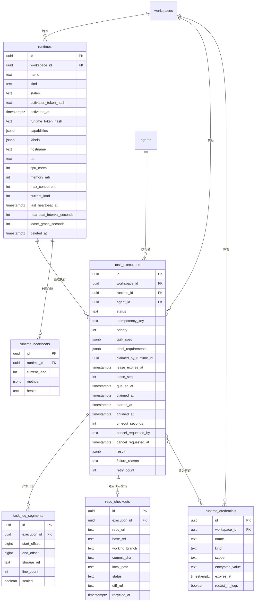
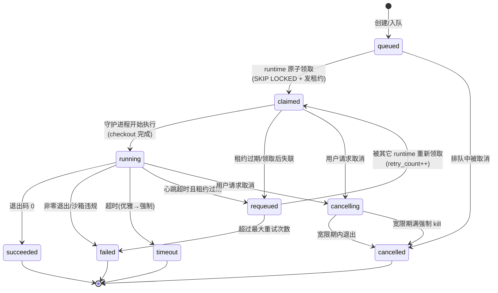

# Agent 运行时(Runtime)模块调研记录

> 目标读者:Mesh 产品与工程团队。本文是撰写 runtime 模块 spec 的依据性调研文档。
>
> 模块定位:runtime 是 agent 实际执行代码、操作仓库、运行命令的"身体"。Mesh 把 AI agent 当作真正的队友,而队友需要一台真实的"工位机器"才能干活——runtime 就是这块工位。它既可以是平台托管的,也可以是用户把自托管机器/容器注册进来(bring-your-own)。
>
> 后端技术栈基准:Python 异步 Web 框架 + PostgreSQL + ORM + WebSocket。
>
> 竞品参照:文中涉及竞品做法时,统一以"主流 AI agent 平台""业界标准做法"指代;涉及底层模型时统一以"主流大语言模型"指代。

---

## 0. 数据模型与协议基准约定(全文统一)

- 数据库:PostgreSQL;所有主键 `UUID`(v4);所有表含 `created_at` / `updated_at`(`timestamptz`,UTC)。
- 接口风格:REST + JSON;鉴权用 `Authorization: Bearer <token>`;资源用复数名词。
- 列表分页:统一游标分页 `?cursor=<opaque>&limit=<n>`,响应体含 `next_cursor`(为 `null` 表示到底)。
- 长任务:状态机驱动,日志/进度通过 WebSocket / SSE 流式推送。
- 删除:软删除优先(`deleted_at timestamptz null`)。
- 时间:一律 UTC,RFC3339 字符串(如 `2026-07-24T09:30:00Z`)。
- 命名:表名 snake_case 复数,字段 snake_case。

---

## 1. 功能清单(每项附典型用户场景)

### 1.1 runtime 定义与类型

runtime 是一个"可领取并执行 agent 任务的受管执行环境"。分两类:

| 类型 | 说明 | 谁负责机器 |
|---|---|---|
| **平台托管(platform-managed)** | 平台在自有资源池里按需拉起隔离执行环境,用户零运维 | 平台 |
| **用户自托管(bring-your-own)** | 用户把自己的物理机/虚拟机/容器注册为 runtime,代码在自己机器上跑 | 用户 |

**典型场景**:
- 创业团队没有合规顾虑,直接用平台托管 runtime,开箱即用,不碰运维。
- 金融客户代码不能出内网,把内网一台加固服务器注册为自托管 runtime,所有 agent 任务都在自家机器执行,平台只下发任务与回收日志。
- 用户有一台带特殊 GPU/特殊工具链的机器,注册为 runtime 并打标签 `gpu=true`、`has-ffmpeg=true`,只让需要这些能力的任务被分派过来。

设计要点:两类 runtime 在**任务调度视角完全同构**——都通过同一套"注册—心跳—领取—上报"机器接口接入。差异仅在"谁来拉起守护进程"。这保证调度器不需要区分二者,降低核心复杂度。

### 1.2 runtime 注册流程

注册采用"**先建影子记录 + 一次性激活码 + 守护进程激活**"三段式,避免在 UI 里手工填写机器信息。

1. 用户在控制台点"新增 runtime",平台创建一条 `status=pending` 的 runtime 记录,并生成**一次性激活码**(短 TTL、单次使用、服务端只存哈希)。
2. 平台展示一段安装命令(含激活码),用户在自己的机器上执行。
3. 机器上的守护进程启动,用激活码调用激活接口,上报元数据(主机名、OS、CPU 核数、内存、可用磁盘、已安装工具/能力、标签),换取一个**长期 runtime token**。
4. 平台把该 runtime 置为 `online`,激活码作废。

**典型场景**:用户复制安装命令到内网服务器执行,30 秒后控制台 runtime 列表出现一台在线机器,自动显示 `8 核 / 32GB / 工具:git, python, node`。

安全要点:激活码一次性、短 TTL(默认 15 分钟)、只存哈希;长期 token 可吊销、可轮换;token 与单一 runtime 绑定,权限最小化(只能操作自己这条记录与领取任务)。

### 1.3 心跳与健康检查

- 守护进程按固定间隔(默认 15 秒,可配)上报心跳,携带实时健康指标(CPU/内存/磁盘负载、当前活跃任务数、守护进程版本)。
- 服务端记录 `last_heartbeat_at`;若超过 `心跳间隔 × 容忍倍数`(默认 3 倍,即 45 秒)未收到心跳,判定离线,自动标记 `unavailable`。
- 判离线后:该 runtime 上所有处于 `claimed`/`running` 且**租约已过期**的任务,由回收器(reaper)触发"失联处理"(requeue 或标记 failed,见 5.3)。
- 健康检查还区分"进程活但环境坏"(如磁盘写满、容器运行时不可用):守护进程在心跳里自报 `degraded`,平台据此停止派新任务但保留排障窗口。

**典型场景**:用户笔记本合盖休眠,45 秒后控制台该 runtime 变灰显示"离线",其上正在跑的任务被自动重新排队,改由另一台 runtime 接手,用户无需人工干预。

### 1.4 任务队列与 claim/领取机制

- 任务创建后进入队列(`status=queued`),带优先级与可选的标签约束(要求 runtime 具备某标签)。
- runtime 守护进程主动**拉取并原子领取**任务(pull 模型,而非服务端 push),天然适配自托管"机器在内网、平台无法主动连入"的场景。
- **原子领取**:用 `SELECT ... FOR UPDATE SKIP LOCKED LIMIT 1` 在单事务内锁定一条可领取任务并改状态为 `claimed`,杜绝多 runtime 重复领取。
- **租约(lease)**:领取即发放租约(`lease_expires_at`),守护进程需周期性续租;租约过期未续 → 视为持有者已死,任务可被回收重派。
- **防重复执行**:配合幂等键与状态机校验(只有 `queued`/`requeued` 可被领取)。

**典型场景**:同一个 agent 任务被同时挂到 3 台空闲 runtime 上竞争,数据库层 `SKIP LOCKED` 保证只有一台抢到,其余两台立即去抢队列里下一条,无锁等待、无重复执行。

### 1.5 并发上限

- 每个 runtime 有 `max_concurrent`(默认 1,可配),表示同时执行任务上限。
- 守护进程领取前自检 `当前活跃数 < max_concurrent` 才发起 claim;服务端也在领取时校验,双重保险。
- **队列背压**:当所有 runtime 满载,新任务停留在 `queued`,队列长度即背压信号;控制台展示队列深度,供用户决策"加机器"还是"等待"。
- 支持 runtime 级暂停(`paused`):暂停后不再领取新任务,已在跑的继续到结束(或按需排空)。

**典型场景**:一台 16 核机器设 `max_concurrent=4`,同时跑 4 个 agent 任务互不干扰;第 5 个任务在队列等待,直到某个任务完成腾出槽位。

### 1.6 执行日志流式输出

- 守护进程把任务的 stdout/stderr **按行(或按块)追加上报**,每行带单调递增的字节偏移 `offset`。
- 用户在任务详情页**实时滚动看日志**(WebSocket/SSE 推送);断线后用"我看到的最后一个 offset"重连,**从断点续传**,不丢不重。
- 日志同时落**持久存储**(详见 2.3 存储策略),任务结束后仍可回看完整日志。
- 日志写入路径上经过**脱敏过滤**(见 1.9)。

**典型场景**:agent 在跑一个 10 分钟的构建,用户中途切走又切回,前端用本地缓存的最后 offset 重连,日志从断开处无缝续上,而不是从头刷屏。

### 1.7 沙箱隔离

执行不可信 agent 代码必须隔离,分层防御:

- **进程/容器隔离**:每个任务在独立的容器/命名空间内执行,文件系统、进程表、网络相互隔离;任务结束销毁环境。
- **文件系统隔离**:每任务独立工作目录,只读挂载代码 checkout,临时区可写,禁止访问宿主机敏感路径。
- **网络策略**:默认受限出网(白名单或禁止访问内网元数据服务/平台内部网段),可按任务声明开放。
- **资源配额**:用 cgroup 限制每任务 CPU、内存、磁盘、执行时长,防止单任务拖垮整机。
- **权限最小化**:以非特权用户运行,不挂载宿主机 root,不赋予容器特权模式。

**典型场景**:agent 生成的代码里有一段死循环疯狂吃内存,cgroup 内存上限触发后该任务被 OOM 终止并标记 failed,同机其它任务与宿主机毫发无损。

> 平台托管与自托管共用同一套"执行规范"(沙箱、配额、目录布局),由守护进程在本地用容器运行时落地;spec 应把"执行规范"与"调度协议"解耦。

### 1.8 代码仓库 checkout

- 每个需要代码的任务,守护进程在领取后**为该任务创建专属分支**并 checkout(分支名含任务 ID,如 `agent/<execution-id>`),保证多任务并行不互相污染工作区。
- **浅克隆**(`--depth`)减少大仓库拉取开销;按需懒加载子模块。
- **工作目录管理**:统一目录布局(如 `<workdir>/<execution-id>/repo`),任务结束后回收;保留期可配。
- **产物/diff 回收**:任务结束把 `git diff`/新增文件摘要回报平台;超期未取的工作目录与产物自动清理,防止磁盘爆满。
- 仓库凭证(只读部署 token / SSH key)在执行时注入(见 1.9),不写入工作目录长期文件。

**典型场景**:agent 接到"修复登录 bug"任务,守护进程在专属分支 `agent/8f3a...` 上 checkout 代码、改代码、跑测试、产出 diff 回报;任务结束后该分支与 diff 可供人类 review,工作目录在保留期后被回收。

### 1.9 凭证注入

- secret(仓库 token、API key、SSH 私钥)**不硬编码进任务定义**,由平台在任务执行时**按需注入为环境变量/临时文件**。
- **不落盘**:能用环境变量就不写文件;必须落盘的(如 SSH key)写入内存型临时目录,任务结束即删。
- **日志脱敏**:所有注入值进入脱敏黑名单,日志流与持久日志里命中即替换为 `***`;环境变量在子进程结束后不保留。
- **最小权限**:仓库凭证只给该仓库只读(或按任务需要的最小 scope);优先短期凭证;secret 与 runtime/任务做显式绑定,不全局可见。
- secret 存储:服务端加密存储(KMS/对称加密),绝不返回明文给控制台 API。

**典型场景**:任务需要拉私有仓库,守护进程领取时平台一并下发一个短期只读 token,注入为 `GIT_TOKEN` 环境变量;agent 代码里若不慎打印它,日志里只显示 `***`;任务一结束 token 即失效。

### 1.10 超时与取消

- **任务级超时**:每任务带 `timeout_seconds`,守护进程本地计时 + 服务端租约/看门狗双重兜底;超时则优雅终止 → 超时未退则强制 kill,状态置 `timeout`。
- **用户主动取消**:控制台点"取消",平台把任务标记取消意图并通知持有它的 runtime(下次心跳/续租返回,或经 WebSocket 下行);守护进程优雅终止子进程。
- **优雅终止 → 强制 kill**:先发 SIGTERM 给进程组,给一段宽限期(如 15 秒)让代码清理资源;宽限期满未退则 SIGKILL。
- 取消是幂等的;对已结束的任务取消为 no-op 并返回当前状态。

**典型场景**:agent 跑偏了在无限重试一个外部 API,用户在详情页点"取消",15 秒内进程优雅退出、工作区 diff 被保留供排查,任务状态变为 `cancelled`。

---

## 2. 数据模型

### 2.1 实体清单与关系概览



### 2.2 主要实体字段表

#### runtimes

| 字段 | 类型 | 约束 | 默认值 | 说明 |
|---|---|---|---|---|
| id | uuid | PK | gen_random_uuid() | 主键 |
| workspace_id | uuid | NOT NULL, FK→workspaces.id | - | 所属工作区 |
| name | text | NOT NULL | - | 显示名 |
| kind | text | NOT NULL, CHECK(kind in ('platform_managed','self_hosted')) | 'self_hosted' | runtime 类型 |
| status | text | NOT NULL, CHECK(...见下) | 'pending' | 生命周期状态 |
| activation_token_hash | text | NULL | - | 一次性激活码哈希(激活后置空/作废) |
| activated_at | timestamptz | NULL | - | 激活时间 |
| runtime_token_hash | text | NULL | - | 长期 runtime token 哈希(可轮换) |
| capabilities | jsonb | NOT NULL | '[]' | 已安装工具/能力列表,如 ["git","python","node"] |
| labels | jsonb | NOT NULL | '{}' | 自定义标签,如 {"gpu":"true","region":"intranet"} |
| hostname | text | NULL | - | 主机名 |
| os | text | NULL | - | 操作系统标识 |
| cpu_cores | int | NULL | - | CPU 核数 |
| memory_mb | int | NULL | - | 内存(MB) |
| max_concurrent | int | NOT NULL, CHECK(>=0) | 1 | 并发上限 |
| current_load | int | NOT NULL, CHECK(>=0) | 0 | 当前活跃任务数(冗余计数,加速列表) |
| last_heartbeat_at | timestamptz | NULL | - | 最近心跳时间(判离线依据) |
| heartbeat_interval_seconds | int | NOT NULL | 15 | 约定心跳间隔 |
| lease_grace_seconds | int | NOT NULL | 45 | 租约/心跳宽限 |
| version | text | NULL | - | 守护进程版本 |
| created_at / updated_at | timestamptz | NOT NULL | now() | 审计时间 |
| deleted_at | timestamptz | NULL | - | 软删除 |

`status` 取值:`pending`(已建未激活)、`online`(在线可派)、`unavailable`(心跳超时/环境异常)、`paused`(人工暂停)、`draining`(排空中,不接新任务)、`decommissioned`(已下线)。

#### task_executions

| 字段 | 类型 | 约束 | 默认值 | 说明 |
|---|---|---|---|---|
| id | uuid | PK | gen_random_uuid() | 主键(执行实例) |
| workspace_id | uuid | NOT NULL, FK | - | 所属工作区 |
| runtime_id | uuid | NULL, FK→runtimes.id | - | 最终执行的 runtime(领取后填) |
| agent_id | uuid | NULL, FK→agents.id | - | 执行该任务的 agent |
| status | text | NOT NULL | 'queued' | 状态机当前态(见 5.2) |
| idempotency_key | text | NULL, UNIQUE(可空唯一) | - | 幂等键,防重复创建/领取 |
| priority | int | NOT NULL | 100 | 数值越小越优先 |
| task_spec | jsonb | NOT NULL | '{}' | 任务定义(命令、镜像要求、env 声明、需要哪些 secret) |
| label_requirements | jsonb | NOT NULL | '{}' | 要求 runtime 具备的标签 |
| claimed_by_runtime_id | uuid | NULL | - | 领取者(=runtime_id,显式表达领取动作) |
| lease_expires_at | timestamptz | NULL | - | 租约到期时间 |
| lease_seq | int | NOT NULL | 0 | 租约序号,每次续租 +1(乐观并发) |
| queued_at | timestamptz | NOT NULL | now() | 入队时间 |
| claimed_at | timestamptz | NULL | - | 领取时间 |
| started_at | timestamptz | NULL | - | 实际开始执行时间 |
| finished_at | timestamptz | NULL | - | 结束时间 |
| timeout_seconds | int | NOT NULL | 1800 | 任务级超时 |
| cancel_requested_by | uuid | NULL | - | 谁请求取消(用户/系统) |
| cancel_requested_at | timestamptz | NULL | - | 取消请求时间 |
| result | jsonb | NULL | - | 结果摘要(exit code、diff 摘要、产物引用) |
| failure_reason | text | NULL | - | 失败分类(oom/timeout/nonzero_exit/sandbox_violation 等) |
| retry_count | int | NOT NULL | 0 | 已重试次数 |
| created_at / updated_at | timestamptz | NOT NULL | now() | 审计时间 |

#### task_log_segments(日志索引表,内容在对象存储)

| 字段 | 类型 | 约束 | 默认值 | 说明 |
|---|---|---|---|---|
| id | uuid | PK | gen_random_uuid() | 主键 |
| execution_id | uuid | NOT NULL, FK→task_executions.id | - | 所属执行 |
| start_offset | bigint | NOT NULL | - | 本段起始字节偏移(全局单调) |
| end_offset | bigint | NOT NULL | - | 本段结束字节偏移 |
| storage_ref | text | NOT NULL | - | 对象存储对象键(指向真实日志内容) |
| line_count | int | NOT NULL | 0 | 本段行数 |
| sealed | boolean | NOT NULL | false | 段是否已封口(不再追加) |
| created_at | timestamptz | NOT NULL | now() | 创建时间 |

唯一约束:`UNIQUE(execution_id, start_offset)`,保证偏移连续不重叠。

#### runtime_credentials(secret)

| 字段 | 类型 | 约束 | 默认值 | 说明 |
|---|---|---|---|---|
| id | uuid | PK | gen_random_uuid() | 主键 |
| workspace_id | uuid | NOT NULL, FK | - | 所属工作区 |
| name | text | NOT NULL | - | 显示名,如 "intranet-git-readonly" |
| kind | text | NOT NULL, CHECK(kind in ('env','file','git_token','ssh_key')) | 'env' | 注入形态 |
| scope | text | NOT NULL | 'execution' | 作用域(execution/runtime/workspace) |
| encrypted_value | text | NOT NULL | - | 加密后的密文(永不返回明文) |
| redact_in_logs | boolean | NOT NULL | true | 是否进入日志脱敏黑名单 |
| expires_at | timestamptz | NULL | - | 短期凭证过期时间 |
| created_at / updated_at | timestamptz | NOT NULL | now() | 审计时间 |
| deleted_at | timestamptz | NULL | - | 软删除 |

执行与凭证的多对多关系用 `execution_credentials(execution_id, credential_id, injected_at, PRIMARY KEY(execution_id, credential_id))` 记录"本次执行实际注入了哪些",用于审计与脱敏对账。

#### repo_checkouts

| 字段 | 类型 | 约束 | 默认值 | 说明 |
|---|---|---|---|---|
| id | uuid | PK | gen_random_uuid() | 主键 |
| execution_id | uuid | NOT NULL, FK, UNIQUE | - | 一次执行对应一次 checkout |
| repo_url | text | NOT NULL | - | 仓库地址 |
| base_ref | text | NOT NULL | - | 基线分支/SHA |
| working_branch | text | NOT NULL | - | 为本任务创建的专属分支,如 agent/<execution-id> |
| commit_sha | text | NULL | - | 结束时 HEAD commit |
| local_path | text | NULL | - | runtime 本地工作目录(仅 runtime 内有效) |
| status | text | NOT NULL | 'cloning' | cloning/ready/diff_ready/recycled/failed |
| diff_ref | text | NULL | - | diff 产物的对象存储引用 |
| recycled_at | timestamptz | NULL | - | 回收时间 |
| created_at / updated_at | timestamptz | NOT NULL | now() | 审计时间 |

### 2.3 日志存储策略(重点)

日志量大、写多读少、需续传,直接全量写 PostgreSQL 不现实。采用"**内容进对象存储 + 偏移索引进数据库**"分层:

- 守护进程把日志按行追加到本地缓冲,达到阈值(如 64KB 或 2000 行或 2 秒)封口成一个**段(segment)**,上传对象存储,把 `(start_offset, end_offset, storage_ref)` 写入 `task_log_segments`。
- 全局 `offset` 是"该执行累计字节数",单调递增,是续传与去重的唯一依据。
- 实时推送:守护进程在缓冲未封口前,也可经心跳/专用日志通道把"尾部增量"实时上报,服务端立即经 WebSocket 推给前端;封口后落对象存储。
- 续传:客户端记住已收到的最大 offset,重连时带 `?offset=N`,服务端从对象存储读 `[N, ...)` 区间补发,再继续实时流。
- 保留期:日志设 TTL(如 30 天),到期清理对象存储与索引行;热任务可延长。

### 2.4 关键索引(重点)

```sql
-- 队列领取核心索引:按 (status, priority, queued_at) 让 SKIP LOCKED 领取走索引
CREATE INDEX idx_executions_claimable
  ON task_executions (status, priority, queued_at)
  WHERE status IN ('queued','requeued');

-- 租约回收:找出租约过期的已领取任务
CREATE INDEX idx_executions_lease_expired
  ON task_executions (lease_expires_at)
  WHERE status IN ('claimed','running');

-- 离线回收:按 runtime 找其在途任务
CREATE INDEX idx_executions_runtime_inflight
  ON task_executions (runtime_id)
  WHERE status IN ('claimed','running');

-- runtime 列表:在线 + 负载
CREATE INDEX idx_runtimes_status
  ON runtimes (status, last_heartbeat_at)
  WHERE deleted_at IS NULL;

-- 任务历史按 agent / 时间检索
CREATE INDEX idx_executions_agent_time
  ON task_executions (agent_id, queued_at DESC);

-- 日志段按执行 + 偏移定位续传起点
CREATE INDEX idx_log_segments_exec_offset
  ON task_log_segments (execution_id, start_offset);
```

### 2.5 claim 原子性设计(重点)

领取必须是"检查可领取 + 改状态为 claimed + 发放租约"的**单事务原子操作**,核心 SQL:

```sql
-- 单事务内:锁定一条满足标签约束、最高优先级、最早入队的可领取任务
WITH picked AS (
  SELECT id
  FROM task_executions
  WHERE status IN ('queued','requeued')
    AND label_requirements <@ :runtime_labels   -- 标签满足(jsonb 包含)
  ORDER BY priority ASC, queued_at ASC
  LIMIT 1
  FOR UPDATE SKIP LOCKED                        -- 关键:跳过已被其它事务锁住的行
)
UPDATE task_executions e
SET status             = 'claimed',
    runtime_id         = :runtime_id,
    claimed_by_runtime_id = :runtime_id,
    claimed_at         = now(),
    lease_expires_at   = now() + (:lease_seconds || ' seconds')::interval,
    lease_seq          = lease_seq + 1,
    updated_at         = now()
FROM picked
WHERE e.id = picked.id
RETURNING e.id, e.task_spec, e.timeout_seconds, e.lease_expires_at, e.lease_seq;
```

要点:
- `FOR UPDATE SKIP LOCKED`:多台 runtime 并发领取时,被某事务锁住的行直接被其它事务跳过,**零锁等待、零重复领取**,是 PostgreSQL 实现工作队列的业界标准做法。
- 领取与服务端 `current_load < max_concurrent` 校验、runtime `status=online` 校验放在同一事务/前置校验中。
- `lease_seq` 每次领取/续租自增,作为乐观并发令牌:续租与上报必须带正确 `lease_seq`,防止"旧持有者诈尸"覆盖新持有者(见 5.3)。
- `idempotency_key` 唯一约束兜底,防同一逻辑任务被重复入队。

**乐观锁备选**:对不适合长事务的场景,可用 `UPDATE ... WHERE id=:id AND version=:expected_version` 的版本号乐观锁实现领取/状态迁移,更新影响行数为 0 即代表竞争失败。两种方案二选一,推荐 SKIP LOCKED(吞吐与公平性更好)。

---

## 3. 接口设计

调用方分两类:
- **(a) 控制台 API**:用户/前端用,管理 runtime、查看执行、取消任务。Bearer token 为用户会话凭证。
- **(b) 机器 API**:runtime 守护进程用,注册/心跳/领取/上报。Bearer token 为 runtime token(激活后获得),权限严格限定于本 runtime。

所有响应统一包络:成功 `{"data": ..., "next_cursor": ...}`;失败 `{"error": {"code": "...", "message": "..."}}`。

### 3.1 控制台 API

| 方法 | 路径 | 说明 |
|---|---|---|
| GET | /runtimes | runtime 列表(游标分页,可按 status/kind 过滤) |
| POST | /runtimes | 创建 runtime(返回一次性激活码 + 安装命令) |
| GET | /runtimes/{id} | runtime 详情(元数据、负载、心跳) |
| PATCH | /runtimes/{id} | 更新(name、labels、max_concurrent) |
| POST | /runtimes/{id}:pause | 暂停(不再领新任务) |
| POST | /runtimes/{id}:resume | 恢复 |
| POST | /runtimes/{id}/tokens:rotate | 轮换 runtime token |
| DELETE | /runtimes/{id} | 软删除/下线 |
| GET | /runtimes/{id}/executions | 该 runtime 的执行历史 |
| GET | /executions/{id} | 执行详情 |
| POST | /executions/{id}:cancel | 取消执行 |
| GET | /executions/{id}/logs?offset=N&stream=stdout | 拉取日志(续传) |
| GET(WS) | /ws/executions/{id}/logs?offset=N | 实时日志流 |
| GET/POST/DELETE | /credentials | secret 管理(明文只进不出) |

**创建 runtime 请求/响应**:

```json
// POST /runtimes
// 请求
{
  "name": "intranet-build-01",
  "kind": "self_hosted",
  "labels": {"region": "intranet", "gpu": "false"},
  "max_concurrent": 4
}
// 响应 201
{
  "data": {
    "id": "5f1c2a6e-9b4d-4c1a-8e2f-7a3b9c0d1e2f",
    "name": "intranet-build-01",
    "kind": "self_hosted",
    "status": "pending",
    "activation": {
      "code": "ACT-9F3K-2M7Q-XB4Z",
      "install_command": "curl -sSL <install-script> | sh -s -- --workspace mesh-ws --activation ACT-9F3K-2M7Q-XB4Z",
      "expires_at": "2026-07-24T10:15:00Z"
    }
  }
}
```

**取消执行**:

```json
// POST /executions/8f3a1d2c-.../cancel
// 响应 200
{
  "data": {
    "id": "8f3a1d2c-4e5b-4a2c-9d1e-3b7c8a0f1e2d",
    "status": "cancelling",
    "cancel_requested_at": "2026-07-24T09:41:12Z"
  }
}
```

### 3.2 机器 API(守护进程)

| 方法 | 路径 | 说明 |
|---|---|---|
| POST | /agent/runtimes:activate | 用一次性激活码换取 runtime token + 上报元数据 |
| POST | /agent/runtimes/{id}:heartbeat | 心跳 + 健康指标 + 拉取下行指令(如取消) |
| POST | /agent/runtimes/{id}/executions:claim | 原子领取一条任务 |
| PATCH | /agent/executions/{id} | 状态迁移(claimed→running→succeeded/failed/timeout) |
| POST | /agent/executions/{id}/logs | 追加日志段(带 offset) |
| POST | /agent/executions/{id}/checkouts | 上报 checkout/diff 结果 |
| POST | /agent/executions/{id}:renew-lease | 租约续期 |

**激活**:

```json
// POST /agent/runtimes:activate
// 请求
{
  "activation_code": "ACT-9F3K-2M7Q-XB4Z",
  "metadata": {
    "hostname": "build-node-7",
    "os": "linux-x86_64",
    "cpu_cores": 8,
    "memory_mb": 32768,
    "capabilities": ["git", "python", "node", "ffmpeg"],
    "labels": {"region": "intranet"},
    "version": "1.4.2"
  }
}
// 响应 200
{
  "data": {
    "runtime_id": "5f1c2a6e-9b4d-4c1a-8e2f-7a3b9c0d1e2f",
    "runtime_token": "rt_live_a1b2c3d4e5f6...",
    "heartbeat_interval_seconds": 15
  }
}
```

**心跳(兼下行指令通道)**:

```json
// POST /agent/runtimes/5f1c.../heartbeat
// 请求
{
  "current_load": 2,
  "health": "healthy",
  "metrics": {"cpu_pct": 47, "mem_pct": 61, "disk_free_mb": 82000},
  "inflight": ["8f3a1d2c-...", "c21e9b7a-..."]
}
// 响应 200
{
  "data": {
    "server_time": "2026-07-24T09:41:30Z",
    "commands": [
      {"type": "cancel_execution", "execution_id": "8f3a1d2c-...", "grace_seconds": 15}
    ]
  }
}
```

**领取任务(原子,核心)**:

```json
// POST /agent/runtimes/5f1c.../executions:claim
// 请求
{
  "labels": {"region": "intranet", "gpu": "false"},
  "capacity_remaining": 2
}
// 响应 200(领到)
{
  "data": {
    "execution": {
      "id": "8f3a1d2c-4e5b-4a2c-9d1e-3b7c8a0f1e2d",
      "status": "claimed",
      "task_spec": {
        "image": "agent-sandbox:py312",
        "command": ["agent", "run", "--task", "fix-login-bug"],
        "repo": {"url": "git@intranet:acme/web.git", "base_ref": "main"},
        "env_declarations": ["GIT_TOKEN", "CI_API_KEY"],
        "credential_ids": ["cr-001", "cr-002"]
      },
      "timeout_seconds": 1800,
      "lease_expires_at": "2026-07-24T09:43:30Z",
      "lease_seq": 1,
      "credentials": [
        {"id": "cr-001", "kind": "git_token", "env": "GIT_TOKEN", "value": "glpat-xxxx", "expires_at": "2026-07-24T11:41:00Z"},
        {"id": "cr-002", "kind": "env", "env": "CI_API_KEY", "value": "sk-xxxx"}
      ]
    }
  }
}
// 响应 204(队列空或无满足约束的任务,无 body)
```

> 凭证只在 `claim` 响应中随任务一次性下发(短期、最小权限);之后任何接口都不再返回明文。

**追加日志(带 offset,幂等)**:

```json
// POST /agent/executions/8f3a.../logs
// 请求
{
  "lease_seq": 1,
  "stream": "stdout",
  "start_offset": 1048576,
  "lines": ["$ pytest tests/test_login.py", "collected 12 items", "..."],
  "sealed": false
}
// 响应 200
{ "data": {"accepted_end_offset": 1049012, "redacted_hits": 1} }
```

**租约续期 / 状态上报**:

```json
// POST /agent/executions/8f3a...:renew-lease
{ "lease_seq": 1, "current_load": 2 }
// 响应 200
{ "data": {"lease_expires_at": "2026-07-24T09:45:30Z", "lease_seq": 2} }

// PATCH /agent/executions/8f3a...
{ "lease_seq": 2, "status": "succeeded", "result": {"exit_code": 0, "diff_summary": "+34 -7 in 3 files"} }
// 响应 200
{ "data": {"id": "8f3a1d2c-...", "status": "succeeded", "finished_at": "2026-07-24T09:50:01Z"} }
```

### 3.3 日志流式端点(WebSocket,含续传)

连接:`GET /ws/executions/{id}/logs?offset=1049012`(升级 WebSocket;亦提供 SSE 版 `/executions/{id}/logs/stream?offset=N`)。

服务端帧(文本帧,JSON):

```json
{"type": "log", "stream": "stdout", "offset": 1049012, "line": "PASSED [ 41%]"}
{"type": "log", "stream": "stderr", "offset": 1049120, "line": "warning: deprecated api"}
{"type": "status", "status": "running"}
{"type": "heartbeat", "server_time": "2026-07-24T09:42:00Z"}
{"type": "end", "status": "succeeded", "final_offset": 1200340}
```

续传协议:客户端记录已处理的最大 offset,断线重连时把它作为 `?offset=` 传入;服务端先从对象存储补发 `[offset, 已封口)` 历史,再接上实时尾部,保证**不丢、不重、单调递增**。客户端按 `offset` 去重以防补发与实时流边界重叠。

### 3.4 错误码表

| HTTP | code | 含义 | 处理建议 |
|---|---|---|---|
| 400 | invalid_request | 参数/格式错误 | 修正请求体 |
| 401 | unauthorized | token 缺失/失效 | 重新激活/登录 |
| 403 | forbidden | token 无权操作该资源 | 检查 runtime/用户权限 |
| 404 | not_found | 资源不存在 | 核对 ID |
| 409 | conflict | 状态机非法迁移/版本冲突(lease_seq 不符) | 重新领取/续租 |
| 410 | activation_expired | 激活码过期或已用 | 重新创建 runtime 取新码 |
| 422 | invalid_state_transition | 非法状态迁移 | 按状态机修正 |
| 429 | rate_limited | 触发限流 | 退避重试(带 Retry-After) |
| 500 | internal | 服务端错误 | 重试/上报 |

### 3.5 鉴权与分页

- 控制台 API:用户 Bearer token(会话/JWT),按 workspace + 角色鉴权。
- 机器 API:runtime Bearer token,服务端校验 token 哈希与 runtime_id 匹配,且仅允许操作本 runtime 与其领取的执行。
- 分页:`GET /runtimes?cursor=<opaque>&limit=20` → `{"data":[...], "next_cursor":"eyJ..."}`,`next_cursor=null` 表示末页。

---

## 4. UI 设计

### 4.1 runtime 列表页

```
┌──────────────────────────────────────────────────────────────────────────┐
│ Runtimes                                              [ + 新增 runtime ]  │
├──────────────────────────────────────────────────────────────────────────┤
│ 筛选: [状态 ▾ 全部] [类型 ▾ 全部] [标签 ▾]            搜索: [__________]  │
├────┬──────────────────┬─────────┬──────────┬──────────────┬──────────────┤
│ ●  │ 名称             │ 类型     │ 负载      │ 心跳          │ 操作         │
├────┼──────────────────┼─────────┼──────────┼──────────────┼──────────────┤
│ 🟢 │ intranet-build-01│ 自托管   │ 2/4 ▓▓░░ │ 5s 前         │ 详情 · 暂停  │
│ 🟢 │ gpu-worker-02    │ 自托管   │ 1/2 ▓░░░ │ 12s 前        │ 详情 · 暂停  │
│ ⚪ │ cloud-pool-a     │ 平台托管 │ 3/8 ▓▓▓░ │ 2s 前         │ 详情         │
│ ⚫ │ old-laptop       │ 自托管   │ 0/1 ░░░░ │ 离线 3m       │ 详情 · 删除  │
└────┴──────────────────┴─────────┴──────────┴──────────────┴──────────────┘
   队列深度: 7 个任务等待中  ·  图例: 🟢在线 ⚪平台托管 ⚫离线/不可用
```

要点:状态点 + 负载条 + "Xs 前心跳"三要素一眼可读;离线行置灰并给出离线时长;顶部显示队列深度作为背压信号。

### 4.2 runtime 详情页

```
┌──────────────────────────────────────────────────────────────────────────┐
│ ← Runtimes / intranet-build-01                       [暂停] [轮换token]  │
├──────────────────────────────────────────────────────────────────────────┤
│ 状态: 🟢 online        主机: build-node-7        OS: linux-x86_64        │
│ CPU: 8 核   内存: 32GB   并发: 2/4   守护进程: v1.4.2                      │
│ 标签: region=intranet  gpu=false                                         │
│ 能力: git · python · node · ffmpeg                                       │
├──────────────────────────────────────────────────────────────────────────┤
│ 心跳曲线(最近 1h)        内存/CPU 负载                                    │
│   ▂▃▅▇▅▃▂▁▂▃▅▇  (稳定 ~15s 一跳)                                         │
├──────────────────────────────────────────────────────────────────────────┤
│ 正在执行 (2)                                                              │
│  • fix-login-bug      running  03:21   [查看] [取消]                      │
│  • add-metrics-hook   running  00:47   [查看] [取消]                      │
├──────────────────────────────────────────────────────────────────────────┤
│ 历史任务                                      [查看全部 →]                │
│  • refactor-auth     succeeded  昨天     12:03                           │
│  • fix-ci-flake      timeout    昨天      30:00                          │
└──────────────────────────────────────────────────────────────────────────┘
```

### 4.3 注册新 runtime 引导页

```
┌──────────────────────────────────────────────────────────────────────────┐
│ 新增 runtime                                                              │
├──────────────────────────────────────────────────────────────────────────┤
│ 1) 基本信息                                                               │
│    名称: [intranet-build-01]   并发上限: [4]   标签: [region=intranet +]  │
│ 2) 在你的机器上执行下面的命令(一次性激活码,15 分钟内有效):                │
│    ┌─────────────────────────────────────────────────────────────┐ [复制] │
│    │ curl -sSL <install-script> | sh -s -- \                     │        │
│    │   --workspace mesh-ws --activation ACT-9F3K-2M7Q-XB4Z        │        │
│    └─────────────────────────────────────────────────────────────┘        │
│ 3) 等待激活…  ⏳ 正在等待守护进程上线                                       │
│    ✅ 已激活!build-node-7 (8核/32GB) 已上线         [前往详情 →]          │
└──────────────────────────────────────────────────────────────────────────┘
```

要点:三步式;激活码大字展示 + 一键复制;第 3 步用 WebSocket 监听激活事件,守护进程一上线即由 ⏳ 变 ✅,无需手动刷新。

### 4.4 单个任务执行详情页

```
┌──────────────────────────────────────────────────────────────────────────┐
│ ← 执行 / fix-login-bug                                [取消运行]          │
├──────────────────────────────────────────────────────────────────────────┤
│ 状态: ● running   runtime: intranet-build-01   已运行: 03:21 / 上限 30:00 │
│ 分支: agent/8f3a1d2c   基线: main                                         │
├──────────────────────────────────────────────────────────────────────────┤
│ [实时日志] [产物/Diff] [凭证(已脱敏)]                                     │
│ ┌───────────────────────────────────────────────────────────────┐ ⏸ 跟随 │
│ │ $ git checkout -b agent/8f3a1d2c                              │        │
│ │ $ agent run --task fix-login-bug                              │        │
│ │ > 读取仓库结构…                                                 │        │
│ │ > 定位 src/auth/login.py                                       │        │
│ │ $ pytest tests/test_login.py                                  │        │
│ │ PASSED [ 41%] ▍(实时滚动,断线自动续传)                          │        │
│ └───────────────────────────────────────────────────────────────┘        │
│ 日志偏移: 1,049,012 bytes   [下载完整日志]                                │
└──────────────────────────────────────────────────────────────────────────┘
```

要点:顶部状态 + 运行时长/超时进度条;日志区"跟随尾部"开关(自动滚到底);Diff 标签页展示 checkout 产出的差异;取消按钮带二次确认;结束后状态条变绿/红并展示失败原因。

---

## 5. UX 设计

### 5.1 关键端到端流程

注册自托管 runtime → 上线 → 派任务 → 实时观察 → 完成/取消:

```
用户                  控制台/UI            平台服务            守护进程(用户机器)
 │ 点"新增 runtime"     │                    │                    │
 │─────────────────────>│ POST /runtimes     │                    │
 │                      │───────────────────>│ 建 pending + 激活码 │
 │ 看到安装命令+激活码    │<───────────────────│                    │
 │ 在机器执行安装命令     │                    │                    │
 │────────────────────────────────────────────────────────────────>│ 启动
 │                      │                    │  :activate(激活码)  │
 │                      │                    │<────────────────────│ 上报元数据
 │                      │                    │  返回 runtime token  │
 │                      │   WS: 激活事件      │────────────────────>│
 │ UI 由 ⏳ 变 ✅         │<───────────────────│  status=online      │
 │                      │                    │  :heartbeat 循环      │
 │                      │                    │<────────────────────│ 每 15s
 │ 派任务(指定标签)      │                    │  入队 queued         │
 │─────────────────────>│───────────────────>│                    │
 │                      │                    │  :claim (SKIP LOCKED)│
 │                      │                    │<────────────────────│ 领取
 │                      │                    │  返回任务+短期凭证    │
 │                      │                    │────────────────────>│ checkout 专属分支
 │                      │   WS: 日志流        │  :logs (offset)     │
 │ 实时看日志滚动         │<═══════════════════│<────────────────────│ 边跑边报
 │ (断线→带 offset 续传)  │                    │  :renew-lease 循环  │
 │                      │                    │<────────────────────│
 │ [可选] 点"取消"       │ POST :cancel       │  下行 cancel 指令     │
 │─────────────────────>│───────────────────>│────────────────────>│ SIGTERM→SIGKILL
 │                      │   WS: status        │  PATCH status       │
 │ 看到 cancelled        │<═══════════════════│<────────────────────│
 │                      │   WS: end/通知      │  PATCH succeeded    │
 │ 任务完成收到通知       │<═══════════════════│<────────────────────│
```

### 5.2 task 状态机



要点说明:
- `cancelling` 是显式中间态,让"取消请求已发出但进程未退"这段时间可见、可观测。
- `requeued` 与 `queued` 区别在于携带 `retry_count`;超过 `max_retries` 则转 `failed(failure_reason=lease_expired/max_retries)` 而非无限重派。
- 所有迁移走 `PATCH` 带 `lease_seq`/状态前置校验,非法迁移返回 409/422。

### 5.3 claim 竞争与租约续期的实时性方案

- **竞争**:纯数据库 `SKIP LOCKED` 解决,无需分布式锁。多 runtime 并发 claim 时彼此不阻塞,各拿各的任务,公平按 `(priority, queued_at)` 排序。
- **租约(lease)**:领取/续租都设 `lease_expires_at`;守护进程在租约到期前(如剩余 1/3 时)主动 `:renew-lease`。
- **失联回收(reaper)**:平台后台 cron/定时器周期扫描 `idx_executions_lease_expired`,对租约过期且近期无心跳的执行执行回收:`retry_count < max` → `requeued`;否则 → `failed`。回收时 `lease_seq++`,使旧持有者后续上报因 `lease_seq` 不匹配被 409 拒绝——**防止"诈尸"runtime 覆盖新持有者的结果**(脑裂防护)。
- **实时性**:心跳与续租共用一条心跳通道降低连接数;取消等下行指令搭载心跳响应即时下发(默认 15s 内必达),需要更快可叠加 WebSocket 下行通道。

### 5.4 日志流式推送方案

- **首选 WebSocket**(双向、可承载取消等下行帧);**SSE 作为降级**(纯下行、穿透代理友好);两者共用同一 offset 协议。
- **三段合一**:①补发历史(对象存储读 `[offset, sealed)`)→ ②实时尾部(守护进程未封口增量经服务端转发)→ ③`end` 帧收尾。客户端按 offset 去重衔接。
- **背压**:客户端慢时服务端缓冲有上限,溢出则丢弃可重发的实时帧(客户端可凭 offset 重连补回),保证连接不崩。
- **脱敏前置**:脱敏在守护进程上报前或服务端入流前完成,前端永远拿不到明文。

### 5.5 通知机制

- 任务终态(succeeded/failed/timeout/cancelled)触发通知:站内收件箱 + 可选 Webhook(供集成到团队 IM/告警)。
- runtime 离线、由在线转 unavailable、队列积压超阈值等运维事件也产生通知。
- 通知带深链,点击直达执行详情页;失败通知附 `failure_reason` 与最后 N 行日志摘要,减少跳转。

### 5.6 人类监督与干预点

- **取消运行中任务**:一键取消,优雅终止 + 保留 diff 供排查(4.4)。
- **暂停/恢复 runtime**:`paused` 后不接新任务,在跑的排空,用于维护窗口。
- **隔离可疑执行**:对疑似失控/疑似越权的执行,支持"冻结"——立即吊销其短期凭证、收紧网络策略、保留现场(工作目录与日志)供取证,而非简单 kill。
- **凭证可见性**:详情页"凭证"标签只展示注入了哪些 secret 的元信息(名称/种类),值恒为 `***`,并提供"本任务用到哪些凭证"的审计视图。
- **并发与超时旋钮**:用户可调 `max_concurrent` 与任务 `timeout_seconds`,在"跑得快"与"机器不被拖垮"间自行权衡。

---

## 6. 对 Mesh 的设计启示

1. **调度协议与执行规范解耦**。平台托管与自托管共用同一套"注册—心跳—领取—上报"机器接口,差异只在"谁拉起守护进程"。Mesh 应把这条机器接口做成一等公民的稳定契约,让"BYO 机器"与"平台池"在调度器眼里完全同构,这是支持内网/合规客户的关键,也大幅降低核心复杂度。

2. **claim 用 `SELECT ... FOR UPDATE SKIP LOCKED` + 租约 + lease_seq 三件套**。这是 PostgreSQL 原生、零外部依赖的工作队列方案:SKIP LOCKED 保证不重复领取与零锁等待,租约解决"持有者死了任务卡死",`lease_seq` 乐观令牌防"诈尸/脑裂"覆盖。Mesh 不必引入独立消息队列即可拿到可靠的分布式领取语义,与既定 PostgreSQL 技术栈天然契合。

3. **日志必须"内容进对象存储、偏移索引进数据库",并以全局单调 offset 为续传唯一锚点**。全量日志写库会迅速拖垮数据库;而 offset 续传协议(补历史 + 接实时尾 + 客户端去重)是"断线无缝续看"这一核心体验的基石。WebSocket 主、SSE 降级,共用同一 offset 语义。

4. **凭证安全是红线而非功能**。secret 仅在 claim 时随任务一次性下发、短期、最小权限、能走环境变量就不落盘、日志全链路脱敏、服务端永不回显明文、执行结束即失效。Mesh 面向"agent 自主跑代码"的高风险场景,凭证一旦泄漏后果严重,必须从数据模型(`encrypted_value` + `redact_in_logs` + `execution_credentials` 审计)到接口到 UI 一致贯彻。

5. **取消、超时、失联回收都要有"优雅→强制"的两段式与显式中间态**。`cancelling` 中间态、SIGTERM→SIGKILL 宽限期、reaper 租约回收,共同保证"没有任务会永远卡住,也没有状态会永远悬而未决"。配合 `requeued` 与 `max_retries`,让系统在机器随时可能掉线的现实里仍然自愈。

6. **把"队列深度 / 负载 / 心跳新鲜度"做成一等可见信号**。背压、并发旋钮、心跳曲线、离线时长这些运维量直接暴露到列表与详情页,并提供暂停、冻结、隔离等人类干预点——Mesh 的"agent 是队友"叙事要成立,人类必须能像管理真实工位一样,随时看见、介入、止损 agent 的执行环境。
