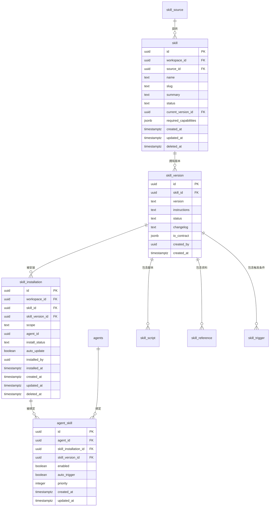
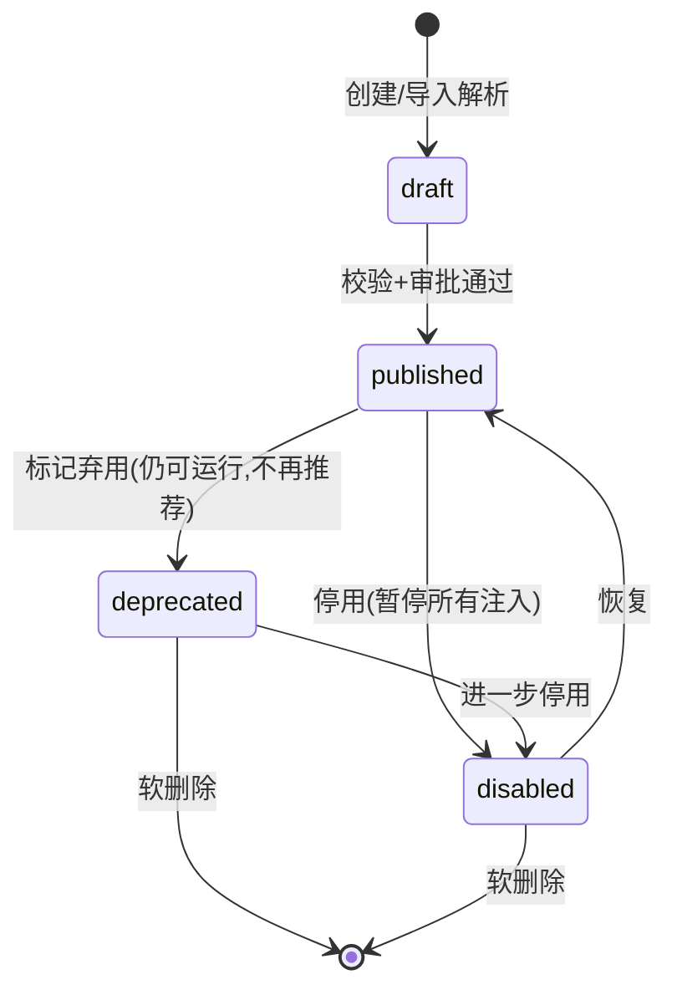
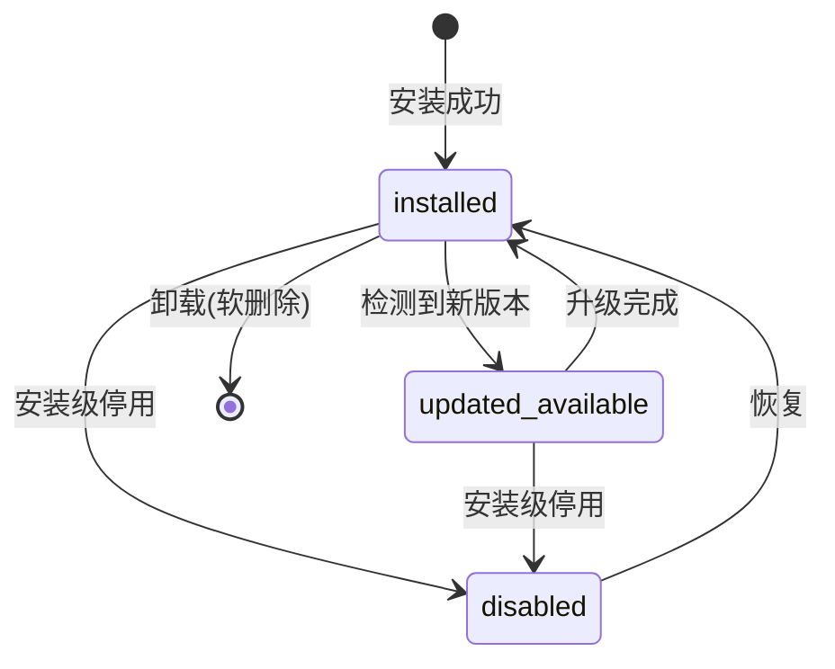

# 技能(Skill)系统调研记录

> 调研主题:技能系统模块
> 适用产品:Mesh(AI 原生团队工作区,AI agent 作为真正的队友)
> 后端技术栈基准:Python(异步 Web 框架 + PostgreSQL + ORM + WebSocket)
> 用途:作为 Mesh 撰写 skill 模块 spec 的依据
> 文档性质:调研原始记录(数据模型 / 接口 / UI / UX 细节)

---

## 0. 术语与基准约定

### 0.1 核心术语

| 术语 | 含义 |
|------|------|
| 技能(skill) | 可安装的结构化指令包,是给 agent 注入领域知识 / SOP / 可复用工作流的打包单元 |
| 技能定义(skill definition) | 技能的逻辑实体,承载名称、摘要、来源、生命周期状态等元信息 |
| 技能版本(skill version) | 技能在某一时刻的不可变快照,含指令正文、脚本、引用资料 |
| 安装(installation) | 把某个技能版本引入到某一作用域(workspace 级或 agent 级)的记录 |
| 绑定(binding) | 把已安装的技能与具体 agent 关联,使其对该 agent 可用 |
| 清单文件(manifest) | 技能包根部的结构化描述文件(YAML / JSON),声明技能元信息与文件结构 |
| 指令正文(instructions) | markdown 形式的自然语言指令,运行时注入 agent 上下文 |
| 触发条件(trigger) | 决定技能在何种任务上下文下被自动匹配并注入的规则 |

### 0.2 数据模型基准(全文统一)

- PostgreSQL,主键 UUID(v4),所有表含 `created_at` / `updated_at`(`timestamptz`,UTC)。
- REST + JSON,Bearer token 鉴权。
- 列表游标分页(`?cursor&limit`,响应含 `next_cursor`)。
- 软删除优先(`deleted_at timestamptz null`)。
- 时间统一 UTC RFC3339。
- 表名 `snake_case` 复数,字段 `snake_case`。

### 0.3 技能本质

技能 = **可安装的结构化指令包**。一个技能可包含:

1. **markdown 指令正文** —— 运行时注入 agent 的提示词,承载 SOP、规范、领域知识;
2. **可执行脚本** —— shell / Python 等脚本文件,被 agent 在受控沙箱内调用;
3. **参考文档** —— 供 agent 按需检索的领域资料(API 说明、模板、样例)。

业界标准做法把技能视为"提示词 + 资源 + 可执行逻辑"的三合一打包单元,通过统一的清单文件(manifest)描述其结构与能力声明。

---

## 1. 功能清单(每项附典型用户场景)

### 1.1 技能定义与构成

技能由以下要素构成,前三项为必备,其余可选:

| 构成要素 | 说明 | 是否必备 |
|----------|------|----------|
| 名称(name) | 技能唯一显示名,作用域内唯一 | 必备 |
| 摘要(summary) | 一句话描述技能用途,用于发现与匹配 | 必备 |
| 触发条件 / 触发关键词(triggers) | 关键词列表 + 自然语言描述,驱动自动匹配 | 必备(可为空表示仅显式调用) |
| 指令正文(instructions) | markdown 正文,运行时注入 | 必备 |
| 脚本文件(scripts) | 可执行脚本列表,含入口、运行时、权限声明 | 可选 |
| 引用资料(references) | 参考文档列表,按需检索 | 可选 |
| 输入 / 输出约定(io contract) | 期望的输入上下文与产出格式(JSON Schema 描述) | 可选 |
| 所需工具 / 权限声明(required capabilities) | 技能运行所需的工具、网络、文件、shell 权限 | 可选(安全关键字段) |

**典型用户场景**:平台管理员把团队沉淀的"代码评审 SOP"打包成一个技能,填写名称"代码评审规范"、摘要"对改动进行安全/质量/可维护性评审",触发关键词["代码评审""code review""审查"],指令正文写入完整评审清单,并声明所需权限为"只读代码 + 评论"。此后任何 agent 处理评审类任务时可自动注入该 SOP。

### 1.2 技能来源

| 来源(source_type) | 说明 | 信任级别 |
|-------------------|------|----------|
| `builtin` | 平台内置,随产品发布,不可删改(只能停用) | 最高,平台签名 |
| `user` | 用户在 workspace 内自建 | 中,本 workspace 可信 |
| `marketplace` | 从技能市场 / 技能仓库导入 | 中-低,需审核 |
| `url` | 从外部 URL / 仓库地址导入 | 低,强制人工审核脚本 |

**典型用户场景**:成员想用一个"数据库迁移检查"技能,在技能市场浏览页搜到后导入;另一名成员把一个内部仓库地址粘贴进导入向导,导入团队私有的"发布检查清单"技能。

### 1.3 技能导入流程

导入流程分为四步,业界标准做法是"先解析、后校验、再沙箱预览、最后安装":

1. **解析清单文件(manifest parse)**:从技能包(压缩包 / 仓库 / URL)根部读取 `manifest.yaml`(或 `manifest.json`),解析出名称、版本、指令正文路径、脚本清单、权限声明。
2. **校验(validate)**:校验清单结构(JSON Schema 校验)、版本号格式(SemVer)、文件完整性、权限声明合法性、名称冲突。
3. **沙箱预览(sandbox preview)**:在隔离环境中渲染指令正文、列出脚本与权限,允许人工审阅;**第三方技能的脚本在此阶段必须人工确认**。
4. **安装(install)**:校验通过后写入技能定义与版本快照,创建安装记录。

**典型用户场景**:运维粘贴一个仓库地址,系统解析出 manifest 后提示"该技能包含 2 个 shell 脚本,申请 shell 执行 + 网络出站权限",运维在预览页逐行查看脚本内容后确认安装。

### 1.4 技能安装范围(workspace 级 vs agent 级)

| 安装范围(scope) | 说明 | 适用 |
|-----------------|------|------|
| `workspace` | 安装到 workspace,所有 agent 可见,可被任意 agent 绑定 | 团队共享技能(SOP、规范) |
| `agent` | 仅安装并绑定到指定 agent | 单一 agent 专属技能 |

**典型用户场景**:把"客服话术规范"以 workspace 级安装,所有客服 agent 都可绑定;把"某 legacy 系统专属操作"以 agent 级安装,只给负责该系统的 agent。

### 1.5 技能与 agent 绑定 / 解绑

- 绑定建立 `agent ↔ 已安装技能版本` 的关系;
- 解绑移除关系但不删除安装记录(技能仍在库中);
- 支持批量绑定(一个技能绑给多个 agent);
- 绑定时可指定是否启用自动触发。

**典型用户场景**:新建一个"前端开发" agent 后,在配置页把已 workspace 级安装的"组件命名规范""单测编写规范"两个技能绑定给它。

### 1.6 版本与更新

- **语义化版本(SemVer)**:`MAJOR.MINOR.PATCH`;
- **版本快照**:每个版本是不可变快照,技能定义指向"当前版本",历史版本全部保留;
- **更新提示**:检测到来源有新版本时,安装记录标记 `updated_available`,通知管理员;
- **回滚(rollback)**:可把安装记录切回任意历史版本;
- **版本切换语义**:升级默认不自动覆盖,需显式确认(避免运行中行为突变)。

**典型用户场景**:市场技能"依赖扫描"发布 1.2.0,系统提示"有可用更新",管理员查看变更日志后选择升级;若新版本引发问题,一键回滚到 1.1.0。

### 1.7 技能的发现与自动触发

两种使用方式:

1. **显式调用**:用户在任务或 agent 配置中明确指定使用某技能;
2. **自动触发(自动匹配注入)**:平台根据任务上下文(标题、描述、标签、关键词)与技能触发条件匹配,自动把命中技能的指令正文注入 agent 上下文。

匹配策略(由弱到强):

- 关键词命中(触发关键词与任务文本的交集);
- 摘要 / 描述的语义相似度(向主流大语言模型或向量检索请求相似度);
- 显式标签匹配(任务标签 ∩ 技能标签);
- 优先级与互斥规则(高优先级技能优先,可配置互斥组避免冲突注入)。

**典型用户场景**:agent 接到一个标题含"评审"的任务,平台匹配到"代码评审规范"技能并自动注入其 SOP;agent 也可在对话中被用户显式要求"用发布检查清单技能"。

### 1.8 技能启用 / 停用

- 技能定义级停用:全平台不再可被安装 / 触发;
- 安装级停用:保留安装记录但暂停注入;
- 绑定级停用:保留绑定但对该 agent 暂停;
- 停用是软状态,可随时恢复。

**典型用户场景**:某技能脚本被发现存在风险,管理员立即将其安装级停用,所有 agent 停止注入,待修复后再恢复。

### 1.9 权限与安全

- **脚本执行的安全边界**:脚本在隔离沙箱中运行,默认无网络、无任意文件写、无特权;按 manifest 声明的 capabilities 申请,人工审批后授予;
- **来源可信度分级**:`builtin > user > marketplace > url`,信任级别越低,审核越严格;
- **第三方脚本强制人工审核**:`marketplace` / `url` 来源含脚本的技能,首次安装必须人工逐一审阅;
- **权限最小化**:技能只拿到声明且被批准的权限;
- **审计**:所有安装、绑定、权限授予、脚本执行均留审计日志。

**典型用户场景**:从 URL 导入的技能申请"shell + 出站网络"权限,安全负责人在审核页看到高亮的网络调用代码,选择"仅授予只读 shell,拒绝网络"。

---

## 2. 数据模型

四层关系总览:**定义(skill)→ 版本(skill_version)→ 安装(skill_installation)→ 绑定(agent_skill)**。

- 一个 `skill` 有多个 `skill_version`(1:N);
- 一个 `skill_version` 可被多次安装到不同作用域(1:N);
- 一个 `skill_installation`(workspace 级)可被多个 agent 绑定(1:N);agent 级安装通常自带绑定;
- `agent_skill` 是 agent 与已安装技能版本之间的绑定关系。

### 2.1 ER 图



### 2.2 表:skill(技能定义)

| 字段 | 类型 | 约束 | 默认值 | 说明 |
|------|------|------|--------|------|
| id | uuid | PK | gen_random_uuid() | 主键 |
| workspace_id | uuid | NOT NULL, FK→workspaces.id | - | 所属 workspace(builtin 技能可为系统 workspace) |
| source_id | uuid | NOT NULL, FK→skill_source.id | - | 来源 |
| name | text | NOT NULL | - | 显示名 |
| slug | text | NOT NULL | - | URL/匹配用短名,`^[a-z0-9][a-z0-9-]*$` |
| summary | text | NOT NULL | - | 一句话摘要 |
| status | text | NOT NULL, CHECK in ('draft','published','deprecated','disabled') | 'draft' | 生命周期状态 |
| current_version_id | uuid | FK→skill_version.id, NULL | NULL | 当前指向版本(可为空表示尚无版本) |
| required_capabilities | jsonb | NOT NULL | '[]' | 所需工具/权限声明数组 |
| tags | text[] | NOT NULL | '{}' | 标签,用于发现 |
| icon | text | NULL | NULL | 图标标识 |
| created_by | uuid | NOT NULL | - | 创建者成员/agent |
| created_at | timestamptz | NOT NULL | now() | 创建时间 |
| updated_at | timestamptz | NOT NULL | now() | 更新时间 |
| deleted_at | timestamptz | NULL | NULL | 软删除 |

**约束**:
- 唯一约束 `uq_skill_workspace_slug (workspace_id, slug) WHERE deleted_at IS NULL`(同 workspace 内 slug 唯一);
- 索引 `idx_skill_workspace_status (workspace_id, status)`、`idx_skill_source (source_id)`、GIN 索引 `idx_skill_tags (tags)`。

### 2.3 表:skill_version(版本快照)

| 字段 | 类型 | 约束 | 默认值 | 说明 |
|------|------|------|--------|------|
| id | uuid | PK | gen_random_uuid() | 主键 |
| skill_id | uuid | NOT NULL, FK→skill.id | - | 所属技能 |
| version | text | NOT NULL | - | SemVer 字符串,如 `1.2.0` |
| instructions | text | NOT NULL | - | markdown 指令正文 |
| status | text | NOT NULL, CHECK in ('draft','published','deprecated') | 'draft' | 版本状态 |
| changelog | text | NULL | NULL | 变更说明 |
| io_contract | jsonb | NULL | NULL | 输入/输出约定(JSON Schema) |
| required_capabilities | jsonb | NOT NULL | '[]' | 该版本所需权限(可与定义级不同) |
| manifest | jsonb | NOT NULL | '{}' | 解析后的原始清单文件,留档 |
| content_hash | text | NOT NULL | - | 指令正文+脚本的内容哈希,用于去重/变更检测 |
| created_by | uuid | NOT NULL | - | 创建者 |
| created_at | timestamptz | NOT NULL | now() | 创建时间(版本不可变,无 updated_at) |

**约束**:
- 唯一约束 `uq_skill_version (skill_id, version)` —— **同一技能版本号唯一**;
- 索引 `idx_skill_version_skill (skill_id, created_at DESC)`。

### 2.4 表:skill_installation(安装记录)

| 字段 | 类型 | 约束 | 默认值 | 说明 |
|------|------|------|--------|------|
| id | uuid | PK | gen_random_uuid() | 主键 |
| workspace_id | uuid | NOT NULL, FK→workspaces.id | - | 安装到的 workspace |
| skill_id | uuid | NOT NULL, FK→skill.id | - | 安装的技能 |
| skill_version_id | uuid | NOT NULL, FK→skill_version.id | - | 当前安装的版本 |
| scope | text | NOT NULL, CHECK in ('workspace','agent') | 'workspace' | 安装范围 |
| agent_id | uuid | NULL, FK→agents.id | NULL | scope='agent' 时指定的 agent |
| install_status | text | NOT NULL, CHECK in ('installed','updated_available','disabled') | 'installed' | 安装状态 |
| auto_update | boolean | NOT NULL | false | 是否自动跟随新版本 |
| granted_capabilities | jsonb | NOT NULL | '[]' | 实际被授予的权限(审批后) |
| installed_by | uuid | NOT NULL | - | 安装者 |
| installed_at | timestamptz | NOT NULL | now() | 安装时间 |
| created_at | timestamptz | NOT NULL | now() | 创建时间 |
| updated_at | timestamptz | NOT NULL | now() | 更新时间 |
| deleted_at | timestamptz | NULL | NULL | 软删除(卸载) |

**约束**:
- 部分唯一约束 `uq_install_scope (workspace_id, skill_id, scope, agent_id) WHERE deleted_at IS NULL` —— 同作用域内一个技能只装一次;
- CHECK:`scope='agent'` 时 `agent_id` 必须非空(用触发器或应用层保证);
- 索引 `idx_install_workspace (workspace_id, install_status)`、`idx_install_skill_version (skill_version_id)`。

### 2.5 表:agent_skill(绑定关系)

> 与 `skill_installation` 分开:安装记录"哪些技能进了库",绑定记录"哪些 agent 真正使用"。workspace 级安装的技能可被多个 agent 绑定。

| 字段 | 类型 | 约束 | 默认值 | 说明 |
|------|------|------|--------|------|
| id | uuid | PK | gen_random_uuid() | 主键 |
| agent_id | uuid | NOT NULL, FK→agents.id | - | agent |
| skill_installation_id | uuid | NOT NULL, FK→skill_installation.id | - | 指向安装记录 |
| skill_version_id | uuid | NOT NULL, FK→skill_version.id | - | 绑定的具体版本(可与安装的当前版本不同,支持灰度/回滚) |
| enabled | boolean | NOT NULL | true | 绑定级启用开关 |
| auto_trigger | boolean | NOT NULL | true | 是否允许自动触发 |
| priority | integer | NOT NULL | 100 | 自动触发优先级,数值大者优先 |
| created_at | timestamptz | NOT NULL | now() | 创建时间 |
| updated_at | timestamptz | NOT NULL | now() | 更新时间 |

**约束**:
- 唯一约束 `uq_agent_skill (agent_id, skill_installation_id)` —— 一个 agent 对同一安装只绑一次;
- 索引 `idx_agent_skill_agent (agent_id, enabled)`、`idx_agent_skill_install (skill_installation_id)`。

### 2.6 表:skill_source(来源)

| 字段 | 类型 | 约束 | 默认值 | 说明 |
|------|------|------|--------|------|
| id | uuid | PK | gen_random_uuid() | 主键 |
| workspace_id | uuid | NOT NULL, FK→workspaces.id | - | 所属 workspace |
| source_type | text | NOT NULL, CHECK in ('builtin','user','marketplace','url') | 'user' | 来源类型 |
| name | text | NOT NULL | - | 来源显示名(如市场名/仓库地址) |
| uri | text | NULL | NULL | 来源地址(仓库地址/市场条目地址);builtin 为空 |
| trust_level | text | NOT NULL, CHECK in ('trusted','reviewed','untrusted') | 'untrusted' | 信任级别 |
| auth | jsonb | NULL | NULL | 拉取来源所需凭据引用(仅存 secret 引用,不存明文) |
| created_at | timestamptz | NOT NULL | now() | 创建时间 |
| updated_at | timestamptz | NOT NULL | now() | 更新时间 |
| deleted_at | timestamptz | NULL | NULL | 软删除 |

**约束**:
- 索引 `idx_source_workspace_type (workspace_id, source_type)`。
- 安全:`auth` 字段只存 secret manager 的引用键,绝不存明文凭据。

### 2.7 表:skill_script(脚本文件)

| 字段 | 类型 | 约束 | 默认值 | 说明 |
|------|------|------|--------|------|
| id | uuid | PK | gen_random_uuid() | 主键 |
| skill_version_id | uuid | NOT NULL, FK→skill_version.id | - | 所属版本 |
| path | text | NOT NULL | - | 文件相对路径 |
| runtime | text | NOT NULL | 'shell' | 运行时:shell/python/... |
| entrypoint | boolean | NOT NULL | false | 是否入口脚本 |
| content_ref | text | NOT NULL | - | 对象存储引用(不直接存大文件正文) |
| content_hash | text | NOT NULL | - | 内容哈希 |
| required_capabilities | jsonb | NOT NULL | '[]' | 该脚本申请的权限 |
| created_at | timestamptz | NOT NULL | now() | 创建时间 |

**约束**:唯一约束 `uq_script_version_path (skill_version_id, path)`。

### 2.8 表:skill_reference(引用资料)

| 字段 | 类型 | 约束 | 默认值 | 说明 |
|------|------|------|--------|------|
| id | uuid | PK | gen_random_uuid() | 主键 |
| skill_version_id | uuid | NOT NULL, FK→skill_version.id | - | 所属版本 |
| path | text | NOT NULL | - | 资料相对路径 |
| media_type | text | NOT NULL | 'text/markdown' | MIME 类型 |
| content_ref | text | NOT NULL | - | 对象存储引用 |
| summary | text | NULL | NULL | 资料摘要(供检索) |
| created_at | timestamptz | NOT NULL | now() | 创建时间 |

### 2.9 表:skill_trigger(触发条件)

| 字段 | 类型 | 约束 | 默认值 | 说明 |
|------|------|------|--------|------|
| id | uuid | PK | gen_random_uuid() | 主键 |
| skill_version_id | uuid | NOT NULL, FK→skill_version.id | - | 所属版本 |
| trigger_type | text | NOT NULL, CHECK in ('keyword','semantic','tag') | 'keyword' | 触发类型 |
| pattern | text | NOT NULL | - | 关键词/标签值/语义描述 |
| weight | numeric(5,2) | NOT NULL | 1.0 | 匹配权重 |
| created_at | timestamptz | NOT NULL | now() | 创建时间 |

**约束**:索引 `idx_trigger_version (skill_version_id)`;关键词匹配可额外建 GIN/全文索引。

---

## 3. 接口设计

基准:REST + JSON;`Authorization: Bearer <token>`;游标分页 `?cursor&limit`,响应含 `next_cursor`;时间 UTC RFC3339;路径前缀 `/api/v1`,资源均隐式归属于 token 对应的 workspace。

### 3.1 端点清单

| 方法 | 路径 | 说明 |
|------|------|------|
| GET | /skills | 列出技能(支持 `status`/`source_type`/`q` 过滤) |
| POST | /skills | 创建技能定义(用户自建) |
| GET | /skills/{skill_id} | 获取技能详情 |
| PATCH | /skills/{skill_id} | 更新技能元信息 / 状态 |
| DELETE | /skills/{skill_id} | 软删除技能 |
| POST | /skills/import | 从来源导入(市场/URL),返回导入任务 |
| GET | /skills/import/{task_id} | 查询导入进度 |
| GET | /marketplace/skills | 列出市场可导入技能 |
| GET | /skills/{skill_id}/versions | 列出技能版本 |
| POST | /skills/{skill_id}/versions | 创建新版本 |
| GET | /skills/{skill_id}/versions/{version_id} | 获取版本详情 |
| POST | /installations | 安装技能到指定 scope |
| DELETE | /installations/{installation_id} | 卸载(软删除) |
| PATCH | /installations/{installation_id} | 更新安装(切换版本/启停/auto_update) |
| GET | /installations | 列出安装记录 |
| POST | /installations/{installation_id}/rollback | 回滚到指定历史版本 |
| POST | /agents/{agent_id}/skills | 绑定技能到 agent |
| DELETE | /agents/{agent_id}/skills/{binding_id} | 解绑 |
| GET | /agents/{agent_id}/skills | 列出某 agent 已装/已绑技能 |
| PATCH | /agents/{agent_id}/skills/{binding_id} | 更新绑定(启停/优先级/auto_trigger) |
| POST | /skills/{skill_id}/approve | 审批第三方技能脚本/权限 |

### 3.2 关键接口示例

#### 3.2.1 创建技能定义

`POST /skills`

请求:

```json
{
  "name": "代码评审规范",
  "slug": "code-review-sop",
  "summary": "对改动进行安全、质量、可维护性评审的标准流程",
  "tags": ["review", "quality"],
  "required_capabilities": ["read:code", "write:comment"]
}
```

响应 `201 Created`:

```json
{
  "id": "5f2a1c00-1111-4a2b-9c3d-000000000001",
  "workspace_id": "7ea1891c-0000-0000-0000-000000000001",
  "source_id": "9b0d0000-0000-0000-0000-000000000002",
  "name": "代码评审规范",
  "slug": "code-review-sop",
  "summary": "对改动进行安全、质量、可维护性评审的标准流程",
  "status": "draft",
  "current_version_id": null,
  "required_capabilities": ["read:code", "write:comment"],
  "tags": ["review", "quality"],
  "created_at": "2026-07-24T12:00:00Z",
  "updated_at": "2026-07-24T12:00:00Z"
}
```

#### 3.2.2 从来源导入

`POST /skills/import`

请求:

```json
{
  "source_type": "url",
  "uri": "<内部 Git 仓库地址>/skills/release-checklist.git",
  "ref": "v1.3.0"
}
```

响应 `202 Accepted`:

```json
{
  "task_id": "c1a00000-0000-0000-0000-000000000099",
  "status": "parsing",
  "stage": "manifest_parse",
  "created_at": "2026-07-24T12:01:00Z"
}
```

#### 3.2.3 查询导入进度

`GET /skills/import/{task_id}`

响应 `200 OK`(校验通过、待人工审批脚本):

```json
{
  "task_id": "c1a00000-0000-0000-0000-000000000099",
  "status": "awaiting_review",
  "stage": "sandbox_preview",
  "preview": {
    "name": "发布检查清单",
    "version": "1.3.0",
    "summary": "发布前的标准检查流程",
    "instructions_preview": "## 发布前检查\n1. 运行回归测试...",
    "scripts": [
      {"path": "scripts/check.sh", "runtime": "shell", "entrypoint": true,
       "required_capabilities": ["exec:shell", "net:outbound"]}
    ],
    "references": [{"path": "docs/runbook.md", "media_type": "text/markdown"}],
    "requested_capabilities": ["exec:shell", "net:outbound"]
  },
  "requires_approval": true,
  "created_at": "2026-07-24T12:01:00Z",
  "updated_at": "2026-07-24T12:01:20Z"
}
```

#### 3.2.4 审批第三方技能

`POST /skills/{skill_id}/approve`

请求(只授予部分权限):

```json
{
  "task_id": "c1a00000-0000-0000-0000-000000000099",
  "granted_capabilities": ["exec:shell"],
  "decision": "approve",
  "comment": "拒绝出站网络,仅允许只读 shell"
}
```

响应 `200 OK`:

```json
{
  "skill_id": "5f2a1c00-0000-4a2b-9c3d-000000000010",
  "skill_version_id": "8d3b0000-0000-0000-0000-000000000020",
  "status": "published",
  "granted_capabilities": ["exec:shell"],
  "reviewed_by": "member-uuid",
  "reviewed_at": "2026-07-24T12:05:00Z"
}
```

#### 3.2.5 安装到指定 scope

`POST /installations`

请求(workspace 级安装):

```json
{
  "skill_id": "5f2a1c00-0000-4a2b-9c3d-000000000010",
  "skill_version_id": "8d3b0000-0000-0000-0000-000000000020",
  "scope": "workspace",
  "auto_update": false
}
```

响应 `201 Created`:

```json
{
  "id": "a1000000-0000-0000-0000-000000000030",
  "workspace_id": "7ea1891c-0000-0000-0000-000000000001",
  "skill_id": "5f2a1c00-0000-4a2b-9c3d-000000000010",
  "skill_version_id": "8d3b0000-0000-0000-0000-000000000020",
  "scope": "workspace",
  "agent_id": null,
  "install_status": "installed",
  "auto_update": false,
  "granted_capabilities": ["exec:shell"],
  "installed_at": "2026-07-24T12:06:00Z"
}
```

#### 3.2.6 绑定到 agent

`POST /agents/{agent_id}/skills`

请求:

```json
{
  "skill_installation_id": "a1000000-0000-0000-0000-000000000030",
  "skill_version_id": "8d3b0000-0000-0000-0000-000000000020",
  "auto_trigger": true,
  "priority": 120
}
```

响应 `201 Created`:

```json
{
  "id": "b2000000-0000-0000-0000-000000000040",
  "agent_id": "d3000000-0000-0000-0000-000000000050",
  "skill_installation_id": "a1000000-0000-0000-0000-000000000030",
  "skill_version_id": "8d3b0000-0000-0000-0000-000000000020",
  "enabled": true,
  "auto_trigger": true,
  "priority": 120,
  "created_at": "2026-07-24T12:07:00Z"
}
```

#### 3.2.7 列出某 agent 已装技能(分页)

`GET /agents/{agent_id}/skills?limit=20`

响应 `200 OK`:

```json
{
  "items": [
    {
      "binding_id": "b2000000-0000-0000-0000-000000000040",
      "skill": {
        "id": "5f2a1c00-0000-4a2b-9c3d-000000000010",
        "name": "发布检查清单",
        "slug": "release-checklist",
        "summary": "发布前的标准检查流程",
        "source_type": "url",
        "status": "published"
      },
      "version": "1.3.0",
      "install_status": "updated_available",
      "enabled": true,
      "auto_trigger": true,
      "priority": 120
    }
  ],
  "next_cursor": "eyJvZmZzZXQiOjIwfQ==",
  "limit": 20
}
```

#### 3.2.8 切换 / 回滚版本

`POST /installations/{installation_id}/rollback`

请求:

```json
{
  "target_version_id": "8d3b0000-0000-0000-0000-000000000019",
  "reason": "1.3.0 引发脚本超时,回滚到 1.2.0"
}
```

响应 `200 OK`:

```json
{
  "id": "a1000000-0000-0000-0000-000000000030",
  "skill_version_id": "8d3b0000-0000-0000-0000-000000000019",
  "previous_version_id": "8d3b0000-0000-0000-0000-000000000020",
  "install_status": "installed",
  "updated_at": "2026-07-24T13:00:00Z"
}
```

#### 3.2.9 列出版本

`GET /skills/{skill_id}/versions?limit=10`

响应 `200 OK`:

```json
{
  "items": [
    {"id": "8d3b0000-0000-0000-0000-000000000020", "version": "1.3.0", "status": "published", "changelog": "新增网络检查脚本", "created_at": "2026-07-20T09:00:00Z"},
    {"id": "8d3b0000-0000-0000-0000-000000000019", "version": "1.2.0", "status": "published", "changelog": "优化检查顺序", "created_at": "2026-07-10T09:00:00Z"}
  ],
  "next_cursor": null,
  "limit": 10
}
```

### 3.3 错误码表

| HTTP | code | 含义 |
|------|------|------|
| 400 | validation_error | 请求体 / 参数校验失败(含清单文件 JSON Schema 校验失败) |
| 401 | unauthorized | 缺少或无效 Bearer token |
| 403 | forbidden | 无权限(如非管理员审批第三方脚本) |
| 404 | not_found | 资源不存在或已删除 |
| 409 | conflict | 唯一约束冲突(slug 重复 / 重复安装 / 重复绑定) |
| 409 | version_conflict | 版本号已存在(SemVer 唯一) |
| 422 | manifest_invalid | 清单文件结构合法但语义非法(缺指令正文、未知 runtime) |
| 422 | approval_required | 第三方技能含脚本但未审批 |
| 423 | locked | 技能处于 draft/disabled 不可安装 |
| 429 | rate_limited | 触发限流 |
| 502 | source_unreachable | 导入时来源地址不可达 |
| 500 | internal_error | 服务端错误 |

错误响应统一信封:

```json
{
  "success": false,
  "data": null,
  "error": {"code": "approval_required", "message": "该技能含第三方脚本,需审批后才能安装", "details": {"scripts": ["scripts/check.sh"]}},
  "meta": null
}
```

### 3.4 鉴权与分页

- 鉴权:所有端点要求 `Authorization: Bearer <token>`(JWT);技能审批 / 安装类操作要求 workspace 管理员或具备 `skill:manage` 权限;
- 分页:`?cursor=<opaque>&limit=<1-100>`,默认 `limit=20`;响应 `meta` 或顶层含 `next_cursor`,为空表示末页;
- 限流:导入、市场拉取类端点单独限流,防止对来源造成压力。

---

## 4. UI 设计

### 4.1 技能列表 / 库页

卡片信息:名称、摘要、来源标识、当前版本、安装状态、生命周期状态。

```
┌──────────────────────────────────────────────────────────────────┐
│  技能库                       [搜索 q...]  [来源▾] [状态▾]  [+ 新建] │
│                                       [⇩ 导入]  [浏览技能市场 →]    │
├──────────────────────────────────────────────────────────────────┤
│ ┌────────────────────────┐  ┌────────────────────────┐            │
│ │ 📦 代码评审规范          │  │ 📦 发布检查清单          │            │
│ │ 对改动进行安全/质量评审   │  │ 发布前的标准检查流程     │            │
│ │ 来源: 用户自建          │  │ 来源: URL  ⚠ 含脚本      │            │
│ │ 版本: v1.1.0           │  │ 版本: v1.3.0 ↻ 有更新    │            │
│ │ 状态: ● published      │  │ 状态: ● published        │            │
│ │ 安装: workspace · 已绑定3│  │ 安装: workspace          │            │
│ │ [详情] [绑定] [停用]     │  │ [详情] [更新] [审批]      │            │
│ └────────────────────────┘  └────────────────────────┘            │
│  ... 更多卡片(瀑布/网格)              [加载更多 next_cursor]         │
└──────────────────────────────────────────────────────────────────┘
```

### 4.2 技能详情页

包含:指令正文渲染、脚本文件列表、引用资料、版本历史、安装 / 绑定操作区。

```
┌──────────────────────────────────────────────────────────────────┐
│ ← 返回库    代码评审规范   ● published   v1.1.0   [安装] [绑定▾]    │
├───────────────┬──────────────────────────────────────────────────┤
│ [概览][版本历史]│  ## 指令正文(markdown 渲染)                        │
│ [脚本][资料]   │  你是一名资深代码评审员。对每次改动:                 │
│ [触发条件]     │  1. 先检查安全(注入/越权/敏感信息泄露)              │
│               │  2. 再检查质量(命名/复杂度/重复)                    │
│ 所需权限:      │  3. 输出结构化评审意见...                          │
│ ☑ read:code   │                                                   │
│ ☑ write:comment│  ── 脚本文件 ──────────────────────                │
│               │  ▸ scripts/lint.sh   shell  入口  [查看] [权限]     │
│ 来源: 用户自建 │  ── 引用资料 ──────────────────────                │
│ 创建: 2026-07 │  ▸ docs/checklist.md  text/markdown  [预览]        │
└───────────────┴──────────────────────────────────────────────────┘
```

版本历史子页:

```
┌──────────────────────────────────────────────────────────────────┐
│ 版本历史                                                          │
│ ┌─────────┬──────────┬──────────────────────────┬──────────────┐  │
│ │ 版本     │ 状态      │ 变更说明                  │ 操作          │  │
│ ├─────────┼──────────┼──────────────────────────┼──────────────┤  │
│ │ v1.1.0  │ ●当前     │ 增加可维护性检查           │ [查看]        │  │
│ │ v1.0.0  │ published │ 首版                     │ [回滚到此版]  │  │
│ └─────────┴──────────┴──────────────────────────┴──────────────┘  │
└──────────────────────────────────────────────────────────────────┘
```

### 4.3 技能导入向导

三步:粘贴 URL / 选择市场项 → 预览 → 安装(含脚本审批)。

```
┌──────────────────────────────────────────────────────────────────┐
│ 导入技能        ① 选择来源  ──  ② 预览校验  ──  ③ 安装            │
├──────────────────────────────────────────────────────────────────┤
│  ○ 从技能市场选择     ● 从 URL / 仓库地址导入                       │
│  ┌────────────────────────────────────────────────────────────┐  │
│  │ <内部 Git 仓库地址>/skills/release-checklist.git              │  │
│  └────────────────────────────────────────────────────────────┘  │
│  版本/分支: [v1.3.0 ▾]        [解析并校验 →]                        │
└──────────────────────────────────────────────────────────────────┘
        ↓ 解析校验通过,进入预览
┌──────────────────────────────────────────────────────────────────┐
│ 预览: 发布检查清单 v1.3.0     来源信任级别: ⚠ untrusted             │
│ ─ 指令正文预览(可滚动) ─                                          │
│   ## 发布前检查 ...                                               │
│ ─ 脚本(必须人工审阅) ─                                            │
│   ⚠ scripts/check.sh  [shell] 申请: exec:shell, net:outbound      │
│     ┌────────────────────────────────────────────────┐            │
│     │ #!/usr/bin/env bash                            │            │
│     │ curl -s <外部端点> (高亮: 出站网络)              │            │
│     └────────────────────────────────────────────────┘            │
│ ─ 权限授予 ─                                                      │
│   ☑ exec:shell   ☐ net:outbound (建议拒绝)                        │
│              [拒绝]   [审批并安装 →]                                │
└──────────────────────────────────────────────────────────────────┘
```

### 4.4 agent 配置页里的技能绑定区

```
┌──────────────────────────────────────────────────────────────────┐
│ Agent 配置: 前端开发助手            [基础][技能][工具][权限]         │
├──────────────────────────────────────────────────────────────────┤
│ 已绑定技能 (2)                                  [+ 从库中绑定]      │
│ ┌────────────────────────────────────────────────────────────┐  │
│ │ ☑ 组件命名规范   v1.0.0   自动触发:开  优先级:100  [解绑]    │  │
│ │ ☑ 单测编写规范   v2.1.0   自动触发:开  优先级:100  [解绑]    │  │
│ │ ☐ 代码评审规范   v1.1.0   (已停用)          [启用] [解绑]    │  │
│ └────────────────────────────────────────────────────────────┘  │
│ 提示: 标记 ⚠ 的技能含脚本,执行受沙箱与已授予权限约束。              │
└──────────────────────────────────────────────────────────────────┘
```

### 4.5 技能市场浏览页

```
┌──────────────────────────────────────────────────────────────────┐
│ 技能市场            [搜索...]  [分类▾]  [排序: 热度▾]              │
├──────────────────────────────────────────────────────────────────┤
│ ┌────────────────────────┐  ┌────────────────────────┐            │
│ │ 📦 依赖漏洞扫描          │  │ 📦 接口文档生成          │            │
│ │ 扫描依赖并报告已知漏洞   │  │ 从代码生成接口文档       │            │
│ │ ⭐ 4.7  ⇩ 1.2k          │  │ ⭐ 4.5  ⇩ 980           │            │
│ │ 维护方: 已认证 ✓         │  │ 维护方: 社区            │            │
│ │ [预览] [导入]           │  │ [预览] [导入]           │            │
│ └────────────────────────┘  └────────────────────────┘            │
│ 注: 含脚本的第三方技能导入时需人工审批。                            │
└──────────────────────────────────────────────────────────────────┘
```

---

## 5. UX 设计

### 5.1 关键交互流程:从市场导入 → 安装 → 绑定 → 自动触发

```
[市场浏览页]                 [导入向导]              [安装]            [agent 配置]
  选中"依赖漏洞扫描" ──→ ① 选择来源 ──→ ② 预览校验 ──→ ③ 审批安装
                                                       │
                              (含脚本 → 强制人工审阅脚本与权限)
                                                       │
                                                       ▼
                                          workspace 级安装(installed)
                                                       │
                                                       ▼
                                          [agent 配置页] 绑定给"安全巡检"agent
                                          (auto_trigger=on, priority=120)
                                                       │
                                                       ▼
                                   agent 接到含"依赖""漏洞"关键词的任务
                                                       │
                                                       ▼
                                   平台匹配命中 → 自动注入指令正文 → agent 执行
```

要点:

1. 市场项点击"导入"进入向导,默认带入来源;
2. 预览阶段把"指令正文 + 脚本 + 权限"同屏呈现,脚本默认折叠但**含脚本时强制展开并要求逐项确认**;
3. 安装默认 workspace 级、`auto_update=false`(保守,避免运行行为突变);
4. 绑定步骤可跳过(先入库,稍后绑定);
5. 自动触发开关默认开,但用户可在绑定行随时关闭。

### 5.2 版本更新与回滚流程

```
检测到来源有新版本
   │
   ▼
安装记录 install_status = updated_available  ──→  通知管理员(inbox + 角标)
   │
   ▼
[详情页/通知] 查看变更日志与 diff
   │
   ├─→ [立即更新]  PATCH /installations {skill_version_id: 新版}  → installed
   │
   └─→ [稍后]  保持 updated_available
   │
   ▼ (若新版引发问题)
[版本历史] 选择旧版 → [回滚]  POST /installations/{id}/rollback → installed
```

- 升级默认需显式确认;`auto_update=true` 时仅自动跟进 PATCH(非破坏性)版本;
- 回滚是"把安装记录的当前版本指针指向历史版本",历史版本永不删除,故回滚始终可用;
- 绑定记录可独立指向某版本,支持灰度(部分 agent 用新版,其余留旧版)。

### 5.3 技能生命周期状态机

技能定义级:



安装状态:



### 5.4 自动触发机制(基于任务上下文的匹配策略)

匹配在任务进入 agent 处理前执行,流程:

1. **收集候选**:取该 agent 已绑定且 `enabled=true` 且 `auto_trigger=true` 的技能;
2. **多策略打分**:
   - 关键词命中:触发关键词与任务标题/描述的命中数 × `weight`;
   - 语义相似度:任务文本与技能摘要/触发描述,经主流大语言模型或向量检索打分;
   - 标签匹配:任务标签 ∩ 技能标签;
3. **排序与裁剪**:按总分 × `priority` 排序,取 Top-N(避免上下文过载);
4. **互斥与冲突**:同互斥组只保留最高分者;
5. **注入**:把命中技能的指令正文拼入 agent 上下文,并记录"本次注入了哪些技能"(可解释、可审计)。

兜底:用户可在任务里显式指定技能,显式指定的技能强制注入且不参与裁剪。

### 5.5 实时性(导入 / 安装进度)

- 导入是异步任务(解析→校验→沙箱→审批→安装),通过 WebSocket 推送 `import.progress` 事件,前端实时更新阶段与进度条;
- 未连接 WebSocket 时降级为轮询 `GET /skills/import/{task_id}`;
- 安装/绑定/版本切换为同步操作,完成后通过 WebSocket 广播 `skill.changed` 事件,驱动列表/卡片即时刷新;
- 事件载荷携带 `skill_id` / `installation_id` / `change_type`,前端按 id 局部更新。

### 5.6 通知机制

| 触发 | 通知对象 | 渠道 |
|------|----------|------|
| 有可用更新(updated_available) | workspace 管理员 / 安装者 | inbox + 列表角标 |
| 第三方技能待审批 | 安全负责人 / 管理员 | inbox + 待办 |
| 导入失败(来源不可达/校验失败) | 发起人 | inbox |
| 技能被停用 / 弃用 | 已绑定的 agent 拥有者 | inbox |
| 脚本执行异常 / 越权被拦截 | 安全负责人 | inbox + 告警 |

### 5.7 人类监督与干预点

1. **第三方脚本审核**:`marketplace` / `url` 来源含脚本的技能,首次安装强制人工逐一审阅脚本内容与权限申请;
2. **权限授予控制**:审批者可授予全部 / 部分 / 零权限,默认最小化;脚本只能拿到被授予的 capabilities;
3. **沙箱执行边界**:脚本在隔离环境运行,默认无网络、无任意写、无特权;越权调用被运行时拦截并告警;
4. **运行可观测**:每次技能注入与脚本执行留审计日志,可在详情页回溯"哪个 agent、哪个任务、注入了哪个版本、执行了哪些脚本";
5. **一键熔断**:发现风险可立即停用(定义级 / 安装级 / 绑定级三档),即时停止注入;
6. **更新不自动覆盖**:升级默认需确认,避免运行中 agent 行为突变。

---

## 6. 对 Mesh 的设计启示

1. **坚持"定义—版本—安装—绑定"四层解耦**。技能定义承载元信息与生命周期,版本是不可变快照,安装记录"哪些技能进了哪个作用域",绑定记录"哪些 agent 真正使用"。四层分离后,版本回滚、灰度发布、workspace 共享与 agent 专属才能互不干扰地实现,这是整个模块可演进性的地基。

2. **workspace 级安装 + agent 级绑定的两级模型,匹配"团队共享 vs 个体专属"两种现实需求**。共享 SOP/规范应一次安装、多 agent 复用;专属技能则直装直绑。Mesh 把 AI agent 当队友,技能就是"团队知识库 + 个人技能树"的统一抽象,两级模型恰好覆盖。

3. **安全是技能系统的头号约束,必须前置而非补丁**。脚本沙箱、权限最小化、来源信任分级、第三方脚本强制人工审核、运行审计与一键熔断,应作为 MVP 必备而非后期加固。技能本质是"可执行的提示词包",一旦放松,等于给 agent 开了不受控的副作用通道。

4. **自动触发要"可解释、可裁剪、可关闭"**。基于任务上下文的匹配注入是技能系统价值最大的能力,但必须告诉用户"本次注入了哪些技能、为什么",提供 Top-N 裁剪避免上下文过载,并允许在绑定级一键关闭自动触发或显式指定,把控制权始终留给人类。

5. **版本不可变 + 默认不自动覆盖,保障运行中 agent 的稳定性**。技能更新可能改变 agent 行为,故升级需显式确认、历史版本永久保留、回滚始终可用、绑定可独立指向版本以支持灰度。这把"持续更新"与"行为可预期"两个矛盾目标兼顾到位。

6. **导入是异步多阶段流程,用 WebSocket 推进度并对降级友好**。解析→校验→沙箱预览→审批→安装可能耗时且需人工介入,应以任务化 + 事件推送呈现进度,并在无实时连接时降级轮询;同时把"预览与审批"设计成导入流程的强制环节,而非可选步骤。
