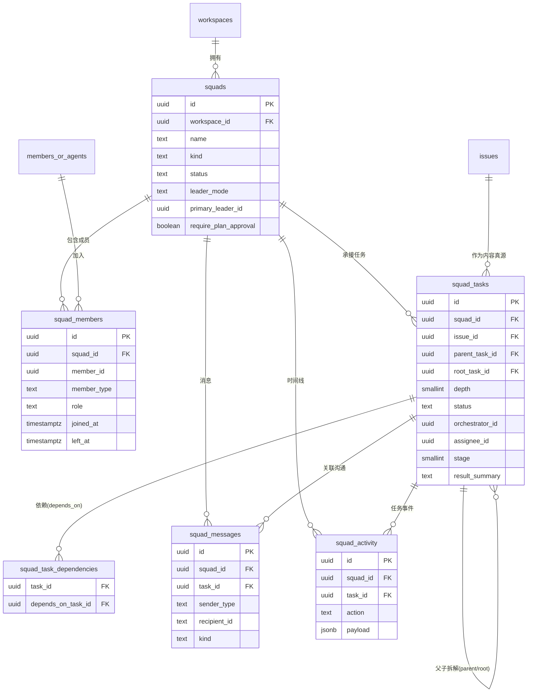
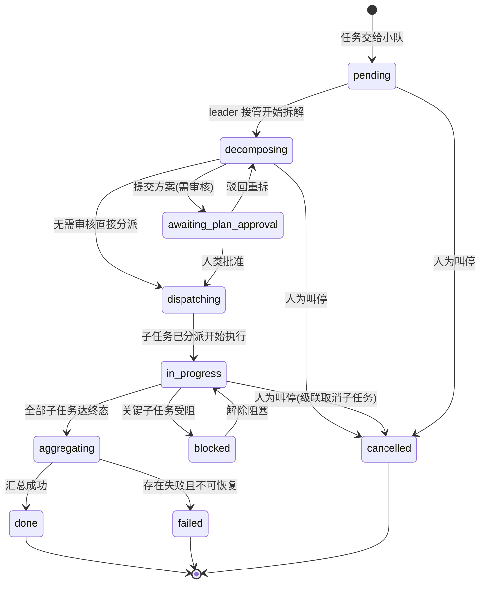
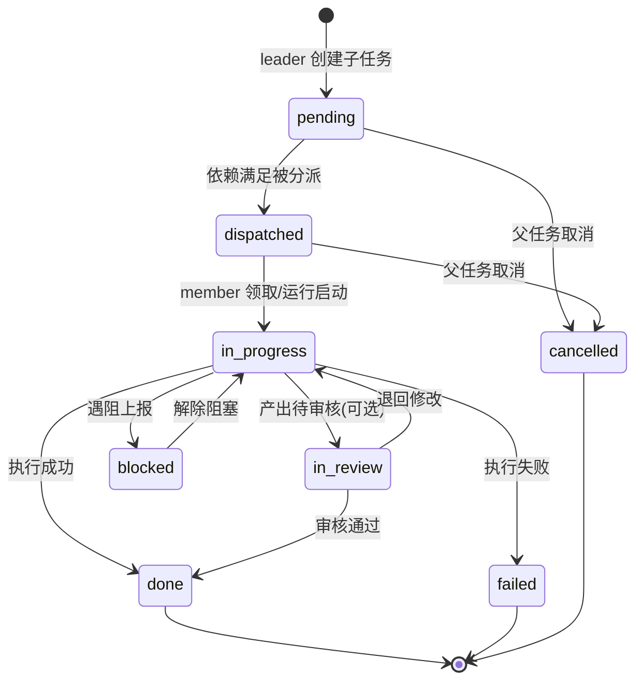

# 调研记录：小队（Squad）

> 模块簇：多智能体编排与协作
> 调研对象：业界主流 AI agent 平台与协作产品在「多智能体编组协作 / 任务拆解分派 / 编排时间线」上的成熟设计模式。
> 说明：本文仅记录中性化的设计模式与业界标准做法，用于指导 Mesh 的 Spec 撰写；不指向任何具体产品、公司或模型。
> Mesh 特色标注：`[Mesh 特色]` 表示需要特别为「AI agent 作为真正队友」这一核心范式做的设计。
> 术语约定：squad＝小队（多智能体编排单元）；leader＝组长（负责接收任务 / 拆解 / 分派 / 汇总）；member＝成员（负责执行，可为 agent 或人）；observer＝观察员（只读监督）。

---

## 一、功能清单

### 1.1 小队的生命周期

| # | 功能点 | 典型用户场景 |
|---|--------|--------------|
| S1 | 创建小队（命名 / 描述 / 头像） | 项目经理为「支付重构」组建一支固定小队，填名称、目标描述、上传小队头像 |
| S2 | 编辑小队基本信息 | 调整小队名称 / 描述 / 头像；目标变更时更新说明 |
| S3 | 归档（解散）小队 | 项目结项后把小队置为 `archived`，保留全部历史（成员、任务、消息、时间线）供追溯，不做物理删除 |
| S4 | 恢复（解档）小队 | 误归档或项目重启时，从 `archived` 恢复为 `active` |
| S5 | 删除小队（受限） | 仅 owner 在无运行中任务时可申请删除（仍是软删除，留审计）；常规路径是归档 |
| S6 | 小队列表 / 搜索 / 筛选 | 在「小队」页按名称搜索，按状态（active / archived）、按类型（常设 / 临时）筛选 |

### 1.2 成员构成与角色

| # | 功能点 | 典型用户场景 |
|---|--------|--------------|
| M1 | 多 agent 成员 `[Mesh 特色]` | 把若干个不同职责的 agent（编码、评审、测试）加入同一小队 |
| M2 | 含人类成员 | 小队里同时有人类工程师作为 member，与 agent 并肩被分派子任务 |
| M3 | 角色：leader（至少一个） | 指定一个或多个 agent 为 leader，负责接收小队任务、拆解、分派、汇总 |
| M4 | 角色：member | 执行被分派的子任务，汇报结果 |
| M5 | 角色：observer（只读监督） | 人类负责人作为 observer：能看全部任务拆解、消息、时间线，但不被分派执行 |
| M6 | 是否支持多 leader | 支持「单 leader（默认、推荐）」与「多 leader（协作 / 互备）」两种模式；多 leader 时需明确「主 leader」负责最终汇总，避免分派冲突 `[设计取舍见 §六]` |
| M7 | 增减成员 | 给小队添加 / 移除成员；移除时校验其是否持有运行中子任务 |
| M8 | 运行中改成员 `[Mesh 特色]` | 允许在有小队任务运行时增减成员，但有限制：不能移除正持有 in_progress 子任务的 member；新加 member 只对新分派生效，不影响已分派任务 |
| M9 | 变更角色 | 把某 member 提升为 leader，或把 leader 降级；变更即时写入并留痕到时间线 |

### 1.3 小队级任务入口与编排（核心）

| # | 功能点 | 典型用户场景 |
|---|--------|--------------|
| T1 | 小队级任务入口 `[Mesh 特色]` | 把一张 issue / 任务**分派给整个小队**（而非单个成员），由 leader 接管 |
| T2 | leader 接收并拆解 | leader agent 被唤醒，读取任务与共享上下文，把它拆成若干子任务 |
| T3 | 创建子任务 / 子 issue | leader 为每个子任务创建记录（可挂为父 issue 的子 issue），写明目标、验收口径 |
| T4 | 指定执行人 | leader 把每个子任务分派给合适的 member（按 agent 技能 / 人类职责匹配） |
| T5 | 设定依赖与顺序（并行 / 串行） | leader 声明子任务依赖（DAG）：无依赖的并行执行，有依赖的等前置完成后再执行；支持「阶段（stage）」批量并行 |
| T6 | 多层级拆解 | 某子任务本身较复杂时，可由被指派的「子 leader」二次拆解，形成多层父子树（限制最大深度） |
| T7 | 汇总结果 | 全部子任务到达终态后，leader 聚合各 member 产出，生成总结，回写父任务 / 父 issue |
| T8 | 人类审核拆解方案（可选干预点） | 高风险任务可配置「拆解后先暂停，等人类确认方案再分派执行」 |
| T9 | 任务取消 / 叫停 | 发起人或人类 observer 中途叫停整个小队任务，级联取消未完成的子任务 |

### 1.4 小队内消息与协作记录

| # | 功能点 | 典型用户场景 |
|---|--------|--------------|
| C1 | 小队内消息（群聊式） | 成员间自由协商、对齐方案；leader 与 member 沟通细节 |
| C2 | 指令消息（leader→member） `[Mesh 特色]` | leader 下达结构化指令（带关联 task），member 端呈现为「待办指令」而非普通聊天 |
| C3 | 汇报消息（member→leader） `[Mesh 特色]` | member 完成任务后回报结论 / 产物链接，关联到对应子任务 |
| C4 | 广播 vs 定向 | 消息可广播给全队（recipient 为空），也可定向发给某个成员 |
| C5 | 消息关联任务 | 每条消息可挂到具体 squad_task，按任务维度聚合查看「这个子任务的所有沟通」 |
| C6 | 共享上下文 | 小队级别的任务说明、关键决策、共享资料以「置顶消息 / 上下文卡片」形式沉淀，新成员加入可读 |
| C7 | 协作时间线（审计） | 全程可追溯：谁在何时被分派了什么、做了什么状态变更、产出了什么、发了什么消息，按时间线性呈现 |
| C8 | 按任务 / 按成员过滤时间线 | 排查「这个子任务为什么失败」「这个 agent 当时做了什么」 |

### 1.5 小队的复用形态

| # | 功能点 | 典型用户场景 |
|---|--------|--------------|
| R1 | 常设小队（standing） | 长期存在的固定团队（如「平台后端小队」），成员稳定，反复接任务 |
| R2 | 临时小队（adhoc） `[Mesh 特色]` | 为某个一次性任务临时拉一支小队，任务完成后自动归档 |
| R3 | 小队模板（可选增强） | 把一套成员 + 角色配置存为模板，一键复用到新小队 |
| R4 | 任务级小队（task-scoped） | 直接由「把任务交给一组 agent」隐式生成的轻量小队，生命周期绑定到该任务 |

---

## 二、数据模型

> 约定：PostgreSQL；主键 UUID v4（`gen_random_uuid()`）；所有表含 `created_at`/`updated_at`（`timestamptz`，默认 `now()`，UTC）；软删除优先（小队归档用 `status='archived'`，成员离队用 `left_at`，任务取消用 `status='cancelled'`）；REST + JSON；游标分页（`?cursor&limit`，含 `next_cursor`）；Bearer token 鉴权；实时走 WebSocket / SSE。表名 snake_case 复数，字段 snake_case。

### 2.1 `squads` — 小队主表

| 字段 | 类型 | 约束 / 默认 | 说明 |
|------|------|-------------|------|
| `id` | uuid | PK | 小队 ID |
| `workspace_id` | uuid | NOT NULL, FK→workspaces | 所属工作区（多租户隔离，所有查询强制带） |
| `name` | text | NOT NULL, length 1..80 | 小队名称 |
| `description` | text | NULL | 小队目标 / 职责描述 |
| `avatar_url` | text | NULL | 头像地址 |
| `kind` | text | NOT NULL, CHECK in ('standing','adhoc','task_scoped')，default 'standing' | 形态：常设 / 临时 / 任务级 |
| `status` | text | NOT NULL, CHECK in ('active','archived')，default 'active' | 状态；归档＝软解散 |
| `leader_mode` | text | NOT NULL, CHECK in ('single','multi')，default 'single' | 组长模式：单 leader / 多 leader |
| `primary_leader_id` | uuid | NULL | 主 leader（多 leader 模式下负责最终汇总；单 leader 时即唯一 leader） |
| `require_plan_approval` | boolean | NOT NULL, default false | 拆解方案是否需人类审核后才分派执行（干预开关） |
| `max_decompose_depth` | smallint | NOT NULL, default 2, CHECK between 1 and 4 | 允许的最大拆解层级 |
| `creator_type` | text | NOT NULL, CHECK in ('member','agent') | 创建者类型 |
| `creator_id` | uuid | NOT NULL | 创建者 ID |
| `archived_at` | timestamptz | NULL | 归档时间 |
| `archived_by_id` | uuid | NULL | 归档操作人 |
| `deleted_at` | timestamptz | NULL | 软删除（仅 owner 受限删除路径） |
| `created_at` / `updated_at` | timestamptz | NOT NULL, default now() | 时间戳 |

**唯一约束：** `uq_squads_name (workspace_id, name) WHERE deleted_at IS NULL AND status='active'` —— 同工作区内活跃小队不重名。
**关键索引：**
- `idx_squads_list (workspace_id, status, created_at DESC) WHERE deleted_at IS NULL` —— 小队列表主查询。
- `idx_squads_kind (workspace_id, kind, status)` —— 按形态筛选。

### 2.2 `squad_members` — 成员关系表

| 字段 | 类型 | 约束 / 默认 | 说明 |
|------|------|-------------|------|
| `id` | uuid | PK | 关系 ID |
| `workspace_id` | uuid | NOT NULL | 多租户隔离 |
| `squad_id` | uuid | NOT NULL, FK→squads | 所属小队 |
| `member_id` | uuid | NOT NULL | 成员 ID（agent 或 human，按 member_type 解释） |
| `member_type` | text | NOT NULL, CHECK in ('agent','human') | 成员类型 `[Mesh 特色]` |
| `role` | text | NOT NULL, CHECK in ('leader','member','observer') | 角色 |
| `joined_at` | timestamptz | NOT NULL, default now() | 加入时间 |
| `left_at` | timestamptz | NULL | 离队时间（NULL＝在队；软删除成员关系） |
| `added_by_type` | text | NOT NULL, CHECK in ('member','agent','system') | 添加者类型 |
| `added_by_id` | uuid | NOT NULL | 添加者 ID |
| `created_at` / `updated_at` | timestamptz | NOT NULL, default now() | 时间戳 |

**唯一约束：** `uq_squad_member_active (squad_id, member_id, member_type) WHERE left_at IS NULL` —— 同一成员在同一小队只有一条在队记录（部分唯一约束）。
> 设计要点：用 `left_at` 软删除而非物理删，保留「某人曾是成员」的历史；再次加入时插入新行（旧的 `left_at` 已置位，不冲突）。

**关键索引：**
- `idx_squad_members_active (squad_id, role) WHERE left_at IS NULL` —— 「某小队当前成员 / 按角色取」。
- `idx_squad_members_member (member_type, member_id) WHERE left_at IS NULL` —— 反查「我加入了哪些小队」。
- 校验触发器 / 应用层约束：每个 active 小队至少一个 `role='leader'`（见 §3.1 业务规则）。

### 2.3 `squad_tasks` — 小队任务表（编排核心）

> 设计选择：squad_task 是**编排层记录**，包裹一张 issue（复用 issues 表作为任务真源），并承载拆解树、分派、状态机。issue 管「任务内容 / 评论 / 状态」，squad_task 管「这是哪个小队、哪一层、谁拆解、谁执行、依赖谁」。二者一一对应或一 issue 多 squad_task（重派）。

| 字段 | 类型 | 约束 / 默认 | 说明 |
|------|------|-------------|------|
| `id` | uuid | PK | 小队任务 ID |
| `workspace_id` | uuid | NOT NULL | 多租户隔离 |
| `squad_id` | uuid | NOT NULL, FK→squads | 承接小队 |
| `issue_id` | uuid | NOT NULL, FK→issues | 关联 issue（任务内容真源） |
| `parent_task_id` | uuid | NULL, FK→squad_tasks.id | 父任务（拆解树自引用）；根任务为 NULL |
| `root_task_id` | uuid | NULL, FK→squad_tasks.id | 根任务（冗余，加速整树聚合；根任务指向自身） |
| `depth` | smallint | NOT NULL, default 0, CHECK between 0 and 4 | 拆解层级（根=0），受 `squads.max_decompose_depth` 约束 |
| `title_snapshot` | text | NOT NULL | 任务标题快照（避免渲染时回查 issue） |
| `status` | text | NOT NULL, CHECK in ('pending','decomposing','awaiting_plan_approval','dispatching','in_progress','blocked','aggregating','done','failed','cancelled'), default 'pending' | 任务状态机（见 §5.2） |
| `orchestrator_type` | text | NULL, CHECK in ('agent','human') | 拆解 / 编排者类型（通常是 leader agent） |
| `orchestrator_id` | uuid | NULL | 拆解 / 编排者 ID |
| `assignee_type` | text | NULL, CHECK in ('agent','human') | 执行人类型（member）；根任务可空（由 leader 统筹） |
| `assignee_id` | uuid | NULL | 执行人 ID |
| `stage` | smallint | NULL | 执行阶段编号（同 stage 的子任务可并行；stage 间串行） |
| `run_id` | uuid | NULL, FK→agent_runs | 若执行人是 agent，记录其运行 ID `[Mesh 特色]` |
| `plan_markdown` | text | NULL | leader 的拆解方案说明（人类审核对象） |
| `result_summary` | text | NULL | 汇总结果（leader 聚合产出 / member 完成小结） |
| `dispatched_at` | timestamptz | NULL | 分派时间 |
| `started_at` | timestamptz | NULL | 开始执行时间 |
| `finished_at` | timestamptz | NULL | 结束时间 |
| `failure_reason` | text | NULL | 失败原因 |
| `created_at` / `updated_at` | timestamptz | NOT NULL, default now() | 时间戳 |

**关系与约束：**
- `parent_task_id → squad_tasks.id`：自引用构成拆解树；应用层校验子任务与父任务同 `squad_id`、同 `root_task_id`，且 `depth = parent.depth + 1 ≤ max_decompose_depth`。
- `root_task_id`：根任务在创建时回填为自身 id（事务内一次更新），便于「给定任意节点取整树」。
- 状态迁移由服务端集中校验（非法迁移返回 `409 CONFLICT`），见 §5.2 状态机。

**关键索引：**
- `idx_squad_tasks_squad (workspace_id, squad_id, status, created_at DESC)` —— 小队任务列表 / 看板。
- `idx_squad_tasks_tree (root_task_id, depth, created_at)` —— 拆解树拉取。
- `idx_squad_tasks_parent (parent_task_id, status)` —— 「某父任务的所有直接子任务及其状态」（驱动汇总判定）。
- `idx_squad_tasks_assignee (assignee_type, assignee_id, status)` —— 「分派给我的子任务」（member 工作台）。
- 部分索引 `idx_squad_tasks_active ON squad_tasks(squad_id) WHERE status NOT IN ('done','failed','cancelled')` —— 活跃任务快查 / 归档前校验。

### 2.4 `squad_task_dependencies` — 任务依赖（DAG）

| 字段 | 类型 | 约束 | 说明 |
|------|------|------|------|
| `id` | uuid | PK | |
| `task_id` | uuid | NOT NULL, FK→squad_tasks | 当前任务 |
| `depends_on_task_id` | uuid | NOT NULL, FK→squad_tasks | 前置任务（task_id 须等其 done） |
| `created_at` | timestamptz | NOT NULL | |

**唯一约束：** `uq_task_dep (task_id, depends_on_task_id)`；CHECK `task_id <> depends_on_task_id`。
> 设计要点：依赖用独立关系表而非 jsonb，便于做环检测（递归 CTE / 拓扑校验）与「谁在等谁」反查。`stage` 字段是依赖的**粗粒度补充**（按阶段批量并行），二者并存：stage 表达「批次」，依赖表达「精确先后」。

**关键索引：**
- `idx_dep_task (task_id)` —— 取某任务的前置集合，判定是否可分派。
- `idx_dep_blocker (depends_on_task_id)` —— 反查「哪些任务被我阻塞」，前置完成时触发解锁。

### 2.5 `squad_messages` — 小队内消息

| 字段 | 类型 | 约束 / 默认 | 说明 |
|------|------|-------------|------|
| `id` | uuid | PK | 消息 ID |
| `workspace_id` | uuid | NOT NULL | 多租户隔离 |
| `squad_id` | uuid | NOT NULL, FK→squads | 所属小队 |
| `task_id` | uuid | NULL, FK→squad_tasks | 关联任务（按任务聚合沟通；可空＝小队级闲聊） |
| `sender_type` | text | NOT NULL, CHECK in ('agent','human','system') | 发送者类型 `[Mesh 特色]` |
| `sender_id` | uuid | NOT NULL | 发送者 ID（system 用固定值） |
| `recipient_type` | text | NULL, CHECK in ('agent','human') | 接收者类型；NULL＝广播全队 |
| `recipient_id` | uuid | NULL | 接收者 ID；NULL＝广播 |
| `kind` | text | NOT NULL, CHECK in ('chat','instruction','report','system','context'), default 'chat' | 消息种类：闲聊协商 / 指令 / 汇报 / 系统 / 共享上下文 |
| `body_markdown` | text | NOT NULL | 原始 markdown（真源） |
| `body_html` | text | NULL | 服务端净化后的 HTML 缓存 |
| `body_text` | text | NULL | 纯文本（搜索 / 摘要 / 通知预览） |
| `pinned` | boolean | NOT NULL, default false | 是否置顶（共享上下文 / 关键决策） |
| `attachment_ids` | jsonb | NOT NULL, default '[]' | 附件 ID 列表（见 attachment 模块） |
| `deleted_at` | timestamptz | NULL | 软删除 |
| `created_at` / `updated_at` | timestamptz | NOT NULL, default now() | 时间戳 |

**关键索引：**
- `idx_messages_squad (workspace_id, squad_id, created_at) WHERE deleted_at IS NULL` —— 消息流主查询。
- `idx_messages_task (squad_id, task_id, created_at) WHERE task_id IS NOT NULL` —— 按任务聚合。
- `idx_messages_recipient (recipient_type, recipient_id, created_at)` —— 「发给我的消息 / 指令收件箱」。
- 部分索引 `idx_messages_pinned (squad_id) WHERE pinned = true` —— 共享上下文 / 置顶。

### 2.6 `squad_activity` — 协作时间线 / 审计

| 字段 | 类型 | 约束 / 默认 | 说明 |
|------|------|-------------|------|
| `id` | uuid | PK | 活动 ID |
| `workspace_id` | uuid | NOT NULL | 多租户隔离 |
| `squad_id` | uuid | NOT NULL, FK→squads | 所属小队 |
| `task_id` | uuid | NULL, FK→squad_tasks | 关联任务（可空＝小队级事件） |
| `actor_type` | text | NOT NULL, CHECK in ('agent','human','system') | 行为主体类型 |
| `actor_id` | uuid | NOT NULL | 行为主体 ID |
| `action` | text | NOT NULL | 事件枚举（见下） |
| `target_type` | text | NULL | 目标实体类型（squad/member/task/message/issue） |
| `target_id` | uuid | NULL | 目标实体 ID |
| `payload` | jsonb | NOT NULL, default '{}' | 渲染快照（变更前后值、子任务计数等），实体被删后仍可读 |
| `created_at` / `updated_at` | timestamptz | NOT NULL, default now() | 时间戳（活动只增不改，updated_at 仅作约定列） |

**`action` 枚举（建议集）：**
`squad_created` / `squad_updated` / `squad_archived` / `squad_restored` / `member_added` / `member_removed` / `role_changed` / `task_received` / `decompose_started` / `plan_submitted` / `plan_approved` / `plan_rejected` / `task_decomposed` / `task_dispatched` / `task_started` / `task_blocked` / `task_finished` / `task_failed` / `task_cancelled` / `task_aggregated` / `message_sent`（仅关键消息可选入时间线）。

**关键索引：**
- `idx_activity_squad (workspace_id, squad_id, created_at DESC)` —— 小队时间线主查询。
- `idx_activity_task (squad_id, task_id, created_at) WHERE task_id IS NOT NULL` —— 单任务全程追溯。
- `idx_activity_actor (actor_type, actor_id, created_at)` —— 「这个 agent 当时做了什么」。

### 2.7 ER 关系总结（mermaid）



**关系脉络（一句话串起五张表）：** 一个 `squad` 由若干 `squad_members`（agent / 人，带角色）组成；把一张 issue 交给小队会生成一条根 `squad_tasks`，leader 把它拆成子 `squad_tasks`（父子自引用 + `squad_task_dependencies` 表达先后）并分派给 member；执行过程中的指令 / 汇报沉淀到 `squad_messages`（按 task 聚合）；每一步关键动作写入 `squad_activity` 形成可追溯时间线。

---

## 三、接口设计

> 鉴权：`Authorization: Bearer <token>`（成员会话 token 或 API token）。写操作校验 workspace 角色与资源权限（RBAC，见 auth 模块）；agent runtime 用 API token 代 agent 调用拆解 / 分派 / 汇报端点。
> 分页：游标分页。响应含 `data[]` 与 `pagination: { next_cursor, has_more }`；游标为不透明字符串（内部基于 `created_at + id` 的 keyset）。
> 时间：RFC3339（UTC）。统一错误包络见 §3.4。

### 3.1 端点清单

**小队 CRUD**

| 方法 | 路径 | 说明 |
|------|------|------|
| GET | `/api/v1/squads` | 列出小队（`?cursor&limit&status&kind&q`） |
| POST | `/api/v1/squads` | 创建小队 |
| GET | `/api/v1/squads/{squad_id}` | 小队详情（含成员摘要、活跃任务计数） |
| PATCH | `/api/v1/squads/{squad_id}` | 更新名称 / 描述 / 头像 / 编排开关 |
| POST | `/api/v1/squads/{squad_id}/archive` | 归档（软解散） |
| POST | `/api/v1/squads/{squad_id}/restore` | 恢复 |

**成员管理**

| 方法 | 路径 | 说明 |
|------|------|------|
| GET | `/api/v1/squads/{squad_id}/members` | 列出成员（`?role&cursor&limit`） |
| POST | `/api/v1/squads/{squad_id}/members` | 添加成员（批量） |
| PATCH | `/api/v1/squads/{squad_id}/members/{member_id}` | 变更角色 |
| DELETE | `/api/v1/squads/{squad_id}/members/{member_id}` | 移除成员（软删，置 left_at） |

**任务编排（核心）**

| 方法 | 路径 | 说明 |
|------|------|------|
| POST | `/api/v1/squads/{squad_id}/tasks` | 把任务交给小队（建根 squad_task，唤醒 leader） |
| GET | `/api/v1/squads/{squad_id}/tasks` | 列出小队任务（`?status&cursor&limit`） |
| GET | `/api/v1/squads/{squad_id}/tasks/{task_id}` | 单任务详情 |
| GET | `/api/v1/squads/{squad_id}/tasks/{task_id}/tree` | 拆解树（整棵子任务，含依赖） |
| GET | `/api/v1/squads/{squad_id}/tasks/{task_id}/status` | 长任务状态查询（拆解 / 汇总进度） |
| GET | `/api/v1/squads/{squad_id}/tasks/{task_id}/stream` | SSE 流式订阅该任务的编排进度 |
| POST | `/api/v1/squads/{squad_id}/tasks/{task_id}/subtasks` | leader 创建子任务（批量，含依赖） |
| POST | `/api/v1/squads/{squad_id}/tasks/{task_id}/plan/approve` | 人类批准拆解方案 |
| POST | `/api/v1/squads/{squad_id}/tasks/{task_id}/plan/reject` | 驳回方案（leader 重新拆解） |
| POST | `/api/v1/squads/{squad_id}/tasks/{task_id}/dispatch` | 分派已就绪的子任务 |
| POST | `/api/v1/squads/{squad_id}/tasks/{task_id}/cancel` | 取消（级联取消未完成子任务） |

**消息与时间线**

| 方法 | 路径 | 说明 |
|------|------|------|
| GET | `/api/v1/squads/{squad_id}/messages` | 列出消息（`?task_id&kind&cursor&limit`） |
| POST | `/api/v1/squads/{squad_id}/messages` | 发送消息 |
| GET | `/api/v1/squads/{squad_id}/activity` | 协作时间线（`?task_id&action&cursor&limit`） |

### 3.2 关键端点请求 / 响应示例

**① 创建小队（POST `/api/v1/squads`）— 请求体：**
```json
{
  "name": "支付重构小队",
  "description": "负责支付链路的重构与回归验证",
  "avatar_url": "https://cdn.example.local/avatars/squad-pay.png",
  "kind": "standing",
  "leader_mode": "single",
  "require_plan_approval": true,
  "max_decompose_depth": 2,
  "members": [
    {"member_type": "agent", "member_id": "a-leader-01", "role": "leader"},
    {"member_type": "agent", "member_id": "a-coder-02", "role": "member"},
    {"member_type": "agent", "member_id": "a-reviewer-03", "role": "member"},
    {"member_type": "human", "member_id": "u-zhang-09", "role": "observer"}
  ]
}
```
**响应体（201）：**
```json
{
  "data": {
    "id": "sq-1f3a",
    "workspace_id": "ws-001",
    "name": "支付重构小队",
    "description": "负责支付链路的重构与回归验证",
    "avatar_url": "https://cdn.example.local/avatars/squad-pay.png",
    "kind": "standing",
    "status": "active",
    "leader_mode": "single",
    "primary_leader_id": "a-leader-01",
    "require_plan_approval": true,
    "max_decompose_depth": 2,
    "member_count": 4,
    "leaders": [{"member_type": "agent", "member_id": "a-leader-01", "name": "orchestrator"}],
    "created_at": "2026-07-24T09:00:00Z",
    "updated_at": "2026-07-24T09:00:00Z"
  }
}
```

**② 把任务交给小队（POST `/api/v1/squads/{squad_id}/tasks`）— 请求体：**
```json
{
  "issue_id": "i-2201",
  "brief": "把订单结算从同步改为异步，并补齐幂等与对账。",
  "priority": "high",
  "due_date": "2026-08-05T18:00:00Z"
}
```
**响应体（202，表示已受理并异步唤醒 leader）：**
```json
{
  "data": {
    "id": "st-root-9001",
    "squad_id": "sq-1f3a",
    "issue_id": "i-2201",
    "parent_task_id": null,
    "root_task_id": "st-root-9001",
    "depth": 0,
    "title_snapshot": "订单结算异步化改造",
    "status": "pending",
    "orchestrator_id": "a-leader-01",
    "status_url": "/api/v1/squads/sq-1f3a/tasks/st-root-9001/status",
    "stream_url": "/api/v1/squads/sq-1f3a/tasks/st-root-9001/stream",
    "created_at": "2026-07-24T09:05:00Z"
  }
}
```
> 服务端落库根任务后即返回 202，随后异步入队 leader 运行；客户端用 `status_url` 轮询或 `stream_url` 订阅拆解进度。

**③ leader 创建子任务（POST `/api/v1/squads/{squad_id}/tasks/{task_id}/subtasks`）— 请求体：**
```json
{
  "plan_markdown": "拆为 3 个子任务：先做异步化与幂等（并行），再做对账，最后回归验证（依赖前三者）。",
  "subtasks": [
    {
      "title": "结算入口异步化 + 幂等键",
      "assignee": {"member_type": "agent", "member_id": "a-coder-02"},
      "stage": 1,
      "depends_on": []
    },
    {
      "title": "对账批处理任务",
      "assignee": {"member_type": "agent", "member_id": "a-coder-02"},
      "stage": 1,
      "depends_on": []
    },
    {
      "title": "回归与压测验证",
      "assignee": {"member_type": "human", "member_id": "u-li-07"},
      "stage": 2,
      "depends_on": ["结算入口异步化 + 幂等键", "对账批处理任务"]
    }
  ]
}
```
> `depends_on` 支持两种写法：引用本批内的子任务标题（创建时服务端解析为 id），或 `temp_ref` 临时编号。跨已有任务的依赖直接用 `task_id`。服务端做环检测，越层（超 max_decompose_depth）返回 `422 DECOMPOSE_DEPTH_EXCEEDED`。

**响应体（201，因 `require_plan_approval=true` 进入待审核）：**
```json
{
  "data": {
    "root_task_id": "st-root-9001",
    "root_status": "awaiting_plan_approval",
    "created_subtasks": [
      {"id": "st-9002", "title": "结算入口异步化 + 幂等键", "assignee_id": "a-coder-02", "assignee_type": "agent", "stage": 1, "depth": 1, "status": "pending"},
      {"id": "st-9003", "title": "对账批处理任务", "assignee_id": "a-coder-02", "assignee_type": "agent", "stage": 1, "depth": 1, "status": "pending"},
      {"id": "st-9004", "title": "回归与压测验证", "assignee_id": "u-li-07", "assignee_type": "human", "stage": 2, "depth": 1, "status": "pending"}
    ],
    "dependencies": [
      {"task_id": "st-9004", "depends_on_task_id": "st-9002"},
      {"task_id": "st-9004", "depends_on_task_id": "st-9003"}
    ],
    "awaiting_approval": true
  }
}
```

**④ 拆解树（GET `/api/v1/squads/{squad_id}/tasks/{task_id}/tree`）— 响应体（200）：**
```json
{
  "data": {
    "id": "st-root-9001",
    "title_snapshot": "订单结算异步化改造",
    "status": "in_progress",
    "depth": 0,
    "progress": {"total": 3, "done": 1, "in_progress": 1, "pending": 1, "failed": 0},
    "children": [
      {
        "id": "st-9002",
        "title_snapshot": "结算入口异步化 + 幂等键",
        "status": "done",
        "assignee": {"member_type": "agent", "member_id": "a-coder-02", "name": "coder"},
        "stage": 1,
        "result_summary": "已引入消息队列与幂等键，单测通过。",
        "finished_at": "2026-07-24T11:20:00Z",
        "children": []
      },
      {
        "id": "st-9003",
        "title_snapshot": "对账批处理任务",
        "status": "in_progress",
        "assignee": {"member_type": "agent", "member_id": "a-coder-02", "name": "coder"},
        "stage": 1,
        "children": []
      },
      {
        "id": "st-9004",
        "title_snapshot": "回归与压测验证",
        "status": "pending",
        "assignee": {"member_type": "human", "member_id": "u-li-07", "name": "李工"},
        "stage": 2,
        "depends_on": ["st-9002", "st-9003"],
        "blocked_by": ["st-9003"],
        "children": []
      }
    ]
  }
}
```
> `blocked_by` 由服务端依据 `squad_task_dependencies` 实时计算：前置未 done 的任务列出阻塞者，前端据此渲染「等待 st-9003」。

**⑤ 长任务状态查询（GET `.../tasks/{task_id}/status`）— 响应体（200）：**
```json
{
  "data": {
    "task_id": "st-root-9001",
    "status": "decomposing",
    "phase": "leader_decomposing",
    "progress": {"percent": 40, "stage_label": "正在拆解任务并匹配执行人"},
    "orchestrator": {"member_type": "agent", "member_id": "a-leader-01", "run_id": "run-771"},
    "last_event": {"action": "decompose_started", "at": "2026-07-24T09:05:03Z"},
    "updated_at": "2026-07-24T09:05:12Z"
  }
}
```

**⑥ SSE 流式订阅（GET `.../tasks/{task_id}/stream`，`Accept: text/event-stream`）— 事件流示例：**
```
event: task.status
data: {"task_id":"st-root-9001","status":"decomposing","at":"2026-07-24T09:05:03Z"}

event: subtask.created
data: {"task_id":"st-9002","title":"结算入口异步化 + 幂等键","assignee_id":"a-coder-02"}

event: task.status
data: {"task_id":"st-root-9001","status":"awaiting_plan_approval","at":"2026-07-24T09:06:10Z"}

event: task.status
data: {"task_id":"st-root-9001","status":"done","result_summary":"已完成异步化改造，对账通过，回归无异常。","at":"2026-07-24T15:40:00Z"}
```
> 每个事件带单调递增 `id`（即 seq）；客户端断线重连用 `Last-Event-ID` 续订，服务端从事件缓冲重放缺口。

**⑦ 发送小队消息（POST `/api/v1/squads/{squad_id}/messages`）— 请求体：**
```json
{
  "task_id": "st-9003",
  "recipient": {"member_type": "agent", "member_id": "a-leader-01"},
  "kind": "report",
  "body_markdown": "对账批处理已完成首轮，发现 3 笔差异，详见日志。\n产物: https://ci.example.local/run/8812",
  "attachment_ids": ["att-501"]
}
```
**响应体（201）：**
```json
{
  "data": {
    "id": "msg-7001",
    "squad_id": "sq-1f3a",
    "task_id": "st-9003",
    "sender": {"member_type": "agent", "member_id": "a-coder-02", "name": "coder"},
    "recipient": {"member_type": "agent", "member_id": "a-leader-01", "name": "orchestrator"},
    "kind": "report",
    "body_markdown": "对账批处理已完成首轮，发现 3 笔差异，详见日志。\n产物: https://ci.example.local/run/8812",
    "body_html": "<p>对账批处理已完成首轮，发现 3 笔差异，详见日志。<br>产物: <a href=\"https://ci.example.local/run/8812\">…</a></p>",
    "pinned": false,
    "created_at": "2026-07-24T13:10:00Z"
  }
}
```
> 定向消息 `recipient` 为空即广播全队。`kind='instruction'` 且发送者为 leader 时，member 端会把它呈现为「待办指令」并触发对应运行 `[Mesh 特色]`。

### 3.3 分页与游标

- 所有列表端点：`?limit=<1..100，默认 30>&cursor=<opaque>`。
- 响应统一：
```json
{"data": [ ... ], "pagination": {"next_cursor": "eyJjcmVhdGVkX2F0Ijog...", "has_more": true}}
```
- 游标内部为 `(created_at, id)` 的 keyset 编码，`has_more=false` 时 `next_cursor=null`。

### 3.4 错误码体系

统一错误包络：
```json
{"error": {"code": "FORBIDDEN", "message": "你没有权限执行此操作", "details": {}}}
```

| HTTP | code | 场景 |
|------|------|------|
| 400 | `VALIDATION_ERROR` | 字段缺失 / 超长 / 非法（名称为空、role 非法等） |
| 401 | `UNAUTHENTICATED` | 缺失 / 过期 / 非法 token |
| 403 | `FORBIDDEN` | 无权限（如非成员操作小队、跨 workspace 访问） |
| 404 | `NOT_FOUND` | 小队 / 任务 / 成员 / 消息不存在或已删除 |
| 409 | `CONFLICT` | 非法状态迁移（如对已完成任务再分派）、并发更新冲突、归档时仍有运行中任务 |
| 409 | `SQUAD_NAME_TAKEN` | 同工作区活跃小队重名 |
| 422 | `NO_LEADER` | 变更后小队将没有 leader |
| 422 | `DECOMPOSE_DEPTH_EXCEEDED` | 拆解层级超过 `max_decompose_depth` |
| 422 | `DEPENDENCY_CYCLE` | 子任务依赖构成环 |
| 422 | `ASSIGNEE_NOT_MEMBER` | 分派对象不是当前小队成员 |
| 422 | `MEMBER_HAS_ACTIVE_TASK` | 移除的成员仍持有 in_progress 子任务 |
| 429 | `RATE_LIMITED` | 触发速率限制，响应含 `Retry-After` |
| 500 | `INTERNAL` | 服务端异常（不泄露堆栈） |

### 3.5 鉴权与权限要点

- 小队读：workspace 成员且为小队成员 / observer，或具备管理员角色。
- 小队写（创建 / 编辑 / 归档 / 增删成员）：需小队管理权限或 workspace 管理员；agent 不能自改自己所属小队的成员构成（防越权）。
- 给小队分派任务：对目标 issue 有分派权限的 member，或自动化触发器（autopilot）。
- leader 拆解 / 分派 / 汇报：由 agent runtime 持 API token 代该 leader agent 调用，服务端校验「调用 agent 确为该任务的 orchestrator」。
- 审核拆解方案 / 取消任务：人类 member、observer 或 workspace 管理员。

---

## 四、UI 设计

### 4.1 小队列表页

```
┌──────────────────────────────────────────────────────────────────────┐
│ 小队                                          [+ 新建小队]            │
│ ┌────────────┐ ┌──────┐ ┌──────────┐                                  │
│ │🔍 搜索小队 │ │全部▾ │ │状态:全部▾│                                   │
│ └────────────┘ └──────┘ └──────────┘                                  │
├──────────────────────────────────────────────────────────────────────┤
│ ┌──────────────────────────────────────────────────────────────┐    │
│ │ 🟦 支付重构小队          常设   ●活跃    3 任务进行中  4 成员 │    │
│ │    负责支付链路的重构与回归验证                              │    │
│ │    👤(L) 🤖 🤖 👁        更新于 5 分钟前                      │    │
│ └──────────────────────────────────────────────────────────────┘    │
│ ┌──────────────────────────────────────────────────────────────┐    │
│ │ 🟩 营销文案突击队        临时   ○已归档  —            5 成员 │    │
│ │    618 大促文案批量产出（已完成）                             │    │
│ │    🤖(L) 🤖 🤖 👤 👤                                         │    │
│ └──────────────────────────────────────────────────────────────┘    │
└──────────────────────────────────────────────────────────────────────┘
```
- 卡片元素：头像 / 名称 / 形态徽标（常设 / 临时）/ 状态点（活跃 / 已归档）/ 进行中任务计数 / 成员头像墙（leader 带 `(L)` 角标，人类与 agent 用不同图标 `[Mesh 特色]`）。
- 顶部：搜索框 + 形态筛选 + 状态筛选；右上「新建小队」。

### 4.2 小队详情页

```
┌──────────────────────────────────────────────────────────────────────┐
│ ◀ 支付重构小队   ●活跃  常设            [编辑] [归档] [交给小队一个任务]│
├──────────────────────────────────────┬───────────────────────────────┤
│ 成员 (4)                [+ 添加成员] │ 协作时间线        [按任务▾]   │
│ ┌──────────────────────────────────┐│ ┌─────────────────────────────┐ │
│ │ 🤖 orchestrator   组长 (L)       ││ │ 09:05 系统 收到任务 i-2201  │ │
│ │ 🤖 coder          成员           ││ │ 09:05 orchestrator 开始拆解 │ │
│ │ 🤖 reviewer       成员           ││ │ 09:06 拆解出 3 个子任务     │ │
│ │ 👤 李工           观察员         ││ │ 09:07 李工 批准拆解方案     │ │
│ └──────────────────────────────────┘│ │ 09:08 分派 st-9002→coder    │ │
│                                     │ │ 11:20 st-9002 ✅完成        │ │
│ 当前任务 (1)                        │ │ 13:10 coder 汇报对账差异    │ │
│ ┌──────────────────────────────────┐│ │ ...                         │ │
│ │ 订单结算异步化改造   进行中 60%  ││ └─────────────────────────────┘ │
│ │ ▸ 查看拆解树                    ││                                 │
│ └──────────────────────────────────┘│                                 │
├──────────────────────────────────────┴───────────────────────────────┤
│ 消息区  [全部 | 指令 | 汇报 | 共享上下文]            📌 置顶上下文 2  │
│ ┌──────────────────────────────────────────────────────────────────┐ │
│ │ 🤖 orchestrator → 全队 [指令]  09:08                              │ │
│ │   请各位按拆解执行，先并行做异步化与对账，回归依赖前两者。        │ │
│ │ 🤖 coder → orchestrator [汇报] 13:10  ▸ 关联 st-9003              │ │
│ │   对账批处理首轮完成，发现 3 笔差异，详见日志。                   │ │
│ ├──────────────────────────────────────────────────────────────────┤ │
│ │ [输入消息…  @提及  关联任务▾  📎附件]                  [发送]     │ │
│ └──────────────────────────────────────────────────────────────────┘ │
└──────────────────────────────────────────────────────────────────────┘
```
- **成员头像墙与角色**：每行头像 + 名称 + 角色徽标（组长 / 成员 / 观察员）；agent 与人类图标区分；hover 出「改角色 / 移除」。
- **当前任务**：列出活跃小队任务及进度条，点入 4.4 任务详情。
- **协作时间线**：按时间线性铺陈全部 `squad_activity`，支持「按任务 / 按成员 / 按 action」过滤。
- **消息区**：群聊式，按 `kind` 分 tab；指令 / 汇报带「关联任务」标签；顶部固定共享上下文（置顶消息）。

### 4.3 创建 / 编辑小队

```
┌──────────────────────────────────────────────────────┐
│ 新建小队                                              │
│ 名称*      [支付重构小队            ]                 │
│ 描述       [负责支付链路的重构与回归验证]            │
│ 头像       [🟦 上传]                                  │
│ 形态       (•) 常设   ( ) 临时（任务完成后自动归档）  │
│ 组长模式   (•) 单组长  ( ) 多组长                     │
│ ☑ 拆解方案需人类审核后执行                           │
│ 最大拆解层级  [2 ▾]                                   │
│ ── 成员（至少 1 名组长）──────────────────────────── │
│ 🤖 orchestrator   [组长 ▾]  [×]                       │
│ 🤖 coder          [成员 ▾]  [×]                       │
│ 👤 李工           [观察员 ▾][×]                       │
│ [+ 添加成员（人或 agent）]                            │
│                                       [取消] [创建]   │
└──────────────────────────────────────────────────────┘
```
- 选人弹层混排人类成员与 agent，可搜索；每行选角色（组长 / 成员 / 观察员）。
- 校验：至少一名组长，否则「创建」置灰并提示。

### 4.4 小队任务详情页（拆解树 / 看板）

```
┌──────────────────────────────────────────────────────────────────────┐
│ ◀ 订单结算异步化改造    状态: 进行中    根任务 st-root-9001          │
│ 进度 ████████░░░░ 60%   [查看时间线] [取消任务]                       │
│ [拆解树视图 | 看板视图]                                               │
├──────────────────────────────────────────────────────────────────────┤
│ 📦 订单结算异步化改造 (根)            orchestrator   进行中           │
│ ├── ✅ st-9002 结算入口异步化+幂等键   coder  阶段1  已完成           │
│ │      └ 结果: 已引入消息队列与幂等键，单测通过                      │
│ ├── 🔄 st-9003 对账批处理任务          coder  阶段1  执行中           │
│ └── ⏸ st-9004 回归与压测验证          李工   阶段2  待命             │
│        └ 等待: st-9003 完成                                          │
├──────────────────────────────────────────────────────────────────────┤
│ 看板视图（按状态列）                                                  │
│ ┌待命───────┐ ┌执行中─────┐ ┌待审核─┐ ┌已完成────┐ ┌失败──┐         │
│ │ st-9004   │ │ st-9003   │ │       │ │ st-9002  │ │      │         │
│ └───────────┘ └───────────┘ └───────┘ └──────────┘ └──────┘         │
└──────────────────────────────────────────────────────────────────────┘
```
- **拆解树**：缩进展示父子层级，每节点带状态图标 / 执行人 / 阶段 / 依赖（「等待 st-9003」）/ 结果摘要；展示 leader 如何分派。
- **看板视图**：按子任务状态分列拖拽（人工可改状态）；agent 子任务由运行自动流转。
- 若 `require_plan_approval` 且处于 `awaiting_plan_approval`：顶部出现高亮横幅「leader 已提交拆解方案，等待审核 [批准] [驳回]」，方案 markdown 渲染在侧栏。

### 4.5 小队内对话 / 协作记录视图

- 与 4.2 消息区同源，独立放大视图：左侧消息流（按 kind 着色：指令=蓝、汇报=绿、闲聊=灰、系统=虚线），右侧「任务关联面板」点任意消息高亮其所属子任务。
- 顶部「共享上下文」抽屉：聚合所有 `pinned=true` 消息，作为新成员入队即可读的沉淀。
- 导出：可把「某任务的全部消息 + 时间线」导出为 markdown 归档。

---

## 五、UX 设计

### 5.1 端到端关键交互流程

1. **组建小队**：用户进入「小队」页 → 新建 → 填名称 / 描述 / 形态 → 添加成员（混排选人与 agent，逐个设角色，至少一名组长）→ 可选开启「拆解需审核」→ 创建。
2. **把大任务交给小队**：在 issue 详情或小分队列 → 「分派给小队」选中小队 → 服务端建根 squad_task（`pending`）→ 返回 202 与 `status_url`/`stream_url`。
3. **leader 自动拆解**：根任务唤醒 leader agent → 状态 `decomposing` → leader 读任务与共享上下文，调用 `subtasks` 端点批量建子任务并声明依赖 / 阶段 → 写 `squad_activity`。
4. **（可选）人类审核**：若开启审核，根任务进 `awaiting_plan_approval`，通知人类 → 人类在任务详情页看方案 → 批准（进分派）或驳回（leader 重拆）。
5. **分派与执行**：批准 / 无需审核后 `dispatching` → 无依赖（stage 1）的子任务并行分派：agent member 入队运行、human member 收通知 → 各子任务 `in_progress`；有依赖（stage 2）的等前置 done 自动解锁。
6. **协作与汇报**：member 执行中通过小队消息协商 / 向 leader 汇报（`report`，关联子任务）；遇阻置 `blocked` 并通知 leader。
7. **leader 汇总**：当某父任务的全部直接子任务达终态 → 根任务 `aggregating` → leader 聚合各 `result_summary` 与产物，生成总结回写父 issue → 根任务 `done`（有失败则 `failed`，附原因）。
8. **完成与归档**：发起人收到「小队任务完成」通知；临时小队（adhoc / task_scoped）可在任务完成后自动归档。

### 5.2 状态机（mermaid）

**小队任务（根任务 / 编排级）状态机：**



**member 子任务状态机（在 squad_tasks 同一 status 枚举内，但流转更简单）：**


> 状态迁移集中在服务端校验：非法迁移返回 `409 CONFLICT`。前置任务 done 时，服务端扫描 `squad_task_dependencies.depends_on_task_id` 找出被解锁的子任务，若其全部前置已 done 且 stage 允许，则自动 `pending → dispatched`。

### 5.3 实时性方案（WebSocket 为主，SSE 用于长任务编排流）

- **小队级实时（WebSocket）**：客户端登录后建立 `wss://…/ws`，token 鉴权，按 `workspace_id + member_id` 订阅；进入某小队详情页时再订阅 `squad:<squad_id>` 频道。事件：
  - `squad_message.created`（消息实时上墙）
  - `squad_task.status_changed`（子任务状态流转，驱动拆解树 / 看板刷新）
  - `squad_activity.created`（时间线增量）
  - `squad_member.changed`（成员 / 角色变更）
  - `squad.updated` / `squad.archived`
- **长任务编排流（SSE）**：`GET …/tasks/{task_id}/stream` 专为「拆解—分派—汇总」这条长链路提供进度流，事件类型 `task.status` / `subtask.created` / `subtask.assigned` / `plan.submitted` / `task.aggregated`；每事件带 `id`(seq)，断线用 `Last-Event-ID` 续订。
- **心跳与重连**：WebSocket 每 ~25s ping/pong，超时指数退避重连（带抖动）；重连后带 `?since_seq=` 重放缺口事件，并对账一次活跃任务与未读。
- **降级**：WebSocket 不可用时，长任务进度退化为轮询 `status` 端点（如每 3~5s），消息退化为列表轮询。
> 选型理由：小队消息 / 状态变更是多向、双向、高频的小队级事件，走常驻 WebSocket；而单个任务的编排进度是「围绕一个资源的单向流」，用 SSE 更轻、天然支持断线续订，二者互补。

### 5.4 通知机制

- **被分派子任务 → 通知 member**：agent member 入队运行（不依赖通知）；human member 进收件箱 + 可选邮件 / 站内推送，含任务标题、来源小队、跳转链接。
- **汇总完成 → 通知发起人**：根任务 `done`/`failed` 时通知原始分派人，附 `result_summary` 与跳转。
- **方案待审核 → 通知审核人**：`awaiting_plan_approval` 时通知人类 member / observer 审批。
- **受阻 / 失败 → 通知 leader 与发起人**：子任务 `blocked`/`failed` 时上报。
- **去噪与回环抑制 `[Mesh 特色]`**：动作发起者不给自己发通知；agent 之间的指令 / 汇报不触发会再次唤醒自身的通知，防 leader↔member 死循环（沿用评论模块的回环抑制原则）。
- **偏好**：复用通知偏好矩阵，新增事件类型 `squad_task_assigned` / `squad_task_finished` / `squad_plan_review`，可分别开关站内 / 邮件。

### 5.5 人类监督与干预点 `[Mesh 特色]`

- **人类作为 member**：被分派子任务，正常执行与汇报，与 agent 并列出现在拆解树上。
- **人类作为 observer**：全程只读监督（任务、消息、时间线），不执行，但保留干预权。
- **审核 leader 的拆解方案**：开启 `require_plan_approval` 后，leader 拆完先暂停在 `awaiting_plan_approval`，人类批准 / 驳回（驳回可附意见，leader 据此重拆）。这是「人审 AI 编排」的核心闸门。
- **叫停整个小队任务**：发起人 / observer / 管理员可随时 `cancel`，服务端级联取消所有未完成子任务、终止相关 agent 运行，已完成的子任务结果保留。
- **运行中改成员的护栏**：不可移除持有 in_progress 子任务的 member（返回 `422 MEMBER_HAS_ACTIVE_TASK`）；新增 member 仅对后续分派生效，不追溯改写已分派任务。
- **手动改状态 / 重派**：人类可在看板手动改子任务状态、把某子任务转派给其他成员（写时间线留痕），用于 AI 编排失灵时兜底。

---

## 六、对 Mesh 的设计启示

1. **小队是「编排单元」而非「通讯录分组」**：核心价值在 leader 的拆解—分派—汇总闭环，而非把成员堆在一起。数据模型上必须让 `squad_tasks`（编排层）与 `issues`（任务内容层）解耦又互链——issue 管内容与评论，squad_task 管层级、依赖、分派、状态机，二者通过 `issue_id` 关联。这是小队模块区别于「群组聊天」的根本。

2. **拆解树 + 依赖 DAG 是编排的骨架**：用 `parent_task_id`/`root_task_id` 表达父子层级（冗余 root 加速整树聚合），用独立的 `squad_task_dependencies` 表表达精确先后（而非 jsonb），`stage` 作为粗粒度并行批次。环检测、越层校验、前置完成自动解锁都依赖这套结构化关系，必须在建表时就支持，而非事后补丁。

3. **「人审 AI 编排」是可配置的闸门而非默认阻塞**：`require_plan_approval` 让高风险任务在 `awaiting_plan_approval` 暂停等人确认方案，低风险任务全自动直通。配合 observer 角色、叫停权、运行中改成员的护栏，构成「AI 自主 + 人类可控」的分层监督——这是把 agent 当队友但又不失控的关键产品姿态。

4. **编排长链路要可观测、可续订**：拆解—分派—汇总可能耗时数分钟到数小时，前端绝不能靠盲等。为每个根任务提供 `status` 查询 + `stream`（SSE，带 seq 续订），配合 WebSocket 的小队级实时与 `squad_activity` 时间线，让用户随时知道「leader 拆到哪了、谁在跑、卡在哪」。可观测性是用户对多智能体编排建立信任的前提。

5. **消息要分「种类」并强关联任务**：`squad_messages.kind`（指令 / 汇报 / 闲聊 / 系统 / 上下文）+ `task_id` 让沟通不只是聊天流，而是可被 agent 消费的结构化协作信号——leader 的指令可触发 member 运行、member 的汇报可被 leader 聚合。同时 `pinned` 共享上下文解决「新成员入队读什么」。这比单纯群聊更贴合 agent 协作。

6. **回环抑制与副作用提示贯穿始终**：agent 互发指令 / 汇报必须抑制「触发自身再运行」的通知回环（沿用评论模块的提及即运行原则）；leader 分派 agent member 即入队运行属副作用动作，UI 与权限都要显式。多 leader 模式务必设主 leader 收口汇总，避免分派冲突——默认推荐单 leader，多 leader 作为进阶可选项。
