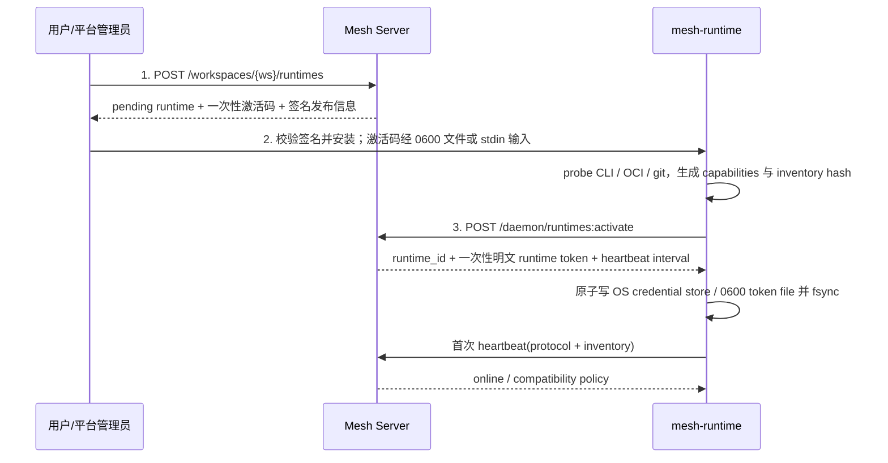
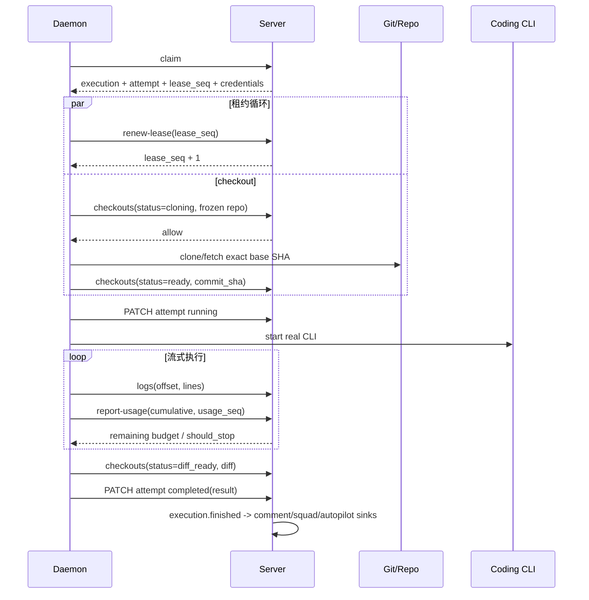

# Daemon 运行时执行体架构设计

> 状态：Draft，待安全评审
>
> 父任务：MES-91；本设计对应阶段 1 的 daemon 执行体与真实 LLM 全链路。
>
> 权威边界：服务端 execution / attempt 状态机、claim、租约、凭证、
> realtime 契约仍以 `README.md` §6 与 `features/runtime.md` 为准。本文件定义
> `mesh-runtime` 进程怎样消费这些契约、怎样调用本地 coding CLI，以及为形成
> 可运行闭环必须补齐的 Server 接口。

---

## 1. 目标、非目标与核心决策

### 1.1 目标

`mesh-runtime` 是运行在用户机器或平台托管节点上的 Python 3.12 常驻进程。
它必须完成以下闭环：

1. 探测本机可用 coding CLI，注册 runtime 并持续保活；
2. 按服务端容量与能力约束领取真实 `task_executions`；
3. 在任务级隔离环境中 checkout 指定仓库、启动真实 LLM coding CLI；
4. 续租、响应取消、限制资源和预算；
5. 将脱敏日志、会话 id、token/费用用量、diff 与最终结果可靠回流；
6. 进程崩溃或网络分区后不产生双写、僵尸进程和长期占用。

### 1.2 非目标

- 不在 daemon 内复制 Server 的调度、工作区鉴权或重试真源；
- 不让任务子进程持有 runtime token、成员 token 或 Server 数据库连接；
- 不直接从 daemon 写 issue 评论；评论必须由 Server 以内置 agent 身份落库；
- 不在本阶段实现新的模型供应商 API 客户端。模型调用由本地 coding CLI 完成；
- 不承诺所有操作系统都具备相同强度的沙箱。达不到隔离基线的节点不得领取
  不受信任任务。

### 1.3 核心决策

| 主题 | 决策 | 原因 |
| --- | --- | --- |
| 语言与并发 | Python 3.12 + `asyncio.TaskGroup` | 与 Server 技术栈一致；心跳、claim、续租、日志上传均为 I/O 密集 |
| 调度真源 | Server 的 runtime 行、execution、attempt 与 `lease_seq` | 本地状态仅用于恢复，不与 Server 争夺真源 |
| CLI 接入 | `ExecutorAdapter` 插件接口；首个实现为 Claude Code | CLI 版本、参数、事件解析与核心调度解耦 |
| 进程模型 | 单 daemon 控制面 + 每 attempt 一个 supervisor | 每个任务独立取消域；一个任务阻塞不影响心跳和其它任务 |
| 工具执行 | coding CLI 控制器与仓库工具沙箱分离，工具只经本地 broker | provider 凭证与仓库内不可信代码不处于同一安全域 |
| 隔离后端 | Linux rootless OCI 为生产基线；process 后端仅限显式开发模式 | 仅工作目录隔离不能约束进程、网络和凭证读取 |
| 日志 | daemon 本地先脱敏、有限落盘，再走现有日志 REST；Server 再脱敏 | 网络中断可续传，同时避免原始 secret 落盘 |
| 投递语义 | claim 最多一个持有者；上报 at-least-once + 幂等键/offset/usage seq | 与现有 Server 契约一致，不制造虚假 exactly-once |
| 预算 | Server 保存逻辑执行预算，daemon 本地即时熔断，CLI 原生费用上限兜底 | 同时覆盖多 attempt 总预算和单进程低延迟停止 |

---

## 2. 现有 Server 基线与缺口

### 2.1 可直接复用的实现

以下均已在 `backend/src/mesh/runtime/` 落地，daemon 不再定义第二套协议：

| 能力 | 当前接口 / 实现 | daemon 用法 |
| --- | --- | --- |
| 创建影子记录 | 控制台 `POST /api/v1/workspaces/{ws}/runtimes` | 安装前由用户或平台创建，获得一次性激活码和签名发布信息 |
| 激活 | `POST /api/v1/daemon/runtimes:activate` | 上报 hostname、OS、资源、CLI capabilities、daemon 版本，换取一次性明文 `mesh_rt_` token |
| 心跳与下行 | `POST /api/v1/daemon/runtimes/{id}:heartbeat` | 默认 15s；上报诊断负载，接收幂等 `cancel_execution` 指令 |
| 原子领取 | `POST /api/v1/daemon/runtimes/{id}/executions:claim` | Server 以 runtime 行的 workspace、labels、capabilities、容量做 `FOR UPDATE SKIP LOCKED` claim |
| attempt 状态 | `PATCH /api/v1/daemon/attempts/{id}` | 携带当前 `lease_seq` 上报 running / terminal |
| 租约 | `POST /api/v1/daemon/attempts/{id}:renew-lease` | 默认 120s 租约；每次成功续租返回递增后的 `lease_seq` |
| 日志 | `POST /api/v1/daemon/attempts/{id}/logs` | 按 attempt 全局 UTF-8 字节 offset 追加 stdout/stderr 行 |
| checkout 审批 | `POST /api/v1/daemon/attempts/{id}/checkouts` | clone 前先报 `cloning`；Server 校验冻结 repo 与 workspace allowlist |
| 凭证重取 | `POST /api/v1/daemon/attempts/{id}/credentials:refetch` | 仅在 claim 响应丢失时使用；旧 envelope 吊销，最多 3 次 |
| 高风险审批 | `POST /api/v1/daemon/executions/{id}/approvals` | 当前 attempt 终止并释放容量，批准后新 attempt 从 `resume_context` 续跑 |
| 失联回收 | `runtime/reaper.py` | lease 过期后旧 attempt 被 fencing，逻辑执行按 `max_attempts` requeue 或失败 |
| 日志展示 | `execution:{id}:logs` WS + `/logs/stream` SSE | daemon 只负责 REST 上传；Server 的 outbox/realtime projector 负责推送与重放 |
| squad 收口 | `squad/relay.py` 消费 `execution.finished` | execution 终态继续驱动 squad task，不由 daemon 调用 squad API |

claim 成功响应当前已包含 `task_spec`、`config_snapshot`、
`required_capabilities`、`label_requirements`、`timeout_seconds`、
`working_branch`、`lease_seq` 和一次性凭证 envelope。204 同时表示队列为空、
无能力匹配或容量已满；任一 204 都不会改变 `current_load`。

### 2.2 真实执行前必须收口的缺口

| 优先级 | 缺口 | 当前后果 | 本设计要求 |
| --- | --- | --- | --- |
| P0 | claim 只返回 `agent_config_version_id`，未返回不可变配置内容 | daemon 拿不到 system instructions、model 与完整 capability grants | claim 返回经过 Server 解析的 `agent_config` 快照及哈希 |
| P0 | 没有 attempt-scoped Mesh 业务身份 | sandbox 若拿成员 PAT 会越权，若只拿 runtime token 又无法安全写当前任务 | claim 签发仅由 Broker 持有的 action token，绑定 attempt + lease + 当前资源 |
| P0 | 普通 issue execution 完成后无通用结果评论 consumer | execution 可完成，但用户看不到 agent 最终答复 | 增加 `execution.finished` 的 agent result sink，幂等写评论 |
| P0 | 没有 usage 上报与逻辑执行预算字段 | 无法证明真实 token 消耗，也无法跨 attempt 熔断 | 增加预算列、attempt 累计用量列与 fenced usage API |
| P0 | mention enqueue 未走统一快照组装，`task_spec` 为空 | @agent 任务缺少评论上下文和 agent 配置 | assign / mention / autopilot 统一调用同一 snapshot builder |
| P0 | daemon 只能通过等待 lease 过期表达“可重试失败” | 容量释放慢，失败重试不可控 | 增加 fenced `:relinquish` 接口，Server 决定 requeue / max_retries |
| P0 | runtime token 同时关联 `api_tokens` 且写 `runtime_token_hash`，与 canonical Spec 不一致 | 双真源与机器身份 scope 不清晰 | 迁移到独立 `runtime_tokens`，见 §9 |
| P0 | checkout diff 直接写对象存储，未执行 workspace 全量 secret 扫描 | 未注入当前 attempt 的其它 workspace secret 仍可能被带出 | diff / result / artifact 在 Server 落盘前统一走全通道扫描 |
| P1 | Spec 已定义 `context_progress` / context-appends，路由与 schema 尚未实现 | `/btw` 等运行期追加无法进入 CLI 下一 turn | 补齐心跳字段、拉取端点和 receipt 水位 |
| P1 | approval 的 checkpoint 没有通用上传/下载通道 | 新 runtime 无法取得旧 attempt 的可移植恢复点 | 增加 attempt artifact API；resume 只引用脱敏 artifact |
| P1 | `draining` 状态存在但没有 daemon 自助排空入口 | 升级只能突然掉线或依赖控制台 | 增加 `runtimes/{id}:drain` / `:resume-claims` |
| P1 | 心跳不能更新 CLI inventory 与协议版本 | CLI 被升级或删除后，Server 仍按旧 capability 调度 | 心跳增加版本和 inventory hash；变化时完整重报 |

P0 是真实 LLM happy path 的开发前置条件；P1 中 context append 与 approval
checkpoint 可在首个 happy path 后完成，但在开放不受信任任务前必须完成。

---

## 3. 进程架构

```text
┌──────────────────────────── mesh-runtime ────────────────────────────┐
│  RuntimeApp                                                         │
│  ├─ TokenStore / Config / LocalLedger(SQLite)                       │
│  ├─ HeartbeatLoop ──────────────── POST heartbeat                   │
│  ├─ ClaimScheduler ─────────────── POST executions:claim            │
│  ├─ ExecutorInventory ──┬─ ClaudeCodeAdapter                        │
│  │                      └─ future adapters                          │
│  └─ AttemptSupervisor[0..N]                                         │
│      ├─ LeaseLoop ──────────────── POST renew-lease                 │
│      ├─ CheckoutManager ────────── POST checkouts                   │
│      ├─ LogSpool/Uploader ──────── POST logs                        │
│      ├─ UsageReporter ──────────── POST report-usage                │
│      ├─ Model controller process (有 provider 凭证，无仓库工具权限)  │
│      └─ ToolBroker (仅持有当前 attempt 的短期 action token)          │
│             │                                                       │
└─────────────┼───────────────────────────────────────────────────────┘
              │ attempt-scoped Unix socket / named pipe
┌─────────────▼────── rootless OCI task sandbox ──────────────────────┐
│ MCP tool worker: read/write/search/command/git                      │
│ /workspace = 当前 attempt worktree；/tmp 独立；无宿主 HOME          │
│ 默认无网络；按 task_spec 域名 allowlist 开放；cgroup 配额            │
└────────────────────────────────────────────────────────────────────┘
```

控制面和任务面必须是两个安全域：

- daemon 父进程持有 runtime token，但绝不把它放进子进程 env、argv、文件挂载或
  Unix socket payload；
- model controller 持有专用 coding CLI 认证，但没有直接 Bash / Read / Edit
  工具，也不挂载仓库；所有仓库操作经 ToolBroker；
- task sandbox 挂载仓库并执行工具，但看不到 runtime token 和 provider 凭证；
- ToolBroker 只持有当前 attempt 的短期 action token；从父进程注入 attempt id、
  workspace 与 lease，不接受 sandbox 自报这些身份字段，也不能 claim 或操作其它
  attempt。

### 3.1 建议代码布局

```text
daemon/
├── pyproject.toml
├── src/mesh_runtime/
│   ├── __main__.py
│   ├── app.py                 # 根 TaskGroup、信号与优雅停机
│   ├── config.py              # 配置加载、校验、secret-file 读取
│   ├── api.py                 # typed Server client、重试与错误分类
│   ├── inventory.py           # CLI/OCI/git 探测与健康状态
│   ├── scheduler.py           # claim、退避、本地并发槽
│   ├── attempt.py             # attempt supervisor、lease fencing
│   ├── ledger.py              # SQLite 恢复台账，不保存 secret
│   ├── checkout.py
│   ├── logs.py
│   ├── usage.py
│   ├── redaction.py
│   ├── executors/
│   │   ├── base.py
│   │   └── claude_code.py
│   ├── isolation/
│   │   ├── base.py
│   │   ├── oci.py
│   │   └── process_dev.py
│   └── broker/
│       ├── server.py
│       ├── policy.py
│       └── tools.py
└── tests/
    ├── unit/
    ├── integration/
    └── real_llm/
```

daemon 不导入 `backend/src/mesh` 的 ORM 或 service；双方只共享一个版本化的
Pydantic 协议包或生成客户端，避免本地进程意外获得 Server 内部能力。

---

## 4. 本地 CLI 探测与适配层

### 4.1 适配接口

```python
class ExecutorAdapter(Protocol):
    name: str

    async def probe(self, configured_path: Path | None) -> ExecutorProbe: ...
    def build_command(self, request: RunRequest) -> list[str]: ...
    def build_environment(self, request: RunRequest) -> dict[str, str]: ...
    async def parse_event(self, line: bytes) -> ExecutorEvent: ...
    async def request_stop(self, process: ProcessHandle) -> None: ...
    def classify_exit(self, returncode: int, last_event: ExecutorEvent | None) -> ExitResult: ...
```

适配层输出统一事件：

```text
SessionStarted(session_id, model)
TextDelta(text)
ToolRequested(name, input, call_id)
ToolCompleted(call_id, outcome)
UsageObserved(cumulative_input, cumulative_output, cache_read, cache_create, cost_microusd)
FinalResult(text, session_id, usage)
Retrying(category, delay_ms)
ProtocolWarning(raw_type)
```

核心调度只消费这些事件，不识别供应商 JSON 字段。

### 4.2 探测策略

启动时与每 5 分钟执行一次轻量探测；inventory hash 变化立即心跳重报：

1. 优先使用显式配置的绝对路径；
2. 否则只在 daemon 自身受控 `PATH` 中用 `shutil.which()` 查找；
3. 拒绝软链最终目标位于 world-writable 目录、非普通文件或 owner 异常的 binary；
4. 使用 argv 直接执行 `<binary> --version`，超时 5s，禁止 `shell=True`；
5. 首次启动额外解析 `<binary> --help` 的能力指纹；不依赖 help 是否列出全部参数，
   以 adapter 的版本矩阵为主；
6. probe 失败时将 runtime 标为 `degraded`，停止 claim，不自动下载安装或升级 CLI；
7. 未验证的新 major 版本默认不可用。可通过
   `allow_unverified_executor_version=true` 临时放开，但心跳必须带告警。

标准 capability key：

```json
[
  "coding_cli.claude_code",
  "tool.fs",
  "tool.command",
  "tool.git",
  "isolation.oci",
  "usage.cost"
]
```

所有需要真实 coding CLI 的入队路径必须声明 `coding_cli.claude_code`；Server
继续使用现有 JSONB `<@` 匹配，CLI 消失后的节点不会再领取新任务。

### 4.3 Claude Code adapter

首版以非交互流式模式运行，命令采用参数数组，不拼接 shell 字符串。必要参数：

```text
claude
  -p
  --bare
  --input-format stream-json
  --output-format stream-json
  --verbose
  --include-partial-messages
  --session-id <daemon 生成的 UUID>
  --max-turns <task budget>
  --max-budget-usd <本 attempt 剩余额度>
  --permission-mode dontAsk
  --tools ""
  --strict-mcp-config
  --mcp-config <attempt-scoped config>
```

约束：

- 禁止 `--dangerously-skip-permissions`；
- 只加载 daemon 生成的 attempt-scoped MCP 配置，不读取用户、项目或 local
  settings、hook、plugin、memory 或任意 MCP；
- system prompt、skill instructions 和不可信任务上下文经 stdin 发送，不出现在
  进程 argv；
- `system/init` 首帧的 session id、model、tools 与 MCP 列表必须校验；MCP 加载
  失败或出现未声明工具立即终止；
- 未知 JSON 事件只记结构化 warning；连续 20 个无法解析事件或最终 result 缺失，
  视为 `executor_protocol_error`，不得把原始整帧直接写日志；
- session transcript 使用 attempt 私有的 `CLAUDE_CONFIG_DIR`。终态后按保留策略
  删除；需要审批续跑时先生成脱敏、可移植 checkpoint，不能只保存本机路径。

将来新增 CLI 只需实现 adapter、版本矩阵、事件 parser 与真实 smoke test，不改
claim、lease、日志或隔离主流程。

---

## 5. 注册、保活与版本协商

### 5.1 三步注册



激活码和 runtime token 均不得出现在命令行参数。激活响应持久化失败时 daemon
退出并提示用户重新生成激活码，不把 token 打到 stderr。

### 5.2 心跳

- 以 Server 返回的 interval 为准，默认 15s，加入 ±10% jitter；
- 心跳 task 独立于 claim 和 attempt；任何任务 stdout 阻塞不得拖延心跳；
- `current_load` / `inflight` 仅诊断，本地值不得覆盖 Server 容量真源；
- 每条 `cancel_execution` 可重复出现，按 attempt id 幂等处理；
- 网络失败按 1s、2s、4s、8s、15s 退避，仍需在本地根据 lease deadline 保护
  在途任务；
- 401 表示 token 不可用，立即停止 claim 并进入 fatal；
- 403 `tls_required` 表示配置错误，不降级为明文；
- health 为 `degraded` 时 Server 停止分派；恢复前必须重新 probe 成功。

### 5.3 版本协商

心跳增加：

```json
{
  "daemon_version": "1.0.0",
  "protocol_version": "1.0",
  "inventory_hash": "sha256:...",
  "inventory": [
    {"name": "claude_code", "version": "2.x", "healthy": true}
  ]
}
```

响应增加：

```json
{
  "protocol_version": "1.0",
  "minimum_daemon_version": "1.0.0",
  "features": ["usage_v1", "result_sink_v1", "context_append_v1"],
  "claim_allowed": true
}
```

- protocol major 不一致：禁止 claim；
- Server minor 高于 daemon：只使用双方 features 交集；
- daemon 版本低于 minimum：继续心跳和取消在途任务，但禁止新 claim；
- 滚动升级先 `drain`，活动 attempt 清零后替换进程，再 `resume-claims`。

---

## 6. Claim、退避、并发与租约

### 6.1 Claim 调度

daemon 本地 `asyncio.Semaphore` 上限取：

```text
min(Server runtime.max_concurrent, daemon config.max_concurrent, isolation backend capacity)
```

Server 仍以锁定的 runtime 行做最终容量校验。本地调度流程：

1. inventory healthy、兼容性通过且未 draining；
2. `free_slots > 0` 时每个空槽最多发一个 claim 请求；
3. 200：把 attempt 与初始 `lease_seq=1` 原子写入本地 ledger，再启动 supervisor；
4. 204：不占槽，进入空队列退避；
5. 429：严格遵守 `Retry-After`；
6. 5xx / 网络错误：不猜测 claim 是否成功。重试 claim 前先等待短退避；Server 的
   原子 claim 和租约回收保证最终一致，但为减少“响应丢失后已 claim”窗口，P0
   应给 claim 增加 daemon 生成的 `claim_request_id` 幂等键。相同 id 重放时返回
   同一 execution/attempt；一次性凭证不重复回显，daemon 随后走 fenced
   credentials refetch；
7. 401 / 协议不兼容：停止所有新 claim。

退避：

| 场景 | 初始 | 上限 | 重置条件 |
| --- | --- | --- | --- |
| 204 空队列 / 不匹配 | 1s | 30s | 任一 claim 成功 |
| 网络 / 5xx | 1s | 60s | 任一 2xx |
| 429 | `Retry-After` | 120s | 下一次非 429 |

均使用 full jitter，避免大量 runtime 同步打点。

### 6.2 Attempt 时序



### 6.3 Lease 规则

- 默认 120s 租约每 40s 续一次，实际周期为 `min(lease_duration/3, 40s)`；
- `lease_seq` 存在一个 `AttemptContext` 中，更新与日志/usage/checkout 上报共享同一
  `asyncio.Lock`，禁止不同协程带旧值并发上报；
- 409 `lease_seq_mismatch` 或 `attempt_terminal`：立即关闭 broker、TERM/KILL
  controller 与 sandbox，停止所有上报；旧 holder 不尝试“修复”Server；
- 续租连续失败且距 deadline 小于 20s：主动杀子进程，保留已脱敏 spool，等待
  Server reaper 回收；
- Server cancel 将 execution/attempt 置 `cancelling` 后，后续日志仍可上报，最终
  必须 PATCH `cancelled`；
- daemon 不直接把 attempt 标记 `reclaimed`，该状态只由 Server reaper 写入。

### 6.4 重试归属

- HTTP GET/heartbeat/renew/logs/usage 等幂等操作由 daemon 重试；
- CLI 或隔离后端的暂态启动失败通过新 `:relinquish` 上报；
- Server 在同一事务内结束当前 attempt、释放容量，并按 `max_attempts` 决定
  execution 回 `queued` 或 `failed(max_retries)`；
- 非零退出、沙箱违规、预算耗尽默认不自动重试；只有 task 的冻结 retry policy
  明确允许时，Server 才 requeue；
- daemon 不在本地创建 attempt #N+1，也不复用旧 worktree 分支。

---

## 7. 执行隔离、checkout 与生命周期

### 7.1 目录

```text
<state_dir>/
├── ledger.sqlite3                      # 0600；无 token/credential 明文
├── spool/<attempt_id>/                 # 0700；仅脱敏日志与待上传元数据
└── work/<workspace_id>/<execution_id>/a<attempt_number>/
    ├── repo/
    ├── tmp/
    ├── cli-state/
    └── artifacts/
```

- 所有 path 由 UUID 和 attempt number 派生，不接受 task_spec 自定义宿主路径；
- 创建后用 `resolve()` 校验仍位于 `state_dir`，拒绝 symlink 穿越；
- 每个新 attempt 使用新目录和 Server 给出的
  `agent/<execution_id>/a<attempt_number>` 分支；
- cleanup 只操作已校验的 attempt 目录；成功默认保留 1h，失败保留 24h，security
  freeze 保留到人工解冻；磁盘水位超过 80% 时停止 claim，先清理已终态目录。

凭证只放在独立 tmpfs `/run/mesh-secrets/<attempt_id>`，不得进入上述持久目录。每个
terminal cleanup 按固定 manifest 执行并审计：停止整个 cgroup → 关闭并删除 broker
socket → 吊销 action token/envelope → 卸载 secret tmpfs → 删除 MCP config、CLI
临时状态与 askpass → 截断已确认 spool → 删除或按 retention 隔离 worktree。security
freeze 的例外只保留已脱敏现场，同时撤销凭证、关闭出站并将文件系统转只读。

### 7.2 Checkout

1. 从 `config_snapshot.repo` 读取 URL、base ref、base SHA；任务 prompt 中的 URL
   永远不是 checkout 输入；
2. clone 前先调用现有 checkouts API 的 `status=cloning`。只有 Server 200 才发起
   网络连接；
3. 只接受 allowlist 中的 `https` / `ssh` URL；platform-managed 继续执行现有
   SSRF 防护，并在网络层阻断私网、link-local 与元数据地址；
4. repo credential 只交给 daemon 的 checkout helper，不进入 model controller
   或 sandbox 通用 env；优先使用内存 credential helper / pipe；
5. fetch 后校验实际 SHA 等于冻结 `base_sha`，再创建 attempt 分支；
6. 结束时生成受限大小 diff；Server 通过现有 checkouts API 写对象存储引用；
7. 禁止自动 push。push 必须由冻结 capability grant 与审批策略显式允许。

### 7.3 OCI 沙箱基线

- rootless user namespace，容器内 uid/gid 不映射宿主 root；
- 只读 rootfs；只把当前 attempt `repo/`、`tmp/` 挂入；
- 禁止 privileged、host PID/IPC/network、Docker socket 与宿主 HOME；
- `no-new-privileges`、capabilities drop all、seccomp 与只读 `/proc`；
- cgroup v2 限制 CPU、memory、pids；临时与工作目录设磁盘 quota；
- 默认无出站网络。sandbox 无原始网卡，只能访问 daemon 外部的 attempt-scoped
  egress proxy；
- 任务默认不能访问 Server machine API；ToolBroker 是唯一受控通道；
- process backend 只在 `development=true` 且 workspace 标记为 trusted 时可用，
  心跳 capability 必须是 `isolation.process_dev`，不能伪装为 OCI。

egress proxy 对每次新连接执行完整链路：

```text
规范化 allowlisted hostname
  → 可信递归解析器解析全部 CNAME/A/AAAA
  → 拒绝 RFC1918/loopback/link-local/ULA/metadata/reserved/multicast
  → 解包 IPv4-mapped IPv6 后再次过滤
  → 将本次连接钉死到已验证 IP（Host/SNI 仍为原 hostname）
  → 代理建连，sandbox 不接触 DNS 与目标 IP 选择
```

HTTP 3xx 的每一跳都重新走 allowlist、解析、IP 过滤和钉死流程；DNS TTL 到期后新连接
重新解析，现有连接不因二次解析切换目的 IP。代理拒绝直连 IP、非声明端口和未校验
CONNECT。安全门禁必须覆盖 CNAME 链、DNS rebinding、IPv4-mapped IPv6、
`169.254.169.254` 与重定向到私网。

### 7.4 子进程停止

| 原因 | 动作 |
| --- | --- |
| 用户取消 | 关闭新工具调用 → controller SIGTERM → 宽限 15s → cgroup SIGKILL → PATCH cancelled |
| task timeout | 同上，最终 PATCH timeout / `failure_reason=timeout` |
| budget exceeded | 停止 stdin → SIGTERM/KILL → PATCH failed / `budget_exceeded` |
| OOM | cgroup 事件确认后 PATCH failed / `oom` |
| policy violation | 立即 kill，PATCH failed / `sandbox_violation`，触发安全告警 |
| lease 丢失 | 立即 kill，不再写终态，等待 Server 真源决定 |
| daemon SIGTERM | 先 drain；在 `shutdown_grace` 内完成，剩余 attempt 调 `:relinquish` |

kill 必须作用于整个 cgroup / Job Object，而不是只杀 CLI pid，防止孙进程逃逸。

### 7.5 daemon 崩溃恢复

ledger 每次以事务记录 attempt id、execution id、lease seq、cgroup id、工作目录和已
确认日志/usage 水位。重启时：

1. 先停止 ledger 中残留的 cgroup/进程；
2. 不自动 attach 或 resume 旧 CLI；
3. 若租约仍有效且 Server 接受，调用 `:relinquish(reason=daemon_restart)`；
4. 若无法确认 lease，则不写 Server 状态，等待 reaper；
5. spool 与 worktree 移入 quarantine，直到 execution 已被新 attempt 领取或超过
   retention 才清理。

---

## 8. Prompt、工具权限、输出与实时回流

### 8.1 Prompt 分层

claim 的执行输入必须由 Server 预先冻结，daemon 只按层装配：

1. **可信系统层**：不可变 agent config 的 system instructions、model config；
2. **可信工作流层**：匹配到的 skill instructions 与 Mesh 输出契约；
3. **授权层**：严格 `[{capability, permission}]` grants；
4. **不可信数据层**：issue 标题/描述、评论、附件提取文本、外部消息，保留现有
   `UNTRUSTED_DATA` 边界；
5. **恢复层**：经 Server 签名引用的 resume checkpoint。

不可信数据永不拼进系统指令，也不能修改 CLI flags、MCP config、env、repo URL、
预算或工具 allowlist。squad 成员 result、leader 汇总输入和 agent 间追加消息同样
属于不可信数据；每次跨 agent 传递都重新包入 `UNTRUSTED_DATA`，不得因为作者是
agent 而提升为可信工作流层。

### 8.2 ToolBroker

MCP bridge 只暴露 capability grants 允许的工具：

- `read_only`：只读工具；
- `write`：限定当前 worktree 的写与命令；
- `confirm_required`：执行前把规范化 action 送 daemon，daemon 调 Server approval
  API；当前 attempt 按 canonical 协议结束，批准后由新 attempt 恢复。

Broker 每个请求校验 attempt-scoped nonce、工具名、参数 schema、路径和命令 policy。
nonce 只允许当前 attempt，不能调用 claim、heartbeat、credential refetch 或其它
attempt。所有工具结果在返回模型前执行大小限制与 secret 扫描。

动作到闸门的唯一映射：

| 动作 | 最低 grant | Broker 行为 |
| --- | --- | --- |
| 当前 worktree 读、搜索、`git diff/status/log` | `read_only` | 只读执行；路径越界直接拒绝 |
| 当前 worktree 写、格式化、测试、无网络构建 | `write` | 命令 AST/policy 校验后在 sandbox 执行 |
| `git clone/fetch` 冻结 repo | `read_only` | daemon checkout helper 执行；只发短期只读凭证 |
| `git commit` 当前 attempt 分支 | `write` | 仅允许 Server 冻结的 author/policy |
| `git push`、发布、外部上传/POST、删除远端资源 | `confirm_required` | 未取得人类 approval 绝不执行；批准后的新 attempt 才获得一次性写凭证 |
| 当前 issue 评论/状态、当前 squad task 操作 | `write` + 对应 task scope | Broker 使用短期 action token 调 Server |
| 跨 issue 批量写、agent trigger、工作区管理、credential 明文读取 | 不暴露 | 无 grant 可开启，始终拒绝 |

model controller 以 `--tools ""` 禁用内置 Bash/Read/Edit/Web，再用
`--strict-mcp-config` 只装载 Broker，因此不存在绕过 Broker 的第二条执行路径；
设计明确禁止 `bypassPermissions`。git 只读与写凭证分开颁发，写凭证只在
`confirm_required` 批准后的新 attempt 中短时存在。

### 8.3 日志

daemon 将 CLI stdout 的 JSON 事件解析为用户可读日志；stderr 只保留安全的诊断。
禁止把完整 provider 请求、thinking、credential、env dump 或原始未知 JSON 帧上报。

上传协议严格使用现有实现：

```json
{
  "lease_seq": 7,
  "stream": "stdout",
  "start_offset": 8192,
  "lines": ["checkout complete", "running tests"]
}
```

- stdout/stderr 进入一个中央有序队列，共享 attempt 全局 byte offset；
- 每 250ms、100 行或 64KiB（任一先到）形成一批；
- daemon 用当前 attempt 已注入的 credential 与 provider/runtime 固定敏感模式先
  脱敏，只将脱敏内容写 0600 spool；
- Server 再次脱敏，并返回 `accepted_end_offset`；只有收到该值才推进本地水位；
- 409 `offset_mismatch` 使用 Server 返回的 expected 对账：已确认段丢弃，未确认段按
  原批次重发；
- spool 默认上限 64MiB/attempt。达到 75% 暂停 CLI stdout 读取形成背压；上限仍
  无法下降则终止 attempt，不能无限吃磁盘；
- Server 经 outbox projector 将每行投影为
  `execution:{execution_id}:logs` / `execution.log`，在线客户端走 WS，断线或无 WS
  走现有 SSE/REST offset 续传。daemon 不直接写 realtime。

### 8.4 最终结果

daemon 终态上报：

```json
{
  "lease_seq": 12,
  "status": "completed",
  "result": {
    "schema_version": 1,
    "executor": {"name": "claude_code", "version": "2.x"},
    "session_id": "uuid",
    "summary_markdown": "完成内容与验证结果",
    "usage": {
      "input_tokens": 12000,
      "output_tokens": 1800,
      "cache_read_input_tokens": 30000,
      "cache_creation_input_tokens": 2000,
      "cost_microusd": 42000
    },
    "checkout": {
      "working_branch": "agent/<execution>/a1",
      "base_sha": "sha",
      "head_sha": "sha"
    }
  }
}
```

Server 对 `summary_markdown` 做 64KiB 上限与全通道 secret 扫描。随后
`execution.finished` 的 result sink：

- issue assignment：以 agent roster member 为作者发布结果评论；
- mention：回复 `trigger_comment_id` 所在线程；
- squad：继续由现有 squad relay 映射并汇总；
- autopilot：写回对应 run/action result；
- 每个 sink 使用 `execution:{id}:result:<sink>` 幂等键；
- 默认 `suppress_triggers=true`，避免 agent 输出中的无意 mention 形成回环；
- sink 失败不回滚 execution 终态，由 outbox 重试并在超限后告警。

diff、result 与 checkpoint artifact 必须在 Server 写对象存储或评论前使用 workspace
全量 redaction blacklist 扫描；命中时拒绝发布、保留安全审计并触发 security freeze。

---

## 9. 凭证、环境变量与 token 安全

### 9.1 Runtime token

新增独立表 `runtime_tokens`，替代机器 token 对 `api_tokens` 的复用：

| 字段 | 说明 |
| --- | --- |
| `id, workspace_id, runtime_id` | 复合 FK 保证同租户 |
| `token_hash, prefix` | SHA-256 唯一哈希与展示前缀；不存明文 |
| `scopes` | `heartbeat`、`claim`、`attempt:report`、`credential:fetch`、`approval:request` |
| `expires_at, grace_until` | 正常过期与轮换重叠窗口 |
| `rotated_from_id` | 轮换审计链 |
| `last_used_at, revoked_at` | 使用与吊销审计 |

规则：

- 激活只颁发本 runtime 的机器 scope，不具备用户、评论、issue 更新能力；
- 每条 machine route 同时校验 token scope、runtime id、workspace、status；
- daemon token 仅在父进程 TokenStore 中存在。Linux 优先 systemd credential；
  fallback 启动时用 `lstat/open(O_NOFOLLOW)` 验证非 symlink、owner 等于 daemon
  uid、文件权限恰为 0600 且父目录不宽于 0700；任一不符 fail closed；
- `POST /daemon/runtimes/{id}/tokens:rotate` 用当前 token 换新 token；旧 token 仅保留
  10 分钟 grace。daemon 原子持久化并用新 token 完成一次 heartbeat 后，Server
  可提前吊销旧 token；
- 控制台手工 revoke、pause、decommission 与 security freeze 立即吊销该 runtime
  的全部 token；
- token 绝不进入日志、异常 repr、metrics label、子进程 env、SQLite 或 core dump；
- Server 对 token 只做常量时间哈希比较，未知 / 已吊销 / 跨 runtime 统一返回 401。

### 9.2 Attempt action token

需要调用 Mesh 业务工具时，claim 额外签发短期 action token。它与 runtime token
分型、分表、分 scope：

```text
workspace_id + agent_member_id + execution_id + attempt_id + lease_seq
scopes = context:read, current_issue:comment, current_issue:status,
         current_squad_task:write
```

- 默认没有 `agent:trigger`、跨 issue、成员、runtime、credential 或管理 scope；
- TTL 为 `min(当前 lease 剩余时间, 5min)`；每次续租后由 daemon 父进程向 Server
  换取新 token，旧 token grace 不超过 30s；
- token 只进入 daemon-side ToolBroker 的内存，不进入 sandbox/model controller
  env、文件、stdin、MCP 参数或工具结果；
- Server 每次校验 token 中的 attempt 与数据库当前 holder/`lease_seq`，并按
  token 60 requests/min、写操作 10 requests/min 限流；
- attempt terminal、reclaimed、freeze 或 lease mismatch 时 Server 立即吊销；
- Broker 返回经过 schema/大小/secret 扫描的业务结果，不回显 token；
- 当前 issue 最终结果仍可由 §8.4 result sink 幂等兜底，避免 CLI 在完成后必须再
  持有业务 token 才能交付结果。

Server 新增 `execution_action_tokens`（只存 hash、scope、绑定字段、expires/revoked）
或等价的短期签名凭证吊销台账；不得把成员 PAT/agent PAT 交给 daemon 或任务。

### 9.3 子进程 env

env 从空字典开始构造，不继承 daemon 的 `os.environ`。固定允许：

```text
LANG, LC_ALL, TZ
HOME=<attempt cli-state>
TMPDIR=<attempt tmp>
PATH=<受控 tool image path>
MESH_ATTEMPT_ID=<非 secret>
```

Server 已拒绝 `LD_*`、`DYLD_*`、`PYTHON*`、`PATH`、`NODE_OPTIONS`、
`MESH_DAEMON_*`、`MESH_INTERNAL_*` 等注入名；daemon 必须重复校验。task credential
只能交给对应 helper/broker，不默认放入 model controller env。任何必须作为 env
使用的短期 credential：

- 名称同时通过 Server 与 daemon allowlist；
- value 只在目标进程 exec 前的内存中存在；
- 不写 settings、shell rc、git remote 或命令行；
- 终态 / freeze / refetch 时立即吊销并从内存覆盖删除；
- 加入本地和 Server 两层 redaction blacklist。

ToolBroker socket 位于 daemon 私有 0700 目录、mode 0600；连接时校验
`SO_PEERCRED`/平台等价机制的 uid 与 attempt cgroup 身份。socket 名称、fd 和 nonce
不得跨 attempt 复用。

### 9.4 Provider 凭证

provider 凭证属于 model controller 安全域，不进入 repo sandbox。每个 runtime 使用
专用最小权限账号/凭证，不复用个人日常 HOME。若目标 CLI 无法在“controller 无内置
工具、repo 工具只走 broker”的模式下工作，该 CLI 只能在 trusted-local profile
启用，不能宣称满足 production isolation。

controller profile 从专用 credential store 复制到不向 sandbox 挂载的私有 tmpfs；
禁用 provider telemetry 与自动更新，终态卸载 tmpfs。adapter probe 若不能确认钉住
版本支持所需禁用项，production profile fail closed。

### 9.5 Approval checkpoint

checkpoint 只包含：

- 已完成步骤的结构化水位；
- 已脱敏 diff / patch artifact ref；
- 待审批 tool 名、规范化参数与摘要；
- session id（审计用途，不作为跨机器恢复的唯一依据）。

禁止上传 provider 认证、完整 HOME、未脱敏 transcript 或 runtime token。新 attempt
先重新 checkout 冻结 base SHA，再应用签名 artifact，最后将 resume context 作为
可信恢复层开始新 session。

---

## 10. Token 用量与预算护栏

### 10.1 Server 数据模型

`task_executions` 新增逻辑执行总预算与累计量：

```text
input_token_limit BIGINT NULL
output_token_limit BIGINT NULL
cost_limit_microusd BIGINT NULL
usage_input_tokens BIGINT NOT NULL DEFAULT 0
usage_output_tokens BIGINT NOT NULL DEFAULT 0
usage_cache_read_input_tokens BIGINT NOT NULL DEFAULT 0
usage_cache_creation_input_tokens BIGINT NOT NULL DEFAULT 0
usage_cost_microusd BIGINT NOT NULL DEFAULT 0
```

`execution_attempts` 新增：

```text
executor_name TEXT NULL
executor_version TEXT NULL
session_id TEXT NULL
usage_seq BIGINT NOT NULL DEFAULT 0
usage_* BIGINT NOT NULL DEFAULT 0
```

预算在 enqueue 时冻结；null 表示该维度不限制，但 workspace 必须有管理员级总预算。
金额使用整数微美元，禁止 float。

### 10.2 Usage API

```text
POST /api/v1/daemon/attempts/{id}:report-usage
```

请求：

```json
{
  "lease_seq": 7,
  "usage_seq": 4,
  "executor": {"name": "claude_code", "version": "2.x"},
  "session_id": "uuid",
  "cumulative": {
    "input_tokens": 12000,
    "output_tokens": 1800,
    "cache_read_input_tokens": 30000,
    "cache_creation_input_tokens": 2000,
    "cost_microusd": 42000
  }
}
```

Server 锁 execution 后再锁 attempt，校验 workspace/runtime/lease：

1. `(attempt_id, usage_seq)` 幂等；旧 seq 返回当前结果；
2. attempt 累计值只能单调增加；
3. 以新旧 delta 原子增加 execution 总量，跨 attempt 不重置；
4. 返回各维度 remaining；
5. 任一限制达到阈值时，同事务把 execution/attempt 转 `cancelling` 并返回
   `should_stop=true`；daemon 执行两段式停止；
6. terminal PATCH 的 result usage 必须与 Server 已累计值一致，Server 值为真源。

### 10.3 本地熔断

- adapter 从每个可观察的 API/assistant result 累加 usage；
- 每次模型调用完成立即 report，不等待 attempt 终态；
- Claude Code 使用 `--max-budget-usd` 执行 provider 侧费用硬上限；
- daemon 在剩余 token/费用低于 5% 时不再开始新 turn；
- token 只能在一次在途模型请求结束后观察，因此 token 上限允许最多一个模型调用的
  有界超调；入队时预留一个 `per_call_reserve`，避免达到 Server 上限才停止；
- usage 解析失败时不能当作 0 继续无限运行：停止新 turn，重试解析/上报；超过 30s
  仍不可确认则失败 `usage_unavailable`；
- workspace 月预算由 Server claim 前再次校验，防多 runtime 并发各自只看本地值。

---

## 11. 运行期上下文、审批与取消

### 11.1 Context append

按 `features/runtime.md` 已定义但尚未落地的协议实现：

1. 心跳带每个在途 attempt 的 `context_progress` 与最新 `lease_seq`；
2. Server 只在 runtime、attempt、lease 均匹配时推进 receipt；
3. 有新追加时下发 `inject_context`；
4. daemon 拉取
   `GET /daemon/executions/{id}/context-appends?since_seq=N`；
5. 内容作为不可信 user message 写入 CLI stream-json stdin；
6. coding CLI 当前 turn 不可打断，消息进入下一 turn；
7. 注入后心跳回报水位。语义为 at-least-once，模型提示必须容忍重复。

### 11.2 Approval

`confirm_required` 工具调用发生时：

1. Broker 不执行工具；
2. daemon 生成脱敏 checkpoint，上传 artifact；
3. 调现有 approvals API，`resume_context` 只含 artifact ref、水位、pending action；
4. Server 原子把当前 attempt 置
   `cancelled(awaiting_approval)`、释放租约和容量；
5. daemon 结束 controller/sandbox，保留受控 artifact；
6. 批准后 execution 回 queued，新 attempt claim；
7. 新 attempt 校验/下载 artifact，从审批点恢复；拒绝/过期不恢复。

### 11.3 Cancel

心跳的 `cancel_execution` 是至少一次指令。daemon 使用本地 attempt 状态 CAS，重复
指令只触发一次 TERM/KILL。若取消与自然完成竞争，以 Server 已锁定状态为准：

- PATCH completed 命中已 cancelling 时应返回状态冲突；
- daemon 随即停止并 PATCH cancelled；
- 若 terminal 已提交成功，后续 cancel 是 Server 的幂等 no-op。

---

## 12. 部署、配置与可观测性

### 12.1 发布形态

| 场景 | 形态 | 隔离 |
| --- | --- | --- |
| Linux 自托管 | 签名 tar 包 + systemd service，专用 `mesh-runtime` 用户 | rootless OCI + cgroup v2 |
| 平台托管 | 每 runtime 一组受管 daemon pod/VM，Server 仅提供协议 | 独立 node sandbox / rootless OCI |
| macOS 开发 | 签名包 + launchd，外接 OCI backend | 仅在 OCI 可用时领取不可信任务 |
| Windows 开发 | WSL2 / service wrapper | WSL2 内 OCI；原生 process 仅 trusted-local |
| 容器化自托管 | daemon 容器 + rootless worker runtime | 禁止挂 Docker root socket；使用受限 worker service |

Python 代码通过可复现 lockfile 构建为版本化独立 artifact；发布清单携带 SHA-256、
签名、SBOM、protocol major 和支持的 CLI 版本矩阵。daemon 不自更新；升级由管理员
或平台在 draining 后完成。

供应链 CI 必须：

- 依赖精确钉住并校验 hash，禁止未审查的动态安装；
- 运行 `pip-audit` 与依赖许可证/SBOM 扫描，已知 CRITICAL/HIGH 漏洞阻断合入；
- 对可复现构建产物重新计算 hash、验证签名，并用篡改 artifact 负向测试证明拒装；
- provider CLI 只允许版本矩阵中的签名安装，不从 daemon 自动更新；
- real_llm workflow 只允许 `workflow_dispatch` / 受保护定时任务，在需环境审批的
  专用 runner 上运行；不得由 `pull_request` 或 fork 事件取得 secret。

### 12.2 配置项

| 配置 | 默认 | 说明 |
| --- | --- | --- |
| `server_url` | 必填 | 仅 HTTPS；生产禁止跳过证书校验 |
| `activation_file` | 空 | 仅首次激活读取，成功后不保留 |
| `runtime_token_file` | OS credential | fallback 0600 文件 |
| `state_dir` / `work_root` | 平台目录 | 必须本地文件系统、不可 world-writable |
| `executor_preference` | `claude_code` | adapter 选择顺序 |
| `claude_binary` | 自动探测 | 可设绝对路径 |
| `isolation_backend` | `oci` | `process_dev` 需显式 trusted |
| `worker_image` | 固定 digest | 禁止 mutable tag |
| `max_concurrent` | Server 值 | 本地只能下调，不能突破 Server |
| `claim_backoff_max` | 30s | 空队列退避 |
| `shutdown_grace` | 60s | drain 后等待时间 |
| `log_spool_limit` | 64MiB/attempt | 只存脱敏日志 |
| `cpu_limit` / `memory_limit` / `pids_limit` | workspace policy | task 只能下调 |
| `allow_unverified_executor_version` | false | 应急开关，必须出告警 |

secret 配置只支持 `*_file` / OS credential 引用，不允许把 token 放入普通 YAML。

### 12.3 指标与健康

低基数指标：

```text
mesh_runtime_heartbeat_success
mesh_runtime_claim_total{result}
mesh_runtime_active_attempts
mesh_runtime_claim_backoff_seconds
mesh_runtime_lease_remaining_seconds
mesh_runtime_log_spool_bytes
mesh_runtime_log_upload_lag_seconds
mesh_runtime_attempt_duration_seconds{terminal}
mesh_runtime_usage_tokens{kind}
mesh_runtime_usage_cost_microusd
mesh_runtime_executor_probe_success{executor}
mesh_runtime_sandbox_violations_total{kind}
```

禁止把 workspace id、execution id、session id、repo URL 或 token prefix 放入 metric
label。它们进入结构化审计字段并受访问控制。

health：

- healthy：Server 可达、CLI/OCI probe 通过、磁盘低于 80%；
- degraded：CLI/OCI 不可用、协议需升级、磁盘高水位或日志持续积压；停止 claim；
- fatal：token 失效、TLS 配置错误、state dir 权限不安全；退出并由 service manager
  告警，禁止高速重启。

---

## 13. Server 变更清单

### 13.1 P0 接口

| 变更 | 请求 / 响应关键点 | 幂等 / fencing |
| --- | --- | --- |
| 扩展 activate / heartbeat | protocol、daemon version、inventory、features | inventory hash 去重 |
| 扩展 claim | resolved `agent_config`、prompt layers、budget remaining、output sink、claim request id、短期 action token | `claim_request_id` 每 runtime 唯一；action token 绑定 attempt + lease |
| `POST attempts/{id}:report-usage` | §10.2 cumulative schema | `lease_seq` + `usage_seq` |
| `POST attempts/{id}:relinquish` | `{lease_seq, reason}` | terminal/requeue 单事务，重复 no-op |
| runtime token rotate | 新 token 一次性返回，旧 token grace | token family + confirm heartbeat |
| agent result sink | 消费 `execution.finished` 并写 comment/action result | execution + sink 幂等键 |

### 13.2 P1 接口

| 变更 | 说明 |
| --- | --- |
| context-appends GET + heartbeat progress | 落实现有 runtime Spec 契约 |
| attempt artifacts create/upload/complete/download | checkpoint、测试报告等；签名 URL + 全通道扫描 |
| `runtimes/{id}:drain` / `:resume-claims` | daemon 升级与优雅停机 |
| Server capability policy | enqueue 自动加入 coding CLI 与 isolation capability |

### 13.3 模型与词汇

新增/调整：

- `runtime_tokens`；
- `execution_action_tokens`（或等价的可吊销短期签名凭证台账）；
- task/execution usage 与 budget 字段；
- attempt executor/session/usage 字段；
- attempt `claim_request_id` 与 `UNIQUE(runtime_id, claim_request_id)`；
- failure reasons：
  `executor_unavailable`、`executor_protocol_error`、`daemon_restart`、
  `budget_exceeded`、`usage_unavailable`、`log_backpressure`；
- `execution.progress` 可承载不含 secret 的阶段：
  `preparing`、`checkout`、`running`、`uploading_result`；
- 所有事件名先登记 `events/vocab.py`，仍只经 outbox/realtime projector。

### 13.4 必须修正的现有漂移

1. `features/runtime.md` 与 README 声明 machine token 不进 `api_tokens`，当前
   `runtime/service.py` 实际同时写 `api_tokens` 与 `runtime_token_hash`；
2. runtime Spec 的 heartbeat `context_progress` 与 context-appends 尚未出现在
   `schemas.py` / `daemon_routes.py`；
3. claim 的 frozen config 只有版本 id，没有可执行配置内容；
4. mention producer 没有与 assign producer 共用 snapshot / task_spec；
5. `execution.finished` 目前只注册 squad consumer，普通 issue 缺结果 sink。

token 迁移顺序固定为：创建 `runtime_tokens` → 从现有 runtime hash 回填一条 active
记录 → 部署只读新表且停止创建新 `api_tokens` 行 → 验证 activate/rotate/pause/
decommission 与旧 token 401 负向 → 吊销并清理历史 runtime `api_tokens` 关联 →
最后删除 `runtime_token_id` 与旧 hash 列。迁移期间允许双读但禁止双写，且必须有
回滚窗口，不能直接删列破坏在线 runtime。

开发阶段必须用迁移、代码与 Spec 一起收口，不能只在 daemon 中绕过。

---

## 14. 分阶段实现建议

### A. Daemon 执行体

#### A1：冻结 Server P0 协议

- 统一三类 enqueue snapshot；
- claim hydration、result sink、usage/budget、relinquish；
- `runtime_tokens` 单一真源与机器 scope；
- OpenAPI / Pydantic 契约测试。

完成门槛：仅用 fake executor 也能证明 claim → usage → terminal → issue 结果评论
的 Server 状态闭环，且无成员 token 下发。

#### A2：daemon 骨架与可靠调度

- Python package、配置、TokenStore、typed API client；
- CLI/OCI inventory；
- heartbeat、claim backoff、semaphore、lease、cancel、ledger/recovery；
- 单元测试使用 fake clock，不依赖真实等待。

#### A3：隔离与工具 broker

- rootless OCI backend、cgroup lifecycle、network deny；
- checkout 预授权、repo credential helper；
- attempt-scoped MCP ToolBroker 与 capability policy；
- env allowlist、双层 redaction、spool backpressure。

#### A4：Claude Code adapter

- 非交互 stream-json、session/usage parser、stdin prompt layers；
- CLI 原生 budget flag、turn limit、unknown-event compatibility；
- output/result mapping、context append；
- adapter contract tests + 固定 JSONL fixtures。

#### A5：恢复、审批与部署

- artifact checkpoint 与 approval resume；
- drain、token rotation、签名 artifact、systemd/容器清单；
- 故障注入：daemon kill、网络分区、lease mismatch、日志响应丢失、磁盘满。

### B. 真实 LLM 全链路 E2E

真实 E2E 必须启动 PostgreSQL、Redis、对象存储、Server worker、realtime gateway 与
独立 daemon 进程，并使用已认证的真实 Claude Code；禁止替换成固定输出进程。
workflow 使用受保护 environment、专用 runner 与 `concurrency=1`，费用上限必填；
外部 PR/fork 不触发、不获得 secret。workspace/runtime/execution 全部经真实 API
创建，禁止用 psql/ORM 直插播种来绕过注册、claim 或鉴权。

#### B1：最小 happy path

1. 创建 workspace、agent、project、allowlisted repo 与 runtime；
2. 完成三步激活，确认 CLI capability；
3. 分派 issue；
4. daemon 真 claim、checkout、运行 coding CLI 并产生代码 diff；
5. 断言日志可从 WS/SSE 看到；
6. 断言 `session_id` 非空、input/output token 或 cost 大于 0；
7. 断言 execution/attempt completed、usage 聚合正确；
8. 断言 Server 以 agent 身份发布且仅发布一条结果评论。

测试必须显式设置极小费用上限、专用测试 repo 与清理策略；无真实凭证时标记 skip，
不能用 fake 通过“真 LLM”门禁。

#### B2：可靠性

- 运行中重启 daemon：旧 cgroup 被杀，Server requeue，新 attempt #N+1 完成；
- 日志上传响应丢失：offset 对账后不丢不重；
- cancel：15s 内收到并停止，无残留子进程；
- timeout / OOM / nonzero exit：状态与 failure reason 正确；
- budget：达到费用或 token 护栏后停止，跨 attempt 不重置；
- 两个 runtime 并发抢一个 execution：仅一个真实 CLI 被启动。

#### B3：安全

- sandbox 读取 daemon/provider token 失败；
- `max_concurrent>1` 时 attempt A 无法读取 attempt B 的目录、`/proc`、env、
  broker socket/nonce/action token，A/B 均无法读取 daemon 进程内存与控制 socket；
- env dump、异常栈、日志、评论、diff 中无 secret；
- repo URL 越过 frozen allowlist 被 clone 前拒绝；
- 私网 / link-local / metadata、CNAME rebinding、IPv4-mapped IPv6、重定向到私网
  均在 egress proxy 建连前失败；
- 恶意 repo 内 `.mcp.json`、`.claude/settings.json`、hooks 与项目指令不被加载，
  不能增加工具或绕过 Broker；
- `confirm_required` 的 push/发布/外部写在 approval 前没有网络请求、凭证签发或
  文件外副作用；批准后由新 attempt 从 checkpoint 恢复；
- 旧 lease holder 的日志、usage、结果均 409；

---

## 15. MES-93 安全必修收口映射

| 项 | 收口位置与可验证结论 |
| --- | --- |
| S-01 | §4.3：`--bare` + `--tools ""` + `--strict-mcp-config`，不加载 repo settings/hooks/MCP/memory；B3 恶意 repo 负向 |
| S-02 | §8.2：动作→grant→闸门唯一表；明确禁 `bypassPermissions`，写凭证只在批准后的新 attempt 颁发 |
| S-03 | §7.3 与 B3：`max_concurrent>1` 下 A→B、sandbox→daemon 的目录/进程/env/socket/token 负向矩阵 |
| S-04 | §7.3：attempt-scoped egress proxy 执行可信解析→全 IP 过滤→钉死建连，重定向逐跳复验；B3 覆盖 rebinding |
| S-05 | §9.2：action token 绑定 workspace/member/execution/attempt/lease，TTL、续期、限流、持有域和吊销时序写死 |
| S-06 | §2.2、§8.4、§13：result/diff/artifact 双层全通道扫描，Server 落盘前兜底与 freeze |
| S-07 | §10：预算入队冻结、CLI 原生硬限、daemon reserve/watchdog、Server 跨 attempt/workspace 汇总与 fail closed |
| S-08 | §7.1、§8.3、§9.4：WAL 先脱敏、secret 仅 tmpfs、terminal cleanup manifest、journal 禁明文 |
| S-09 | §8.1：issue/评论/repo/成员 result/leader 汇总均为不可信层；P0 统一所有 trigger snapshot |
| S-10 | §9.1/§9.3：token file owner/symlink/mode 三查 fail closed、env 双检、Broker socket 0600 + peer uid/cgroup |
| S-11 | §9.1/§13.4：`runtime_tokens` 单一机器凭证真源，迁移移除 `api_tokens` 双写与依赖并补旧 token 负向 |
| S-12 | 全文与发布形态统一使用权威二进制名 `mesh-runtime` |
| S-13 | §12.1/B：锁定依赖、`pip-audit`/SBOM/签名篡改门禁，real_llm 仅受保护 runner、非 PR、concurrency=1、无 DB 直插 |

S-01～S-04 为开发放行前的 HIGH 门禁；其负向测试不得降级为普通告警或
trusted-local profile 结果。

---

## 16. 设计评审检查表

- [ ] runtime token 与 provider credential 均不进入仓库工具沙箱；
- [ ] claim / logs / usage / result 全部带可验证的 attempt 与 lease fencing；
- [ ] CLI 不可用或协议未知时停止 claim，而不是静默降级；
- [ ] clone 前已由 Server 校验冻结 repo 与 allowlist；
- [ ] stdout/stderr 的全局 byte offset、spool 与 Server 续传语义一致；
- [ ] 预算同时覆盖单 attempt 即时停止和多 attempt 逻辑总量；
- [ ] cancel / timeout / OOM / lease lost 都能杀整个进程树；
- [ ] daemon 重启不 attach 不可信旧进程，不自行复用 attempt；
- [ ] 普通 issue、mention、squad、autopilot 均有明确且幂等的 output sink；
- [ ] context append 与 approval resume 不依赖同一台 runtime 的本地 session；
- [ ] 真实 LLM E2E 以 session id + 非零 usage 证明不是桩；
- [ ] 代码、文档、发布包、提交信息符合仓库匿名化约束。
