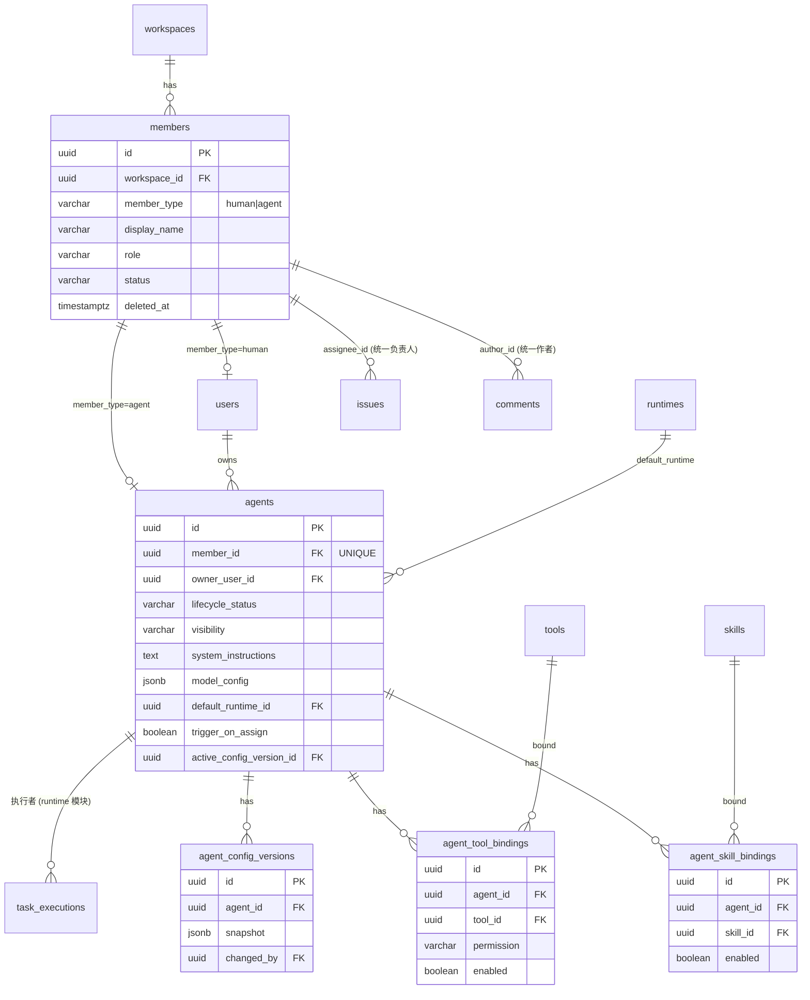
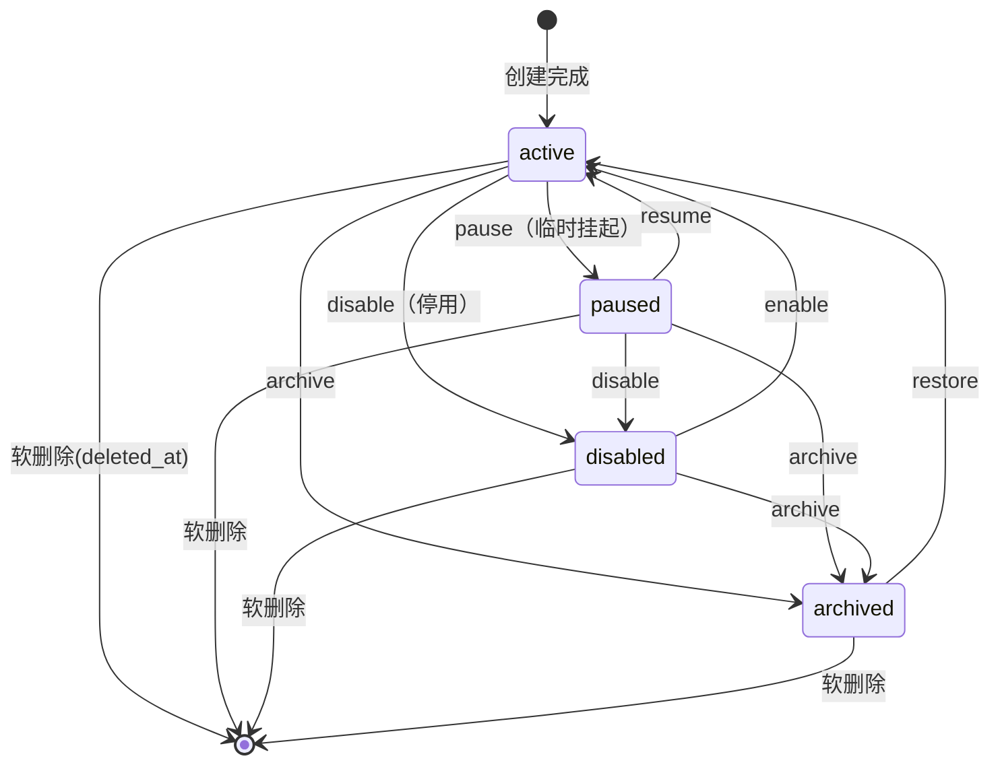

# Agent（Agent 管理）功能 Spec

> 所属层：AI 队友与智能体编排（AI Agent Core）
> 依赖 Spec：`member`（统一成员名册）、`auth`（鉴权 / API token）、`runtime`（运行时）、`skill`（技能 / 工具）、`issue`（看板 / 分派）、`comment-inbox`（评论 / 收件箱）
> 被依赖：`issue`（分派即触发）、`comment-inbox`（@提及触发）、`squad`（智能体小队）、`autopilot`（定时 / 事件自动化）
> 技术栈基准：Python 异步 Web 框架（FastAPI）+ SQLAlchemy 2.x（`DeclarativeBase` / `Mapped` / `mapped_column`）+ PostgreSQL + WebSocket
> 文档性质：可直接指导开发的实现规格。所有命名、约束、端点、事件均以此为准则；与全局约定冲突时以《全局一致性锚点》为准。

---

## 全局一致性锚点（本 Spec 一律遵循）

1. **存储**：PostgreSQL；表名 snake_case 复数；主键 `UUID`（`gen_random_uuid()`）；所有表含 `created_at` / `updated_at`（`TIMESTAMPTZ`，默认 `now()`，UTC）；软删除统一 `deleted_at TIMESTAMPTZ NULL`。
2. **成员**：统一 `members` 名册（`member_type = 'human' | 'agent'`）；`issue.assignee_id`、`comment.author_id`、提及目标一律引用 `members.id`。
3. **接口**：基础路径 `/api/v1`；`Authorization: Bearer <token>`；游标分页响应 `{"data": [...], "next_cursor": <opaque|null>}`；统一错误信封 `{"error": {"code","message","details"}}`；供 runtime / CLI 使用的 API token 只存哈希、显式 scope。
4. **实时**：单一 WebSocket 端点 `/ws`，按频道订阅，事件携带单调递增 `seq` 支持断线重放；日志 / 长任务进度可降级 SSE；事件名 `<entity>.<action>`。
5. **ORM**：SQLAlchemy 2.x 约定（类型注解映射、`select()` 查询、异步会话）。

---

## 1. 功能描述

### 1.1 定位

Agent 是 Mesh 的差异化核心：**AI agent 与人类成员同为 workspace 的一等成员**。本模块负责 agent 的身份、配置、能力绑定、可见性、生命周期，以及「被分派 / 被 @ 即自动开工」这条主链路的入口编排。agent 不是某个用户的附属脚本，而是有名册身份、有岗位说明书（system instructions）、有技能与工具、有可见性与权限、有完整审计历史的「数字队友」。

本 Spec 覆盖：
- agent 与人类同构的统一身份建模（与 `member` 模块共建 `members` 名册）；
- agent profile、模型与推理参数、技能 / 工具绑定、配置版本与回滚；
- 可见性与共享、所有权；
- 生命周期状态机（创建 / 暂停 / 停用 / 归档 / 软删除 / 恢复）；
- **「分派即触发」**：`issue.assigned(agent)` 与 `@提及` 共用同一执行入队机制（事件驱动），交给 runtime 执行。

### 1.2 功能点与场景表

| # | 功能点 | 典型用户场景 |
|---|--------|--------------|
| F1 | agent 与人类统一为成员 `[Mesh 特色]` | 成员列表、@提及弹层、分派人选择器中，agent 与人类出现在同一候选集；系统用统一「成员」承载，`member_type` 区分 |
| F2 | 按类型筛选 | 列表 / 候选可切「仅人类 / 仅 Agent / 全部」；权限与计费按类型分别处理 |
| F3 | agent 独立身份 | agent 有头像、名称、简介；发评论 / 改状态以自身身份署名，不借用创建者身份 |
| F4 | agent 可被分派 issue `[Mesh 特色]` | 看板卡片或 issue 详情把负责人设为某 agent，等于把任务交给它 |
| F5 | agent 可被 @提及 `[Mesh 特色]` | 评论里 `@某agent` 入队一次运行，结果以该 agent 的评论回流 |
| F6 | 行为以自身身份留痕 | 时间线显示「agent X 把状态改为进行中」，与人类操作同构 |
| F7 | 创建者 / 所有者关系 | 记录由哪个人类成员创建 / 拥有，用于权限归属与「我创建的 agent」筛选 |
| F8 | agent 不计入人类席位 | 席位 / 邀请统计区分人类与 agent；agent 单独计费或按用量计费 |
| P1–P7 | Profile | 名称 / 头像 / 简介 / 角色标签 / **AI 身份徽章** / 能力摘要 / 状态指示 |
| C1–C10 | 配置 | 模型档位、system instructions、温度 / top_p / max_tokens、推理强度、参数预设、配置版本与回滚、保存前校验 |
| S1–S7 | 技能 / 工具绑定 | 绑定技能与工具、逐项启停、**权限分级**（只读 / 可写 / 需人工确认）、默认 runtime 绑定、绑定留痕、能力可见 |
| V1–V5 | 可见性与共享 | workspace / private 两档、编辑权限、调用权限、所有权转移 |
| L1–L9 | 生命周期 | 向导式创建、模板 / 复制创建、编辑、软停用、暂停、归档、恢复、软删除、停用前置检查 |
| A1–A7 | 分派即触发 `[Mesh 特色]` | 事件驱动入队、衔接 runtime、@提及触发、去重防抖、暂停拦截、运行状态回流、自动状态流转 |
| D1–D6 | 全场景 AI 标识 `[Mesh 特色]` | 看板卡片 / 评论流 / 成员列表 / @候选 / 分派选择器 / 活动流处处带 AI 徽章 |

### 1.3 边界与非目标

**本模块负责：**
- agent 的名册身份（写 `members` + `agents`）、配置、绑定、可见性、生命周期；
- 把「分派 / @提及」翻译成一次执行入队请求（事件驱动），交给 runtime 调度。

**本模块不负责（非目标）：**
- 人类成员的认证、邮箱、邀请流程（属 `member` / `auth` 模块，本模块只复用 `members` 名册）；
- 任务的实际领取、沙箱、日志、凭证注入（属 `runtime` 模块，本模块只投递 `task_executions`）；
- 技能 / 工具的定义与实现（属 `skill` 模块，本模块只做绑定与授权）；
- issue 的字段、看板泳道、状态机定义（属 `issue` / `kanban`，本模块只在被分派时订阅其事件）；
- 模型注册表与底层模型供应商接入细节（统一以「主流大语言模型」抽象，具体接入属平台基础设施，不在本 Spec 范围）。

**约束红线：**
- AI 身份徽章不可关闭、不可隐藏；任何场景都明确标注非人类身份，杜绝冒充。
- 高风险工具默认 `confirm_required`；agent 自主性以「人类随时可介入」为硬约束。

---

## 2. 数据模型

### 2.0 关键设计决策：统一名册 + 类表继承

采用 **「统一 `members` 名册 + `users` / `agents` 子表」的类表继承（class-table inheritance）**：`members` 是「workspace 内的一个身份」，`member_type` 决定其专有属性挂在 `users` 还是 `agents`；子表通过 `member_id` 1:1 反向关联回 `members`。所有协作实体（issue 负责人、评论作者、提及对象）外键统一指向 `members.id`，从根本上支撑「agent 与人类同为一等成员」。

> 与 `member` 模块共建：`members` / `users` 表由 `member` 模块定义并owns 其迁移；本模块 owns `agents` 及其绑定 / 版本表。两模块共享同一 `members.member_type` 判别器（`'human' | 'agent'`）与 `members.id` 统一引用键，禁止任何引用点私自带 `(id, type)` 多态二元组。

### 2.1 `members` — 统一成员名册（身份层，与 member 模块共建）

| 字段 | 类型 | 约束 / 默认 | 说明 |
|------|------|-------------|------|
| id | uuid | PK, default `gen_random_uuid()` | 成员唯一身份（统一引用键） |
| workspace_id | uuid | NOT NULL, FK `workspaces(id)` ON DELETE CASCADE | 所属 workspace |
| member_type | varchar(16) | NOT NULL, CHECK IN (`'human'`,`'agent'`) | 成员类型判别器 |
| display_name | varchar(120) | NOT NULL | 显示名（允许重名） |
| avatar_url | text | NULL | 头像 URL |
| role_tag | varchar(64) | NULL | 角色标签（如「测试工程师」），用于列表辨识与筛选 |
| role | varchar(16) | NOT NULL DEFAULT `'member'`, CHECK IN (`'owner'`,`'admin'`,`'member'`,`'guest'`) | 工作区级角色（沿用 member 模块） |
| status | varchar(16) | NOT NULL DEFAULT `'active'`, CHECK IN (`'active'`,`'disabled'`,`'removed'`) | 名册状态（与 member 模块一致） |
| created_by | uuid | NULL, FK `members(id)` | 创建 / 邀请者成员 id |
| created_at | timestamptz | NOT NULL DEFAULT `now()` | |
| updated_at | timestamptz | NOT NULL DEFAULT `now()` | |
| deleted_at | timestamptz | NULL | 软删除 |

约束 / 索引：
- `CHECK (member_type = 'human' OR role <> 'owner')` —— agent 不得担任 owner。
- 子表关联：`member_type='human'` 对应一行 `users.member_id`；`member_type='agent'` 对应一行 `agents.member_id`（均 UNIQUE）。
- `idx_members_ws_type_status`：`(workspace_id, member_type, status)` WHERE `deleted_at IS NULL` —— 支撑成员列表 / @候选 / 分派候选主查询。
- `idx_members_ws_name`：`(workspace_id, lower(display_name))` —— 加速搜索（不做名称强唯一）。

### 2.2 `users` — 人类账号子表（节选，由 member / auth 模块 owns）

| 字段 | 类型 | 约束 / 默认 | 说明 |
|------|------|-------------|------|
| id | uuid | PK | 人类账号 id |
| member_id | uuid | NOT NULL UNIQUE, FK `members(id)` ON DELETE CASCADE | 对应成员身份（1:1） |
| email | citext | NOT NULL UNIQUE | 登录邮箱 |
| auth_provider | varchar(32) | NOT NULL DEFAULT `'password'` | 认证方式 |
| created_at / updated_at | timestamptz | NOT NULL DEFAULT `now()` | |

> 人类成员 = `members` 一行 + `users` 一行；认证、邮箱等人类专有属性放这里，不污染统一身份层。

### 2.3 `agents` — agent 专有配置表（本模块 owns）

| 字段 | 类型 | 约束 / 默认 | 说明 |
|------|------|-------------|------|
| id | uuid | PK, default `gen_random_uuid()` | agent id |
| member_id | uuid | NOT NULL UNIQUE, FK `members(id)` ON DELETE CASCADE | 对应统一成员身份（1:1） |
| owner_user_id | uuid | NOT NULL, FK `users(id)` | 创建者 / 所有者（人类） |
| slug | varchar(64) | NULL | 可选短标识，用于提及简写 |
| bio | text | NULL | 个人简介（markdown） |
| badge_kind | varchar(32) | NOT NULL DEFAULT `'ai'` | AI 身份徽章类型（渲染区分用，不可置空隐藏） |
| lifecycle_status | varchar(16) | NOT NULL DEFAULT `'active'`, CHECK IN (`'active'`,`'paused'`,`'disabled'`,`'archived'`) | 生命周期状态（见 5.2） |
| visibility | varchar(16) | NOT NULL DEFAULT `'workspace'`, CHECK IN (`'workspace'`,`'private'`) | 可见性级别 |
| system_instructions | text | NULL | 系统指令（岗位说明书） |
| model_config | jsonb | NOT NULL DEFAULT `'{}'::jsonb` | 模型与推理参数（结构见 2.4） |
| default_runtime_id | uuid | NULL, FK `runtimes(id)` ON DELETE SET NULL | 默认运行时（被分派后在此执行；跨模块外键 → runtime） |
| trigger_on_assign | boolean | NOT NULL DEFAULT true | 被分派 issue 时是否自动触发运行 `[Mesh 特色]` |
| active_config_version_id | uuid | NULL, FK `agent_config_versions(id)` | 当前生效配置版本指针（见 2.7） |
| created_at | timestamptz | NOT NULL DEFAULT `now()` | |
| updated_at | timestamptz | NOT NULL DEFAULT `now()` | |
| deleted_at | timestamptz | NULL | 软删除 |

> `members.status`（名册级 `active/disabled/removed`）与 `agents.lifecycle_status`（agent 级 `active/paused/disabled/archived`）是两个正交维度：前者管「是否还在名册里」，后者管「agent 运营状态」。停用 agent 时两者联动（见 5.2）。

索引：
- `idx_agents_owner`：`(owner_user_id)` —— 「我创建的 agent」。
- `idx_agents_lifecycle`：`(lifecycle_status)` WHERE `deleted_at IS NULL`。
- `idx_agents_visibility`：`(visibility)` —— 可见性过滤。
- `idx_agents_default_runtime`：`(default_runtime_id)` —— runtime 删除前检查引用。
- `member_id` 已 UNIQUE，关联查询走主键。

### 2.4 `model_config` JSONB 结构（模型与推理参数）

用 JSONB 承载频繁演进、字段不固定的推理参数，避免为每个新参数加列；应用层用 JSON Schema / Pydantic 校验。推荐结构：

```json
{
  "model": "mainstream-llm-balanced",
  "model_tier": "balanced",
  "temperature": 0.2,
  "top_p": 1.0,
  "max_tokens": 8192,
  "reasoning_effort": "medium",
  "stop_sequences": [],
  "preset": "strict_engineering",
  "advanced": { "frequency_penalty": 0.0, "presence_penalty": 0.0 }
}
```

| 键 | 类型 | 取值 / 范围 | 说明 |
|----|------|-------------|------|
| model | string | 「主流大语言模型」标识 | 由平台模型注册表枚举，不暴露具体供应商 |
| model_tier | string | `strong_reasoning` / `balanced` / `lightweight_fast` | 模型档位（控本与选型的抽象） |
| temperature | number | [0, 2] | 随机性 |
| top_p | number | [0, 1] | 核采样 |
| max_tokens | integer | [1, 模型上限] | 单次输出上限 |
| reasoning_effort | string | `low` / `medium` / `high` | 内部推理强度 `[Mesh 特色]` |
| stop_sequences | string[] | — | 停止序列 |
| preset | string | 预设名 | 一键套用的参数模板 |
| advanced | object | — | 低频高级参数收纳 |

设计要点：
- 校验在应用层完成，保存前拒绝越界值，错误码 `422 validation_error`。
- 按需对特定键建表达式 GIN 索引（如统计某档位 agent 数）：`CREATE INDEX idx_agents_model_tier ON agents USING gin ((model_config->'model_tier'))`。
- 重大变更同步写入 `agent_config_versions` 快照（2.7），实现可回滚（immutable，不原地改写历史快照）。

### 2.5 `agent_skill_bindings` — agent ↔ 技能绑定

| 字段 | 类型 | 约束 / 默认 | 说明 |
|------|------|-------------|------|
| id | uuid | PK | |
| agent_id | uuid | NOT NULL, FK `agents(id)` ON DELETE CASCADE | |
| skill_id | uuid | NOT NULL, FK `skills(id)` ON DELETE CASCADE | 绑定的技能（跨模块外键 → skill） |
| enabled | boolean | NOT NULL DEFAULT true | 单项启用开关 |
| created_at | timestamptz | NOT NULL DEFAULT `now()` | |
| updated_at | timestamptz | NOT NULL DEFAULT `now()` | |

约束 / 索引：
- `UNIQUE (agent_id, skill_id)` —— 防重复绑定。
- `idx_skill_bindings_agent`：`(agent_id)` WHERE `enabled = true` —— 取某 agent 的可用技能。

### 2.6 `agent_tool_bindings` — agent ↔ 工具绑定（带权限）

| 字段 | 类型 | 约束 / 默认 | 说明 |
|------|------|-------------|------|
| id | uuid | PK | |
| agent_id | uuid | NOT NULL, FK `agents(id)` ON DELETE CASCADE | |
| tool_id | uuid | NOT NULL, FK `tools(id)` ON DELETE CASCADE | 绑定的工具（跨模块外键 → skill / tool） |
| permission | varchar(16) | NOT NULL DEFAULT `'confirm_required'`, CHECK IN (`'read_only'`,`'write'`,`'confirm_required'`) | 权限级别，高风险默认需人工确认 `[Mesh 特色]` |
| enabled | boolean | NOT NULL DEFAULT true | |
| created_at | timestamptz | NOT NULL DEFAULT `now()` | |
| updated_at | timestamptz | NOT NULL DEFAULT `now()` | |

约束 / 索引：
- `UNIQUE (agent_id, tool_id)`。
- `idx_tool_bindings_agent`：`(agent_id)` WHERE `enabled = true`。

### 2.7 `agent_config_versions` — 配置版本快照（审计 / 回滚）

| 字段 | 类型 | 约束 / 默认 | 说明 |
|------|------|-------------|------|
| id | uuid | PK | 版本 id |
| agent_id | uuid | NOT NULL, FK `agents(id)` ON DELETE CASCADE | |
| snapshot | jsonb | NOT NULL | 该版本完整配置快照（system_instructions + model_config + 绑定清单） |
| change_summary | text | NULL | 变更摘要（可服务端自动生成） |
| changed_by | uuid | NOT NULL, FK `members(id)` | 操作者成员 id |
| created_at | timestamptz | NOT NULL DEFAULT `now()` | 版本生成时间（仅插入，不更新） |

索引：`idx_config_versions_agent_time`：`(agent_id, created_at DESC)`。
> `agents.active_config_version_id` 指向当前生效版本；回滚 = 复制旧快照写新版本并把指针指过去（不可变快照，符合 immutable 原则，不抹除历史）。

### 2.8 实体关系（ER 图）



跨模块外键与唯一约束要点：
- `agents.member_id` UNIQUE → 一个成员身份至多对应一个 agent（1:1）。
- `agent_skill_bindings.UNIQUE(agent_id, skill_id)`、`agent_tool_bindings.UNIQUE(agent_id, tool_id)`。
- `issues.assignee_id` / `comments.author_id` / 提及目标 → `members.id`，并冗余 `assignee_type` / `author_type`（`'human'|'agent'`）以便无 join 渲染 AI 徽章。
- `task_executions.agent_id` → `agents.id`（runtime 模块 owns，本模块只读引用以展示运行历史）。

---

## 3. 接口设计

### 3.0 通用约定

- **鉴权**：所有端点要求 `Authorization: Bearer <token>`（用户会话 JWT）。鉴权失败 `401`，权限不足 `403`。
- **基础路径**：`/api/v1`。
- **响应包络**（成功，单对象）：`{"data": { ... }}`。
- **响应包络**（成功，列表 + 游标分页）：`{"data": [ ... ], "next_cursor": "eyJ..." | null}`。
- **错误信封**（失败）：

```json
{
  "error": {
    "code": "validation_error",
    "message": "temperature 必须在 [0,2] 区间",
    "details": [ { "field": "model_config.temperature", "issue": "out_of_range" } ]
  }
}
```

- **分页**：`?cursor=<opaque>&limit=N`（默认 20，上限 100），`next_cursor` 为 `null` 表示末页。
- **时间**：全部 UTC RFC3339。
- **资源命名**：复数名词 `/agents`、`/members`。
- **实时**：长任务 / 状态变化经 `/ws` 推送（见 5.3），REST 仅负责读写。

### 3.1 REST 端点清单

| 方法 | 路径 | 说明 |
|------|------|------|
| POST | `/api/v1/agents` | 创建 agent（profile + 初始配置 + 绑定） |
| GET | `/api/v1/agents` | 列表，`?status=&visibility=&owner_id=&cursor=&limit=&q=` |
| GET | `/api/v1/agents/{id}` | 详情（profile + 配置 + 绑定 + 当前版本） |
| PATCH | `/api/v1/agents/{id}` | 更新 profile（名称 / 头像 / 简介 / 角色标签 / 可见性） |
| PATCH | `/api/v1/agents/{id}/config` | 更新模型 / 推理参数 / system instructions（生成新配置版本） |
| POST | `/api/v1/agents/{id}:pause` | 暂停（body 带 `in_flight_policy`） |
| POST | `/api/v1/agents/{id}:resume` | 恢复到 active |
| POST | `/api/v1/agents/{id}:disable` | 停用 |
| POST | `/api/v1/agents/{id}:enable` | 启用 |
| POST | `/api/v1/agents/{id}:archive` | 归档 |
| POST | `/api/v1/agents/{id}:restore` | 从归档 / 停用恢复 |
| DELETE | `/api/v1/agents/{id}` | 软删除（置 `deleted_at`） |
| POST | `/api/v1/agents/{id}:transfer` | 转移所有权 |
| GET | `/api/v1/agents/{id}/skills` | 列出绑定技能 |
| POST | `/api/v1/agents/{id}/skills` | 绑定技能（批量） |
| DELETE | `/api/v1/agents/{id}/skills/{skill_id}` | 解绑技能 |
| PATCH | `/api/v1/agents/{id}/skills/{skill_id}` | 启用 / 停用单项 |
| GET | `/api/v1/agents/{id}/tools` | 列出绑定工具 |
| POST | `/api/v1/agents/{id}/tools` | 绑定工具（带 permission） |
| DELETE | `/api/v1/agents/{id}/tools/{tool_id}` | 解绑工具 |
| PATCH | `/api/v1/agents/{id}/tools/{tool_id}` | 改权限 / 启停单项 |
| GET | `/api/v1/agents/{id}/config-versions` | 配置版本历史 |
| POST | `/api/v1/agents/{id}/config-versions/{version_id}:rollback` | 回滚到指定版本 |
| GET | `/api/v1/agents/{id}/executions` | 该 agent 的运行历史（只读，源自 runtime 模块） |
| GET | `/api/v1/members` | 统一成员列表，`?member_type=human\|agent&status=&cursor=&limit=` |

> 生命周期 / 回滚等动作型端点统一用 `:verb` 后缀（如 `:pause`），与读写型端点（PATCH/DELETE）区分。

### 3.2 可运行 JSON 示例

**创建 agent — 请求 `POST /api/v1/agents`**

```json
{
  "display_name": "小测",
  "avatar_url": "https://cdn.mesh.internal/avatars/xiaoce.png",
  "role_tag": "测试工程师",
  "bio": "负责回归测试与缺陷复现，输出可执行的测试报告。",
  "visibility": "workspace",
  "system_instructions": "你是测试工程师。收到 issue 后先复现问题，再给出最小复现步骤与修复建议。不做超出测试范围的改动。",
  "model_config": {
    "model_tier": "balanced",
    "temperature": 0.2,
    "top_p": 1.0,
    "max_tokens": 8192,
    "reasoning_effort": "medium",
    "preset": "strict_engineering"
  },
  "default_runtime_id": "8b2c1f0e-4a7d-4c9b-9e1a-2f3b4c5d6e7f",
  "trigger_on_assign": true,
  "skill_ids": ["s-uuid-1", "s-uuid-2"],
  "tools": [
    { "tool_id": "t-uuid-exec", "permission": "confirm_required" },
    { "tool_id": "t-uuid-read", "permission": "read_only" }
  ]
}
```

**创建 agent — 响应 `201 Created`**

```json
{
  "data": {
    "id": "a1b2c3d4-0000-4000-8000-000000000001",
    "member": {
      "id": "m1b2c3d4-0000-4000-8000-000000000001",
      "member_type": "agent",
      "display_name": "小测",
      "avatar_url": "https://cdn.mesh.internal/avatars/xiaoce.png",
      "role_tag": "测试工程师",
      "role": "member",
      "status": "active"
    },
    "owner_user_id": "u-uuid-current",
    "visibility": "workspace",
    "lifecycle_status": "active",
    "badge_kind": "ai",
    "model_config": {
      "model_tier": "balanced",
      "temperature": 0.2,
      "top_p": 1.0,
      "max_tokens": 8192,
      "reasoning_effort": "medium",
      "preset": "strict_engineering"
    },
    "trigger_on_assign": true,
    "active_config_version_id": "v-uuid-1",
    "created_at": "2026-07-24T12:00:00Z",
    "updated_at": "2026-07-24T12:00:00Z"
  }
}
```

> 创建在同一事务内写入 `members`（`member_type='agent'`）+ `agents` + 绑定 + 首个 `agent_config_versions`，并发出 `agent.created` 事件。

**列表 — `GET /api/v1/agents?status=active&limit=2`**

```json
{
  "data": [
    { "id": "a1b2...0001", "display_name": "小测", "role_tag": "测试工程师", "lifecycle_status": "active", "badge_kind": "ai", "busy": true },
    { "id": "a1b2...0002", "display_name": "文档助手", "role_tag": "文档撰写", "lifecycle_status": "active", "badge_kind": "ai", "busy": false }
  ],
  "next_cursor": "eyJpZCI6ImExYjIuLi4wMDAyIn0="
}
```

**更新配置 — `PATCH /api/v1/agents/{id}/config`（生成新版本）**

```json
{
  "model_config": { "temperature": 0.7, "reasoning_effort": "high" },
  "system_instructions": "（更新后的岗位说明书）"
}
```

响应 `200 OK` 返回新的 `active_config_version_id` 与生效配置；`change_summary` 由服务端自动生成。配置变更对进行中运行不生效，对后续运行生效。

**绑定工具 — `POST /api/v1/agents/{id}/tools`**

```json
{ "tools": [ { "tool_id": "t-uuid-web", "permission": "read_only" } ] }
```

**生命周期 — `POST /api/v1/agents/{id}:pause`**

```json
{ "reason": "临时维护", "in_flight_policy": "finish_current" }
```

`in_flight_policy` 取值 `finish_current`（让进行中任务跑完）/ `pause_now`（一并暂停）。响应返回最新 `lifecycle_status` 与被影响的运行数。非法状态迁移返回 `409 conflict`。

**软删除 — `DELETE /api/v1/agents/{id}`** → `204 No Content`；后续列表中不再出现，历史评论以「已停用 agent」占位渲染。

### 3.3 分派即触发的内部接口（事件驱动，非公开 REST）

「分派即触发」不通过新增公开 REST，而是订阅 `issue` 模块的领域事件并入队执行，与 `@提及` 共用同一执行入口：

- 订阅事件：`issue.assigned`（assignee 为 agent 且 `trigger_on_assign=true`）、`comment.created`（正文提及某 agent）。
- 处理器 `enqueue_agent_run(agent_id, issue_id, trigger)`：
  1. 校验 agent `lifecycle_status='active'` 且 `members.status='active'`，否则发 `agent.trigger_skipped`（原因 `paused/disabled`）并提示，不入队；
  2. 去重 / 防抖（见 5.1 A4）：以 `(agent_id, issue_id)` 为键，若已有 `queued/claimed/running` 的执行则按策略合并或排队；
  3. 组装 issue 上下文（标题 / 描述 / 评论 / 附件 / 标签），**所有外部来源内容（评论、附件、描述等）注入 agent 上下文时显式标记为不可信数据并做结构隔离**（见 README §6「不可信内容处理」全局约定），生成幂等键 `idempotency_key = sha256(agent_id|issue_id|trigger_seq)`；
  4. 调用 runtime 模块创建 `task_executions`（`status='queued'`，`agent_id`、`label_requirements` 取自 agent 绑定）；
  5. 发出 `agent.run_enqueued` 事件。

> 幂等键 + 状态机校验保证同一逻辑触发不会重复入队（详见 runtime Spec 的 claim 原子性）。

### 3.4 错误码体系

| HTTP | code | 含义 | 触发示例 |
|------|------|------|----------|
| 400 | invalid_request | 请求体格式错误 / JSON 解析失败 | body 非合法 JSON |
| 401 | unauthorized | 缺少 / 无效 token | 未带 Authorization |
| 403 | forbidden | 无权限（编辑 / 调用 / 转移） | 非所有者编辑私有 agent |
| 404 | not_found | 资源不存在或已删除 | 错误的 agent id |
| 409 | conflict | 状态冲突 / 唯一约束冲突 | 非法生命周期迁移；重复绑定同一技能 |
| 409 | last_owner | 试图转移走最后一个 owner（与 member 模块语义一致） | owner 保护 |
| 422 | validation_error | 业务校验失败 | temperature 越界；system_instructions 为空（若要求必填） |
| 429 | rate_limited | 触发限流 | 单位时间创建过多 agent |
| 500 | internal_error | 服务端异常 | 未捕获错误（不向外泄漏堆栈） |

> 错误响应不泄漏内部实现细节（无堆栈、无 SQL）；`details` 仅返回字段级校验信息。所有端点接入限流。

### 3.5 分页与鉴权

- 游标分页：agent 列表按 `(lifecycle_status, created_at, id)` 排序编码游标；`next_cursor=null` 表示末页。
- 鉴权：
  - 读取 agent：workspace 成员可见 `visibility='workspace'` 的 agent；`private` 仅所有者与 admin 可见。
  - 写配置 / 绑定 / 生命周期：所有者或 admin（按 workspace 编辑策略）。
  - 触发（分派 / @）：与可见性一致；`private` agent 仅所有者可触发。
  - 转移所有权：仅当前所有者或 admin。

### 3.6 WebSocket 事件（`/ws`，`<entity>.<action>`，带 seq 重放）

客户端连 `/ws` 后订阅频道，每个事件含全局单调 `seq`，断线重连时带 `?since_seq=N` 补发。

| 频道 | 事件 | 说明 |
|------|------|------|
| `workspace:{ws}:agents` | `agent.created` / `agent.updated` / `agent.deleted` | 列表与候选实时刷新 |
| `workspace:{ws}:agents` | `agent.lifecycle_changed` | 暂停 / 停用 / 归档 / 恢复，含前后状态 |
| `agent:{id}:presence` | `agent.presence` | 空闲 / 处理中（由 runtime 心跳与运行状态推导） |
| `issue:{id}:runs` | `agent.run_enqueued` / `agent.run_started` / `agent.run_progress` / `agent.run_completed` / `agent.run_failed` | 运行状态回流，卡片忙碌指示与进度条 |
| `workspace:{ws}:agents` | `agent.trigger_skipped` | 分派 / @ 因 paused/disabled 未触发 |
| `agent:{id}:confirm` | `agent.confirm_requested` | 高风险工具需人工确认（带内联批准 / 拒绝） |

帧示例：

```json
{ "seq": 48213, "channel": "issue:{id}:runs", "event": "agent.run_started",
  "data": { "agent_id": "a1b2...0001", "execution_id": "e-uuid", "issue_id": "i-uuid", "started_at": "2026-07-24T12:00:05Z" } }
```

---

## 4. UI / UX

### 4.1 信息架构

agent 管理有两个入口：

```
设置 Settings
└── Agents
    ├── 列表页（筛选 / 搜索 / 新建）
    └── 详情页
        ├── Tab：概览 Profile
        ├── Tab：配置 Configuration（模型 + 指令 + 参数）
        ├── Tab：技能与工具 Skills & Tools
        ├── Tab：可见性与权限 Visibility & Access
        └── Tab：历史 History（配置版本 / 审计）
成员 Members（人与 agent 统一名册）
```

### 4.2 Agent 列表页

```
┌───────────────────────────────────────────────────────────────┐
│  Agents                                   [ 筛选 ▾ ] [ + 新建 ] │
│  搜索: [__________________________]  状态: [全部▾] 类型: [仅agent]│
├───────────────────────────────────────────────────────────────┤
│  ◉ 小测  [AI]   测试工程师        ● 处理中   active   ⋯         │
│  ◉ 文档助手[AI] 文档撰写          ○ 空闲     active   ⋯         │
│  ◉ 值班运维[AI] 运维             ◐ 已暂停   paused   ⋯         │
│  ▢ 老报表  [AI] 报表             ▭ 已归档   archived ⋯         │
├───────────────────────────────────────────────────────────────┤
│  共 12 个 · 加载下一页 ↓                                         │
└───────────────────────────────────────────────────────────────┘
```

- 每行：头像（右下角叠加 AI 角标）、名称 + `[AI]` 徽章、角色标签、实时忙碌指示（●处理中 / ○空闲，来自 `agent.presence`）、生命周期状态、`⋯` 行内操作（暂停 / 停用 / 归档 / 复制 / 转移）。
- 顶部筛选：状态（active/paused/disabled/archived）、可见性、所有者、关键字搜索。
- 列表默认隐藏 archived/disabled，需主动勾选显示。

### 4.3 Agent 详情页（配置 / 指令 / 模型参数 / 技能绑定）

```
┌──────────────────────────────────────────────────────────────────┐
│  ← 返回   ◉ 小测 [AI]   active ● 处理中        [ 暂停 ] [ ⋯ 更多 ] │
│  测试工程师 · 由 张三 创建 · workspace 可见                         │
├──────────────────────────────────────────────────────────────────┤
│ [概览] [配置] [技能与工具] [可见性与权限] [历史]                     │
├──────────────────────────────────────────────────────────────────┤
│  配置 Tab：                                                        │
│   底层模型档位   ( ○强推理  ●均衡  ○轻量快速 )                       │
│   具体模型       [ 主流大语言模型-均衡版 ▾ ]                         │
│   System Instructions                                            │
│   ┌──────────────────────────────────────────────┐                │
│   │ 你是测试工程师。收到 issue 后先复现问题……       │                │
│   └──────────────────────────────────────────────┘                │
│   ▸ 高级参数                                                       │
│     温度 ──●────── 0.2     top_p ──────● 1.0                       │
│     max_tokens [ 8192 ]    推理强度 (低 ●中 高)                     │
│   预设: [严谨工程 ▾]   [ 应用预设 ]                                 │
│                                       [ 取消 ]  [ 保存(生成新版本) ] │
└──────────────────────────────────────────────────────────────────┘
```

- **概览 Tab**：头像（可换）、名称、角色标签、bio（markdown 预览）、能力摘要（绑定技能 / 工具数量与清单 + 模型档位）、当前状态。
- **配置 Tab**：模型档位单选 + 具体模型下拉；system instructions 多行编辑器（支持 markdown、变量插值提示）；推理参数滑块 / 输入；高级折叠区；预设套用；保存即生成新配置版本。越界值在保存前红字拦截。
- **技能与工具 Tab**：双列清单，逐项开关；工具项带权限下拉（只读 / 可写 / 需确认），高风险默认「需确认」并加警示色。
- **可见性与权限 Tab**：可见性单选、编辑权限策略、所有权转移。
- **历史 Tab**：配置版本时间线，支持「对比上一版」「回滚到此版本」。

### 4.4 创建 / 编辑向导

四步向导（编辑时复用同一组件，预填现有值）：

```
① 基本信息  →  ② 模型与指令  →  ③ 技能与工具  →  ④ 可见性  →  [完成]
─────────────────────────────────────────────────────────
步骤 ①  名称*  [____________]   头像 [上传/自动生成]
        角色标签 [____________]  简介 [________________]
─────────────────────────────────────────────────────────
        [ 上一步 ]                         [ 下一步 ]
```

- 每步可独立校验、可后退不丢数据；步骤指示器显示进度。
- 步骤 ② 提供「预设」快速起步，新手无需逐项调参。
- 步骤 ③ 支持「稍后配置」，允许先建一个最小 agent 再补能力。
- 「完成」后立即出现在成员列表与 `@`/分派候选中。
- 提供「从现有 agent 复制」与「从模板创建」快捷入口。

### 4.5 成员列表中的 AI 标识

```
成员 Members                       [ 全部 ▾ ]  [ 邀请成员 ] [ + 新建 Agent ]
─────────────────────────────────────────────────────────
👤 张三        人类 · 产品负责人          在线
👤 李四        人类 · 后端工程师          离线
◉ 小测 [AI]    Agent · 测试工程师         ● 处理中 · active
◉ 文档助手[AI] Agent · 文档撰写           ○ 空闲   · active
```

- agent 行：头像带 AI 角标、名称旁 `[AI]` 徽章、类型列显式标「Agent」、状态列含生命周期 + 实时忙碌。
- 顶部筛选可切「全部 / 仅人类 / 仅 Agent」（对应 `member_type`）。
- `[ + 新建 Agent ]` 与「邀请成员」并列，体现 agent 与人类同为可加入的「成员」。
- 行内角色下拉中 agent 行的 `owner` 选项禁用置灰（agent 不得为 owner）。

### 4.6 看板卡片与评论区中 agent 头像与徽章

看板卡片：
```
┌──────────────────────────┐
│ 修复登录态丢失      [高]   │
│ #MES-42                  │
│ 标签: [bug]              │
│            ◉[AI] ●处理中  │  ← 负责人头像 + AI 角标 + 忙碌动效
└──────────────────────────┘
```
评论区：
```
┌──────────────────────────────────────────────┐
│ ◉[AI] 小测 · AI · 2 分钟前                     │
│ 已复现：在 token 过期后刷新页面会丢失登录态。    │
│ 最小复现步骤：1) ……  2) ……                     │
│ [ 产物附件 ▾ ]                                 │
└──────────────────────────────────────────────┘
```

- 卡片：负责人位显示 agent 头像（右下 AI 角标），处理中加动态指示（脉冲 / 进度）。
- 评论：agent 评论恒带 `[AI]` 标签与徽章，署名是 agent 自身；产物（报告 / 补丁）作为附件挂在该评论下。
- `@` 候选弹层：agent 项带 AI 图标 + 副文案「提及将触发一次运行」，避免误触发。
- 分派人选择器：人与 agent 分组或加图标区分；选中 agent 时浮出提示「分派后它将自动开始工作」。

### 4.7 关键交互流程：创建 → 配置 → 分派 → 观察自动工作

```
1. 用户在 设置→Agents 点「+ 新建」，走向导：
   ① 起名「小测」、传头像、填角色标签
   ② 选「均衡」模型档位、套用「严谨工程」预设、写岗位说明书
   ③ 绑定「回归测试」技能 + 「代码执行(需确认)」工具
   ④ 可见性选 workspace → 完成
2. 「小测」立即出现在成员列表与 @ /分派候选（头像带 AI 角标）。
3. 用户在看板把卡片 #MES-42 的负责人改为「小测」。
4. 系统发 issue.assigned 事件 → enqueue_agent_run 入队 → 卡片头像出现「●处理中」动效，
   issue 状态自动转「进行中」，时间线记一条「小测 已开始处理」。
5. 运行中：卡片 / 详情实时显示进度指示；agent 阶段性进展以评论回流。
6. 运行完成：agent 发一条带产物的评论，把状态置「待评审」，触发通知给分派者；用户在评论区复核产物。
7. 全程 agent 以自身身份署名，AI 徽章始终可见。
```

设计要点：分派即触发是「无感自动化」的关键——用户不需要再点「开始」，这正是「agent 像队友一样接单干活」的体验核心。同时通过浮出提示与去重防抖，避免「不知道它已经开始」或「重复触发」。

### 4.8 生命周期状态机



状态语义与拦截规则：
- **active**：可被分派 / `@` 触发，可正常处理任务。
- **paused**：不接新任务；进行中任务按 `in_flight_policy` 决定继续或一并暂停；可快速 resume。
- **disabled**：停用，不接新任务；保留全部历史归属。
- **archived**：从主列表隐藏，数据保留；restore 回 active。
- **软删除**：置 `deleted_at`，默认从所有候选 / 列表隐藏；历史外键以「已停用 agent」占位渲染。
- 非法迁移（如 archived 直接 pause）返回 `409 conflict`。状态变更经 `agent.lifecycle_changed` 广播，UI 即时刷新。
- 与名册联动：`disable` 时 `members.status` 置 `disabled`；`enable/restore` 回 `active`；软删除时 `members.deleted_at` 同步置位。

### 4.9 实时性方案

- **在线 / 忙碌状态**：agent 的「空闲 / 处理中」由 runtime 心跳与运行状态推导，经 `agent:{id}:presence` 频道推送；列表与卡片上的指示点即时变化（脉冲动画表示处理中）。
- **运行进度**：每次运行有独立事件流，把「开始 / 阶段进展 / 完成 / 失败」推给订阅了该 issue 或该 agent 的客户端，卡片与详情页实时刷新。
- **配置 / 状态变更**：agent 的生命周期与配置变更经 workspace 级频道广播，多端同步。
- **降级**：`/ws` 断线时回退到带 `updated_at` 的轮询（如每 5s 拉一次相关 agent 的轻量状态），重连后凭 `since_seq` 增量补齐。
- **一致性**：所有实时事件携带单调递增 `seq` / `updated_at`，客户端按序去重，避免乱序覆盖。

### 4.10 通知与人类监督

通知（进收件箱，可按类型开关，含「agent 运行通知」总开关）：

| 事件 | 通知对象 | 渠道 |
|------|----------|------|
| 我分派的 issue 由 agent 完成 / 失败 | 分派者 / 订阅者 | 站内 + 可选邮件 |
| 我 `@` 触发的 agent 运行结束 | 触发者 | 站内 |
| 我创建 / 拥有的 agent 被停用 / 归档 / 转移 | 所有者 | 站内 |
| agent 运行需要人工确认（高风险工具）`[Mesh 特色]` | 分派者 / 所有者 | 站内（强提醒，带内联批准 / 拒绝） |
| agent 长时间无心跳 / 运行卡死 | 所有者 / 管理员 | 站内 |

人类干预矩阵（自主性以「人类随时可踩刹车」为前提）：
1. **暂停一个正在工作的 agent**：选 `pause_now` 立即冻结当前运行，或 `finish_current` 让它跑完手头这步再停。
2. **取消单次运行**：在 issue 的运行进度条上「停止本次运行」，不影响 agent 整体生命周期。
3. **复核产出**：agent 完成后 issue 置「待评审」，产物以评论附件呈现；人类可批准（转「完成」）、打回（评论补充意见，重新 `@` 或再次分派触发返工）。
4. **高风险操作闸门**：绑定为 `confirm_required` 的工具在执行前发「需人工确认」通知，批准后才继续——写操作 / 外部调用的默认护栏。
5. **配置回滚**：发现行为异常可回滚到上一个配置版本，快速止损。
6. **审计可追溯**：所有配置变更、生命周期操作、绑定变更留有版本与操作者记录。

---

## 5. 验收标准

### 5.1 功能验收

- [ ] 创建 agent 在同一事务写入 `members`（`member_type='agent'`）+ `agents` + 绑定 + 首个配置版本，缺一即整体回滚。
- [ ] `members.id` 是 issue 负责人 / 评论作者 / @提及的唯一引用键；agent 与人类在同一候选集中可被分派与提及。
- [ ] agent 发评论 / 改状态以自身 `member_id` 署名，时间线显示为 agent 身份且带 AI 徽章。
- [ ] 模型与推理参数保存前完成范围校验（temperature ∈ [0,2]、top_p ∈ [0,1]、max_tokens ≥ 1），越界返回 `422`。
- [ ] 每次 `PATCH /config` 生成新的不可变 `agent_config_versions` 快照并更新 `active_config_version_id`；可列出历史、对比、回滚。
- [ ] 技能 / 工具可逐项启停；工具默认 `permission='confirm_required'`；`UNIQUE(agent_id, skill_id/tool_id)` 阻止重复绑定。
- [ ] 可见性 `workspace`/`private` 生效：private agent 非所有者 / 非 admin 不可见、不可触发。
- [ ] 生命周期状态机按 4.8 实现；非法迁移返回 `409`；`disable` 时 `members.status` 联动置 `disabled`。
- [ ] 软删除置 `deleted_at` 后从所有列表 / 候选隐藏；历史评论以「已停用 agent」占位渲染，外键不报错。
- [ ] 所有权转移仅所有者 / admin 可操作；转移后 `owner_user_id` 更新并发 `agent.updated`。
- [ ] **分派即触发**：把 agent 设为 issue 负责人发出 `issue.assigned` → 自动入队一次运行，无需人工点「开始」；`trigger_on_assign=false` 时不触发。
- [ ] **@提及触发**：评论 @agent 与分派共用同一 `enqueue_agent_run` 入口。
- [ ] **触发去重 / 防抖**：同一 `(agent_id, issue_id)` 已有 `queued/claimed/running` 执行时按策略合并 / 排队，不重复入队（幂等键兜底）。
- [ ] **暂停 / 停用拦截**：agent 处于 paused/disabled 时分派 / @ 不触发运行，发 `agent.trigger_skipped` 并提示。
- [ ] **运行状态回流**：运行开始 / 进行 / 完成 / 失败实时回写 issue（卡片忙碌指示、进度、评论），agent 接单自动置「进行中」、产出置「待评审」。
- [ ] 全场景 AI 徽章不可关闭：列表、卡片、评论、@候选、分派选择器均显示；@候选与分派选择器带「将触发一次运行」提示。
- [ ] 高风险工具执行前发「需人工确认」通知，批准后才继续；拒绝则中止该工具调用。

### 5.2 非功能验收

- [ ] **不重复领取**：分派 / @ 产生的执行经幂等键 + 状态机校验，绝不产生重复的 `task_executions`（与 runtime 的 SKIP LOCKED 协同）。
- [ ] **失联自愈**：agent 绑定的 runtime 失联时，运行由 runtime 模块 requeue / 标记失败；agent 侧 presence 与卡片状态随之更新，无需人工干预。
- [ ] **凭证不落盘**：本模块不持久化任何运行期凭证；凭证由 runtime 在 claim 时一次性下发，agent 配置中只引用 `credential_id`，不存明文。
- [ ] **不可信内容隔离**：issue 标题 / 描述 / 评论 / 附件注入 agent 上下文时显式标记为不可信数据并做结构隔离（见 README §6「不可信内容处理」）；agent 写出的评论 / 附件产出物经全通道 secret 命中检测，命中即拦截并告警。
- [ ] **日志时延**：运行进度 / 状态事件从发生到 UI 可见 P95 ≤ 2s（WebSocket 在线时）；断线重连凭 `since_seq` 补发不丢不重。
- [ ] **配置不可变**：历史配置版本只增不改；回滚通过新增版本实现，审计链完整可追溯。
- [ ] **审计完整**：所有配置 / 生命周期 / 绑定变更记录操作者 `members.id` 与时间，可查询。
- [ ] **限流**：创建 / 更新 / 触发类端点接入限流，超限返回 `429` 带 `Retry-After`。
- [ ] **错误信息不泄漏**：错误响应无堆栈 / 无 SQL，仅含字段级 `details`。
- [ ] **用户可控 URL scheme 校验**：`avatar_url` 等用户可控 URL 字段服务端校验 scheme，禁止 `javascript:`/`data:`，仅允许 `https`。
- [ ] **性能**：成员 / agent 列表主查询命中 `idx_members_ws_type_status` / `idx_agents_lifecycle`，10 万成员 workspace 下列表 P95 ≤ 300ms。
