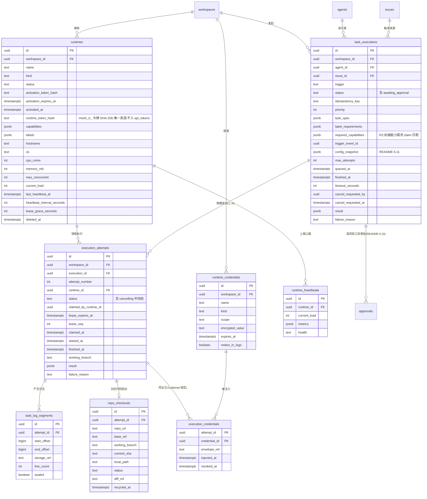
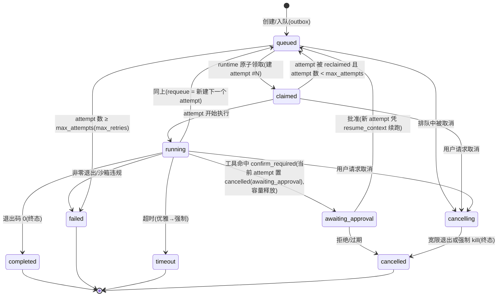

# Runtime（运行时）功能 Spec

> 所属层：AI 队友与智能体编排（AI Agent Core）— 执行基础设施
> 依赖 Spec：`agent`（执行者 / 默认 runtime 绑定）、`member` / `auth`（API token，只存哈希、显式 scope）、`workspace`（资源归属）、`skill`（工具能力）、`issue`（触发来源）
> 被依赖：`agent`（分派即触发的执行落地）、`autopilot`（自动化执行）、`squad`（多 agent 协作执行）
> 技术栈基准：Python 异步 Web 框架（FastAPI）+ SQLAlchemy 2.x（`DeclarativeBase` / `Mapped` / `mapped_column`，异步会话）+ PostgreSQL + WebSocket / SSE
> 文档性质：可直接指导开发的实现规格。runtime 是 agent 实际执行代码、操作仓库、运行命令的「身体」/「工位机器」。

---

## 全局一致性锚点（一律引用 README §6，本 Spec 不重复定义）

1. **存储**：PostgreSQL 16+；表名 snake_case 复数；主键 `UUID`（`gen_random_uuid()`）；所有表含 `created_at` / `updated_at`（`TIMESTAMPTZ`，默认 `now()`，UTC）；软删除统一 `deleted_at TIMESTAMPTZ NULL`。
2. **成员**：执行的归属 / 取消者引用 `members.id`（复合 FK，README §6.1/§6.2）；执行者引用 `agents.id`。
3. **接口**：基础路径 `/api/v1`；包络 / 分页 / 错误信封见 README §6.14；**供 runtime / CLI 使用的 API token 只存哈希、显式 scope**。
4. **实时**：统一实时契约见 README §6.7（频道内 `seq`、`realtime_events` 持久重放、`resume_from` / `resync_required`）；流式输出见 README §6.8；**日志流可降级 SSE**；事件名 `<entity>.<action>`。
5. **队列 / 投递**：**execution / attempt 分层、at-least-once、幂等键、凭证 fencing 以 README §6.4–§6.5 为唯一权威**；业务侧入队经 transactional outbox（§6.6）；审批挂起 `awaiting_approval` 见 §6.10。
6. **ORM**：SQLAlchemy 2.x 约定。

---

## 1. 功能描述

### 1.1 定位

Mesh 把 AI agent 当作真正的队友，而队友需要一台真实的「工位机器」才能干活——**runtime 就是这块工位**。它既可以是平台托管的（platform-managed），也可以是用户把自托管机器 / 容器注册进来（bring-your-own，BYO）。

**核心设计原则：调度协议与执行规范解耦。** 平台托管与自托管在「任务调度视角」完全同构——都通过同一套「注册—心跳—领取—上报」机器接口接入，差异仅在「谁来拉起守护进程」。调度器不区分二者，这是支持内网 / 合规客户的关键，也大幅降低核心复杂度。

**零外部队列。** 任务领取用 PostgreSQL `SELECT ... FOR UPDATE SKIP LOCKED` + 租约（lease）+ `lease_seq` 三件套实现可靠的分布式工作队列语义，不引入独立消息队列，与既定 PostgreSQL 技术栈天然契合。

### 1.2 功能点与场景表

| # | 功能点 | 典型用户场景 |
|---|--------|--------------|
| R1 | runtime 两类同构 | 创业团队用平台托管开箱即用；金融客户把内网加固服务器注册为自托管 runtime，代码不出内网 |
| R2 | 标签 / 能力匹配 | 一台带特殊 GPU / 工具链的机器打标签 `gpu=true`、`has-ffmpeg=true`，只让需要这些能力的任务被分派过来 |
| R3 | 三段式注册 | 「先建影子记录 + 一次性激活码 + 守护进程激活」，避免在 UI 手工填机器信息；30 秒后控制台出现一台在线机器 |
| R4 | 心跳与健康检查 | 守护进程每 15s 上报心跳与健康指标；超时判离线；区分「进程活但环境坏」（degraded） |
| R5 | 失联自愈 | 笔记本合盖休眠，45s 后该 runtime 判离线，其上在途任务自动重新排队，由另一台接手，无需人工 |
| R6 | 原子领取（SKIP LOCKED） | 3 台空闲 runtime 竞争同一任务，数据库层保证只有一台抢到，无锁等待、无重复执行 |
| R7 | 租约 + lease_seq | 领取即发租约，周期续租；租约过期视为持有者已死可回收；`lease_seq` 防「诈尸 / 脑裂」覆盖 |
| R8 | 并发上限与背压 | 每 runtime `max_concurrent`（默认 1）；满载时新任务停留 `queued`，队列深度即背压信号 |
| R9 | 日志流式 + 续传 | stdout/stderr 按行追加上报，带单调 `offset`；前端实时滚动，断线凭最后 offset 无缝续看，不丢不重 |
| R10 | 沙箱隔离 | 每任务独立容器 / 命名空间，文件 / 进程 / 网络隔离（**出站默认 deny**，按 task_spec 声明域名白名单放行），cgroup 资源配额，非特权用户，结束即销毁 |
| R11 | 代码仓库专属分支 checkout | 每任务创建专属工作分支 `agent/<execution-id>`，多任务并行不互相污染；产出差异（diff）回报供 review |
| R12 | 凭证注入（不落盘） | secret 仅在 claim 时随任务一次性下发、短期、最小权限；能走环境变量就不落盘；**全通道脱敏（日志 + 评论 + 附件产出物）**；**runtime_token 仅存于 daemon 受信进程，任务沙箱不可见** |
| R13 | 超时与取消（两段式） | 任务级超时 + 用户主动取消；先优雅终止（SIGTERM + 宽限期）再强制 kill（SIGKILL）；`cancelling` 显式中间态 |
| R14 | 运维可观测 | 队列深度 / 负载 / 心跳新鲜度作为一等可见信号；暂停 / 冻结 / 隔离等人类干预点 |

### 1.3 边界与非目标

**本模块负责：**
- runtime 的注册、激活、心跳、健康、生命周期；
- 任务队列、原子领取、租约、并发、状态机、失联回收；
- 执行日志的流式上报 / 续传 / 持久化索引；
- 沙箱执行规范的契约、代码 checkout 专属分支、凭证一次性下发与脱敏；
- 超时 / 取消 / 冻结 / 隔离。

**本模块不负责（非目标）：**
- agent 的配置 / 技能 / 可见性（属 `agent` 模块；本模块只读 `agent_id` 与 `default_runtime_id`）；
- 「分派即触发」的事件编排（属 `agent` 模块的 `enqueue_agent_run`，本模块只接收已入队的 `task_executions`）；
- secret 的密钥管理基础设施（KMS / 对称加密的具体实现属平台安全基础设施，本模块只定义 `encrypted_value` 契约与脱敏行为）；
- 底层模型供应商接入（统一以「主流大语言模型」抽象）。

**约束红线：**
- **凭证安全是红线而非功能**：secret 仅 claim 时一次性下发、短期、最小权限、能走环境变量就不落盘、**全通道脱敏（日志 + 评论 + 附件产出物均做 secret 命中检测，命中即拦截并告警）**、服务端永不回显明文、执行结束即失效。
- **工作区隔离是红线**：claim SQL 与领取端点强制 `workspace_id` 等值过滤（从 runtime 记录读取，不接受客户端传入），跨 workspace 领取不可能发生。
- **沙箱出站默认 deny 是红线**：任务沙箱出站网络默认拒绝，仅按 `task_spec` 声明的域名白名单放行；任何部署形态下禁止 RFC1918 / link-local / 云元数据地址（`169.254.169.254` 等）。
- **daemon token 隔离是红线**：`runtime_token`（长期凭证，可 claim 任务、换取其他任务的一次性凭证明文）**仅存于 daemon 受信进程**，任务沙箱无法读取 daemon 的环境变量、进程内存或控制套接字；`max_concurrent>1` 时恶意任务即使攻破沙箱也无法窃取 daemon token 冒充 runtime。
- 没有任务会永远卡住，也没有状态会永远悬而未决（超时 / 取消 / 失联回收均有「优雅→强制」两段式与显式中间态）。

---

## 2. 数据模型

### 2.1 实体清单与关系概览

> **逻辑 execution 与物理 attempt 分层（R1，README §6.4 权威）**：`task_executions` 是一次逻辑执行（触发后只有一行，承载幂等键、入队快照、最终结果）；`execution_attempts` 是一次物理尝试（领取、租约、runtime、分支、日志、结果都挂在 attempt 上）。**requeue 创建新 attempt，不复用/覆盖旧行**，审计链完整。



### 2.2 主要实体字段表

#### `runtimes`

| 字段 | 类型 | 约束 | 默认值 | 说明 |
|---|---|---|---|---|
| id | uuid | PK | `gen_random_uuid()` | 主键 |
| workspace_id | uuid | NOT NULL, FK→workspaces.id | - | 所属工作区 |
| name | text | NOT NULL | - | 显示名 |
| kind | text | NOT NULL, CHECK IN (`'platform_managed'`,`'self_hosted'`) | `'self_hosted'` | runtime 类型 |
| status | text | NOT NULL, CHECK（见下） | `'pending'` | 生命周期状态 |
| activation_token_hash | text | NULL | - | 一次性激活码哈希（激活后置空 / 作废） |
| activation_expires_at | timestamptz | NULL | - | **激活码过期时间（R1 补齐，默认创建后 15 分钟）；过期后激活返回 `410`** |
| activated_at | timestamptz | NULL | - | 激活时间（**即激活码 used_at**：非空表示激活码已使用，不可再用） |
| runtime_token_hash | text | NULL（激活前），UNIQUE | - | **runtime 机器令牌（`mesh_rt_` 前缀）的 SHA-256 哈希——唯一存储真源（MES-76 R2-H2 写死）**：激活时写入（明文仅激活响应一次），轮换时整体替换。**不入 `api_tokens`**——runtime 不是名册成员，`api_tokens.owner_member_id NOT NULL` 无法承载机器令牌；此前 `runtime_token_id FK→api_tokens.id` 与「哈希冗余」双真源已删除 |
| capabilities | jsonb | NOT NULL | `'[]'` | 已安装工具 / 能力列表，如 `["version_control","python","node"]` |
| labels | jsonb | NOT NULL | `'{}'` | 自定义标签，如 `{"gpu":"true","region":"intranet"}` |
| hostname | text | NULL | - | 主机名 |
| os | text | NULL | - | 操作系统标识 |
| cpu_cores | int | NULL | - | CPU 核数 |
| memory_mb | int | NULL | - | 内存（MB） |
| max_concurrent | int | NOT NULL, CHECK(>=0) | 1 | 并发上限 |
| current_load | int | NOT NULL, CHECK(>=0) | 0 | 当前活跃任务数（冗余计数，加速列表） |
| last_heartbeat_at | timestamptz | NULL | - | 最近心跳时间（判离线依据） |
| heartbeat_interval_seconds | int | NOT NULL | 15 | 约定心跳间隔 |
| lease_grace_seconds | int | NOT NULL | 45 | 租约 / 心跳宽限 |
| version | text | NULL | - | 守护进程版本 |
| created_at / updated_at | timestamptz | NOT NULL | `now()` | 审计时间 |
| deleted_at | timestamptz | NULL | - | 软删除 |

`status` 取值：`pending`（已建未激活）、`online`（在线可派）、`unavailable`（心跳超时 / 环境异常）、`paused`（人工暂停）、`draining`（排空中，不接新任务）、`decommissioned`（已下线）。

#### `task_executions`（逻辑执行，README §6.4 权威）

| 字段 | 类型 | 约束 | 默认值 | 说明 |
|---|---|---|---|---|
| id | uuid | PK | `gen_random_uuid()` | 主键（逻辑执行实例） |
| workspace_id | uuid | NOT NULL, FK→workspaces.id | - | 所属工作区 |
| agent_id | uuid | NULL | - | 执行该任务的 agent；**复合 FK `(workspace_id, agent_id) → agents(workspace_id, id)`**（README §6.2） |
| issue_id | uuid | NULL | - | 触发来源 issue；**复合 FK `(workspace_id, issue_id) → issues(workspace_id, id)`**（支撑「分派即开工」可观测） |
| trigger | text | NOT NULL DEFAULT `'assign'`, CHECK IN (`'assign'`,`'mention'`,`'autopilot'`,`'manual'`,`'chat'`,`'integration'`) | `'assign'` | 触发方式(R2:`'integration'` = 外部 IM/VCS 集成触发,README §6.9/§6.17、integrations.md;MES-67:`'chat'` 为平台驱动快速路径——不经 claim/attempt 物理层,入队后由 chat 生成引擎终态经 outbox 事件 `chat.generation_finished` 直接落终态,见 chat-session.md §4.4) |
| status | text | NOT NULL | `'queued'` | 逻辑状态机当前态（见 4.7；含 `awaiting_approval`，README §6.4/§6.10） |
| idempotency_key | text | NULL, UNIQUE（可空唯一） | - | 幂等键 `sha256(agent_id|issue_id|trigger_event_id)`（README §6.5），防重复入队 |
| priority | int | NOT NULL | 100 | 数值越小越优先 |
| task_spec | jsonb | NOT NULL | `'{}'` | 任务定义（命令、镜像要求、env 声明、需要哪些 secret） |
| label_requirements | jsonb | NOT NULL | `'{}'` | 要求 runtime 具备的标签 |
| required_capabilities | jsonb | NOT NULL | `'[]'` | 所需 runtime 能力清单（如 `["ffmpeg","gpu"]`）；**严格类型为「字符串数组」**——schema CHECK 拒绝任何非字符串元素（R3：调度字段只接受 capability key 集合，`{capability,permission}` 对象条目在入队归一算法中只取其 key，见 README §6.4/§6.11、agent.md §3.3；对象一旦混入,claim 的 JSONB `<@` 匹配永不命中、任务永久无法领取）；claim 时与服务端保存的 `runtimes.capabilities`（同为字符串数组）匹配（§2.5，README §6.4 权威字段，不能只在文字里声称已校验） |
| trigger_event_id | uuid | NULL | - | 触发来源的 outbox 事件 id（审计 / 幂等键输入，README §6.11） |
| config_snapshot | jsonb | NOT NULL | `'{}'` | **入队可复现快照**：agent_config_version_id、skill 版本、capability_grants（**严格 `[{capability,permission}]` 对象数组**——授权语义只进快照,不进 `required_capabilities` 调度字段,R3）、repo/base SHA、trigger_event_id（README §6.11） |
| max_attempts | int | NOT NULL, CHECK(>=1) | 3 | 最大物理尝试次数（超出转 `failed(max_retries)`） |
| queued_at | timestamptz | NOT NULL | `now()` | 入队时间 |
| finished_at | timestamptz | NULL | - | 逻辑结束时间 |
| timeout_seconds | int | NOT NULL | 1800 | 单 attempt 任务级超时 |
| cancel_requested_by | uuid | NULL, FK→members.id | - | 谁请求取消（成员 / 系统）；复合 FK `(workspace_id, cancel_requested_by) → members(workspace_id, id)` |
| cancel_requested_at | timestamptz | NULL | - | 取消请求时间 |
| result | jsonb | NULL | - | 最终结果摘要（来自成功 attempt） |
| failure_reason | text | NULL | - | 失败分类（oom / timeout / nonzero_exit / sandbox_violation / lease_expired / max_retries / superseded / agent_paused / awaiting_approval / approval_rejected / approval_expired / **cancelled_by_command**）；`awaiting_approval` = 审批挂起时当前 attempt 的失败分类；`cancelled_by_command` = IM 命令平面 `/stop` 触发的用户取消（integrations.md §3.7，MES-82） |
| context_injected_through_seq | bigint | NOT NULL DEFAULT 0 | - | **运行期上下文追加的服务端持久连续水位（MES-82）**：已连续注入完成的最大 append seq（连续前缀，GREATEST 单调不回退）；`inject_context` 下发起点以此为准（daemon 重启首报 0 经 GREATEST 忽略，已记录注入的行不再下发——去重快路径，非恰好一次承诺，见「运行期上下文追加」） |
| created_at / updated_at | timestamptz | NOT NULL | `now()` | 审计时间 |

> **领取 / 租约 / 分支 / 日志 / 单次结果等物理字段不在本表**——全部下沉到 `execution_attempts`；`retry_count` 由 `COUNT(execution_attempts)-1` 派生，不再存冗余列。

#### `execution_attempts`（物理尝试，R1 新增，README §6.4 权威）

| 字段 | 类型 | 约束 | 默认值 | 说明 |
|---|---|---|---|---|
| id | uuid | PK | `gen_random_uuid()` | 主键（物理尝试实例） |
| workspace_id | uuid | NOT NULL, FK→workspaces.id | - | 所属工作区 |
| execution_id | uuid | NOT NULL | - | 所属逻辑执行；**复合 FK `(workspace_id, execution_id) → task_executions(workspace_id, id)`** |
| attempt_number | int | NOT NULL, CHECK(>=1) | - | 第几次尝试；`UNIQUE (execution_id, attempt_number)` |
| runtime_id | uuid | NULL | - | 领取该尝试的 runtime；**复合 FK `(workspace_id, runtime_id) → runtimes(workspace_id, id)`** |
| claimed_by_runtime_id | uuid | NULL | - | 领取者（=runtime_id，显式表达领取动作） |
| status | text | NOT NULL, CHECK IN (`'claimed'`,`'running'`,`'cancelling'`,`'completed'`,`'failed'`,`'timeout'`,`'cancelled'`,`'reclaimed'`) | `'claimed'` | 尝试状态：`cancelling` = 取消请求已送达、进程退出中的物理中间态（R2：与逻辑层 `cancelling` 词汇统一，修复索引含 `cancelling` 而 CHECK 不含的不一致）；`cancelled(failure_reason='awaiting_approval')` = 审批挂起时当前 attempt 的终态（README §6.4/§6.10）；`reclaimed` = 被 reaper 回收（租约过期 / 失联），其审计信息原样保留 |
| lease_expires_at | timestamptz | NULL | - | 租约到期时间 |
| lease_seq | int | NOT NULL | 0 | 租约序号，每次领取 / 续租 +1（fencing，防诈尸覆盖） |
| claimed_at | timestamptz | NULL | - | 领取时间 |
| started_at | timestamptz | NULL | - | 实际开始执行时间 |
| finished_at | timestamptz | NULL | - | 尝试结束时间 |
| working_branch | text | NULL | - | **本 attempt 专属工作分支 `agent/<execution_id>/a<attempt_number>`**（按 attempt 唯一，避免两个 runtime/attempt 推同一分支，README §6.5） |
| result | jsonb | NULL | - | 本次尝试结果（exit code、diff 摘要、产物引用） |
| failure_reason | text | NULL | - | 本次失败分类 |
| created_at / updated_at | timestamptz | NOT NULL | `now()` | 审计时间 |

#### `task_log_segments`（日志索引表，内容在对象存储）

| 字段 | 类型 | 约束 | 默认值 | 说明 |
|---|---|---|---|---|
| id | uuid | PK | `gen_random_uuid()` | 主键 |
| workspace_id | uuid | NOT NULL, FK→workspaces.id | - | 所属工作区 |
| attempt_id | uuid | NOT NULL | - | 所属物理尝试；**复合 FK `(workspace_id, attempt_id) → execution_attempts(workspace_id, id)`**（日志按 attempt 留存，requeue 后新 attempt 日志独立，续传不串流） |
| start_offset | bigint | NOT NULL | - | 本段起始字节偏移（该 attempt 内单调） |
| end_offset | bigint | NOT NULL | - | 本段结束字节偏移 |
| storage_ref | text | NOT NULL | - | 对象存储对象键（指向真实日志内容） |
| line_count | int | NOT NULL | 0 | 本段行数 |
| sealed | boolean | NOT NULL | false | 段是否已封口（不再追加） |
| created_at | timestamptz | NOT NULL | `now()` | 创建时间 |

唯一约束：`UNIQUE(attempt_id, start_offset)`，保证偏移连续不重叠。

#### `runtime_credentials`（secret）

| 字段 | 类型 | 约束 | 默认值 | 说明 |
|---|---|---|---|---|
| id | uuid | PK | `gen_random_uuid()` | 主键 |
| workspace_id | uuid | NOT NULL, FK→workspaces.id | - | 所属工作区 |
| name | text | NOT NULL | - | 显示名，如 `intranet-repo-readonly` |
| kind | text | NOT NULL, CHECK IN (`'env'`,`'file'`,`'repo_token'`,`'ssh_key'`) | `'env'` | 注入形态 |
| scope | text | NOT NULL | `'execution'` | 作用域（execution / runtime / workspace） |
| encrypted_value | text | NOT NULL | - | 加密后的密文（永不返回明文） |
| redact_in_logs | boolean | NOT NULL | true | 是否进入日志脱敏黑名单 |
| expires_at | timestamptz | NULL | - | 短期凭证过期时间 |
| created_at / updated_at | timestamptz | NOT NULL | `now()` | 审计时间 |
| deleted_at | timestamptz | NULL | - | 软删除 |

#### `execution_credentials`（attempt ↔ 凭证多对多，注入审计 + 凭证 fencing）

| 字段 | 类型 | 约束 | 说明 |
|---|---|---|---|
| attempt_id | uuid | PK, 复合 FK→execution_attempts(workspace_id, id) | 复合主键（**凭证按 attempt 绑定**，README §6.5） |
| credential_id | uuid | PK, **复合 FK `(workspace_id, credential_id) → runtime_credentials(workspace_id, id)`**（README §6.2 多租户红线：跨租户凭证引用在 INSERT 时即被数据库拒绝） | 复合主键 |
| workspace_id | uuid | NOT NULL, FK→workspaces.id | 隔离 |
| envelope_ref | text | NOT NULL | 短期凭证信封引用（envelope id；值本身只经 claim/refetch 响应一次性下发） |
| injected_at | timestamptz | NOT NULL DEFAULT `now()` | 注入时间 |
| revoked_at | timestamptz | NULL | 撤销时间（freeze / 轮换 / attempt 终态后置位） |

> 记录「本次尝试实际注入了哪些 secret」，用于审计与脱敏对账。**凭证协议（R1，README §6.5/§6.11）**：
> - 凭证仅在 `claim` 响应中随 attempt 一次性下发（短期 envelope，默认 TTL ≤ 2h，绑定 attempt_id 与 lease_seq）；
> - **网络响应丢失 / requeue / freeze 后的重取**：daemon 可 `POST /api/v1/daemon/attempts/{attempt_id}/credentials:refetch`——仅当该 attempt 仍 `claimed/running` 且 `lease_seq` 匹配时返回**新 envelope**（旧 envelope 立即撤销，`revoked_at` 置位），每 attempt 重取次数有上限（默认 3），超限转人工 freeze 审查；
> - **轮换 / 撤销**：控制台轮换 `runtime_credentials` 时，在途 envelope 于下次心跳被下行指令要求重取；`POST /executions/{id}:freeze` 立即撤销该执行所有 attempt 的 envelope（`revoked_at`）；
> - attempt 终态（completed/failed/timeout/cancelled/reclaimed）即撤销其全部 envelope，服务端永不回显明文。

#### `repo_checkouts`

| 字段 | 类型 | 约束 | 默认值 | 说明 |
|---|---|---|---|---|
| id | uuid | PK | `gen_random_uuid()` | 主键 |
| workspace_id | uuid | NOT NULL, FK→workspaces.id | - | 隔离 |
| attempt_id | uuid | NOT NULL, UNIQUE | - | 一次物理尝试对应一次 checkout；**复合 FK `(workspace_id, attempt_id) → execution_attempts(workspace_id, id)`** |
| repo_url | text | NOT NULL | - | 仓库地址 |
| base_ref | text | NOT NULL | - | 基线分支 / SHA（取自 `config_snapshot.repo.base_sha`） |
| working_branch | text | NOT NULL | - | **本 attempt 专属分支 `agent/<execution_id>/a<attempt_number>`**（按 attempt 唯一，README §6.5） |
| commit_sha | text | NULL | - | 结束时 HEAD commit |
| local_path | text | NULL | - | runtime 本地工作目录（仅 runtime 内有效，非交付物） |
| status | text | NOT NULL | `'cloning'` | `cloning` / `ready` / `diff_ready` / `recycled` / `failed` |
| diff_ref | text | NULL | - | 差异（diff）产物的对象存储引用 |
| recycled_at | timestamptz | NULL | - | 回收时间 |
| created_at / updated_at | timestamptz | NOT NULL | `now()` | 审计时间 |

> **仓库 checkout 安全约定（H1）：**
> - **workspace 级 `allowed_repos` 白名单**：**`config_snapshot.repo.url`**（入队时冻结、可审计，README §6.11）必须在所属 workspace 配置的 `allowed_repos`（`workspaces.settings` 或独立配置表中的仓库 URL 白名单）内，checkout 请求到达服务端时强制校验，不在白名单内返回 `403 forbidden`。
> - **凭证按仓库最小化签发**：`repo_token` 类凭证（`runtime_credentials.kind='repo_token'`）必须限定于目标仓库（仅对该仓库有读/写权限的短期 token），防止持有 token 后 clone 白名单外的其他仓库。
> - **平台托管 runtime 出站限制**：平台托管（`kind='platform_managed'`）runtime 上的 checkout 操作禁止访问私网地址段（RFC1918、link-local、云元数据 `169.254.169.254` 等），防 SSRF（与 H4 出站策略合并落实）。（心跳明细，可选保留窗口）

| 字段 | 类型 | 约束 | 默认值 | 说明 |
|---|---|---|---|---|
| id | uuid | PK | `gen_random_uuid()` | 主键 |
| runtime_id | uuid | NOT NULL, FK→runtimes.id | - | 所属 runtime |
| current_load | int | NOT NULL | 0 | 上报时活跃任务数 |
| metrics | jsonb | NOT NULL | `'{}'` | CPU / 内存 / 磁盘等指标 |
| health | text | NOT NULL | `'healthy'` | `healthy` / `degraded` |
| created_at | timestamptz | NOT NULL | `now()` | 心跳时间 |

### 2.3 日志存储策略（重点）

日志量大、写多读少、需续传，直接全量写 PostgreSQL 不现实。采用「**内容进对象存储 + 偏移索引进数据库**」分层：

- 守护进程把日志按行追加到本地缓冲，达到阈值（如 64KB 或 2000 行或 2 秒）封口成一个**段（segment）**，上传对象存储，把 `(start_offset, end_offset, storage_ref)` 写入 `task_log_segments`。
- 全局 `offset` 是「该执行累计字节数」，单调递增，是续传与去重的唯一依据。
- 实时推送：守护进程在缓冲未封口前，也可经心跳 / 专用日志通道把「尾部增量」实时上报，服务端立即经 `/ws` 推给前端；封口后落对象存储。
- 续传：客户端记住已收到的最大 offset，重连时带 `?offset=N`，服务端从对象存储读 `[N, ...)` 区间补发，再继续实时流。
- 保留期：日志设 TTL（如 30 天），到期清理对象存储与索引行；热任务可延长。

### 2.4 关键索引（重点）

```sql
-- 队列领取核心索引：逻辑执行可领取（queued，含 requeue 回落到 queued 的）
CREATE INDEX idx_executions_claimable
  ON task_executions (workspace_id, priority, queued_at)
  WHERE status = 'queued';

-- 租约回收：找出租约过期的在途 attempt
CREATE INDEX idx_attempts_lease_expired
  ON execution_attempts (lease_expires_at)
  WHERE status IN ('claimed','running','cancelling');

-- 离线回收：按 runtime 找其在途 attempt
CREATE INDEX idx_attempts_runtime_inflight
  ON execution_attempts (runtime_id)
  WHERE status IN ('claimed','running','cancelling');

-- runtime 列表：在线 + 负载
CREATE INDEX idx_runtimes_status
  ON runtimes (status, last_heartbeat_at)
  WHERE deleted_at IS NULL;

-- 供引用方复合 FK（README §6.2）
CREATE UNIQUE INDEX uq_runtimes_ws_id ON runtimes (workspace_id, id);
CREATE UNIQUE INDEX uq_task_executions_ws_id ON task_executions (workspace_id, id);
CREATE UNIQUE INDEX uq_attempts_ws_id ON execution_attempts (workspace_id, id);
CREATE UNIQUE INDEX uq_runtime_credentials_ws_id ON runtime_credentials (workspace_id, id);

-- 任务历史按 agent / issue / 时间检索（分派即开工可观测）
CREATE INDEX idx_executions_agent_time ON task_executions (agent_id, queued_at DESC);
CREATE INDEX idx_executions_issue_time ON task_executions (issue_id, queued_at DESC);
CREATE INDEX idx_attempts_execution ON execution_attempts (execution_id, attempt_number);

-- 日志段按 attempt + 偏移定位续传起点
CREATE INDEX idx_log_segments_attempt_offset
  ON task_log_segments (attempt_id, start_offset);
```

### 2.5 claim 原子性与跨租户安全（重点，R1 权威版）

领取必须是「**同租户校验 + 服务端标签/能力匹配 + 原子容量扣减 + 建 attempt 发租约**」的**单事务原子操作**。

**安全红线（评审硬约束）：**
- claim SQL **必须带** `e.workspace_id = :runtime_workspace_id`（runtime token 解析出的归属工作区），杜绝跨租户领取；
- 标签 / 能力匹配**只能使用服务端保存的** `runtimes.labels` / `runtimes.capabilities`（claim 事务内 `SELECT ... FOR UPDATE` 读出），**绝不信任 daemon 请求体里的 `labels` / `capacity_remaining`**（请求体仅作诊断参考）；
- agent 设置了 `default_runtime_id` 时，仅该 runtime 可领取（`AND (a.default_runtime_id IS NULL OR a.default_runtime_id = :runtime_id)`）；
- 容量扣减在**同一事务内串行化**：先 `SELECT ... FOR UPDATE` 锁 runtime 行校验 `current_load < max_concurrent`（仅校验，不预扣），选定匹配任务后才 `current_load + 1`；**无匹配任务整体回滚、`current_load` 保持不变**（核心 SQL 见下，README §6.4），不做"先 +1 再找任务"的容量泄漏模式。

核心 SQL：

```sql
BEGIN;

-- 1) 锁定本 runtime 行：校验在线/越权/容量（仅校验，不预扣；行锁串行化同一 runtime 的并发 claim）
SELECT labels, capabilities
  FROM runtimes
 WHERE id = :runtime_id
   AND workspace_id = :runtime_workspace_id   -- 跨租户领取防护（token 解析，不信请求体）
   AND status = 'online' AND deleted_at IS NULL
   AND current_load < max_concurrent
 FOR UPDATE;
-- 0 行 → ROLLBACK，返回 204（满载/离线/越权）；容量未变

-- 2) 同租户 + 标签 + 能力 + 默认 runtime 约束下选一条最高优先级、最早入队的任务
WITH picked AS (
  SELECT e.id
  FROM task_executions e
  JOIN agents a ON a.id = e.agent_id
  WHERE e.status = 'queued'
    AND e.workspace_id = :runtime_workspace_id                  -- 跨租户领取防护
    AND e.label_requirements <@ :server_runtime_labels          -- 服务端标签（jsonb 包含）
    AND e.required_capabilities <@ :server_runtime_capabilities -- R2：服务端能力匹配（权威字段）
    AND (a.default_runtime_id IS NULL OR a.default_runtime_id = :runtime_id)
  ORDER BY e.priority ASC, e.queued_at ASC
  LIMIT 1
  FOR UPDATE OF e SKIP LOCKED                                   -- 跳过已被其它事务锁住的行
)
SELECT id INTO :picked_id FROM picked;

-- 3) 无匹配任务 → ROLLBACK（容量未预扣，无泄漏），返回 204
--    （R2 修复：旧版先 +1 再找任务，0 行仍可 COMMIT → 容量永久泄漏；此版绝不发生）

-- 4) 有任务：同事务内扣容量 + 逻辑转 claimed + 建 attempt #N（租约挂在 attempt 上）
UPDATE runtimes
   SET current_load = current_load + 1,
       last_heartbeat_at = now(),
       updated_at = now()
 WHERE id = :runtime_id;

UPDATE task_executions
   SET status = 'claimed', updated_at = now()
 WHERE id = :picked_id;

INSERT INTO execution_attempts
  (workspace_id, execution_id, attempt_number, runtime_id, claimed_by_runtime_id,
   status, lease_expires_at, lease_seq, claimed_at)
SELECT :runtime_workspace_id, :picked_id,
       COALESCE((SELECT MAX(attempt_number) FROM execution_attempts WHERE execution_id = :picked_id), 0) + 1,
       :runtime_id, :runtime_id, 'claimed',
       now() + (:lease_seconds || ' seconds')::interval, 1, now()
RETURNING id, attempt_number, lease_expires_at, lease_seq;

COMMIT;
```

要点：
- **容量防超卖 + 无任务必回滚**（R2 硬约束，T20）：claim 是「选任务 + 扣容量 + 建 attempt」的**单一原子成功分支**——先 `SELECT ... FOR UPDATE` 锁 runtime 行校验在线/越权/容量（**仅校验，不预扣**；行锁串行化同一 runtime 的并发 claim），再 `FOR UPDATE SKIP LOCKED` 选出匹配任务；**选中任务后**才 `current_load + 1`、转 `claimed`、建 attempt，一次提交。**有容量但无匹配任务时事务必须整体回滚（`current_load` 保持不变）再返回 204**，绝不「先 +1 再找任务」后带着 0 行结果 COMMIT（那会造成容量永久泄漏）。
- **能力匹配为权威条件**（R2/R3）：`e.required_capabilities <@ :server_runtime_capabilities` 与标签条件并行生效，能力清单取自步骤 1 锁定的服务端 `runtimes.capabilities`（不信 daemon 请求体）；缺所需能力的 runtime 跳过该任务（集成测试 T20）。**两侧均为严格字符串数组**（R3）：`runtimes.capabilities` 为 capability key 字符串数组；`e.required_capabilities` 由入队归一算法派生为纯 key 集合并由 schema CHECK 兜底（`{capability,permission}` 对象只进 `config_snapshot.capability_grants` 授权快照，绝不进调度字段——否则 `<@` 永不命中、任务永久无法领取，README §6.4/§6.11、agent.md §3.3、集成测试 T28）。
- `FOR UPDATE SKIP LOCKED`：多台 runtime 并发领取时，被某事务锁住的行直接被其它事务跳过，**零锁等待、零重复领取**。
- **容量幂等释放**：attempt 进入任一终态（completed/failed/timeout/cancelled）或被 reaper 置 `reclaimed` 时，**在状态迁移的同一事务内**对 `runtimes.current_load` 做 `GREATEST(current_load - 1, 0)`；每个 attempt 只释放一次（由 attempt 状态迁移守卫，终态 → 终态 的重复上报为 no-op），防止泄漏或扣成负数。
- `lease_seq` 每次领取 / 续租自增，作为 fencing 令牌：续租与一切上报必须带正确 `lease_seq`，旧持有者「诈尸」回写因不匹配被 `409` 拒绝（脑裂防护）。
- `idempotency_key` 唯一约束兜底，防同一逻辑触发被重复入队（README §6.5）。
- requeue = reaper 把过期 attempt 置 `reclaimed` 并把逻辑执行回落 `queued`；下一次领取**新建 attempt #N+1**，旧 attempt 的 runtime / claimed_at / 日志 / 分支 / 失败原因原样保留（审计不覆盖）。

SQLAlchemy 2.x 落地：同一 `async` 事务内依次 `select(...).with_for_update()` 锁 runtime 行（校验在线/容量，**不预扣**）→ `select(...).with_for_update(of=..., skip_locked=True)` 选任务 → **有任务才** `update()` 扣容量、转 claimed、`insert()` attempt，全程一个事务提交；无匹配任务则 `rollback()` 返回 204（容量不变）。

---

## 3. 接口设计

调用方分两类：
- **(a) 控制台 API**：用户 / 前端用，管理 runtime、查看执行、取消任务。Bearer token 为用户会话凭证。
- **(b) 机器 API（守护进程）**：runtime 守护进程用，注册 / 心跳 / 领取 / 上报。Bearer token 为 **runtime 机器令牌**（激活后获得，明文前缀 **`mesh_rt_`**——auth.md §2.5.1 令牌前缀注册表唯一权威，此前示例 `rt_live_` 已废弃；**仅存 SHA-256 哈希于 `runtimes.runtime_token_hash`（唯一真源，不进 `api_tokens`**——机器令牌无名册持有者，R2-H2），权限严格限定于本 runtime 与其领取的执行。**心跳为机器域专属能力：`mesh` CLI 与一切用户凭证不得调用 `/api/v1/daemon/*`（cli.md §1.3，MES-76 H8）**。

所有响应统一包络：成功单对象 `{"data": {...}}`；成功列表 `{"data": [...], "next_cursor": ...}`；失败 `{"error": {"code","message","details"}}`。

### 3.1 控制台 API

> **路径前缀（MES-77 跨 Spec 同步，配合 cli.md C1/C5，与后端 `runtime/routes.py` 实际实现逐端点对齐）**：控制台 API 一律为 workspace 作用域，路径均带 `/workspaces/{ws}/` 前缀（`{ws}` = workspace UUID 或 slug，鉴权中间件解析并校验成员资格，§6.2）；此前表内裸路径为文档漂移，以本表为准。daemon 命名空间 `/api/v1/daemon/*`（§3.5，机器域，`mesh_rt_` 令牌）不带工作区前缀——runtime 自身即工作区资源，激活时已绑定。

| 方法 | 路径 | 说明 |
|---|---|---|
| GET | `/api/v1/workspaces/{ws}/runtimes` | runtime 列表（游标分页，可按 status/kind/labels 过滤） |
| POST | `/api/v1/workspaces/{ws}/runtimes` | 创建 runtime（返回一次性激活码 + 安装命令；cli.md `mesh runtime register` 的控制台侧影子记录，cli.md §1.3） |
| GET | `/api/v1/workspaces/{ws}/runtimes/{id}` | runtime 详情（元数据、负载、最近心跳；cli.md `mesh runtime status` 排障只读数据源） |
| PATCH | `/api/v1/workspaces/{ws}/runtimes/{id}` | 更新（name、labels、max_concurrent） |
| POST | `/api/v1/workspaces/{ws}/runtimes/{id}:pause` | 暂停（不再领新任务） |
| POST | `/api/v1/workspaces/{ws}/runtimes/{id}:resume` | 恢复 |
| POST | `/api/v1/workspaces/{ws}/runtimes/{id}/tokens:rotate` | 轮换 runtime API token |
| DELETE | `/api/v1/workspaces/{ws}/runtimes/{id}` | 软删除 / 下线 |
| GET | `/api/v1/workspaces/{ws}/runtimes/{id}/executions` | 该 runtime 的执行历史 |
| GET | `/api/v1/workspaces/{ws}/executions/{id}` | 执行详情 |
| POST | `/api/v1/workspaces/{ws}/executions/{id}:cancel` | 取消执行 |
| POST | `/api/v1/workspaces/{ws}/executions/{id}:freeze` | 冻结可疑执行（吊销短期凭证、保留现场） |
| GET | `/api/v1/workspaces/{ws}/executions/{id}/logs?offset=N&stream=stdout` | 拉取日志（续传，REST 轮询 / 补历史；`stream=stdout\|stderr` 分流过滤） |
| GET(SSE) | `/api/v1/workspaces/{ws}/executions/{id}/logs/stream?offset=N` | 实时日志流（SSE 降级通道，§3.3） |
| WS | `/ws` 订阅 `execution:{id}:logs` | 实时日志流（WebSocket 主通道；频道名不含工作区段，订阅授权按 §6.7 资源级重校验） |
| GET/POST/DELETE | `/api/v1/workspaces/{ws}/credentials` | secret 管理（明文只进不出） |

**创建 runtime 请求 / 响应**：

```json
// POST /api/v1/workspaces/{ws}/runtimes  — 请求
{
  "name": "intranet-build-01",
  "kind": "self_hosted",
  "labels": {"region": "intranet", "gpu": "false"},
  "max_concurrent": 4
}
// 响应 201
{
  "data": {
    "id": "5f1c2a6e-9b4d-4c1a-8e2f-7a3b9c0d1e2f",
    "name": "intranet-build-01",
    "kind": "self_hosted",
    "status": "pending",
    "activation": {
      "code": "ACT-9F3K-2M7Q-XB4Z",
      "expires_at": "2026-07-24T10:15:00Z",
      "release": {
        "artifact_url": "https://releases.mesh.example/runtime/1.4.2/mesh-runtime_1.4.2_linux_x86_64.tar.gz",
        "sha256": "9f86d081884c7d659a2feaa0c55ad015a3bf4f1b2b0b822cd15d6c15b0f00a08",
        "signature_url": "https://releases.mesh.example/runtime/1.4.2/mesh-runtime_1.4.2_linux_x86_64.tar.gz.sig",
        "signing_key_url": "https://releases.mesh.example/mesh-release.pub"
      },
      "activate_hint": "mesh-runtime activate --activation-file ./activation.txt   # 激活码经受限文件/stdin 读取，勿放入命令行参数"
    }
  }
}
```

> **R1 安装安全（评审硬约束）**：
> - **废弃 `curl | sh`** 与"激活码出现在命令参数/历史"的做法。安装 = 下载**签名发布包** → 本地校验 `sha256` 与签名（minisign/cosign 兼容，公钥 `mesh-release.pub` 随产品发布）→ 解包到可审阅目录 → 执行 `mesh-runtime activate`。
> - **激活码不进命令行参数**：经受限 stdin 或仅本人可读的文件读取（`--activation-file <path>`，建议权限 `0600`；或 `MESH_ACTIVATION_CODE` 环境变量经受控环境注入），避免进程列表 / shell 历史泄露。
> - 提供**可审阅的手动安装路径**：文档给出逐步命令（下载、校验、解包、systemd 单元示例），用户可逐条审查后再执行；一键脚本仅为上述步骤的封装且默认 dry-run 打印。
> - 激活码一次性、短 TTL（默认 15 分钟，落库 `activation_expires_at`）、服务端只存 `activation_token_hash`；`activated_at` 非空即已用，重复激活返回 `410 activation_expired`。`releases.mesh.example` 为占位分发地址，部署时替换为实际内网 / 公网分发端点。

**取消执行**：

```json
// POST /api/v1/workspaces/{ws}/executions/8f3a1d2c-.../cancel  — 响应 200
{
  "data": {
    "id": "8f3a1d2c-4e5b-4a2c-9d1e-3b7c8a0f1e2d",
    "status": "cancelling",
    "cancel_requested_at": "2026-07-24T09:41:12Z"
  }
}
```

### 3.2 机器 API（守护进程）

| 方法 | 路径 | 说明 |
|---|---|---|
| POST | `/api/v1/daemon/runtimes:activate` | 用一次性激活码换取 runtime API token + 上报元数据（激活码经请求体传入，**仅由 daemon 从受限 stdin/文件读入后组装请求**，不落 shell 历史） |
| POST | `/api/v1/daemon/runtimes/{id}:heartbeat` | 心跳 + 健康指标 + 拉取下行指令（如取消、凭证轮换重取） |
| POST | `/api/v1/daemon/runtimes/{id}/executions:claim` | 原子领取一条任务（服务端按 §2.5 校验；凭证随响应按 attempt 一次性下发） |
| PATCH | `/api/v1/daemon/attempts/{attempt_id}` | attempt 状态迁移（claimed→running→completed/failed/timeout），带 `lease_seq` |
| POST | `/api/v1/daemon/attempts/{attempt_id}/logs` | 追加日志段（带 offset） |
| POST | `/api/v1/daemon/attempts/{attempt_id}/checkouts` | 上报 checkout / diff 结果 |
| POST | `/api/v1/daemon/attempts/{attempt_id}:renew-lease` | 租约续期 |
| POST | `/api/v1/daemon/attempts/{attempt_id}/credentials:refetch` | **凭证重取**（响应丢失/网络抖动后；仅租约有效且 attempt 在途时可调用，发新 envelope 撤旧，每 attempt 上限 3 次，见 §2.2 凭证协议） |
| POST | `/api/v1/daemon/executions/{id}/approvals` | **高风险工具审批请求**：运行中工具命中 `confirm_required` 时创建统一 `approvals`（README §6.10），**当前 attempt 置 `cancelled(awaiting_approval)`、租约结束、容量释放**，逻辑执行转 `awaiting_approval`；批准结果经心跳下行/轮询回传，执行回 `queued` 由新 attempt 凭 `resume_context` 续跑 |
| GET | `/api/v1/daemon/executions/{id}/context-appends` | **运行期上下文追加拉取**（MES-82）：`?since_seq=N` 返回 `execution_context_appends` 中 **seq > N 且 `injected_attempt_id IS NULL OR injected_attempt_id <> :current_attempt`** 的追加行（按 seq 序；attempt 作用域：当前 attempt 已记录行不返回、旧 attempt 记录行对新 attempt 照常返回，与协议同文无分叉）；daemon 收心跳 `inject_context` 指令后调用，下一 turn 边界注入（at-least-once，注入后尽力记录；见「运行期上下文追加」） | daemon |

> 机器 API 命名空间 `/api/v1/daemon/`，与 agent 管理的 `/api/v1/agents` 显式区分。鉴权：`runtime_token_hash` 与 `runtime_id` 匹配、`workspace_id` 由 token 解析注入（**不以请求体为准**），且仅允许操作本 runtime 与其领取的 attempt。

**激活**：

```json
// POST /api/v1/daemon/runtimes:activate  — 请求
{
  "activation_code": "ACT-9F3K-2M7Q-XB4Z",
  "metadata": {
    "hostname": "build-node-7",
    "os": "linux-x86_64",
    "cpu_cores": 8,
    "memory_mb": 32768,
    "capabilities": ["version_control", "python", "node", "ffmpeg"],
    "labels": {"region": "intranet"},
    "version": "1.4.2"
  }
}
// 响应 200
{
  "data": {
    "runtime_id": "5f1c2a6e-9b4d-4c1a-8e2f-7a3b9c0d1e2f",
    "runtime_token": "mesh_rt_a1b2c3d4e5f6...",
    "heartbeat_interval_seconds": 15
  }
}
```

> `runtime_token` 明文（`mesh_rt_` 前缀，auth.md §2.5.1 注册表）仅在此响应中出现一次；服务端写入 **`runtimes.runtime_token_hash`（SHA-256，唯一存储真源，R2-H2：不进 `api_tokens`）**，激活码随即作废。

**心跳（兼下行指令通道）**：

```json
// POST /api/v1/daemon/runtimes/5f1c.../heartbeat  — 请求
{
  "current_load": 2,
  "health": "healthy",
  "metrics": {"cpu_pct": 47, "mem_pct": 61, "disk_free_mb": 82000},
  "inflight": ["att-uuid-1", "att-uuid-2"],
  "context_progress": [
    {"attempt_id": "att-uuid-1", "execution_id": "8f3a1d2c-...", "injected_through_seq": 3},
    {"attempt_id": "att-uuid-2", "execution_id": "c21e9b7a-...", "injected_through_seq": 0}
  ]
}
// 响应 200
{
  "data": {
    "server_time": "2026-07-24T09:41:30Z",
    "commands": [
      {"type": "cancel_execution", "execution_id": "8f3a1d2c-...", "grace_seconds": 15},
      {"type": "inject_context", "attempt_id": "att-uuid-2", "execution_id": "c21e9b7a-...", "from_seq": 0}
    ]
  }
}
```

> **请求字段**：`inflight`（在途 **attempt UUID** 列表）保持既有语义，**仅作诊断**；**`context_progress`（MES-82 新增）为 best-effort 记录通道**：daemon 按在途 attempt 逐条上报 `{attempt_id, execution_id, injected_through_seq}`（本地视角已注入的最大 seq）；服务端经归属校验（陈旧/已回收 attempt 忽略）后回写 `injected_at` 并推进水位——**尽力去重,非正确性保证**（上报丢失只扩大重复窗口，at-least-once 语义不受影响，见「运行期上下文追加」）。缺省（旧 daemon 不上报）不影响语义（仅失去去重快路径）。
>
> **`inject_context` 下行指令（MES-82 运行期上下文追加）**：当某在途执行的 `execution_context_appends` 出现 seq 大于该执行已上报 `injected_through_seq` 的新行（如集成平台 `/btw` 命令写入，integrations.md §3.7），心跳响应即对持有该执行在途 attempt 的 runtime 下发 `{type:'inject_context', attempt_id, execution_id, from_seq}`（**`from_seq` = 服务端持久水位 `task_executions.context_injected_through_seq`，不以 daemon 上报值为下发起点**——daemon 重启首报 0 不引发重放）；daemon 拉取 `GET /api/v1/daemon/executions/{id}/context-appends?since_seq=N`（daemon 鉴权同 approvals 端点；**端点固定附加 `injected_at IS NULL` 过滤，已注入行绝不返回**）取得待注入行，**在该执行下一 agent turn 边界**以不可信数据块注入（README §6.15：LLM 单轮不可打断，追加不中断当前轮次）；**投递语义为 at-least-once**（注入后经心跳尽力记录 `injected_at`/水位作去重快路径，窄崩溃窗口内允许重复，下游容忍写死）。详见本节「运行期上下文追加」。

**运行期上下文追加（MES-82；integrations.md §3.7 `/btw` 的落点机制）**：

在途执行可被追加补充上下文（来源：IM 命令平面的 `/btw`），追加行是**不可信数据**（README §6.15），不改变执行的真源状态与配置快照（§6.11），仅供 agent 在后续 turn 作为数据参考：

| 字段 | 类型 | 约束 | 说明 |
| --- | --- | --- | --- |
| id | uuid | PK，`UNIQUE (workspace_id, id)`（§6.2 复合 FK 引用前提） | |
| workspace_id | uuid | NOT NULL，FK→workspaces ON DELETE CASCADE | |
| execution_id | uuid | NOT NULL，复合 FK `(workspace_id, execution_id) → task_executions(workspace_id, id)` ON DELETE CASCADE | 追加归属的在途执行 |
| seq | bigint | NOT NULL，`UNIQUE (execution_id, seq)` | 执行内单调递增（插入时执行维度咨询锁取号，同 integrations.md §2.10 协议） |
| source | text | NOT NULL，CHECK IN ('im_btw') | 追加来源（本期仅 IM `/btw`；扩展新来源需登记本词汇） |
| payload | jsonb | NOT NULL | `{sender_user_id, sender_display, text(≤4000 字符截断), received_at, conversation_ref}` |
| injected_at | timestamptz | NULL | daemon 注入后经心跳 best-effort 记录的时刻（**attempt 作用域去重快路径，非 exactly-once 真源**，见「注入投递语义」；NULL = 未记录/待投递；执行终态时仍未注入的行随执行审计保留） |
| injected_attempt_id | uuid | NULL | **记录注入的 attempt（attempt 作用域 receipt，R5-1）**：仅当前有效 attempt 的 ACK 可写入（旧/已回收 attempt 经 fencing 拒写）；**requeue 产生新 attempt 后，旧 attempt 的记录不再计入水位与过滤**（新 attempt 至少重收一次——允许重复、不得丢失，与 at-least-once 承诺一致） |
| created_at | timestamptz | NOT NULL DEFAULT now() | |

- **写入方与准入**：集成平台命令平面以服务层调用写入（不经 daemon HTTP）；**仅对 `queued/claimed/running` 的执行可写；`cancelling` 的执行不再接受追加**（integrations.md §3.7：渲染"任务正在停止，无法补充"反馈），终态执行写入 → `422`（渲染"任务已结束"）。**每执行追加上限（M3，成本放大残余面护栏）与 seq 取号共用同一把执行级事务咨询锁**：写入事务先 `pg_advisory_xact_lock(hashtext('eca:' || execution_id))`，锁内**依次**校验 `MESH_CONTEXT_APPEND_MAX_COUNT`（默认 20 条，COUNT(*)）与 `MESH_CONTEXT_APPEND_MAX_CHARS`（默认 32000 字符，SUM 累计 payload.text 长度）→ 超限拒绝写入 `422 append_limit_exceeded`（integrations.md 渲染"补充已达上限"反馈 + 审计）→ 通过则 `seq = COALESCE(max(seq),0)+1` INSERT（锁保证计数校验与取号原子，并发写不穿 20/32000 上限）。
- **注入投递语义（at-least-once，诚实降级写死；R4-2）**：本 Spec **不承诺「不重放 / 恰好一份」**——现有 runtime 契约只有审批挂起/续跑路径的 `resume_context`，**没有每 turn 对话检查点原语**（无 checkpoint 表/提交 API/已提交指针/attempt fencing），故注入记录无法与"对话状态"同事务原子发布；与其虚构机制，**显式降级为 at-least-once**：每条 append 对执行**至少投递一次**，窄崩溃窗口（已注入对话、记录落库前崩溃）内**可能重复投递**。**下游容忍写死**：append 块是**不可信补充数据**（README §6.15），同一 `(execution_id, seq)` 的重复块与单块**语义等价**（同一条"顺便补充"重复展示，不是两条不同指示）；**注入不是工具调用、不触发执行、不累积副作用**——agent 不得把重复补充块解读为"强调/执行两次"，高风险动作仍只经 `confirm_required` 闸门（与补充次数无关）。
- **尽力去重（attempt 作用域，缩小重复窗口，非正确性保证）**：① daemon 进程内 `(execution_id, seq)` 已注入集合（正常运行期不重复注入）；② 注入完成后 daemon 经心跳 `context_progress` 上报，服务端**以当前有效 attempt 为限**回写 receipt：`UPDATE execution_context_appends SET injected_at=now(), injected_attempt_id=:attempt WHERE execution_id=:e AND seq <= :reported AND (injected_attempt_id IS NULL OR injected_attempt_id = :attempt)`——**fencing：`:attempt` 必须是该执行当前有效 attempt（`execution_attempts` 最新、状态 `claimed/running`、未被 `reclaimed`），否则整条 ACK 拒写**（旧 attempt 迟到 ACK 不污染新 attempt 视图；best-effort：上报/回写丢失只扩大重复窗口，不破坏语义）；③ `GET …?since_seq=N` 固定附加过滤 `injected_attempt_id IS NULL OR injected_attempt_id <> :current_attempt`（**仅当前 attempt 的 receipt 生效**）；④ **requeue 到新 attempt：新 attempt 至少重收一次**——旧 attempt 的 receipt 不再计入（水位重置，见下），seq 重新下发（at-least-once：允许重复、不得丢失）。
- **服务端连续水位（attempt 作用域，去重快路径，best-effort）**：`task_executions.context_injected_through_seq BIGINT NOT NULL DEFAULT 0` = 该执行**在当前有效 attempt 上已连续记录注入完成**的最大 seq（连续前缀：所有 seq ≤ W 的行 `injected_attempt_id = 当前有效 attempt`）。心跳 ACK 处理事务内以**找首个缺口**重算（仅计当前 attempt 的 receipt）：`W = COALESCE((SELECT min(seq) FROM execution_context_appends WHERE execution_id=:e AND (injected_attempt_id IS DISTINCT FROM :current_attempt)), (SELECT COALESCE(max(seq),0)+1 …)) - 1`，同事务写入 `context_injected_through_seq = W`（attempt 作用域内单调；**跨 attempt 不单调——requeue 时重置，见下**）。**requeue 事务（attempt → `reclaimed` + 创建新 attempt，runtime 失联回收/审批续跑同一路径）同事务原子重置 `context_injected_through_seq = 0`**——旧 attempt 的 receipt 行保留审计但不再计入水位与下发过滤，新 attempt 从 0 重收（至少一次）。水位与 receipt 是缩小重复窗口的快路径，**不是 exactly-once 真源**（真源语义见上「at-least-once」条）。
- **下行起点以服务端水位为准**：`inject_context` 触发条件 = 存在 `seq > context_injected_through_seq AND (injected_attempt_id IS NULL OR injected_attempt_id <> 当前有效 attempt)` 的行；**下发 `from_seq = context_injected_through_seq`（服务端水位，不以心跳上报值为起点）**；`GET …?since_seq=N` 端点**固定附加 attempt 作用域过滤**（`injected_attempt_id IS NULL OR injected_attempt_id <> :current_attempt`，API 表与协议同文，无两份契约）——当前 attempt 已记录行不返回，**旧 attempt 记录的行对新 attempt 照常返回（不丢失）**。
- **daemon 侧快路径去重**：daemon 进程内以 `(execution_id, seq)` 集合避免同一 attempt 内重复拉取——**仅快路径，正确性由 attempt 作用域 receipt + requeue 重置保证**（attempt 失败/回收后新 attempt 重收，不丢失；重复由下游容忍消化）。
- **边界**：追加不是 `config_snapshot` 的一部分（不参与 §6.11 冻结）；执行**终态**（cancelled/failed/completed/timeout）时未注入的追加行保留审计（`injected_at` 永 NULL），不再投递；追加行的删除仅随执行级联（ON DELETE CASCADE），不提供单独删除端点（审计完整性）。

**领取任务（原子，核心）**：

```json
// POST /api/v1/daemon/runtimes/5f1c.../executions:claim  — 请求
// 注意：labels / capacity_remaining 仅作诊断参考，服务端匹配与容量判定
// 一律使用服务端保存的 runtime 标签/能力/负载（§2.5 安全红线），不信任请求体。
{
  "diagnostics": {"labels": {"region": "intranet"}, "capacity_remaining": 2}
}
// 响应 200（领到）
{
  "data": {
    "execution": {
      "id": "8f3a1d2c-4e5b-4a2c-9d1e-3b7c8a0f1e2d",
      "status": "claimed",
      "config_snapshot": {
        "agent_config_version_id": "v-uuid-7",
        "skill_versions": {"s-uuid-1": "sv-3"},
        "capability_grants": [{"capability": "exec:shell", "permission": "confirm_required"}],
        "repo": {"url": "https://code.intranet.example/team/web-app.git", "base_ref": "main", "base_sha": "c0ffee..."},
        "trigger_event_id": "evt-uuid-1"
      },
      "task_spec": {
        "image": "agent-sandbox:py312",
        "command": ["mesh-agent", "run", "--task", "fix-login-bug"],
        "env_declarations": ["REPO_TOKEN", "CI_API_KEY"],
        "credential_ids": ["cr-001", "cr-002"],
        "required_capabilities": ["version_control", "python"]
      },
      "timeout_seconds": 1800
    },
    "attempt": {
      "id": "att-uuid-1",
      "attempt_number": 1,
      "working_branch": "agent/8f3a1d2c-4e5b-4a2c-9d1e-3b7c8a0f1e2d/a1",
      "lease_expires_at": "2026-07-24T09:43:30Z",
      "lease_seq": 1,
      "credentials": [
        {"id": "cr-001", "kind": "repo_token", "env": "REPO_TOKEN", "value": "rot-xxxx", "envelope": "env-1", "expires_at": "2026-07-24T11:41:00Z"},
        {"id": "cr-002", "kind": "env", "env": "CI_API_KEY", "value": "sk-xxxx", "envelope": "env-2", "expires_at": "2026-07-24T11:41:00Z"}
      ]
    }
  }
}
// 注：task_spec.required_capabilities 与该执行行的 required_capabilities 一致，用于 claim 能力匹配（§2.5，README §6.4）。
// 响应 204（队列空、无满足标签/能力约束的任务、或容量已满；无匹配任务时事务整体回滚、current_load 不变，无 body）
```

> **凭证只在 `claim` / `credentials:refetch` 响应中随 attempt 一次性下发**（短期 envelope、最小权限、绑定 attempt 与 lease）；之后任何接口都不再返回明文。`credentials[].value` 命中脱敏黑名单，日志中出现即替换为 `***`。响应丢失后经 `credentials:refetch` 重取（旧 envelope 立即撤销，§2.2）。
>
> **注入环境变量名安全约束（NEW-M1）**：`env_declarations` 与 `credentials[].env` 中的环境变量名须经服务端白名单校验——**拒绝 `LD_*`、`PATH`、`PYTHON*`、`NODE_OPTIONS`、`DYLD_*` 及平台保留前缀（`MESH_DAEMON_*`、`MESH_INTERNAL_*`）等敏感名**，防止覆盖进程加载器 / 运行时 / daemon 认证变量；仅允许匹配 `^[A-Z][A-Z0-9_]{0,63}$` 且不在拒绝清单内的名称，校验在 claim 组装时执行，非法名返回 `422`。

**追加日志（带 offset，幂等）**：

```json
// POST /api/v1/daemon/attempts/att-uuid-1/logs  — 请求
{
  "lease_seq": 1,
  "stream": "stdout",
  "start_offset": 1048576,
  "lines": ["$ mesh-agent run --task fix-login-bug", "> 检出仓库基线 main → 专属分支 agent/8f3a1d2c-.../a1", "..."],
  "sealed": false
}
// 响应 200
{ "data": {"accepted_end_offset": 1049012, "redacted_hits": 1} }
```

**租约续期 / 状态上报（均按 attempt，带 lease_seq fencing）**：

```json
// POST /api/v1/daemon/attempts/att-uuid-1:renew-lease
{ "lease_seq": 1 }
// 响应 200
{ "data": {"lease_expires_at": "2026-07-24T09:45:30Z", "lease_seq": 2} }

// PATCH /api/v1/daemon/attempts/att-uuid-1
{ "lease_seq": 2, "status": "completed", "result": {"exit_code": 0, "diff_summary": "+34 -7 in 3 files"} }
// 响应 200（同事务内逻辑执行转 completed 并幂等释放 runtime 容量，§2.5）
{ "data": {"id": "att-uuid-1", "execution_id": "8f3a1d2c-...", "status": "completed",
           "execution_status": "completed", "finished_at": "2026-07-24T09:50:01Z"} }
```

> `lease_seq` 不匹配（attempt 已被 reaper 回收并改派）→ `409 conflict`，旧持有者的一切上报被拒（脑裂防护）。

### 3.3 日志流式端点（WebSocket 主 / SSE 降级，含续传）

连接：订阅 `/ws` 频道 `execution:{id}:logs`（可带初始 `offset`）；SSE 降级 `GET /api/v1/workspaces/{ws}/executions/{id}/logs/stream?offset=N`（MES-77：补 workspace 前缀，与 §3.1 表一致）。两者共用同一 offset 协议。

服务端帧（文本帧，JSON）：

```json
{"type": "log", "stream": "stdout", "offset": 1049012, "ts": "2026-07-24T09:41:58Z", "line": "PASSED [ 41%]"}
{"type": "log", "stream": "stderr", "offset": 1049120, "ts": "2026-07-24T09:41:59Z", "line": "warning: deprecated api"}
{"type": "status", "status": "running"}
{"type": "heartbeat", "server_time": "2026-07-24T09:42:00Z"}
{"type": "end", "status": "completed", "final_offset": 1200340}
```

> **`log` 帧 `ts` 字段（MES-77 增量，配合 cli.md C5 写死）**：RFC3339 UTC，取**服务端收口该日志段的时间**（服务端时钟，避免 daemon 时钟偏移进入日志时间轴）；同一 `POST /api/v1/daemon/attempts/{attempt_id}/logs` 追加段内的各帧共享该段收口时间（段级精度，非逐行）。「日志跟随」的时间维度以此为准；CLI `mesh execution logs` 默认行首渲染 `ts`（`--timestamps=false` 关闭，cli.md §1.2 C12）。WS 主通道与 SSE 降级通道帧形一致。

续传协议：客户端记录已处理的最大 offset，断线重连时把它作为 `?offset=` 传入；服务端先从对象存储补发 `[offset, 已封口)` 历史，再接上实时尾部，保证**不丢、不重、单调递增**。客户端按 `offset` 去重以防补发与实时流边界重叠。频道内事件 `seq`（README §6.7，用于事件重放）与日志 `offset`（用于字节续传）并存、互不混用；日志频道为 `execution:{id}:logs`，其 `seq` 作用域即该频道。

### 3.4 错误码表

| HTTP | code | 含义 | 处理建议 |
|---|---|---|---|
| 400 | invalid_request | 参数 / 格式错误 | 修正请求体 |
| 401 | unauthorized | token 缺失 / 失效 | 重新激活 / 登录 |
| 403 | forbidden | token 无权操作该资源 | 检查 runtime / 用户权限 |
| 404 | not_found | 资源不存在 | 核对 ID |
| 409 | conflict | 状态机非法迁移 / 版本冲突（lease_seq 不符） | 重新领取 / 续租 |
| 410 | activation_expired | 激活码过期或已用 | 重新创建 runtime 取新码 |
| 422 | invalid_state_transition | 非法状态迁移 | 按状态机修正 |
| 429 | rate_limited | 触发限流 | 退避重试（带 Retry-After） |
| 500 | internal_error | 服务端错误 | 重试 / 上报 |

### 3.5 鉴权与分页

- 控制台 API：用户 Bearer token（会话 / JWT），按 workspace + 角色鉴权。
- 机器 API：runtime Bearer token（`mesh_rt_` 前缀，哈希唯一存于 `runtimes.runtime_token_hash`，R2-H2），服务端校验 token 哈希与 `runtime_id` 匹配，且仅允许操作**本 runtime 所属 workspace** 内的资源与其领取的执行。**claim 操作的 workspace 归属从 `runtimes.workspace_id` 服务端读取，不接受客户端传入；心跳 `inflight` 上报的 execution 按 `workspace_id` 归属校验。**
- **机器 API 强制 TLS（红线）**：runtime 协议（machine API）**仅经 TLS（HTTPS）提供，拒绝明文 HTTP**；claim / refetch 响应携带凭证明文，传输层降级即导致凭证裸露。所有 `/api/v1/daemon/` 端点强制 `Strict-Transport-Security`，非 TLS 请求返回 `403`。
- **runtime 状态与 token 联动（R3-H4：mesh_rt_ 真源全链收口）**：runtime 进入 `paused` / `decommissioned` / 软删除（`deleted_at` 置位）时，同步**清除其 `runtimes.runtime_token_hash`（置 NULL——机器令牌唯一真源即失效，不存在可复用的已撤销令牌行；恢复服务经 `tokens:rotate` 重新签发新 `mesh_rt_` 令牌）**，**不经 `api_tokens`（runtime 令牌不入该表，R2-H2）**；所有机器 API 端点统一校验 runtime `status` 与 `deleted_at IS NULL`，且 token 哈希校验命中当前 `runtime_token_hash`——下线/停用后旧令牌调用任何机器 API 必然 401（哈希为空或状态门拒绝）。
- 分页：`GET /api/v1/workspaces/{ws}/runtimes?cursor=<opaque>&limit=20` → `{"data":[...], "next_cursor":"eyJ..."}`，`next_cursor=null` 表示末页。

### 3.6 WebSocket 事件清单（`/ws`，`<entity>.<action>`，带 seq）

| 频道 | 事件 | 说明 |
|------|------|------|
| `workspace:{ws}:runtimes` | `runtime.activated` / `runtime.online` / `runtime.offline` / `runtime.degraded` / `runtime.paused` | runtime 生命周期，注册引导页 ⏳→✅ |
| `workspace:{ws}:executions` | `execution.queued` / `execution.claimed` / `execution.started` / `execution.awaiting_approval` | 队列、领取与审批挂起可观测 |
| `execution:{id}` | `execution.completed` / `execution.failed` / `execution.timeout` / `execution.cancelled` / `execution.requeued` | 终态 / 重排 |
| `execution:{id}:logs` | `execution.log`（带 offset） | 实时日志流 |
| `workspace:{ws}:queue` | `queue.depth_changed` | 队列深度背压信号 |

**内部领域事件 `execution.finished`（outbox，非实时事件名；MES-82 写死为终态单一扇出真源）**：执行进入任一终态时，状态机在**同一事务**写 outbox 内部事件 `execution.finished`，payload `{execution_id, workspace_id, status, failure_reason, finished_at}`，`status ∈ completed | failed | timeout | cancelled`（终态统一承载，不分裂为四个 event type）。**所有终态下游消费者一律订阅本事件**，不直接消费上表的实时事件名（`execution.completed/failed/…` 是本事件经 outbox→projector 派生到 `/ws` 的实时投影）：通知 fan-out（§6.13）、integrations.md 队列项终态回写（`completed→done`、`failed/timeout→failed`、`cancelled→cancelled`）、squad/autopilot 终态联动。幂等：消费方按 `execution_id` + 终态守卫去重（重复出队 no-op）。

---

## 4. UI / UX

### 4.1 runtime 列表页（注册与监控）

```
┌──────────────────────────────────────────────────────────────────────────┐
│ Runtimes                                              [ + 新增 runtime ]  │
├──────────────────────────────────────────────────────────────────────────┤
│ 筛选: [状态 ▾ 全部] [类型 ▾ 全部] [标签 ▾]            搜索: [__________]  │
├────┬──────────────────┬─────────┬──────────┬──────────────┬──────────────┤
│ ●  │ 名称             │ 类型     │ 负载      │ 心跳          │ 操作         │
├────┼──────────────────┼─────────┼──────────┼──────────────┼──────────────┤
│ 🟢 │ intranet-build-01│ 自托管   │ 2/4 ▓▓░░ │ 5s 前         │ 详情 · 暂停  │
│ 🟢 │ gpu-worker-02    │ 自托管   │ 1/2 ▓░░░ │ 12s 前        │ 详情 · 暂停  │
│ ⚪ │ cloud-pool-a     │ 平台托管 │ 3/8 ▓▓▓░ │ 2s 前         │ 详情         │
│ ⚫ │ old-laptop       │ 自托管   │ 0/1 ░░░░ │ 离线 3m       │ 详情 · 删除  │
└────┴──────────────────┴─────────┴──────────┴──────────────┴──────────────┘
   队列深度: 7 个任务等待中  ·  图例: 🟢在线 ⚪平台托管 ⚫离线/不可用
```

要点：状态点 + 负载条 + 「Xs 前心跳」三要素一眼可读；离线行置灰并给出离线时长；顶部显示队列深度作为背压信号。

### 4.2 runtime 详情页（监控）

```
┌──────────────────────────────────────────────────────────────────────────┐
│ ← Runtimes / intranet-build-01                       [暂停] [轮换token]  │
├──────────────────────────────────────────────────────────────────────────┤
│ 状态: 🟢 online        主机: build-node-7        OS: linux-x86_64        │
│ CPU: 8 核   内存: 32GB   并发: 2/4   守护进程: v1.4.2                      │
│ 标签: region=intranet  gpu=false                                         │
│ 能力: version_control · python · node · ffmpeg                           │
├──────────────────────────────────────────────────────────────────────────┤
│ 心跳曲线(最近 1h)        内存/CPU 负载                                    │
│   ▂▃▅▇▅▃▂▁▂▃▅▇  (稳定 ~15s 一跳)                                         │
├──────────────────────────────────────────────────────────────────────────┤
│ 正在执行 (2)                                                              │
│  • fix-login-bug      running  03:21   [查看] [取消]                      │
│  • add-metrics-hook   running  00:47   [查看] [取消]                      │
├──────────────────────────────────────────────────────────────────────────┤
│ 历史任务                                      [查看全部 →]                │
│  • refactor-auth     completed  昨天     12:03                           │
│  • fix-ci-flake      timeout    昨天      30:00                          │
└──────────────────────────────────────────────────────────────────────────┘
```

### 4.3 注册新 runtime 引导页

```
┌──────────────────────────────────────────────────────────────────────────┐
│ 新增 runtime                                                              │
├──────────────────────────────────────────────────────────────────────────┤
│ 1) 基本信息                                                               │
│    名称: [intranet-build-01]   并发上限: [4]   标签: [region=intranet +]  │
│ 2) 在你的机器上安装(签名发布包 + 校验,可逐步审阅):                        │
│    ┌─────────────────────────────────────────────────────────────┐ [复制] │
│    │ # a. 下载签名发布包与公钥(占位分发地址,部署时替换)            │        │
│    │ curl -fsSLO https://releases.mesh.example/runtime/1.4.2/\    │        │
│    │   mesh-runtime_1.4.2_linux_x86_64.tar.gz{,.sig}              │        │
│    │ curl -fsSLO https://releases.mesh.example/mesh-release.pub   │        │
│    │ # b. 校验 checksum 与签名                                     │        │
│    │ sha256sum -c <(echo "9f86d0… mesh-runtime_1.4.2…tar.gz")     │        │
│    │ minisign -Vm mesh-runtime_1.4.2…tar.gz -p mesh-release.pub   │        │
│    │ # c. 解包到可审阅目录(无隐式执行)                             │        │
│    │ tar -xzf mesh-runtime_1.4.2…tar.gz -C ~/.local/opt/mesh      │        │
│    │ # d. 激活码写入仅本人可读的文件,再激活(不进命令行参数)        │        │
│    │ umask 077 && printf '%s' "ACT-9F3K-2M7Q-XB4Z" > activation.txt│       │
│    │ ~/.local/opt/mesh/mesh-runtime activate \                    │        │
│    │   --activation-file ./activation.txt && shred -u activation.txt│      │
│    └─────────────────────────────────────────────────────────────┘        │
│ 3) 等待激活…  ⏳ 正在等待守护进程上线                                       │
│    ✅ 已激活!build-node-7 (8核/32GB) 已上线         [前往详情 →]          │
└──────────────────────────────────────────────────────────────────────────┘
```

要点：三步式（下载校验 → 解包 → 受限激活）；**不提供 `curl | sh` 一键管道**，所有命令逐条可见可审；激活码经 `0600` 文件/stdin 传入、用后即毁，不进入命令行参数与 shell 历史；第 3 步用 `/ws` 监听 `runtime.activated` 事件，守护进程一上线即由 ⏳ 变 ✅，无需手动刷新。

### 4.4 单个任务执行详情页（任务实时日志流）

```
┌──────────────────────────────────────────────────────────────────────────┐
│ ← 执行 / fix-login-bug                                [取消运行]          │
├──────────────────────────────────────────────────────────────────────────┤
│ 状态: ● running   runtime: intranet-build-01   已运行: 03:21 / 上限 30:00 │
│ agent: 小测 [AI]   issue: #MES-42   触发: 分派   分支: agent/8f3a1d2c     │
├──────────────────────────────────────────────────────────────────────────┤
│ [实时日志] [产物/Diff] [凭证(已脱敏)]                                     │
│ ┌───────────────────────────────────────────────────────────────┐ ⏸ 跟随 │
│ │ $ mesh-agent run --task fix-login-bug                          │        │
│ │ > 检出仓库基线 main → 专属分支 agent/8f3a1d2c                   │        │
│ │ > 读取仓库结构…                                                 │        │
│ │ > 定位 src/auth/login.py                                       │        │
│ │ $ pytest tests/test_login.py                                  │        │
│ │ PASSED [ 41%] ▍(实时滚动,断线自动续传)                          │        │
│ └───────────────────────────────────────────────────────────────┘        │
│ 日志偏移: 1,049,012 bytes   [下载完整日志]                                │
└──────────────────────────────────────────────────────────────────────────┘
```

要点：顶部状态 + 运行时长 / 超时进度条；日志区「跟随尾部」开关（自动滚到底）；Diff 标签页展示 checkout 产出的差异；凭证标签只展示注入了哪些 secret 的元信息（名称 / 种类），值恒为 `***`；取消按钮带二次确认；结束后状态条变绿 / 红并展示失败原因。

### 4.5 分派即开工的可观测性

「分派即触发」（见 agent Spec）的每一步在 UI 上可见、可追：
- 卡片负责人设为 agent → `execution.queued` → 卡片头像出现「●处理中」动效，时间线记「小测 已开始处理」。
- `execution.claimed`：详情显示由哪台 runtime 领取（含 hostname / 标签）。
- `execution.started`：进入 running，日志流开始滚动。
- 终态：`execution.completed/failed/timeout/cancelled` 触发通知，附 `failure_reason` 与最后 N 行日志摘要，深链直达详情页。
- issue 详情页可反查其所有 `task_executions`（按 `issue_id` 索引），看到「这个任务被 agent 干过几次、每次结果如何」。

### 4.6 关键端到端流程

```
用户                  控制台/UI            平台服务            守护进程(用户机器)
 │ 点"新增 runtime"     │                    │                    │
 │─────────────────────>│ POST /runtimes     │                    │
 │                      │───────────────────>│ 建 pending + 激活码 │
 │ 看到安装命令+激活码    │<───────────────────│                    │
 │ 在机器执行安装命令     │                    │                    │
 │────────────────────────────────────────────────────────────────>│ 启动
 │                      │                    │  :activate(激活码)  │
 │                      │                    │<────────────────────│ 上报元数据
 │                      │                    │  返回 runtime token  │
 │   WS: runtime.activated                   │────────────────────>│
 │ UI 由 ⏳ 变 ✅         │<───────────────────│  status=online      │
 │                      │                    │  :heartbeat 循环      │
 │                      │                    │<────────────────────│ 每 15s
 │ 派任务(指定标签)      │                    │  入队 queued         │
 │─────────────────────>│───────────────────>│                    │
 │                      │                    │  :claim (SKIP LOCKED)│
 │                      │                    │<────────────────────│ 领取
 │                      │                    │  返回任务+短期凭证    │
 │                      │                    │────────────────────>│ checkout 专属分支
 │   WS: execution.log  │                    │  :logs (offset)     │
 │ 实时看日志滚动         │<═══════════════════│<────────────────────│ 边跑边报
 │ (断线→带 offset 续传)  │                    │  :renew-lease 循环  │
 │                      │                    │<────────────────────│
 │ [可选] 点"取消"       │ POST :cancel       │  下行 cancel 指令     │
 │─────────────────────>│───────────────────>│────────────────────>│ SIGTERM→SIGKILL
 │                      │   WS: execution.*  │  PATCH status       │
 │ 看到 cancelled        │<═══════════════════│<────────────────────│
 │                      │   WS: end/通知      │  PATCH completed    │
 │ 任务完成收到通知       │<═══════════════════│<────────────────────│
```

### 4.7 双层状态机（逻辑 execution + 物理 attempt，README §6.4 权威）

**逻辑层 `task_executions.status`**：



**物理层 `execution_attempts.status`**：`claimed → running →（cancelling 两段式取消中间态）→ completed/failed/timeout/cancelled`，或被 reaper 置 `reclaimed`（租约过期 / 失联回收）。**attempt 行永不删除或改写**：每次 requeue 新建 `attempt_number+1` 行，旧行的 runtime / claimed_at / 日志 / 分支 / 失败原因原样保留（审计不覆盖，`retry_count = COUNT(attempts)-1`）。

要点说明：
- 核心终态为 `completed` / `failed` / `cancelled`；`timeout` 是失败类的独立终态（UX 上单独呈现，`failure_reason='timeout'`）。
- `cancelling` 是显式中间态，让「取消请求已发出但进程未退」这段时间可见；取消两段式：SIGTERM + 宽限期 → SIGKILL，取消幂等（对已结束执行为 no-op）。
- 失败分类新增 `superseded`（被替换分派取消）、`agent_paused`（agent 暂停取消在途）、`awaiting_approval`（审批挂起时当前 attempt）、`approval_rejected` / `approval_expired`（README §6.9/§6.10）。
- **审批挂起唯一协议（R2，README §6.4/§6.10）**：审批挂起只能从 `running` 进入（不存在 `queued → awaiting_approval`）。进入 `awaiting_approval` 时当前 attempt 置 `cancelled(failure_reason='awaiting_approval')`——**attempt 不保留在途态**（审计行保留）、**租约不继续**（随 attempt 终态结束）、**容量不占用**（幂等释放）；批准后执行回 `queued`，由新 attempt #N+1 凭 `resume_context` 从审批点续跑；拒绝/过期 → `cancelled`。该协议不存在"暂停租约导致永久卡死"的路径，每一环皆可测试（T21）。
- 所有 daemon 迁移走 `PATCH` 带 `lease_seq` / 状态前置校验，非法迁移返回 `409` / `422`。

### 4.8 claim 竞争、租约续期与失联自愈

- **竞争**：纯数据库 `SKIP LOCKED` 解决，无需分布式锁。多 runtime 并发 claim 时彼此不阻塞，各拿各的任务，公平按 `(priority, queued_at)` 排序。
- **租约（lease）**：领取 / 续租都设 `lease_expires_at`；守护进程在租约到期前（如剩余 1/3 时）主动 `:renew-lease`。
- **失联回收（reaper）**：平台后台任务（README §2.2 拓扑）周期扫描 `idx_attempts_lease_expired`，对租约过期且近期无心跳的 **attempt** 执行回收：该 attempt 置 `reclaimed`（审计信息保留），逻辑执行若 `COUNT(attempts) < max_attempts` → 回落 `queued`（等待新建 attempt #N+1）；否则 → `failed(max_retries)`。回收同事务**幂等释放** runtime 容量（`GREATEST(current_load-1,0)`），并回收时 `lease_seq++`，使旧持有者后续上报因 `lease_seq` 不匹配被 `409` 拒绝——**防止「诈尸」runtime 覆盖新持有者的结果**（脑裂防护）。
- **审批挂起无需 reaper 特殊处理（R2，README §6.4 唯一协议）**：`awaiting_approval` 逻辑态**没有在途 attempt**——进入该态时当前 attempt 已置 `cancelled(awaiting_approval)`、租约已结束、容量已幂等释放，因此 reaper 扫描在途 attempt 时不会触及该执行；不存在"awaiting_approval 期间暂停租约 / reaper 不回收"的在途态，也就没有"暂停租约导致永久卡死"的路径。批准后执行回 `queued`，由新 attempt 凭 `resume_context` 从审批点续跑。
- **实时性**：心跳与续租共用一条心跳通道降低连接数；取消等下行指令搭载心跳响应即时下发（默认 15s 内必达），需要更快可叠加 `/ws` 下行通道。

### 4.9 日志流式推送方案

- **首选 WebSocket**（双向、可承载取消等下行帧）；**SSE 作为降级**（纯下行、穿透代理友好）；两者共用同一 offset 协议。
- **三段合一**：①补发历史（对象存储读 `[offset, sealed)`）→ ②实时尾部（守护进程未封口增量经服务端转发）→ ③`end` 帧收尾。客户端按 offset 去重衔接。
- **背压**：客户端慢时服务端缓冲有上限，溢出则丢弃可重发的实时帧（客户端可凭 offset 重连补回），保证连接不崩。
- **脱敏前置**：脱敏在守护进程上报前或服务端入流前完成，前端永远拿不到明文。

### 4.10 通知与人类监督

- 任务终态事件（completed/failed/timeout/cancelled）仍**全部产生**，但**分发**按 README §6.13 唯一通知优先级矩阵（不再"所有终态一刀切进收件箱"）：
  - **失败 / 超时**（`failed`/`timeout`）= **critical**：进收件箱（触发者 / 分派者 / 订阅者）+ 可选 Webhook（供集成到团队 IM / 告警），**穿透 quiet hours、重置同组未读**；
  - **成功**（`completed`）= normal：默认留运行页 / 时间线，仅当用户在 `notification_preferences` 显式订阅 `execution_finished`（或该执行由本人 @/分派触发且开启"执行结果"订阅）才进收件箱，**不穿透 quiet hours、不重置未读**；
  - **取消**（`cancelled`，含 superseded/agent_paused）= normal：留运行页，**取消发起者本人不通知**。
- runtime 离线、由在线转 unavailable、队列积压超阈值等运维事件也产生通知。
- 通知带深链，点击直达执行详情页；失败通知附 `failure_reason` 与最后 N 行日志摘要。

人类干预点：
- **取消运行中任务**：一键取消，优雅终止 + 保留 diff 供排查。
- **暂停 / 恢复 runtime**：`paused` 后不接新任务，在跑的排空，用于维护窗口。
- **冻结可疑执行**：对疑似失控 / 越权的执行，**立即撤销其所有 attempt 的短期凭证 envelope**（`execution_credentials.revoked_at` 置位，§2.2 凭证协议）、收紧网络策略、保留现场（工作目录与日志）供取证，而非简单 kill。
- **凭证可见性**：详情页「凭证」标签只展示元信息（名称 / 种类），值恒为 `***`，并提供「本任务用到哪些凭证」的审计视图。
- **并发与超时旋钮**：用户可调 `max_concurrent` 与任务 `timeout_seconds`，在「跑得快」与「机器不被拖垮」间自行权衡。

---

## 5. 验收标准

### 5.1 功能验收

- [ ] 创建 runtime 生成 `status='pending'` 记录 + 一次性激活码（只存哈希、`activation_expires_at` 默认 15 分钟）+ **签名发布包安装信息**（artifact URL + sha256 + 签名 + 公钥；无 `curl | sh`，激活码不进命令行参数，README/§3.1 安装安全）。
- [ ] 守护进程凭激活码（受限 stdin/`0600` 文件读入）激活：上报元数据 → 换取 runtime 机器令牌（`mesh_rt_` 前缀，**SHA-256 仅存 `runtimes.runtime_token_hash`，`api_tokens` 无该行**——information_schema/表查询断言，R2-H2）→ runtime 置 `online`，`activated_at` 置位（激活码作废）；过期 / 已用激活码返回 `410`；轮换（`tokens:rotate`）后旧哈希即失效。
- [ ] 平台托管与自托管走同一套「注册—心跳—领取—上报」机器接口，调度器不区分二者。
- [ ] 心跳每 15s（可配）上报；超过 `心跳间隔 × 容忍倍数`（默认 45s）未收到判离线置 `unavailable`；`degraded` 时停止派新任务但保留排障窗口。
- [ ] **claim 跨租户安全**：claim SQL 带 `workspace_id = :runtime_workspace_id`（token 解析，不信请求体）；标签/能力匹配只用服务端保存值，**能力匹配为权威条件（`required_capabilities <@ runtimes.capabilities`，不只文字声称）**；`default_runtime_id` 约束生效（集成测试 T1/T2/T20）。
- [ ] **容量防超卖 + 无任务必回滚**：claim 先 `SELECT ... FOR UPDATE` 锁 runtime 行校验容量（不预扣），选定匹配任务后才 `current_load + 1`；**有容量但无匹配任务 → 事务整体回滚、`current_load` 不变（T20）**；attempt 终态/回收幂等释放，并发 5 抢 2 容量恰成功 2（集成测试 T3/T20）。
- [ ] 取消为两段式：先 SIGTERM + 宽限期，宽限期满 SIGKILL；`cancelling` 中间态可见；取消幂等，对已结束任务为 no-op。
- [ ] 任务级超时：守护进程本地计时 + 服务端租约 / 看门狗双重兜底；超时置 `timeout`，`failure_reason='timeout'`。
- [ ] 日志按行 / 块上报带单调 `offset`（按 attempt）；前端实时滚动；断线凭最后 offset 无缝续传，不丢不重。
- [ ] checkout 为每 **attempt** 创建专属工作分支 `agent/<execution-id>/a<attempt>`（按 attempt 唯一，README §6.5），多任务/多尝试并行不互相污染；结束产出差异（diff）回报，工作目录超期回收。
- [ ] 凭证仅在 claim / refetch 响应按 attempt 一次性下发（短期 envelope）；`credentials:refetch` 仅租约有效且在途时可用、发新撤旧、上限 3 次；freeze 立即撤销 envelope；`execution_credentials` 记录注入/撤销审计；UI 凭证标签值恒为 `***`。
- [ ] **execution/attempt 分层**（README §6.4）：requeue 新建 attempt 行，旧 attempt 审计信息不被覆盖（集成测试 T4）；`retry_count` 由 attempts 数派生，超 `max_attempts` 转 `failed(max_retries)`；**物理层 `cancelling` 中间态与逻辑层词汇统一（CHECK 与索引一致）**；非法迁移返回 `409`/`422`。
- [ ] **入队可复现快照**（README §6.11）：`config_snapshot` 冻结 agent_config_version_id、skill 版本、**`capability_grants`（版本化 capability key + permission，不含工具目录主键）**、repo/base SHA、trigger_event_id；运行期间配置 / 能力授权变更不影响在途执行。
- [ ] **高风险工具审批（唯一续跑协议）**：执行前经 `/daemon/executions/{id}/approvals` 创建统一 `approvals`（README §6.10），**当前 attempt 置 `cancelled(awaiting_approval)`、租约结束、容量释放**，执行转 `awaiting_approval`（reaper 无需特殊处理，无在途租约）；批准后执行回 `queued`，**新 attempt 凭 `resume_context` 从审批点续跑**；拒绝/过期转 `cancelled`；**同一 subject 仅一个 pending approval**（部分唯一索引兜底，集成测试 T8/T21）。
- [ ] 控制台 / 机器 API 全部走统一响应包络与错误信封（README §6.14）；机器 API token 越权访问其它 runtime 返回 `403`。
- [ ] **仓库 checkout 白名单验收（H1）**：checkout 命中 `allowed_repos` 白名单外 URL → `403`；`repo_token` 不可用于白名单外仓库；平台托管 runtime checkout 私网 / 元数据地址被拒（集成测试覆盖）。
- [ ] **注入环境变量名安全（NEW-M1）**：`env_declarations` / `credentials[].env` 含 `LD_*` / `PATH` / `PYTHON*` / 平台保留前缀等敏感名 → `422` 拒绝。
- [ ] **机器 API 强制 TLS（NEW-M3）**：非 TLS 请求到 `/api/v1/daemon/` 返回 `403`。
- [ ] **runtime 下线即吊销 token（NEW-L2；R3-H4 收口）**：runtime 进入 `paused` / `decommissioned` / 软删除时，`runtime_token_hash` 同步清除（置 NULL，`api_tokens` 无此令牌行）；下线后以旧令牌明文调用任何机器 API 返回 `401`；恢复服务经 `tokens:rotate` 签发新令牌，旧令牌永久失效。
- [ ] 运行状态事件经 outbox → `realtime_events`（频道内 seq，README §6.6/§6.7）发布，断线重放不漏不重；事件名全部命中 README §6.7 词汇注册表（含 `execution.awaiting_approval`）。
- [ ] **终态通知按矩阵分发**（README §6.13，T25）：失败/超时为 critical 进收件箱 + 可选 Webhook（穿透 quiet hours、重置同组未读）；成功默认留运行页/时间线（仅订阅 `execution_finished` 时进收件箱，不穿透、不重置未读）；取消不通知发起者。

### 5.2 非功能验收（重点红线）

- [ ] **任务不重复领取**：多 runtime 并发 claim 同一任务时，`FOR UPDATE SKIP LOCKED` 保证恰有一台抢到，其余立即抢下一条；零锁等待、零重复执行；`idempotency_key` 唯一约束兜底防重复入队。
- [ ] **失联自愈**：runtime 失联后，其上 `claimed/running` 且租约过期的 **attempt** 由 reaper 置 `reclaimed`、逻辑执行回落 `queued` 新建下一个 attempt（或超 `max_attempts` 转 `failed`），改由其它 runtime 接手，无需人工；回收时 `lease_seq++` 防「诈尸」覆盖（脑裂防护），容量幂等释放。**`awaiting_approval` 无在途 attempt（当前 attempt 已 cancelled、租约已结束），reaper 无需特殊处理，无"暂停租约导致永久卡死"路径（README §6.4 唯一协议）**。
- [ ] **凭证不落盘**：secret 能走环境变量就不写文件；必须落盘的写入内存型临时目录，任务结束即删；服务端永不回显明文（`encrypted_value` 只进不出）；**全通道脱敏——日志、评论、附件产出物均做 secret 命中检测，命中即拦截该内容写出并触发安全告警**（验收须覆盖评论 / 附件通道，非仅日志）；短期凭证 envelope 按 attempt 绑定，attempt 终态即撤销（§2.2）。
- [ ] **日志时延**：日志尾部增量从守护进程产生到前端可见 P95 ≤ 2s（WebSocket 在线时）；断线重连凭 offset 补发不丢不重；封口段落对象存储读取续传 P95 ≤ 1s。
- [ ] **沙箱隔离**：每任务独立容器 / 命名空间，cgroup CPU / 内存 / 磁盘 / 时长配额；单任务 OOM 被终止标 `failed(sandbox/oom)`，同机其它任务与宿主机不受影响；非特权用户运行，不挂宿主机 root。
- [ ] **沙箱出站默认 deny**：任务沙箱出站网络默认拒绝，仅按 `task_spec` 声明的域名白名单放行；任何部署形态下禁止 RFC1918 / link-local / 云元数据地址（`169.254.169.254` 等）；被注入任务无法将凭证经外联外泄或扫描内网。
- [ ] **daemon token 与任务沙箱隔离（红线）**：`runtime_token` 仅存于 daemon 受信进程的环境 / 内存中，任务沙箱无法读取 daemon 的 env / 进程内存 / 控制套接字；`max_concurrent>1` 时恶意任务窃取 daemon token 的攻击路径不存在；此约束写入部署规范文档。
- [ ] **无永久卡死**：任何任务最终都到达终态（completed/failed/timeout/cancelled），无状态永久悬而未决（租约 + 看门狗 + reaper 共同保证）。
- [ ] **队列背压可观测**：队列深度、负载、心跳新鲜度在列表 / 详情实时可见；`queue.depth_changed` 事件推送。
- [ ] **限流与退避**：机器 API 与控制台 API 接入限流，超限返回 `429` 带 `Retry-After`。
- [ ] **错误信息不泄漏**：错误响应无堆栈 / 无 SQL / 无凭证明文，仅含字段级 `details`。
- [ ] **性能**：claim 走 `idx_executions_claimable`，1000 台 runtime 并发领取下 P95 ≤ 100ms（README §10 基准）；租约回收扫描走 `idx_attempts_lease_expired`。
