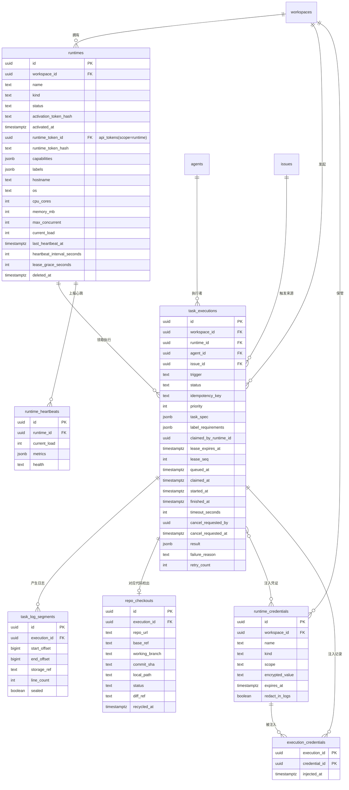
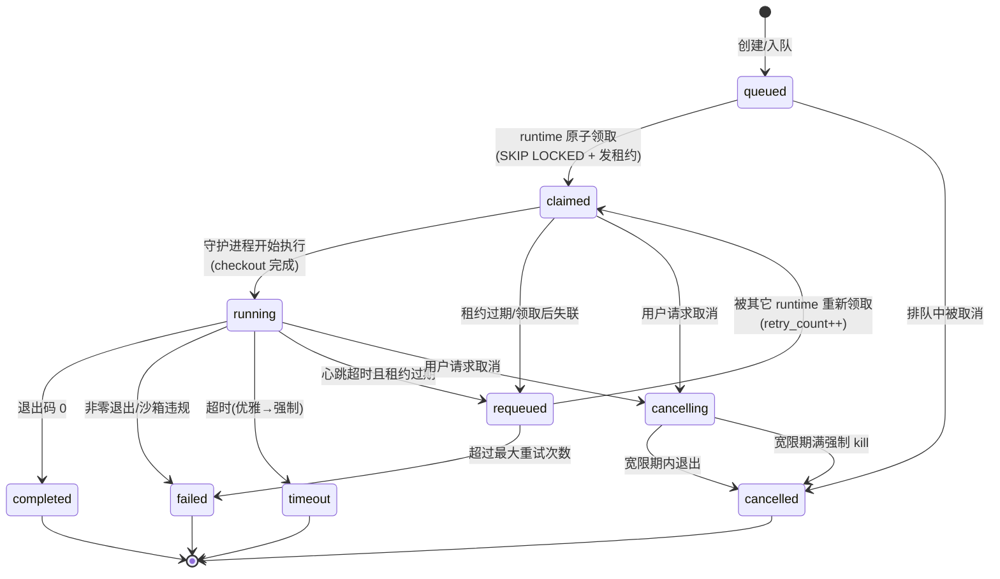

# Runtime（运行时）功能 Spec

> 所属层：AI 队友与智能体编排（AI Agent Core）— 执行基础设施
> 依赖 Spec：`agent`（执行者 / 默认 runtime 绑定）、`member` / `auth`（API token，只存哈希、显式 scope）、`workspace`（资源归属）、`skill`（工具能力）、`issue`（触发来源）
> 被依赖：`agent`（分派即触发的执行落地）、`autopilot`（自动化执行）、`squad`（多 agent 协作执行）
> 技术栈基准：Python 异步 Web 框架（FastAPI）+ SQLAlchemy 2.x（`DeclarativeBase` / `Mapped` / `mapped_column`，异步会话）+ PostgreSQL + WebSocket / SSE
> 文档性质：可直接指导开发的实现规格。runtime 是 agent 实际执行代码、操作仓库、运行命令的「身体」/「工位机器」。

---

## 全局一致性锚点（本 Spec 一律遵循）

1. **存储**：PostgreSQL；表名 snake_case 复数；主键 `UUID`（`gen_random_uuid()`）；所有表含 `created_at` / `updated_at`（`TIMESTAMPTZ`，默认 `now()`，UTC）；软删除统一 `deleted_at TIMESTAMPTZ NULL`。
2. **成员**：执行的归属 / 取消者引用 `members.id`；执行者引用 `agents.id`。
3. **接口**：基础路径 `/api/v1`；`Authorization: Bearer <token>`；游标分页响应 `{"data": [...], "next_cursor": <opaque|null>}`；统一错误信封 `{"error": {"code","message","details"}}`；**供 runtime / CLI 使用的 API token 只存哈希、显式 scope**。
4. **实时**：单一 WebSocket 端点 `/ws`，按频道订阅，事件携带单调递增 `seq` 支持断线重放；**日志流可降级 SSE**；事件名 `<entity>.<action>`。
5. **ORM**：SQLAlchemy 2.x 约定。

---

## 1. 功能描述

### 1.1 定位

Mesh 把 AI agent 当作真正的队友，而队友需要一台真实的「工位机器」才能干活——**runtime 就是这块工位**。它既可以是平台托管的（platform-managed），也可以是用户把自托管机器 / 容器注册进来（bring-your-own，BYO）。

**核心设计原则：调度协议与执行规范解耦。** 平台托管与自托管在「任务调度视角」完全同构——都通过同一套「注册—心跳—领取—上报」机器接口接入，差异仅在「谁来拉起守护进程」。调度器不区分二者，这是支持内网 / 合规客户的关键，也大幅降低核心复杂度。

**零外部队列。** 任务领取用 PostgreSQL `SELECT ... FOR UPDATE SKIP LOCKED` + 租约（lease）+ `lease_seq` 三件套实现可靠的分布式工作队列语义，不引入独立消息队列，与既定 PostgreSQL 技术栈天然契合。

### 1.2 功能点与场景表

| # | 功能点 | 典型用户场景 |
|---|--------|--------------|
| R1 | runtime 两类同构 | 创业团队用平台托管开箱即用；金融客户把内网加固服务器注册为自托管 runtime，代码不出内网 |
| R2 | 标签 / 能力匹配 | 一台带特殊 GPU / 工具链的机器打标签 `gpu=true`、`has-ffmpeg=true`，只让需要这些能力的任务被分派过来 |
| R3 | 三段式注册 | 「先建影子记录 + 一次性激活码 + 守护进程激活」，避免在 UI 手工填机器信息；30 秒后控制台出现一台在线机器 |
| R4 | 心跳与健康检查 | 守护进程每 15s 上报心跳与健康指标；超时判离线；区分「进程活但环境坏」（degraded） |
| R5 | 失联自愈 | 笔记本合盖休眠，45s 后该 runtime 判离线，其上在途任务自动重新排队，由另一台接手，无需人工 |
| R6 | 原子领取（SKIP LOCKED） | 3 台空闲 runtime 竞争同一任务，数据库层保证只有一台抢到，无锁等待、无重复执行 |
| R7 | 租约 + lease_seq | 领取即发租约，周期续租；租约过期视为持有者已死可回收；`lease_seq` 防「诈尸 / 脑裂」覆盖 |
| R8 | 并发上限与背压 | 每 runtime `max_concurrent`（默认 1）；满载时新任务停留 `queued`，队列深度即背压信号 |
| R9 | 日志流式 + 续传 | stdout/stderr 按行追加上报，带单调 `offset`；前端实时滚动，断线凭最后 offset 无缝续看，不丢不重 |
| R10 | 沙箱隔离 | 每任务独立容器 / 命名空间，文件 / 进程 / 网络隔离（**出站默认 deny**，按 task_spec 声明域名白名单放行），cgroup 资源配额，非特权用户，结束即销毁 |
| R11 | 代码仓库专属分支 checkout | 每任务创建专属工作分支 `agent/<execution-id>`，多任务并行不互相污染；产出差异（diff）回报供 review |
| R12 | 凭证注入（不落盘） | secret 仅在 claim 时随任务一次性下发、短期、最小权限；能走环境变量就不落盘；**全通道脱敏（日志 + 评论 + 附件产出物）**；**runtime_token 仅存于 daemon 受信进程，任务沙箱不可见** |
| R13 | 超时与取消（两段式） | 任务级超时 + 用户主动取消；先优雅终止（SIGTERM + 宽限期）再强制 kill（SIGKILL）；`cancelling` 显式中间态 |
| R14 | 运维可观测 | 队列深度 / 负载 / 心跳新鲜度作为一等可见信号；暂停 / 冻结 / 隔离等人类干预点 |

### 1.3 边界与非目标

**本模块负责：**
- runtime 的注册、激活、心跳、健康、生命周期；
- 任务队列、原子领取、租约、并发、状态机、失联回收；
- 执行日志的流式上报 / 续传 / 持久化索引；
- 沙箱执行规范的契约、代码 checkout 专属分支、凭证一次性下发与脱敏；
- 超时 / 取消 / 冻结 / 隔离。

**本模块不负责（非目标）：**
- agent 的配置 / 技能 / 可见性（属 `agent` 模块；本模块只读 `agent_id` 与 `default_runtime_id`）；
- 「分派即触发」的事件编排（属 `agent` 模块的 `enqueue_agent_run`，本模块只接收已入队的 `task_executions`）；
- secret 的密钥管理基础设施（KMS / 对称加密的具体实现属平台安全基础设施，本模块只定义 `encrypted_value` 契约与脱敏行为）；
- 底层模型供应商接入（统一以「主流大语言模型」抽象）。

**约束红线：**
- **凭证安全是红线而非功能**：secret 仅 claim 时一次性下发、短期、最小权限、能走环境变量就不落盘、**全通道脱敏（日志 + 评论 + 附件产出物均做 secret 命中检测，命中即拦截并告警）**、服务端永不回显明文、执行结束即失效。
- **工作区隔离是红线**：claim SQL 与领取端点强制 `workspace_id` 等值过滤（从 runtime 记录读取，不接受客户端传入），跨 workspace 领取不可能发生。
- **沙箱出站默认 deny 是红线**：任务沙箱出站网络默认拒绝，仅按 `task_spec` 声明的域名白名单放行；任何部署形态下禁止 RFC1918 / link-local / 云元数据地址（`169.254.169.254` 等）。
- **daemon token 隔离是红线**：`runtime_token`（长期凭证，可 claim 任务、换取其他任务的一次性凭证明文）**仅存于 daemon 受信进程**，任务沙箱无法读取 daemon 的环境变量、进程内存或控制套接字；`max_concurrent>1` 时恶意任务即使攻破沙箱也无法窃取 daemon token 冒充 runtime。
- 没有任务会永远卡住，也没有状态会永远悬而未决（超时 / 取消 / 失联回收均有「优雅→强制」两段式与显式中间态）。

---

## 2. 数据模型

### 2.1 实体清单与关系概览



### 2.2 主要实体字段表

#### `runtimes`

| 字段 | 类型 | 约束 | 默认值 | 说明 |
|---|---|---|---|---|
| id | uuid | PK | `gen_random_uuid()` | 主键 |
| workspace_id | uuid | NOT NULL, FK→workspaces.id | - | 所属工作区 |
| name | text | NOT NULL | - | 显示名 |
| kind | text | NOT NULL, CHECK IN (`'platform_managed'`,`'self_hosted'`) | `'self_hosted'` | runtime 类型 |
| status | text | NOT NULL, CHECK（见下） | `'pending'` | 生命周期状态 |
| activation_token_hash | text | NULL | - | 一次性激活码哈希（激活后置空 / 作废） |
| activated_at | timestamptz | NULL | - | 激活时间 |
| runtime_token_id | uuid | NULL, FK→api_tokens.id | - | 长期 runtime API token（auth 模块 owns，`scope='runtime'`，只存哈希） |
| runtime_token_hash | text | NULL | - | runtime token 哈希冗余（快速校验，可轮换） |
| capabilities | jsonb | NOT NULL | `'[]'` | 已安装工具 / 能力列表，如 `["version_control","python","node"]` |
| labels | jsonb | NOT NULL | `'{}'` | 自定义标签，如 `{"gpu":"true","region":"intranet"}` |
| hostname | text | NULL | - | 主机名 |
| os | text | NULL | - | 操作系统标识 |
| cpu_cores | int | NULL | - | CPU 核数 |
| memory_mb | int | NULL | - | 内存（MB） |
| max_concurrent | int | NOT NULL, CHECK(>=0) | 1 | 并发上限 |
| current_load | int | NOT NULL, CHECK(>=0) | 0 | 当前活跃任务数（冗余计数，加速列表） |
| last_heartbeat_at | timestamptz | NULL | - | 最近心跳时间（判离线依据） |
| heartbeat_interval_seconds | int | NOT NULL | 15 | 约定心跳间隔 |
| lease_grace_seconds | int | NOT NULL | 45 | 租约 / 心跳宽限 |
| version | text | NULL | - | 守护进程版本 |
| created_at / updated_at | timestamptz | NOT NULL | `now()` | 审计时间 |
| deleted_at | timestamptz | NULL | - | 软删除 |

`status` 取值：`pending`（已建未激活）、`online`（在线可派）、`unavailable`（心跳超时 / 环境异常）、`paused`（人工暂停）、`draining`（排空中，不接新任务）、`decommissioned`（已下线）。

#### `task_executions`

| 字段 | 类型 | 约束 | 默认值 | 说明 |
|---|---|---|---|---|
| id | uuid | PK | `gen_random_uuid()` | 主键（执行实例） |
| workspace_id | uuid | NOT NULL, FK→workspaces.id | - | 所属工作区 |
| runtime_id | uuid | NULL, FK→runtimes.id | - | 最终执行的 runtime（领取后填） |
| agent_id | uuid | NULL, FK→agents.id | - | 执行该任务的 agent（跨模块外键 → agent） |
| issue_id | uuid | NULL, FK→issues.id | - | 触发来源 issue（跨模块外键 → issue，支撑「分派即开工」可观测） |
| trigger | text | NOT NULL DEFAULT `'assign'`, CHECK IN (`'assign'`,`'mention'`,`'autopilot'`,`'manual'`) | `'assign'` | 触发方式 |
| status | text | NOT NULL | `'queued'` | 状态机当前态（见 5.2） |
| idempotency_key | text | NULL, UNIQUE（可空唯一） | - | 幂等键，防重复创建 / 领取 |
| priority | int | NOT NULL | 100 | 数值越小越优先 |
| task_spec | jsonb | NOT NULL | `'{}'` | 任务定义（命令、镜像要求、env 声明、需要哪些 secret） |
| label_requirements | jsonb | NOT NULL | `'{}'` | 要求 runtime 具备的标签 |
| claimed_by_runtime_id | uuid | NULL | - | 领取者（=runtime_id，显式表达领取动作） |
| lease_expires_at | timestamptz | NULL | - | 租约到期时间 |
| lease_seq | int | NOT NULL | 0 | 租约序号，每次续租 +1（乐观并发） |
| queued_at | timestamptz | NOT NULL | `now()` | 入队时间 |
| claimed_at | timestamptz | NULL | - | 领取时间 |
| started_at | timestamptz | NULL | - | 实际开始执行时间 |
| finished_at | timestamptz | NULL | - | 结束时间 |
| timeout_seconds | int | NOT NULL | 1800 | 任务级超时 |
| cancel_requested_by | uuid | NULL, FK→members.id | - | 谁请求取消（成员 / 系统） |
| cancel_requested_at | timestamptz | NULL | - | 取消请求时间 |
| result | jsonb | NULL | - | 结果摘要（exit code、diff 摘要、产物引用） |
| failure_reason | text | NULL | - | 失败分类（oom / timeout / nonzero_exit / sandbox_violation / lease_expired / max_retries） |
| retry_count | int | NOT NULL | 0 | 已重试次数 |
| created_at / updated_at | timestamptz | NOT NULL | `now()` | 审计时间 |

#### `task_log_segments`（日志索引表，内容在对象存储）

| 字段 | 类型 | 约束 | 默认值 | 说明 |
|---|---|---|---|---|
| id | uuid | PK | `gen_random_uuid()` | 主键 |
| execution_id | uuid | NOT NULL, FK→task_executions.id | - | 所属执行 |
| start_offset | bigint | NOT NULL | - | 本段起始字节偏移（全局单调） |
| end_offset | bigint | NOT NULL | - | 本段结束字节偏移 |
| storage_ref | text | NOT NULL | - | 对象存储对象键（指向真实日志内容） |
| line_count | int | NOT NULL | 0 | 本段行数 |
| sealed | boolean | NOT NULL | false | 段是否已封口（不再追加） |
| created_at | timestamptz | NOT NULL | `now()` | 创建时间 |

唯一约束：`UNIQUE(execution_id, start_offset)`，保证偏移连续不重叠。

#### `runtime_credentials`（secret）

| 字段 | 类型 | 约束 | 默认值 | 说明 |
|---|---|---|---|---|
| id | uuid | PK | `gen_random_uuid()` | 主键 |
| workspace_id | uuid | NOT NULL, FK→workspaces.id | - | 所属工作区 |
| name | text | NOT NULL | - | 显示名，如 `intranet-repo-readonly` |
| kind | text | NOT NULL, CHECK IN (`'env'`,`'file'`,`'repo_token'`,`'ssh_key'`) | `'env'` | 注入形态 |
| scope | text | NOT NULL | `'execution'` | 作用域（execution / runtime / workspace） |
| encrypted_value | text | NOT NULL | - | 加密后的密文（永不返回明文） |
| redact_in_logs | boolean | NOT NULL | true | 是否进入日志脱敏黑名单 |
| expires_at | timestamptz | NULL | - | 短期凭证过期时间 |
| created_at / updated_at | timestamptz | NOT NULL | `now()` | 审计时间 |
| deleted_at | timestamptz | NULL | - | 软删除 |

#### `execution_credentials`（执行 ↔ 凭证多对多，注入审计）

| 字段 | 类型 | 约束 | 说明 |
|---|---|---|---|
| execution_id | uuid | PK, FK→task_executions.id | 复合主键 |
| credential_id | uuid | PK, FK→runtime_credentials.id | 复合主键 |
| injected_at | timestamptz | NOT NULL DEFAULT `now()` | 注入时间 |

> 记录「本次执行实际注入了哪些 secret」，用于审计与脱敏对账。

#### `repo_checkouts`

| 字段 | 类型 | 约束 | 默认值 | 说明 |
|---|---|---|---|---|
| id | uuid | PK | `gen_random_uuid()` | 主键 |
| execution_id | uuid | NOT NULL, FK→task_executions.id, UNIQUE | - | 一次执行对应一次 checkout |
| repo_url | text | NOT NULL | - | 仓库地址（**必须在 workspace 级 `allowed_repos` 白名单内**，checkout 前服务端校验，见下方安全约定） |
| base_ref | text | NOT NULL | - | 基线分支 / SHA |
| working_branch | text | NOT NULL | - | 为本任务创建的专属分支，如 `agent/<execution-id>` |
| commit_sha | text | NULL | - | 结束时 HEAD commit |
| local_path | text | NULL | - | runtime 本地工作目录（仅 runtime 内有效，非交付物） |
| status | text | NOT NULL | `'cloning'` | `cloning` / `ready` / `diff_ready` / `recycled` / `failed` |
| diff_ref | text | NULL | - | 差异（diff）产物的对象存储引用 |
| recycled_at | timestamptz | NULL | - | 回收时间 |
| created_at / updated_at | timestamptz | NOT NULL | `now()` | 审计时间 |

> **仓库 checkout 安全约定（H1）：**
> - **workspace 级 `allowed_repos` 白名单**：`task_spec.repo.url` 必须在所属 workspace 配置的 `allowed_repos`（`workspaces.settings` 或独立配置表中的仓库 URL 白名单）内，checkout 请求到达服务端时强制校验，不在白名单内返回 `403 forbidden`。
> - **凭证按仓库最小化签发**：`repo_token` 类凭证（`runtime_credentials.kind='repo_token'`）必须限定于目标仓库（仅对该仓库有读/写权限的短期 token），防止持有 token 后 clone 白名单外的其他仓库。
> - **平台托管 runtime 出站限制**：平台托管（`kind='platform_managed'`）runtime 上的 checkout 操作禁止访问私网地址段（RFC1918、link-local、云元数据 `169.254.169.254` 等），防 SSRF（与 H4 出站策略合并落实）。（心跳明细，可选保留窗口）

| 字段 | 类型 | 约束 | 默认值 | 说明 |
|---|---|---|---|---|
| id | uuid | PK | `gen_random_uuid()` | 主键 |
| runtime_id | uuid | NOT NULL, FK→runtimes.id | - | 所属 runtime |
| current_load | int | NOT NULL | 0 | 上报时活跃任务数 |
| metrics | jsonb | NOT NULL | `'{}'` | CPU / 内存 / 磁盘等指标 |
| health | text | NOT NULL | `'healthy'` | `healthy` / `degraded` |
| created_at | timestamptz | NOT NULL | `now()` | 心跳时间 |

### 2.3 日志存储策略（重点）

日志量大、写多读少、需续传，直接全量写 PostgreSQL 不现实。采用「**内容进对象存储 + 偏移索引进数据库**」分层：

- 守护进程把日志按行追加到本地缓冲，达到阈值（如 64KB 或 2000 行或 2 秒）封口成一个**段（segment）**，上传对象存储，把 `(start_offset, end_offset, storage_ref)` 写入 `task_log_segments`。
- 全局 `offset` 是「该执行累计字节数」，单调递增，是续传与去重的唯一依据。
- 实时推送：守护进程在缓冲未封口前，也可经心跳 / 专用日志通道把「尾部增量」实时上报，服务端立即经 `/ws` 推给前端；封口后落对象存储。
- 续传：客户端记住已收到的最大 offset，重连时带 `?offset=N`，服务端从对象存储读 `[N, ...)` 区间补发，再继续实时流。
- 保留期：日志设 TTL（如 30 天），到期清理对象存储与索引行；热任务可延长。

### 2.4 关键索引（重点）

```sql
-- 队列领取核心索引：按 (status, priority, queued_at) 让 SKIP LOCKED 领取走索引
CREATE INDEX idx_executions_claimable
  ON task_executions (status, priority, queued_at)
  WHERE status IN ('queued','requeued');

-- 租约回收：找出租约过期的已领取任务
CREATE INDEX idx_executions_lease_expired
  ON task_executions (lease_expires_at)
  WHERE status IN ('claimed','running','cancelling');

-- 离线回收：按 runtime 找其在途任务
CREATE INDEX idx_executions_runtime_inflight
  ON task_executions (runtime_id)
  WHERE status IN ('claimed','running','cancelling');

-- runtime 列表：在线 + 负载
CREATE INDEX idx_runtimes_status
  ON runtimes (status, last_heartbeat_at)
  WHERE deleted_at IS NULL;

-- 任务历史按 agent / issue / 时间检索（分派即开工可观测）
CREATE INDEX idx_executions_agent_time ON task_executions (agent_id, queued_at DESC);
CREATE INDEX idx_executions_issue_time ON task_executions (issue_id, queued_at DESC);

-- 日志段按执行 + 偏移定位续传起点
CREATE INDEX idx_log_segments_exec_offset
  ON task_log_segments (execution_id, start_offset);
```

### 2.5 claim 原子性设计（重点）

领取必须是「检查可领取 + 改状态为 claimed + 发放租约」的**单事务原子操作**，核心 SQL：

```sql
-- 单事务内：锁定一条满足标签约束、最高优先级、最早入队的可领取任务
-- 【安全红线】必须强制 workspace_id 等值过滤，runtime 只能领取本工作区的任务
WITH picked AS (
  SELECT id
  FROM task_executions
  WHERE status IN ('queued','requeued')
    AND workspace_id = :runtime_workspace_id     -- 【必须】工作区隔离：从 runtime 记录上取 workspace_id
    AND label_requirements <@ :runtime_labels   -- 标签满足（jsonb 包含）
  ORDER BY priority ASC, queued_at ASC
  LIMIT 1
  FOR UPDATE SKIP LOCKED                        -- 关键：跳过已被其它事务锁住的行
)
UPDATE task_executions e
SET status                = 'claimed',
    runtime_id            = :runtime_id,
    claimed_by_runtime_id = :runtime_id,
    claimed_at            = now(),
    lease_expires_at      = now() + (:lease_seconds || ' seconds')::interval,
    lease_seq             = lease_seq + 1,
    updated_at            = now()
FROM picked
WHERE e.id = picked.id
RETURNING e.id, e.task_spec, e.timeout_seconds, e.lease_expires_at, e.lease_seq;
```

要点：
- `FOR UPDATE SKIP LOCKED`：多台 runtime 并发领取时，被某事务锁住的行直接被其它事务跳过，**零锁等待、零重复领取**，是 PostgreSQL 实现工作队列的业界标准做法。
- **`workspace_id` 等值过滤是安全红线**：`:runtime_workspace_id` 从 runtime 记录（`runtimes.workspace_id`）上读取，**不接受客户端传入**；确保 runtime 只能领取本工作区的在队任务，杜绝跨租户领取与凭证泄漏。
- 领取与服务端 `current_load < max_concurrent` 校验、runtime `status='online'` 校验放在同一事务 / 前置校验中。
- `lease_seq` 每次领取 / 续租自增，作为乐观并发令牌：续租与上报必须带正确 `lease_seq`，防止「旧持有者诈尸」覆盖新持有者（见 5.3）。
- `idempotency_key` 唯一约束兜底，防同一逻辑任务被重复入队。

**乐观锁备选**：对不适合长事务的场景，可用 `UPDATE ... WHERE id=:id AND version=:expected_version` 的版本号乐观锁实现领取 / 状态迁移，更新影响行数为 0 即代表竞争失败。两种方案二选一，推荐 SKIP LOCKED（吞吐与公平性更好）。

SQLAlchemy 2.x 落地：用 `select(...).with_for_update(skip_locked=True).order_by(...).limit(1)` 取出候选行，再在同一 `async` 事务内 `update()` 改状态并 `RETURNING`，全程一个事务提交。

---

## 3. 接口设计

调用方分两类：
- **(a) 控制台 API**：用户 / 前端用，管理 runtime、查看执行、取消任务。Bearer token 为用户会话凭证。
- **(b) 机器 API（守护进程）**：runtime 守护进程用，注册 / 心跳 / 领取 / 上报。Bearer token 为 **runtime API token**（激活后获得，`scope='runtime'`，服务端只存哈希），权限严格限定于本 runtime 与其领取的执行。

所有响应统一包络：成功单对象 `{"data": {...}}`；成功列表 `{"data": [...], "next_cursor": ...}`；失败 `{"error": {"code","message","details"}}`。

### 3.1 控制台 API

| 方法 | 路径 | 说明 |
|---|---|---|
| GET | `/api/v1/runtimes` | runtime 列表（游标分页，可按 status/kind/labels 过滤） |
| POST | `/api/v1/runtimes` | 创建 runtime（返回一次性激活码 + 安装命令） |
| GET | `/api/v1/runtimes/{id}` | runtime 详情（元数据、负载、心跳） |
| PATCH | `/api/v1/runtimes/{id}` | 更新（name、labels、max_concurrent） |
| POST | `/api/v1/runtimes/{id}:pause` | 暂停（不再领新任务） |
| POST | `/api/v1/runtimes/{id}:resume` | 恢复 |
| POST | `/api/v1/runtimes/{id}/tokens:rotate` | 轮换 runtime API token |
| DELETE | `/api/v1/runtimes/{id}` | 软删除 / 下线 |
| GET | `/api/v1/runtimes/{id}/executions` | 该 runtime 的执行历史 |
| GET | `/api/v1/executions/{id}` | 执行详情 |
| POST | `/api/v1/executions/{id}:cancel` | 取消执行 |
| POST | `/api/v1/executions/{id}:freeze` | 冻结可疑执行（吊销短期凭证、保留现场） |
| GET | `/api/v1/executions/{id}/logs?offset=N&stream=stdout` | 拉取日志（续传，REST 轮询 / 补历史） |
| GET(SSE) | `/api/v1/executions/{id}/logs/stream?offset=N` | 实时日志流（SSE 降级通道） |
| WS | `/ws` 订阅 `execution:{id}:logs` | 实时日志流（WebSocket 主通道） |
| GET/POST/DELETE | `/api/v1/credentials` | secret 管理（明文只进不出） |

**创建 runtime 请求 / 响应**：

```json
// POST /api/v1/runtimes  — 请求
{
  "name": "intranet-build-01",
  "kind": "self_hosted",
  "labels": {"region": "intranet", "gpu": "false"},
  "max_concurrent": 4
}
// 响应 201
{
  "data": {
    "id": "5f1c2a6e-9b4d-4c1a-8e2f-7a3b9c0d1e2f",
    "name": "intranet-build-01",
    "kind": "self_hosted",
    "status": "pending",
    "activation": {
      "code": "ACT-9F3K-2M7Q-XB4Z",
      "install_command": "curl -sSL https://get.mesh.internal/runtime | sh -s -- --workspace mesh-ws --activation ACT-9F3K-2M7Q-XB4Z",
      "expires_at": "2026-07-24T10:15:00Z"
    }
  }
}
```

> 激活码一次性、短 TTL（默认 15 分钟）、服务端只存 `activation_token_hash`。安装命令中的 `get.mesh.internal` 为占位分发地址，部署时替换为实际内网 / 公网分发端点。**安装脚本分发必须提供完整性校验（SHA-256 checksum 或 GPG 签名），安装命令中应包含校验步骤，防止中间人篡改分发内容。**

**取消执行**：

```json
// POST /api/v1/executions/8f3a1d2c-.../cancel  — 响应 200
{
  "data": {
    "id": "8f3a1d2c-4e5b-4a2c-9d1e-3b7c8a0f1e2d",
    "status": "cancelling",
    "cancel_requested_at": "2026-07-24T09:41:12Z"
  }
}
```

### 3.2 机器 API（守护进程）

| 方法 | 路径 | 说明 |
|---|---|---|
| POST | `/api/v1/daemon/runtimes:activate` | 用一次性激活码换取 runtime API token + 上报元数据 |
| POST | `/api/v1/daemon/runtimes/{id}:heartbeat` | 心跳 + 健康指标 + 拉取下行指令（如取消） |
| POST | `/api/v1/daemon/runtimes/{id}/executions:claim` | 原子领取一条任务（凭证随响应一次性下发） |
| PATCH | `/api/v1/daemon/executions/{id}` | 状态迁移（claimed→running→completed/failed/timeout） |
| POST | `/api/v1/daemon/executions/{id}/logs` | 追加日志段（带 offset） |
| POST | `/api/v1/daemon/executions/{id}/checkouts` | 上报 checkout / diff 结果 |
| POST | `/api/v1/daemon/executions/{id}:renew-lease` | 租约续期 |

> 机器 API 命名空间 `/api/v1/daemon/`，与 agent 管理的 `/api/v1/agents` 显式区分。鉴权：`runtime_token_hash` 与 `runtime_id` 匹配，且仅允许操作**本 runtime 所属 workspace** 内的资源与其领取的执行。
>
> **【安全红线 — 工作区隔离】claim 端点必须从 `runtimes.workspace_id`（服务端记录，非客户端入参）读取工作区归属，claim SQL 强制 `task_executions.workspace_id = runtimes.workspace_id` 等值过滤（见 §2.5），杜绝跨租户领取。心跳 `inflight` 上报的执行 ID 列表同样按归属校验：任何不属于该 runtime 所属 workspace 的 execution_id 一律拒绝并记录审计告警。**

**激活**：

```json
// POST /api/v1/daemon/runtimes:activate  — 请求
{
  "activation_code": "ACT-9F3K-2M7Q-XB4Z",
  "metadata": {
    "hostname": "build-node-7",
    "os": "linux-x86_64",
    "cpu_cores": 8,
    "memory_mb": 32768,
    "capabilities": ["version_control", "python", "node", "ffmpeg"],
    "labels": {"region": "intranet"},
    "version": "1.4.2"
  }
}
// 响应 200
{
  "data": {
    "runtime_id": "5f1c2a6e-9b4d-4c1a-8e2f-7a3b9c0d1e2f",
    "runtime_token": "rt_live_a1b2c3d4e5f6...",
    "heartbeat_interval_seconds": 15
  }
}
```

> `runtime_token` 明文仅在此响应中出现一次；服务端写入 `api_tokens`（`scope='runtime'`）的哈希，激活码随即作废。

**心跳（兼下行指令通道）**：

```json
// POST /api/v1/daemon/runtimes/5f1c.../heartbeat  — 请求
{
  "current_load": 2,
  "health": "healthy",
  "metrics": {"cpu_pct": 47, "mem_pct": 61, "disk_free_mb": 82000},
  "inflight": ["8f3a1d2c-...", "c21e9b7a-..."]
}
// 响应 200
{
  "data": {
    "server_time": "2026-07-24T09:41:30Z",
    "commands": [
      {"type": "cancel_execution", "execution_id": "8f3a1d2c-...", "grace_seconds": 15}
    ]
  }
}
```

**领取任务（原子，核心）**：

```json
// POST /api/v1/daemon/runtimes/5f1c.../executions:claim  — 请求
{
  "labels": {"region": "intranet", "gpu": "false"},
  "capacity_remaining": 2
}
// 响应 200（领到）
{
  "data": {
    "execution": {
      "id": "8f3a1d2c-4e5b-4a2c-9d1e-3b7c8a0f1e2d",
      "status": "claimed",
      "task_spec": {
        "image": "agent-sandbox:py312",
        "command": ["mesh-agent", "run", "--task", "fix-login-bug"],
        "repo": {"url": "https://code.intranet.example/team/web-app.git", "base_ref": "main"},
        "env_declarations": ["REPO_TOKEN", "CI_API_KEY"],
        "credential_ids": ["cr-001", "cr-002"]
      },
      "timeout_seconds": 1800,
      "lease_expires_at": "2026-07-24T09:43:30Z",
      "lease_seq": 1,
      "credentials": [
        {"id": "cr-001", "kind": "repo_token", "env": "REPO_TOKEN", "value": "rot-xxxx", "expires_at": "2026-07-24T11:41:00Z"},
        {"id": "cr-002", "kind": "env", "env": "CI_API_KEY", "value": "sk-xxxx"}
      ]
    }
  }
}
// 响应 204（队列空或无满足约束的任务，无 body）
```

> **凭证只在 `claim` 响应中随任务一次性下发**（短期、最小权限）；之后任何接口都不再返回明文。`credentials[].value` 命中脱敏黑名单，日志中出现即替换为 `***`。

**追加日志（带 offset，幂等）**：

```json
// POST /api/v1/daemon/executions/8f3a.../logs  — 请求
{
  "lease_seq": 1,
  "stream": "stdout",
  "start_offset": 1048576,
  "lines": ["$ mesh-agent run --task fix-login-bug", "> 检出仓库基线 main → 专属分支 agent/8f3a1d2c", "..."],
  "sealed": false
}
// 响应 200
{ "data": {"accepted_end_offset": 1049012, "redacted_hits": 1} }
```

**租约续期 / 状态上报**：

```json
// POST /api/v1/daemon/executions/8f3a...:renew-lease
{ "lease_seq": 1, "current_load": 2 }
// 响应 200
{ "data": {"lease_expires_at": "2026-07-24T09:45:30Z", "lease_seq": 2} }

// PATCH /api/v1/daemon/executions/8f3a...
{ "lease_seq": 2, "status": "completed", "result": {"exit_code": 0, "diff_summary": "+34 -7 in 3 files"} }
// 响应 200
{ "data": {"id": "8f3a1d2c-...", "status": "completed", "finished_at": "2026-07-24T09:50:01Z"} }
```

### 3.3 日志流式端点（WebSocket 主 / SSE 降级，含续传）

连接：订阅 `/ws` 频道 `execution:{id}:logs`（可带初始 `offset`）；SSE 降级 `GET /api/v1/executions/{id}/logs/stream?offset=N`。两者共用同一 offset 协议。

服务端帧（文本帧，JSON）：

```json
{"type": "log", "stream": "stdout", "offset": 1049012, "line": "PASSED [ 41%]"}
{"type": "log", "stream": "stderr", "offset": 1049120, "line": "warning: deprecated api"}
{"type": "status", "status": "running"}
{"type": "heartbeat", "server_time": "2026-07-24T09:42:00Z"}
{"type": "end", "status": "completed", "final_offset": 1200340}
```

续传协议：客户端记录已处理的最大 offset，断线重连时把它作为 `?offset=` 传入；服务端先从对象存储补发 `[offset, 已封口)` 历史，再接上实时尾部，保证**不丢、不重、单调递增**。客户端按 `offset` 去重以防补发与实时流边界重叠。`/ws` 全局 `seq` 与日志 `offset` 并存：`seq` 用于事件重放，`offset` 用于日志字节续传。

### 3.4 错误码表

| HTTP | code | 含义 | 处理建议 |
|---|---|---|---|
| 400 | invalid_request | 参数 / 格式错误 | 修正请求体 |
| 401 | unauthorized | token 缺失 / 失效 | 重新激活 / 登录 |
| 403 | forbidden | token 无权操作该资源 | 检查 runtime / 用户权限 |
| 404 | not_found | 资源不存在 | 核对 ID |
| 409 | conflict | 状态机非法迁移 / 版本冲突（lease_seq 不符） | 重新领取 / 续租 |
| 410 | activation_expired | 激活码过期或已用 | 重新创建 runtime 取新码 |
| 422 | invalid_state_transition | 非法状态迁移 | 按状态机修正 |
| 429 | rate_limited | 触发限流 | 退避重试（带 Retry-After） |
| 500 | internal_error | 服务端错误 | 重试 / 上报 |

### 3.5 鉴权与分页

- 控制台 API：用户 Bearer token（会话 / JWT），按 workspace + 角色鉴权。
- 机器 API：runtime Bearer token（`api_tokens.scope='runtime'`，只存哈希），服务端校验 token 哈希与 `runtime_id` 匹配，且仅允许操作**本 runtime 所属 workspace** 内的资源与其领取的执行。**claim 操作的 workspace 归属从 `runtimes.workspace_id` 服务端读取，不接受客户端传入；心跳 `inflight` 上报的 execution 按 `workspace_id` 归属校验。**
- 分页：`GET /api/v1/runtimes?cursor=<opaque>&limit=20` → `{"data":[...], "next_cursor":"eyJ..."}`，`next_cursor=null` 表示末页。

### 3.6 WebSocket 事件清单（`/ws`，`<entity>.<action>`，带 seq）

| 频道 | 事件 | 说明 |
|------|------|------|
| `workspace:{ws}:runtimes` | `runtime.activated` / `runtime.online` / `runtime.offline` / `runtime.degraded` / `runtime.paused` | runtime 生命周期，注册引导页 ⏳→✅ |
| `workspace:{ws}:executions` | `execution.queued` / `execution.claimed` / `execution.started` | 队列与领取可观测 |
| `execution:{id}` | `execution.completed` / `execution.failed` / `execution.timeout` / `execution.cancelled` / `execution.requeued` | 终态 / 重排 |
| `execution:{id}:logs` | `execution.log`（带 offset） | 实时日志流 |
| `workspace:{ws}:queue` | `queue.depth_changed` | 队列深度背压信号 |

---

## 4. UI / UX

### 4.1 runtime 列表页（注册与监控）

```
┌──────────────────────────────────────────────────────────────────────────┐
│ Runtimes                                              [ + 新增 runtime ]  │
├──────────────────────────────────────────────────────────────────────────┤
│ 筛选: [状态 ▾ 全部] [类型 ▾ 全部] [标签 ▾]            搜索: [__________]  │
├────┬──────────────────┬─────────┬──────────┬──────────────┬──────────────┤
│ ●  │ 名称             │ 类型     │ 负载      │ 心跳          │ 操作         │
├────┼──────────────────┼─────────┼──────────┼──────────────┼──────────────┤
│ 🟢 │ intranet-build-01│ 自托管   │ 2/4 ▓▓░░ │ 5s 前         │ 详情 · 暂停  │
│ 🟢 │ gpu-worker-02    │ 自托管   │ 1/2 ▓░░░ │ 12s 前        │ 详情 · 暂停  │
│ ⚪ │ cloud-pool-a     │ 平台托管 │ 3/8 ▓▓▓░ │ 2s 前         │ 详情         │
│ ⚫ │ old-laptop       │ 自托管   │ 0/1 ░░░░ │ 离线 3m       │ 详情 · 删除  │
└────┴──────────────────┴─────────┴──────────┴──────────────┴──────────────┘
   队列深度: 7 个任务等待中  ·  图例: 🟢在线 ⚪平台托管 ⚫离线/不可用
```

要点：状态点 + 负载条 + 「Xs 前心跳」三要素一眼可读；离线行置灰并给出离线时长；顶部显示队列深度作为背压信号。

### 4.2 runtime 详情页（监控）

```
┌──────────────────────────────────────────────────────────────────────────┐
│ ← Runtimes / intranet-build-01                       [暂停] [轮换token]  │
├──────────────────────────────────────────────────────────────────────────┤
│ 状态: 🟢 online        主机: build-node-7        OS: linux-x86_64        │
│ CPU: 8 核   内存: 32GB   并发: 2/4   守护进程: v1.4.2                      │
│ 标签: region=intranet  gpu=false                                         │
│ 能力: version_control · python · node · ffmpeg                           │
├──────────────────────────────────────────────────────────────────────────┤
│ 心跳曲线(最近 1h)        内存/CPU 负载                                    │
│   ▂▃▅▇▅▃▂▁▂▃▅▇  (稳定 ~15s 一跳)                                         │
├──────────────────────────────────────────────────────────────────────────┤
│ 正在执行 (2)                                                              │
│  • fix-login-bug      running  03:21   [查看] [取消]                      │
│  • add-metrics-hook   running  00:47   [查看] [取消]                      │
├──────────────────────────────────────────────────────────────────────────┤
│ 历史任务                                      [查看全部 →]                │
│  • refactor-auth     completed  昨天     12:03                           │
│  • fix-ci-flake      timeout    昨天      30:00                          │
└──────────────────────────────────────────────────────────────────────────┘
```

### 4.3 注册新 runtime 引导页

```
┌──────────────────────────────────────────────────────────────────────────┐
│ 新增 runtime                                                              │
├──────────────────────────────────────────────────────────────────────────┤
│ 1) 基本信息                                                               │
│    名称: [intranet-build-01]   并发上限: [4]   标签: [region=intranet +]  │
│ 2) 在你的机器上执行下面的命令(一次性激活码,15 分钟内有效):                │
│    ┌─────────────────────────────────────────────────────────────┐ [复制] │
│    │ curl -sSL https://get.mesh.internal/runtime | sh -s -- \    │        │
│    │   --workspace mesh-ws --activation ACT-9F3K-2M7Q-XB4Z        │        │
│    └─────────────────────────────────────────────────────────────┘        │
│ 3) 等待激活…  ⏳ 正在等待守护进程上线                                       │
│    ✅ 已激活!build-node-7 (8核/32GB) 已上线         [前往详情 →]          │
└──────────────────────────────────────────────────────────────────────────┘
```

要点：三步式；激活码大字展示 + 一键复制；第 3 步用 `/ws` 监听 `runtime.activated` 事件，守护进程一上线即由 ⏳ 变 ✅，无需手动刷新。

### 4.4 单个任务执行详情页（任务实时日志流）

```
┌──────────────────────────────────────────────────────────────────────────┐
│ ← 执行 / fix-login-bug                                [取消运行]          │
├──────────────────────────────────────────────────────────────────────────┤
│ 状态: ● running   runtime: intranet-build-01   已运行: 03:21 / 上限 30:00 │
│ agent: 小测 [AI]   issue: #MES-42   触发: 分派   分支: agent/8f3a1d2c     │
├──────────────────────────────────────────────────────────────────────────┤
│ [实时日志] [产物/Diff] [凭证(已脱敏)]                                     │
│ ┌───────────────────────────────────────────────────────────────┐ ⏸ 跟随 │
│ │ $ mesh-agent run --task fix-login-bug                          │        │
│ │ > 检出仓库基线 main → 专属分支 agent/8f3a1d2c                   │        │
│ │ > 读取仓库结构…                                                 │        │
│ │ > 定位 src/auth/login.py                                       │        │
│ │ $ pytest tests/test_login.py                                  │        │
│ │ PASSED [ 41%] ▍(实时滚动,断线自动续传)                          │        │
│ └───────────────────────────────────────────────────────────────┘        │
│ 日志偏移: 1,049,012 bytes   [下载完整日志]                                │
└──────────────────────────────────────────────────────────────────────────┘
```

要点：顶部状态 + 运行时长 / 超时进度条；日志区「跟随尾部」开关（自动滚到底）；Diff 标签页展示 checkout 产出的差异；凭证标签只展示注入了哪些 secret 的元信息（名称 / 种类），值恒为 `***`；取消按钮带二次确认；结束后状态条变绿 / 红并展示失败原因。

### 4.5 分派即开工的可观测性

「分派即触发」（见 agent Spec）的每一步在 UI 上可见、可追：
- 卡片负责人设为 agent → `execution.queued` → 卡片头像出现「●处理中」动效，时间线记「小测 已开始处理」。
- `execution.claimed`：详情显示由哪台 runtime 领取（含 hostname / 标签）。
- `execution.started`：进入 running，日志流开始滚动。
- 终态：`execution.completed/failed/timeout/cancelled` 触发通知，附 `failure_reason` 与最后 N 行日志摘要，深链直达详情页。
- issue 详情页可反查其所有 `task_executions`（按 `issue_id` 索引），看到「这个任务被 agent 干过几次、每次结果如何」。

### 4.6 关键端到端流程

```
用户                  控制台/UI            平台服务            守护进程(用户机器)
 │ 点"新增 runtime"     │                    │                    │
 │─────────────────────>│ POST /runtimes     │                    │
 │                      │───────────────────>│ 建 pending + 激活码 │
 │ 看到安装命令+激活码    │<───────────────────│                    │
 │ 在机器执行安装命令     │                    │                    │
 │────────────────────────────────────────────────────────────────>│ 启动
 │                      │                    │  :activate(激活码)  │
 │                      │                    │<────────────────────│ 上报元数据
 │                      │                    │  返回 runtime token  │
 │   WS: runtime.activated                   │────────────────────>│
 │ UI 由 ⏳ 变 ✅         │<───────────────────│  status=online      │
 │                      │                    │  :heartbeat 循环      │
 │                      │                    │<────────────────────│ 每 15s
 │ 派任务(指定标签)      │                    │  入队 queued         │
 │─────────────────────>│───────────────────>│                    │
 │                      │                    │  :claim (SKIP LOCKED)│
 │                      │                    │<────────────────────│ 领取
 │                      │                    │  返回任务+短期凭证    │
 │                      │                    │────────────────────>│ checkout 专属分支
 │   WS: execution.log  │                    │  :logs (offset)     │
 │ 实时看日志滚动         │<═══════════════════│<────────────────────│ 边跑边报
 │ (断线→带 offset 续传)  │                    │  :renew-lease 循环  │
 │                      │                    │<────────────────────│
 │ [可选] 点"取消"       │ POST :cancel       │  下行 cancel 指令     │
 │─────────────────────>│───────────────────>│────────────────────>│ SIGTERM→SIGKILL
 │                      │   WS: execution.*  │  PATCH status       │
 │ 看到 cancelled        │<═══════════════════│<────────────────────│
 │                      │   WS: end/通知      │  PATCH completed    │
 │ 任务完成收到通知       │<═══════════════════│<────────────────────│
```

### 4.7 task 状态机



要点说明：
- 核心三终态为 `completed` / `failed` / `cancelled`；`timeout` 是失败类的独立终态（UX 上单独呈现，`failure_reason='timeout'`）。
- `cancelling` 是显式中间态，让「取消请求已发出但进程未退」这段时间可见、可观测。
- `requeued` 与 `queued` 区别在于携带 `retry_count`；超过 `max_retries` 则转 `failed(failure_reason=max_retries)` 而非无限重派。
- 所有迁移走 `PATCH` 带 `lease_seq` / 状态前置校验，非法迁移返回 `409` / `422`。

### 4.8 claim 竞争、租约续期与失联自愈

- **竞争**：纯数据库 `SKIP LOCKED` 解决，无需分布式锁。多 runtime 并发 claim 时彼此不阻塞，各拿各的任务，公平按 `(priority, queued_at)` 排序。
- **租约（lease）**：领取 / 续租都设 `lease_expires_at`；守护进程在租约到期前（如剩余 1/3 时）主动 `:renew-lease`。
- **失联回收（reaper）**：平台后台定时任务周期扫描 `idx_executions_lease_expired`，对租约过期且近期无心跳的执行执行回收：`retry_count < max` → `requeued`；否则 → `failed`。回收时 `lease_seq++`，使旧持有者后续上报因 `lease_seq` 不匹配被 `409` 拒绝——**防止「诈尸」runtime 覆盖新持有者的结果**（脑裂防护）。
- **实时性**：心跳与续租共用一条心跳通道降低连接数；取消等下行指令搭载心跳响应即时下发（默认 15s 内必达），需要更快可叠加 `/ws` 下行通道。

### 4.9 日志流式推送方案

- **首选 WebSocket**（双向、可承载取消等下行帧）；**SSE 作为降级**（纯下行、穿透代理友好）；两者共用同一 offset 协议。
- **三段合一**：①补发历史（对象存储读 `[offset, sealed)`）→ ②实时尾部（守护进程未封口增量经服务端转发）→ ③`end` 帧收尾。客户端按 offset 去重衔接。
- **背压**：客户端慢时服务端缓冲有上限，溢出则丢弃可重发的实时帧（客户端可凭 offset 重连补回），保证连接不崩。
- **脱敏前置**：脱敏在守护进程上报前或服务端入流前完成，前端永远拿不到明文。

### 4.10 通知与人类监督

- 任务终态（completed/failed/timeout/cancelled）触发通知：站内收件箱 + 可选 Webhook（供集成到团队 IM / 告警）。
- runtime 离线、由在线转 unavailable、队列积压超阈值等运维事件也产生通知。
- 通知带深链，点击直达执行详情页；失败通知附 `failure_reason` 与最后 N 行日志摘要。

人类干预点：
- **取消运行中任务**：一键取消，优雅终止 + 保留 diff 供排查。
- **暂停 / 恢复 runtime**：`paused` 后不接新任务，在跑的排空，用于维护窗口。
- **冻结可疑执行**：对疑似失控 / 越权的执行，立即吊销其短期凭证、收紧网络策略、保留现场（工作目录与日志）供取证，而非简单 kill。
- **凭证可见性**：详情页「凭证」标签只展示元信息（名称 / 种类），值恒为 `***`，并提供「本任务用到哪些凭证」的审计视图。
- **并发与超时旋钮**：用户可调 `max_concurrent` 与任务 `timeout_seconds`，在「跑得快」与「机器不被拖垮」间自行权衡。

---

## 5. 验收标准

### 5.1 功能验收

- [ ] 创建 runtime 生成 `status='pending'` 记录 + 一次性激活码（只存哈希、默认 15 分钟 TTL）+ 安装命令。
- [ ] 守护进程凭激活码激活：上报元数据 → 换取 runtime API token（`scope='runtime'`，只存哈希）→ runtime 置 `online`，激活码作废；过期 / 已用激活码返回 `410`。
- [ ] 平台托管与自托管走同一套「注册—心跳—领取—上报」机器接口，调度器不区分二者。
- [ ] 心跳每 15s（可配）上报；超过 `心跳间隔 × 容忍倍数`（默认 45s）未收到判离线置 `unavailable`；`degraded` 时停止派新任务但保留排障窗口。
- [ ] runtime 标签 / 能力匹配：claim 仅返回 `label_requirements <@ runtime_labels` 的任务。
- [ ] 并发上限：守护进程领取前自检 + 服务端领取时校验 `current_load < max_concurrent`，双重保险。
- [ ] 取消为两段式：先 SIGTERM + 宽限期，宽限期满 SIGKILL；`cancelling` 中间态可见；取消幂等，对已结束任务为 no-op。
- [ ] 任务级超时：守护进程本地计时 + 服务端租约 / 看门狗双重兜底；超时置 `timeout`，`failure_reason='timeout'`。
- [ ] 日志按行 / 块上报带单调 `offset`；前端实时滚动；断线凭最后 offset 无缝续传，不丢不重。
- [ ] checkout 为每任务创建专属工作分支 `agent/<execution-id>`，多任务并行不互相污染；结束产出差异（diff）回报，工作目录超期回收。
- [ ] 凭证仅在 claim 响应一次性下发；`execution_credentials` 记录注入审计；UI 凭证标签值恒为 `***`。
- [ ] **跨 workspace 领取不可能发生**：claim SQL 强制 `workspace_id = :runtime_workspace_id`（从 runtime 记录服务端读取）；有回归测试覆盖「工作区 A 的 runtime 无法领取工作区 B 的在队任务」；心跳 `inflight` 上报按归属校验，非本 workspace 的 execution_id 被拒绝并审计告警。
- [ ] **仓库 checkout 白名单**：`task_spec.repo.url` 必须在 workspace 级 `allowed_repos` 白名单内，不在白名单返回 `403`；`repo_token` 凭证按仓库最小化签发。
- [ ] 状态机按 4.7 实现；`requeued` 携带 `retry_count`，超过 `max_retries` 转 `failed`；非法迁移返回 `409`/`422`。
- [ ] 控制台 / 机器 API 全部走统一响应包络与错误信封；机器 API token 越权访问其它 runtime 返回 `403`。

### 5.2 非功能验收（重点红线）

- [ ] **任务不重复领取**：多 runtime 并发 claim 同一任务时，`FOR UPDATE SKIP LOCKED` 保证恰有一台抢到，其余立即抢下一条；零锁等待、零重复执行；`idempotency_key` 唯一约束兜底防重复入队。
- [ ] **失联自愈**：runtime 失联后，其上 `claimed/running` 且租约过期的任务由 reaper 自动 `requeued`（或超 `max_retries` 转 `failed`），改由其它 runtime 接手，无需人工；回收时 `lease_seq++` 防「诈尸」覆盖（脑裂防护）。
- [ ] **凭证不落盘**：secret 能走环境变量就不写文件；必须落盘的写入内存型临时目录，任务结束即删；服务端永不回显明文（`encrypted_value` 只进不出）；日志全链路脱敏，命中即 `***`；短期凭证执行结束即失效。
- [ ] **日志时延**：日志尾部增量从守护进程产生到前端可见 P95 ≤ 2s（WebSocket 在线时）；断线重连凭 offset 补发不丢不重；封口段落对象存储读取续传 P95 ≤ 1s。
- [ ] **沙箱隔离**：每任务独立容器 / 命名空间，cgroup CPU / 内存 / 磁盘 / 时长配额；单任务 OOM 被终止标 `failed(sandbox/oom)`，同机其它任务与宿主机不受影响；非特权用户运行，不挂宿主机 root。
- [ ] **沙箱出站默认 deny**：任务沙箱出站网络默认拒绝，仅按 `task_spec` 声明的域名白名单放行；任何部署形态下禁止 RFC1918 / link-local / 云元数据地址（`169.254.169.254` 等）；被注入任务无法将凭证经外联外泄或扫描内网。
- [ ] **daemon token 与任务沙箱隔离（红线）**：`runtime_token` 仅存于 daemon 受信进程的环境 / 内存中，任务沙箱无法读取 daemon 的 env / 进程内存 / 控制套接字；`max_concurrent>1` 时恶意任务窃取 daemon token 的攻击路径不存在；此约束写入部署规范文档。
- [ ] **无永久卡死**：任何任务最终都到达终态（completed/failed/timeout/cancelled），无状态永久悬而未决（租约 + 看门狗 + reaper 共同保证）。
- [ ] **队列背压可观测**：队列深度、负载、心跳新鲜度在列表 / 详情实时可见；`queue.depth_changed` 事件推送。
- [ ] **限流与退避**：机器 API 与控制台 API 接入限流，超限返回 `429` 带 `Retry-After`。
- [ ] **错误信息不泄漏**：错误响应无堆栈 / 无 SQL / 无凭证明文，仅含字段级 `details`。
- [ ] **性能**：claim 走 `idx_executions_claimable`，1000 台 runtime 并发领取下 P95 ≤ 100ms；租约回收扫描走 `idx_executions_lease_expired`。
